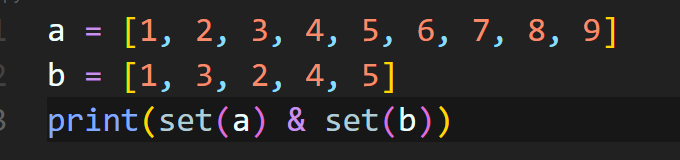
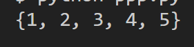

# 📆 2022/ 07/ 31

## ✅ set 연산

- BOJ 1764번 

  👉 [링크](https://www.acmicpc.net/problem/1764)

- 데이터에서 중복을 처리 또는 중복 관련 작업을 할 때, set과 & 연산자가 매우 편함

  

  

  > & 연산자를 통해서 교집합을 구할 수 있음!

 

## ✅ in 연산자의 시간 복잡도

- 리스트, 튜플
  - 평균적으로 `O(N)`
  - 하나하나 순회하기 때문에 데이터의 크기만큼 시간 복잡도를 갖게 됨
- 세트, 딕셔너리
  - 평균적으로 `O(1)`이고, 최악의 경우 `O(N)`
  - 내부적으로 hash를 통해서 자료들을 저장하기 때문에 시간복잡도가 `O(1)`가 가능하고, `O(n)`의 경우에는 해시가 성능이 떨어졌을(충돌이 많은 경우) 때 발생

> 따라서 웬만한 경우, 특히 고정된 리스트에서 검색을 여러번 해야 할수록, 리스트를 셋으로 바꾼뒤에 검색하는 것을 추천. 만약 중복원소를 유지해야하기 때문에 리스트를 유지해야한다면 리스트를 먼저 정렬한 다음에 이진 검색을 사용!

