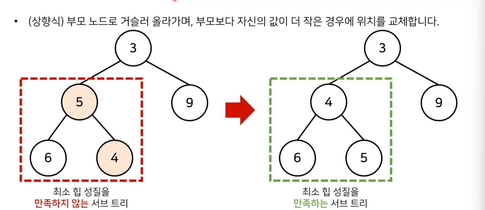

# 📕나동빈 알고리즘 by 유튜브

## ✔️ 1강 : 코딩 테스트 개요 및 출제 경향

### ✅ 온라인 저지

- 해외는 코드포스, 탑코더, 릿코드, 코드셰프
- 국내는 백준, 코드업, 프로그래머스, SWEA

<br>


### ✅ 자신만의 소스코드 관리하기

- 내가 자주 사용하는 알고리즘 코드를 라이브러리화 하면 좋음
- 예시 : https://github.com/ndb796/Python-Competitive-Programming-Team-Notes

<br>


### ✅ 최신 출제 경향

- 가장 출제 빈도가 높은 알고리즘 유형은

  > 그리디(쉬운 난이도), 구현, DFS / BFS 활용한 탐색

<br>


## ✔️ 2강 : 알고리즘 성능 평가

### ✅ 복잡도(Complexity)

- 시간 복잡도 : 특정한 크기의 입력에 대하여 알고리즘의 수행 시간 분석
- 공간 복잡도 : 특정한 크기의 입력에 대하여 알고리즘의 메모리 사용량 분석

<br>


### ✅ 빅오 표기법(Big-O Notation)

- 가장 빠르게 증가하는 항만을 고려하는 표기법
- 3N^3 + 5N^2 + 10000000 👉 O(N^3)

<br>


### ✅ 알고리즘 설계 Tip

- 일반적으로 연산횟수가 `5억`을 넘어가는 경우
  - 파이썬 기준 `5~15초` 가량의 시간이 소요
  - PyPy의 경우 때때로 C언어 보다도 빠르게 동작하기도 함
  - 파이썬으로 시간초과가 나면 `PyPy`로 다시 제출하기 (반대도 가능)
- 코테문제의 시간은 `통상 1~5초`, 문제에서 명시되어 있지 않으면 `대략 5초`라고 생각하는 것이 합리적

<br>


### ✅ 요구사항 체크하기

- 문제에서 가장 먼저 확인해야 하는 내용은 `시간제한(수행시간 요구사항)`
- 시간 제한이 1초인 문제를 만났을 때 ; 파이썬이 1초에 2천만번 계산한다고 가정
  - N의 범위가 500인 경우 : O(N^3)
  - N의 범위가 2000인 경우 : O(N^2)
  - N의 범위가 100,000인 경우 : O(NlogN)
  - N의 범위가 10,000,000인 경우 : O(N)

<br>


### ✅ 수행 시간 측정 소스코드

```python
import time
start_time = time.time() # 측정 시작

# 프로그램 소스코드
end_time = time.time() # 측정 종료
print("time:", end_time - start_time) # 수행 시간 출력
```

> \# 프로그램 소스코드 부분에 코드를 넣으면 됨

<br>


## ✔️ 3강 ~ 11강 : 파이썬 문법

### ✅ 숫자

#### 🟨 지수 표현 방식

- e나 E를 사용
- 3e9 = 3 * 10의 9제곱
- 임의의 큰 수를 표현하기 위해 자주 사용됨
- `최단 경로 알고리즘`에서는 `도달할 수 없는 노드`에 대하여 최단 거리를 `무한(INF)`로 설정하기도 함
- 이때 가능한 최댓값이 10억 미만이라면 무한(INF)의 값으로 1e9를 이용할 수 있음! 

<br>


#### 🟨 실수형에 관해

- 오늘날 가장 널리 쓰이는 `IEEE754` 표준에서는 실수형을 저장하기 위해 4바이트, 혹은 8바이트의 고정된 크기의 메모리를 할당 👉 컴퓨터 시스템은 실수를 표현하는 정확도에 한계를 가짐!
- 10진수 상에서는 0.3 + 0.6 = 0.9가 정확히 떨어지지만, 2진수에서는 0.9를 정확히 표현할 수 있는 방법이 없음
- 따라서 최대한 0.9와 가깝게 표현하지만 결국 미세한 오차가 발생함
- 이럴 때는 `round()`를 이용
  - 예를 들어 123.456을 소수 셋째 자리에서 반올림하면 round(123.456, 2)라고 작성
  - 결과는 123.46이 됨

<br>


#### 🟨 수 자료형의 연산

- 나누기 연산자 (/) 의 결과를 `실수형`으로 반환

<br>


### ✅ 리스트

#### 🟨 메서드들의 시간 복잡도

- append() : O(1)
- sort() : O(NlogN)
- reverse() : O(N)
- insert() : O(N)
- count() : O(N)
- remove() : O(N)

<br>


### ✅ 문자열 & 튜플

#### 🟨 문자열 연산

- +를 이용해서 문자열 끼리 연결 가능
- *을 이용해서 원하는 수만큼 반복 가능
- 문자열도 인덱싱과 슬라이싱이 가능하지만 `immutable`이므로 특정 인덱스의 값은 변경 불가능!

<br>


#### 🟨 튜플을 사용하면 좋은 경우

- `서로 다른 성질의 데이터를 묶어서 관리`해야 할 때
  - 최단 경로 알고리즘에서는 (비용, 노드 번호)의 형태로 튜플 자료형을 자주 사용
- 데이터의 나열을 `해싱(Hashing)의 키 값`으로 사용해야 할 때
  - 튜플은 변경이 불가능하므로 리스트와 다르게 키 값으로 사용될 수 있음
- `리스트보다 메모리를 효율적`으로 사용해야 할 때

<br>


### ✅ 딕셔너리 & 집합

#### 🟨 딕셔너리

- 딕셔너리는 `Hash Table`을 이용하므로 데이터의 조회 및 수정에 있어서 `O(1)`의 시간 복잡도를 가짐!
- keys() 와 values() 함수의 결과값은 `리스트` 형태

<br>


#### 🟨 집합

- 중복을 허용하지 않고, 순서가 없음
- 데이터의 조회 및 수정에 있어서 `O(1)`의 시간 복잡도
- 집합 a와 b가 있을 때, 합집합은 `|`, 교집합은 `&`, 차집합은 `-` 사용

<br>


### ✅ 기본 입출력

#### 🟨 빠르게 입력받기

- sys.stdin.readline() 사용
  - 단, 입력 후 엔터가 줄 바꿈 기호로 입력되므로 `rstrip()` 메서드와 함께 사용

<br>


### ✅ 조건문

- elif 혹은 else 부분은 경우에 따라서 쓰지 않아도 됨

- 아무것도 처리하고 싶지 않을때는 `pass` 사용

  - 디버깅 과정에서 일단 조건문의 형태만 만들어 놓고 조건문을 처리하는 부분은 비워놓고 싶은 경우

  ```python
  score = 85
  if score >= 80:
      pass # 나중에 작성할 소스코드
  else:
      print('성적이 80점 미만입니다')
  print('프로그램을 종료합니다.')
  
  >>> 프로그램을 종료합니다.
  ```

- 조건문에서 실행될 소스코드가 한 줄인 경우, 굳이 줄 바꿈을 하지 않고도 간략하게 표현이 가능

  ```python
  if score >= 80: reslt = 'Success'
  else: result = 'Fail'
  ```

- 조건부 표현식은 if ~ else 문을 한 줄에 작성할 수 있도록 해줌

  ```python
  result = 'Success' if score >= 80 else 'Fail'
  ```

<br>


### ✅ 반복문

- 코테에서 실제 사용 예시를 확인해보면, for문이 더 간결한 경우가 많음
- while문 사용할 때는, 무한 루프가 종료되는지 확인해야함

<br>


### ✅ 함수와 람다 표현식

#### 🟨 함수

- 불필요한 소스코드의 반복을 줄일 수 있음

- 매개변수 : 함수 내부에서 사용할 변수

- 반환 값 : 함수에서 처리 된 결과를 반환

  ```python
  def 함수명(매개변수):
      실행할 소스코드
      return 반환 값
  ```

<br>


#### 🟨 global 키워드

- 해당 함수에서는 지역 변수를 만들지 않고, 함수 바깥에 선언된 변수를 바로 참조하게 됨

  ```python
  a = 0
  
  def func():
      global a
      a += 1
      
  for i in range(10):
      func()
  print(a)
  >>> 10
  ```

  > 헷갈리니, 코테때는 웬만하면 같은 이름의 변수 만들지 않기

<br>


#### 🟨 람다 표현식

- 특정한 기능을 수행하는 함수를 한 줄에 작성 가능

  ```python
  print((lambda a, b : a + b)(3,7))
  >>> 10
  ```

- 여러 개의 리스트에 적용도 가능함

  ```python
  list1 = [1, 2, 3, 4, 5]
  list2 = [6, 7, 8, 9, 10]
  result = map(lambda a, b : a + b, list1, list2)
  print(list(result))
  >>> [7, 9, 11, 13, 15]
  ```

<br>


### ✅ 유용한 표준 라이브러리

#### 🟨 라이브러리들

- `itertools` : 반복되는 형태의 데이터를 처리하기 위한 유용한 기능 제공
  - 특히 순열과 조합 라이브러리는 코딩 테스트에서 자주 사용됨
- `heapq` : 힙(Heap) 자료구조를 제공
  - 일반적으로 우선순위 큐 기능을 구현하기 위해 사용
- `bisect` : 이진 탐색 기능 제공
- `collections` : 덱(deque), 카운터(Counter) 등의 유용한 자료구조를 포함
- `math` : 필수적인 수학적 기능을 제공
  - 팩토리얼, 제곱근, 최대공약수, 삼각함수, 파이(pi) 등

<br>


#### 🟨 순열

- 순열 : 서로 다른 n개에서 서로 다른 r개를 선택하여 일렬로 나열하는 것

```python
from itertools import permutations

data = ['A', 'B', 'C'] # 데이터 준비

result = list(permutations(data, 3)) # 모든 순열 구하기
print(result)

>>> [('A','B','C'),('A','C','B'),('B','A','C'),('B','C','A')('C','A','B'),('C','B','A')]
```

<br>


#### 🟨 조합

- 순열 : 서로 다른 n개에서 서로 다른 r개를 선택하여 일렬로 나열하는 것

```python
from itertools import combinations

data = ['A,', 'B', 'C'] # 데이터 준비

result = list(combinations(data, 2)) # 2개를 뽑는 모든 조합 구하기
print(result)

>>> [('A','B'),('A','C'),('B','C')]
```

<br>


#### 🟨 중복 순열과 중복 조합

```python
# 중복 순열
from itertools import product

data = ['A,', 'B', 'C'] # 데이터 준비

result = list(priduct(data, repeat = 2)) # 2개를 뽑는 모든 순열 구하기 (중복 허용)
print(result)

# 중복 조합
from itertools import combinations_with_replacement

data = ['A,', 'B', 'C'] # 데이터 준비

result = list(combinations_with_replacement(data, 2)) # 2개를 뽑는 모든 조합 구하기 (중복 허용)
print(result)
```

<br>


#### 🟨 Counter

- 등장 횟수를 세는 기능을 제공
- 반복 가능한 객체가 주어졌을 때, 내부의 원소가 몇 번 등장했는지를 알려줌

```python
from collections import Counter

counter = Counter(['1', '2', '3', '4', '5', '2', '3'])

print(counter['2']) # '2'가 등장한 횟수 출력
print(dict(counter)) # 딕셔너리 형태로 출력

>>> 2
>>> {'1': 1,'2': 2,'3': 2, '4':1, '5':1}
```

<br>


#### 🟨 최대 공약수와 최소 공배수

```python
import math

# 최소 공배수
def lcm(a,b):
    return a * b // math.gcd(a,b)

a = 21
b = 14

print(math.gcd(21,14)) # 최대 공약수 계산
print(lcm(21,14)) # 최소 공배수 계산

>>> 7
>>> 42
```

<br>


## ✔️ 12강 : 그리디 알고리즘 개요

### ✅ 그리디 알고리즘

#### 🟨 그리디 알고리즘이란

- 현재 상황에서 지금 당장 좋은 것만 고르는 방법
- 문제를 풀기 위한 최소한의 아이디어를 떠올릴 수 있는 능력을 요구
- `정당성 분석이 중요`
  - 단순히 가장 좋아 보이는 것을 선택해도 최적의 해를 구할 수 있는지 검토해야함
- 일반적인 상황에서 그리디 알고리즘은 최적의 해를 보장할 수 없을 때가 많지만, 코테 데부분에서는 `탐욕법으로 얻은 해가 최적의 해가 되는 상황에서, 이론 추론을 할 수 있어야 풀리도록` 출제됨!

<br>


#### 🟨 예제 : 거스름 돈

- 

<br>


## ✔️ 26강 : 스택 & 큐

### ✅ 스택(Stack)

#### 🟨 스택

- 먼저 들어온 데이터가 나중에 나가는 `선입후출`의 자료구조

- 입구와 출구가 동일한 형태

  ```python
  stack = []
  
  # 삽입(5) -> 삽입(2) -> 삽입(3) ->삽입(7) -> 삭제() -> 삽입(1)
  # -> 삽입 (4) -> 삭제()
  stack.append(5)
  stack.append(2)
  stack.append(3)
  stack.append(7)
  stack.pop()
  stack.append(1)
  stack.append(4)
  stack.pop()
  
  print(stack)
  # [5, 2, 3, 1]
  print(stack[::-1])
  # [1, 3, 2, 5]
  ```
  

> stack을 그대로 출력하면 5, 2, 3, 1 순서이고 [::-1] (마이너스 스텝)을 활용하면 거꾸로 데이터를 다룰 수 있음

<br>


### ✅ 큐(Queue)

#### 🟨 큐

- 먼저 들어온 데이터가 먼저 나가는 `선입선출`의 자료구조

- 입구가 출구가 모두 뚫려 있는 터널, 대기열과 같은 형태

  ```python
  from collections import deque
  
  # 큐 구현을 위해 deque 라이브러리 활용
  queue = deque()
  
  # 삽입(5) -> 삽입(2) -> 삽입(3) ->삽입(7) -> 삭제() -> 삽입(1)
  # -> 삽입 (4) -> 삭제()
  queue.append(5)
  queue.append(2)
  queue.append(3)
  queue.append(7)
  queue.popleft()
  queue.append(1)
  queue.append(4)
  queue.popleft()
  
  print(queue)
  # deque([3, 7, 1, 4])
  queue.reverse()
  print(queue)
  # deque([4, 1, 7, 3])
  ```

  > queue에서는 pop이 아니라 popleft사용
  >
  > 거꾸로 출력하고 싶으면 reverse 메서드 사용

<br>


## ✔️ 30강 : 우선순위 큐

### ✅ 우선순위 큐(Priority Queue)

#### 🟨 우선순위 큐

- 우선순위가 가장 높은 데이터를 가장 먼저 삭제하는 자료구조
- 물건 데이터를 자료구조에 넣었다가 가치가 높은 물건부터 꺼내서 확인해야 하는 경우 같을 때 사용
- 리스트로도 구현 가능하지만 `힙(heap)`이 더 효율적
- 힙은 삽입 시간과, 삭제 시간 둘 다 `O(logN)`의 시간 복잡도를 가짐
- 단순히 N개의 데이터를 힙에 넣었다가 모두 꺼내는 작업은 정렬과 동일 👉 `힙 정렬`
  - 힙 정렬의 시간 복잡도는 `O(NlogN)`


<br>


#### 🟨 힙(Heap)의 특징

- 완전 이진 트리 자료구조의 일종
- 항상 `루트 노드(root node)`를 제거
- 최소 힙(min heap)
  - 루트 노드가 가장 작은 값을 가짐
  - 따라서 값이 작은 데이터가 우선적으로 제거됨

- 최대 힙(max heap)

  - 루트 노드가 가장 큰 값을 가짐

  - 따라서 값이 큰 데이터가 우선적으로 제거됨


> 각각 최소 힙과 최대 힙의 형태

<br>


#### 🟨 완전 이진 트리 (Complete Binary Tree)

- 루트 노드부터 시작하여 왼쪽 자식 노드, 오른쪽 자식 노드 순서대로 데이터가 차례대로 삽입되는 트리

  

  > 새로운 데이터가 들어올 때 마다 자신의 부모 노드와 비교하면서 자신보다 크다면 교체를 하는 방식

- 새로운 원소가 삽입됐을 때 `O(logN)`의 시간 복잡도로 힙 성질을 유지할 수 있음

- 원소가 제거됐을 때도 마찬가지로 `O(logN)`의 시간 복잡도로 힙 성질을 유지할 수 있음

  - 가장 마지막 노드가 루트 노드의 위치에 오도록 함 (단순 위치 바꾸기)
  - 그 다음에 자식 노드와 비교하면서 위치를 바꿔주기 (하향식)

  ```python
  import sys
  import heapq
  input = sys.stdin.readline
  
  def heapsort(iterable):
      heap = []
      result = []
      # 모든 원소를 차례대로 힙에 삽입
      for value in iterable:
          heapq.heappush(heap, value)
      # 힙에 삽입된 모든 원소들을 차례대로 꺼내어서 담기
      for i in range(len(heap)):
          result.append(heapq.heappop(heap))
      return result
  
  n = int(input())
  arr = []
  
  for i in range(n):
      arr.append(int(input()))
  
  res = heapsort(arr)
  
  for i in range(n):
      print(res[i])
  ```

<br>


