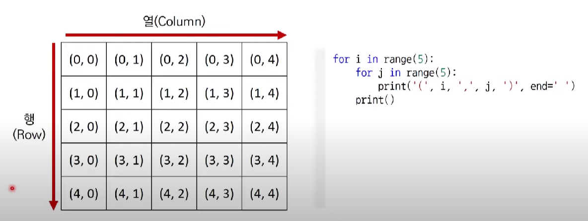
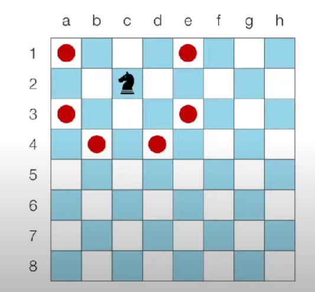
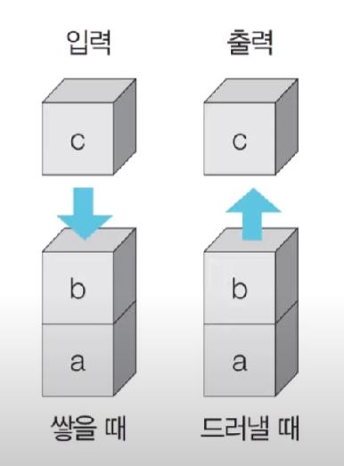
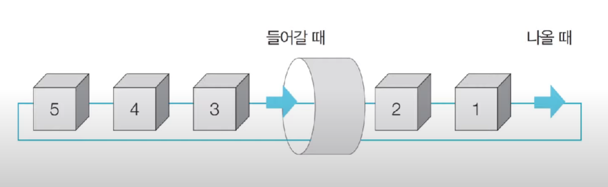
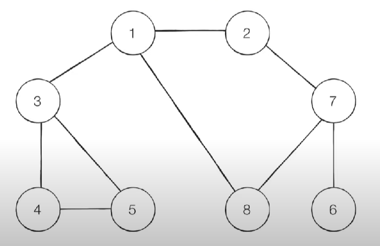
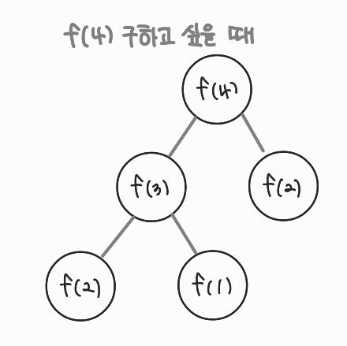

# 📕나동빈 알고리즘 by 유튜브

## 🟨 1강 : 코딩 테스트 개요 및 출제 경향

### ✅ 온라인 저지

- 해외는 코드포스, 탑코더, 릿코드, 코드셰프
- 국내는 백준, 코드업, 프로그래머스, SWEA

<br>

### ✅ 자신만의 소스코드 관리하기

- 내가 자주 사용하는 알고리즘 코드를 라이브러리화 하면 좋음
- 예시 : https://github.com/ndb796/Python-Competitive-Programming-Team-Notes

<br>

### ✅ 최신 출제 경향

- 가장 출제 빈도가 높은 알고리즘 유형은

  > 그리디(쉬운 난이도), 구현, DFS / BFS 활용한 탐색

<br>

## 🟨 2강 : 알고리즘 성능 평가

### ✅ 복잡도(Complexity)

- 시간 복잡도 : 특정한 크기의 입력에 대하여 알고리즘의 수행 시간 분석
- 공간 복잡도 : 특정한 크기의 입력에 대하여 알고리즘의 메모리 사용량 분석

<br>

### ✅ 빅오 표기법(Big-O Notation)

- 가장 빠르게 증가하는 항만을 고려하는 표기법
- 3N^3 + 5N^2 + 10000000 👉 O(N^3)

<br>

### ✅ 알고리즘 설계 Tip

- 일반적으로 연산횟수가 `5억`을 넘어가는 경우
  - 파이썬 기준 `5~15초` 가량의 시간이 소요
  - PyPy의 경우 때때로 C언어 보다도 빠르게 동작하기도 함
  - 파이썬으로 시간초과가 나면 `PyPy`로 다시 제출하기 (반대도 가능)
- 코테문제의 시간은 `통상 1~5초`, 문제에서 명시되어 있지 않으면 `대략 5초`라고 생각하는 것이 합리적

<br>

### ✅ 요구사항 체크하기

- 문제에서 가장 먼저 확인해야 하는 내용은 `시간제한(수행시간 요구사항)`
- 시간 제한이 1초인 문제를 만났을 때 ; 파이썬이 1초에 2천만번 계산한다고 가정
  - N의 범위가 500인 경우 : O(N^3)
  - N의 범위가 2000인 경우 : O(N^2)
  - N의 범위가 100,000인 경우 : O(NlogN)
  - N의 범위가 10,000,000인 경우 : O(N)

<br>

### ✅ 수행 시간 측정 소스코드

```python
import time
start_time = time.time() # 측정 시작

# 프로그램 소스코드
end_time = time.time() # 측정 종료
print("time:", end_time - start_time) # 수행 시간 출력
```

> \# 프로그램 소스코드 부분에 코드를 넣으면 됨

<br>

## 🟨 3강 ~ 11강 : 파이썬 문법

### ✅ 숫자

#### ✔️ 지수 표현 방식

- e나 E를 사용
- 3e9 = 3 \* 10의 9제곱
- 임의의 큰 수를 표현하기 위해 자주 사용됨
- `최단 경로 알고리즘`에서는 `도달할 수 없는 노드`에 대하여 최단 거리를 `무한(INF)`로 설정하기도 함
- 이때 가능한 최댓값이 10억 미만이라면 무한(INF)의 값으로 1e9를 이용할 수 있음!

<br>

#### ✔️ 실수형에 관해

- 오늘날 가장 널리 쓰이는 `IEEE754` 표준에서는 실수형을 저장하기 위해 4바이트, 혹은 8바이트의 고정된 크기의 메모리를 할당 👉 컴퓨터 시스템은 실수를 표현하는 정확도에 한계를 가짐!
- 10진수 상에서는 0.3 + 0.6 = 0.9가 정확히 떨어지지만, 2진수에서는 0.9를 정확히 표현할 수 있는 방법이 없음
- 따라서 최대한 0.9와 가깝게 표현하지만 결국 미세한 오차가 발생함
- 이럴 때는 `round()`를 이용
  - 예를 들어 123.456을 소수 셋째 자리에서 반올림하면 round(123.456, 2)라고 작성
  - 결과는 123.46이 됨

<br>

#### ✔️ 수 자료형의 연산

- 나누기 연산자 (/) 의 결과를 `실수형`으로 반환

<br>

### ✅ 리스트

#### ✔️ 메서드들의 시간 복잡도

- append() : O(1)
- sort() : O(NlogN)
- reverse() : O(N)
- insert() : O(N)
- count() : O(N)
- remove() : O(N)

<br>

### ✅ 문자열 & 튜플

#### ✔️ 문자열 연산

- +를 이용해서 문자열 끼리 연결 가능
- \*을 이용해서 원하는 수만큼 반복 가능
- 문자열도 인덱싱과 슬라이싱이 가능하지만 `immutable`이므로 특정 인덱스의 값은 변경 불가능!

<br>

#### ✔️ 튜플을 사용하면 좋은 경우

- `서로 다른 성질의 데이터를 묶어서 관리`해야 할 때
  - 최단 경로 알고리즘에서는 (비용, 노드 번호)의 형태로 튜플 자료형을 자주 사용
- 데이터의 나열을 `해싱(Hashing)의 키 값`으로 사용해야 할 때
  - 튜플은 변경이 불가능하므로 리스트와 다르게 키 값으로 사용될 수 있음
- `리스트보다 메모리를 효율적`으로 사용해야 할 때

<br>

### ✅ 딕셔너리 & 집합

#### ✔️ 딕셔너리

- 딕셔너리는 `Hash Table`을 이용하므로 데이터의 조회 및 수정에 있어서 `O(1)`의 시간 복잡도를 가짐!
- keys() 와 values() 함수의 결과값은 `리스트` 형태

<br>

#### ✔️ 집합

- 중복을 허용하지 않고, 순서가 없음
- 데이터의 조회 및 수정에 있어서 `O(1)`의 시간 복잡도
- 집합 a와 b가 있을 때, 합집합은 `|`, 교집합은 `&`, 차집합은 `-` 사용

<br>

### ✅ 기본 입출력

#### ✔️ 빠르게 입력받기

- sys.stdin.readline() 사용
  - 단, 입력 후 엔터가 줄 바꿈 기호로 입력되므로 `rstrip()` 메서드와 함께 사용

<br>

### ✅ 조건문

- elif 혹은 else 부분은 경우에 따라서 쓰지 않아도 됨

- 아무것도 처리하고 싶지 않을때는 `pass` 사용

  - 디버깅 과정에서 일단 조건문의 형태만 만들어 놓고 조건문을 처리하는 부분은 비워놓고 싶은 경우

  ```python
  score = 85
  if score >= 80:
      pass # 나중에 작성할 소스코드
  else:
      print('성적이 80점 미만입니다')
  print('프로그램을 종료합니다.')

  >>> 프로그램을 종료합니다.
  ```

- 조건문에서 실행될 소스코드가 한 줄인 경우, 굳이 줄 바꿈을 하지 않고도 간략하게 표현이 가능

  ```python
  if score >= 80: reslt = 'Success'
  else: result = 'Fail'
  ```

- 조건부 표현식은 if ~ else 문을 한 줄에 작성할 수 있도록 해줌

  ```python
  result = 'Success' if score >= 80 else 'Fail'
  ```

<br>

### ✅ 반복문

- 코테에서 실제 사용 예시를 확인해보면, for문이 더 간결한 경우가 많음
- while문 사용할 때는, 무한 루프가 종료되는지 확인해야함

<br>

### ✅ 함수와 람다 표현식

#### ✔️ 함수

- 불필요한 소스코드의 반복을 줄일 수 있음

- 매개변수 : 함수 내부에서 사용할 변수

- 반환 값 : 함수에서 처리 된 결과를 반환

  ```python
  def 함수명(매개변수):
      실행할 소스코드
      return 반환 값
  ```

<br>

#### ✔️ global 키워드

- 해당 함수에서는 지역 변수를 만들지 않고, 함수 바깥에 선언된 변수를 바로 참조하게 됨

  ```python
  a = 0
  
  def func():
      global a
      a += 1
  
  for i in range(10):
      func()
  print(a)
  >>> 10
  ```

  > 헷갈리니, 코테때는 웬만하면 같은 이름의 변수 만들지 않기

<br>

#### ✔️ 람다 표현식

- 특정한 기능을 수행하는 함수를 한 줄에 작성 가능

  ```python
  print((lambda a, b : a + b)(3,7))
  >>> 10
  ```

- 여러 개의 리스트에 적용도 가능함

  ```python
  list1 = [1, 2, 3, 4, 5]
  list2 = [6, 7, 8, 9, 10]
  result = map(lambda a, b : a + b, list1, list2)
  print(list(result))
  >>> [7, 9, 11, 13, 15]
  ```

<br>

### ✅ 유용한 표준 라이브러리

#### ✔️ 라이브러리들

- `itertools` : 반복되는 형태의 데이터를 처리하기 위한 유용한 기능 제공
  - 특히 순열과 조합 라이브러리는 코딩 테스트에서 자주 사용됨
- `heapq` : 힙(Heap) 자료구조를 제공
  - 일반적으로 우선순위 큐 기능을 구현하기 위해 사용
- `bisect` : 이진 탐색 기능 제공
- `collections` : 덱(deque), 카운터(Counter) 등의 유용한 자료구조를 포함
- `math` : 필수적인 수학적 기능을 제공
  - 팩토리얼, 제곱근, 최대공약수, 삼각함수, 파이(pi) 등

<br>

#### ✔️ 순열

- 순열 : 서로 다른 n개에서 서로 다른 r개를 선택하여 일렬로 나열하는 것

```python
from itertools import permutations

data = ['A', 'B', 'C'] # 데이터 준비

result = list(permutations(data, 3)) # 모든 순열 구하기
print(result)

>>> [('A','B','C'),('A','C','B'),('B','A','C'),('B','C','A')('C','A','B'),('C','B','A')]
```

<br>

#### ✔️ 조합

- 조합 : 서로 다른 n개에서 서로 다른 r개를 선택만 하는 것

```python
from itertools import combinations

data = ['A,', 'B', 'C'] # 데이터 준비

result = list(combinations(data, 2)) # 2개를 뽑는 모든 조합 구하기
print(result)

>>> [('A','B'),('A','C'),('B','C')]
```

<br>

#### ✔️ 중복 순열과 중복 조합

```python
# 중복 순열
from itertools import product

data = ['A,', 'B', 'C'] # 데이터 준비

result = list(priduct(data, repeat = 2)) # 2개를 뽑는 모든 순열 구하기 (중복 허용)
print(result)

# 중복 조합
from itertools import combinations_with_replacement

data = ['A,', 'B', 'C'] # 데이터 준비

result = list(combinations_with_replacement(data, 2)) # 2개를 뽑는 모든 조합 구하기 (중복 허용)
print(result)
```

<br>

#### ✔️ Counter

- 등장 횟수를 세는 기능을 제공
- 반복 가능한 객체가 주어졌을 때, 내부의 원소가 몇 번 등장했는지를 알려줌

```python
from collections import Counter

counter = Counter(['1', '2', '3', '4', '5', '2', '3'])

print(counter['2']) # '2'가 등장한 횟수 출력
print(dict(counter)) # 딕셔너리 형태로 출력

>>> 2
>>> {'1': 1,'2': 2,'3': 2, '4':1, '5':1}
```

<br>

#### ✔️ 최대 공약수와 최소 공배수

```python
import math

# 최소 공배수
def lcm(a,b):
    return a * b // math.gcd(a,b)

a = 21
b = 14

print(math.gcd(21,14)) # 최대 공약수 계산
print(lcm(21,14)) # 최소 공배수 계산

>>> 7
>>> 42
```

<br>

## 🟨 12강 : 그리디 알고리즘 개요

### ✅ 그리디 알고리즘

#### ✔️ 그리디 알고리즘이란

- 현재 상황에서 지금 당장 좋은 것만 고르는 방법
- 문제를 풀기 위한 최소한의 아이디어를 떠올릴 수 있는 능력을 요구
- `정당성 분석이 중요`
  - 단순히 가장 좋아 보이는 것을 선택해도 최적의 해를 구할 수 있는지 검토해야함
- 일반적인 상황에서 그리디 알고리즘은 최적의 해를 보장할 수 없을 때가 많지만, 코테 데부분에서는 `탐욕법으로 얻은 해가 최적의 해가 되는 상황에서, 이론 추론을 할 수 있어야 풀리도록` 출제됨!

<br>

#### ✔️ Q. 거스름 돈

- 거스름 돈으로 사용할 500원, 100원, 50원, 10원짜리가 무한개 있음.
- 손님에게 거슬러 주어야 할 돈이 N원 일 때 거슬러 주어야 할 동전의 최소 개수
- 단, N은 항상 10의 배수

```python
N = int(input())
cnt = 0
coins = [500, 100, 50, 10]
result = N
for i in coins:
    x = result // i
    cnt += x
    result -= i * x
    print(result, cnt)
    if result == 0:
        break
print(cnt)
```

> - 가장 큰 화폐 단위부터 돈을 거슬러 줌
>
>   👉 가장 큰 단위가 항상 작은 단위의 배수이므로 작은 단위의 동전들을 종합해 다른 해가 나올 수 없기 때문
>
> - 하지만 800원을 거슬러줘야할 때, 화폐 단위가 500, 400, 100이라면?
>
>   👉 문제 풀이를 위한 최소한의 아이디어를 떠올리고 이것이 정당한지 검토할 수 있어야함!
>
> - 화폐의 종류가 K일 때, 소스코드의 시간 복잡도는 O(K). 즉, N과는 상관 없음

<br>

## 🟨 13강 : 그리디 유형 문제 풀이

### ✅ 그리디 유형 문제 풀이

#### ✔️ Q. 1이 될 때까지

- N이 1이 될 때까지
- (1) N에서 1을 빼거나, (2) N을 K로 나눌 수 있음 (후자는 나누어 떨어질 때만)
- N이 17이고 K가 4면, (1) 1번으로 N이 16이되고, 이후에 (2)를 2번 하면 N이 1이 됨
- 따라서 전체 실행한 횟수는 3. 이런식으로 최소 수행 횟수를 구하기

```python
N, K = map(int, input().split())
cnt = 0
while True:
    if N % K == 0:
        cnt += 1
        N /= K
    else:
        cnt += 1
        N -= 1
    if N == 1:
        break
print(cnt)
```

> - 주어진 N에 대해 최대한 많이 나누기를 수행하면 됨
> - N의 값을 줄일 때, 2 이상의 수로 나누느 작업이 1을 빼는 작업보다 수를 훨씬 많이 줄일 수 있기 때문!

<br>

#### ✔️ Q. 곱하기 혹은 더하기

- 각 자리가 0 ~ 9로 이루어진 문자열 S
- 숫자 사이에 x 또는 +를 넣어서 만들어지는 가장 큰 수를 구하기

```python
S = input()

result = int(S[0])

for char in range(1, len(S)):
    num = int(S[char])
    if num <= 1 or result <= 1:
        result += num
    else:
        result *= num
print(result)
```

> - 대부분은 합 보다는 곱이 더 값을 크게 만들지만, 두 수 중 하나라도 0이거나 1이면 곱하기보다는 더하기를 수행하는 것이 효율적임
> - 따라서 두 수에 대하여 연산을 수행 시, 두 수 중에서 하나라도 1 이하인 경우에는 더하며, 두 수가 모두 2 이상인 경우에는 곱하면 정답

<br>

#### ✔️ Q. 모험가 길드

- N명의 모험가의 공포도 측정
- 공포도가 X인 모험가는 반드시 X명 이상으로 구성한 모험가 그룹에 참여해야 함
- 최대 몇 개의 모험가 그룹을 만들 수 있을까
- N이 5이고, 공포도가 2 3 1 2 2 일 경우, 그룹 1에 공포도가 1, 2, 3인 모험가를 한 명씩 넣고, 그룹 2에 공포도가 2인 남은 두명을 넣게 되면 총 2개의 그룹을 만들 수 있음
- 모든 모험가를 특정 그룹에 넣을 필요는 없음

```python
✅ my solution

from collections import deque

N = int(input())
nums = list(map(int, input().split()))
nums.sort(reverse = True)
# 숫자가 큰 순서대로 뽑기
# [4, 4, 3, 3, 2, 2, 2, 2, 1, 1]
# 4를 뽑으면 그룹 명수는 최소 4가 돼야함
# 4 4 3 3 / 2 2 / 2 2/ 1/ 1
queue = deque(nums)
temp = []
cnt = 0
while True:
    num = queue.popleft()
    temp.append(num)
    if len(temp) != temp[0]:
        continue
    else:
        cnt += 1
        temp = []
        if len(queue) == 0:
            break
        else:
            continue
print(cnt)
```

> - 내림차순 정렬로 풀었지만 4 3 3 3 3 2 의 케이스가 들어오면 내 코드로는 1이 나오지만, 정답은 2이다.
> - 접근 방향은 비슷했지만, 내림차순이 아니라 오름차순으로 풀어야함!

```python
✅ good solution

N = int(input())
nums = list(map(int, input().split()))
nums.sort()
# 2 3 3/ 3 3 4
count = 0
result = 0
for char in nums:
    count += 1
    if count >= char:
        result += 1
        count = 0
print(result)
```

> - 오름차순으로 하나씩 순회하면서 제일 큰 값이 count보다 크거가 같아지면 하나의 그룹으로 인정되는 방식
> - 생각을 잘 하면, 리스트 자체를 조작하는 것이 아닌 이런 효과적인 방법도 쓸 수 있음!

<br>

## 🟨 14강 : 구현 유형 개요

### ✅ 구현(Implementation)

#### ✔️ 구현이란?

- 머릿속에 있는 알고리즘을 소스코드로 바꾸는 과정

  

- 흔히 알고리즘 대회에서 구현 유형의 문제라고 하면 `풀이를 떠올리는 것은 쉽지만 소스코드로 옮기기 어려운 문제`를 뜻함
- 여러 예시들
  - 알고리즘은 간단한데 코드가 지나치게 길어지는 문제
  - 실수 연산을 다루고, 특정 소수점 자리까지 출력해야하는 문제
  - 문자열을 특정한 기준에 따라서 끊어 처리해야 하는 문제
  - 적절한 라이브러리를 찾아서 사용해야 하는 문제

<br>

#### ✔️ 2차원 공간

- 일반적으로 행렬(Matrix)의 의미로 사용됨

  

- `방향 벡터`가 자주 활용됨

```python
# 남, 동, 북, 서
dx = [1, 0, -1 ,0]
dy = [0, 1, 0 ,-1]

# 만약 현재 위치가
x, y = 2, 2

for i in range(4):
    # 다음 위치
    nx = x + dx[i]
    ny = y + dy[i]
    print((nx, ny), end = ' ')

>> (3, 2) (2, 3) (1, 2) (2, 1)
```

<br>

#### ✔️ Q. 상하좌우

- 여행자 A가 N X N 크기의 정사각형 위에 서 있음
- 가장 왼쪽 위 좌표는 (1,1)이고, 가장 오른쪽은 (N,N)
- 상, 하, 좌, 우로 이동이 가능, 시작 좌표는 항상 (1,1)
- 각각 U, D, L, R 과 대응
- 정사각형 공간 벗어나는 움직임은 무시됨

```python
✅ my solution

dx = [1, 0, -1 ,0]
dy = [0, 1, 0 ,-1]
d_cmds = ['D', 'R', 'U', 'L']

N = int(input())
cmd = list(input().split())

# 1,1 부터 N,N 까지
x, y = 1, 1
for char in cmd:
    idx = d_cmds.index(char)

    # 다음 위치
    nx = x + dx[idx]
    ny = y + dy[idx]

    # 범위 내에 있는지
    if 0 < nx < N + 1 and 0 < ny < N + 1:
    # if nx < 1 or ny < 1 or nx > n or ny > n: continue 이렇게도 가능
        x = nx
        y = ny
print(x, y)
```

> - x,y의 방향벡터와 일치하게 D, R, U, L을 같은 인덱스를 가지게 해놓고, 입력이 들어오면 그에 따른 dx, dy를 가지게 함
> - 범위 내에 없으면 이동이 무효가 되므로, 정사각형 범위 안에 있을때만 x = nx, y = ny로 업데이트를 해줌

<br>

## 🟨 15강 : 구현 유형 문제 풀이

### ✅ 구현 유형 문제 풀이

#### ✔️ Q. 시각

- 정수 N이 입력되면 00시 00분 00초부터 N시 59분 59초까지 모든 시각 중에서 3이 하나라도 포함되는 모든 경우의 수를 구하기
- N이 1이라면 00시 00분 03초, 00시 13분 30초 등 3이 하나라도 있으면 세어야하고
- 반면에 00시 02분 55초 같이 3이 없으면 세면 안됨

```python
✅ my solution

hour = 0
minute = 0
second = 0

N = int(input())
cnt = 0
while True:
    second += 1
    if second == 60:
        minute += 1
        second = 0
    if minute == 60:
        hour += 1
        minute = 0
    if hour == N + 1:
        break
    if '3' in str(second) or '3' in str(minute) or '3' in str(hour):
        cnt += 1
print(cnt)
```

> - 하루는 24 _ 60 _ 60 = 86400 초이므로, 총 86400 가지이다
> - 이렇게 모든 유형을 탐색하는게 `완전 탐색(Brute Forcing)`
> - 3중 for문도 가능!

<br>

#### ✔️ Q. 왕실의 나이트

- 8 X 8 좌표 평면

- 특정 한 칸에 나이트가 서 있음

- L자 형태로만 이동 가능, 범위 밖으로는 못 나감

- 수평 두칸 이동 뒤 수직 한칸 이동하거나, 수직 두칸 이동 뒤 수평 한칸 이동 가능

- 나이트의 위치가 주어졌을 때, 나이트가 이동할 수 있는 경우의 수 출력

- 행은 1부터 8, 열은 a부터 h

  

```python
✅ my solution

# 초기 위치
rows = [1, 2, 3, 4, 5, 6, 7, 8]
cols = ['a', 'b', 'c', 'd', 'e', 'f', 'g', 'h']
location = input()
x = rows.index(int(location[1]))
y = cols.index(location[0])

# 델타 입력; 총 8가지
dx = [-2, -1, 1, 2, 2, 1, -1, -2]
dy = [1, 2, 2, 1, -1, -2, -2, -1]
cnt = 0
for i in range(8):
    nx = x + dx[i]
    ny = y + dy[i]
    if -1 < nx < 8 and -1 < ny < 8:
        cnt += 1
print(cnt)
```

<br>

#### ✔️ Q. 문자열 재정렬

- 알파벳 대문자와 숫자(0 ~ 9)로만 구성된 문자열이 입력
- 모든 알파벳을 오름차순으로 정렬해서 이어서 출력한 뒤 모든 숫자를 더한 값을 이어서 출력
- 입력이 `K1KA5CB7` 이면, 출력은 `ABCKK13` 

```python
✅ my solution

word = input()
# K1KA5CB7

numbers = ''
alphas = ''
for char in range(len(word)):
    # 알파벳의 경우
    if 65 <= ord(word[char]) <= 90:
        alphas += word[char]
    else:
        numbers += word[char]
newword = list(''.join(alphas))
newnumbers = list(map(int, ''.join(numbers)))

newword.sort()
print(*newword, sep = '', end = '')
print(sum(newnumbers))
```

>- 강의 풀이는, 숫자의 경우는 합계를 따로 계산, 알파벳은 별도의 `리스트`에 저장
>- 알파벳인지 알아보는 메소드에 `isalpha()`를 쓰면 훨씬 간단함

<br>

## 🟨 16강 : 스택과 큐 자료구조

### ✅ 스택(Stack)

#### ✔️ 스택

- 먼저 들어온 데이터가 나중에 나가는 `선입후출`의 자료구조

- 입구와 출구가 동일한 형태

  
  
  ```python
  stack = []
  
  # 삽입(5) -> 삽입(2) -> 삽입(3) ->삽입(7) -> 삭제() -> 삽입(1)
  # -> 삽입 (4) -> 삭제()
  stack.append(5)
  stack.append(2)
  stack.append(3)
  stack.append(7)
  stack.pop()
  stack.append(1)
  stack.append(4)
  stack.pop()
  
  print(stack)
  # [5, 2, 3, 1]
  print(stack[::-1])
  # [1, 3, 2, 5]
  ```

> - stack을 그대로 출력하면 5, 2, 3, 1 순서이고 [::-1] (마이너스 스텝)을 활용하면 거꾸로 데이터를 다룰 수 있음

<br>

### ✅ 큐(Queue)

#### ✔️ 큐

- 먼저 들어온 데이터가 먼저 나가는 `선입선출`의 자료구조

- 입구가 출구가 모두 뚫려 있는 터널, 대기열과 같은 형태

  
  
  ```python
  from collections import deque
  
  # 큐 구현을 위해 deque 라이브러리 활용
  queue = deque()
  
  # 삽입(5) -> 삽입(2) -> 삽입(3) ->삽입(7) -> 삭제() -> 삽입(1)
  # -> 삽입 (4) -> 삭제()
  queue.append(5)
  queue.append(2)
  queue.append(3)
  queue.append(7)
  queue.popleft()
  queue.append(1)
  queue.append(4)
  queue.popleft()
  
  print(queue)
  # deque([3, 7, 1, 4])
  queue.reverse()
  print(queue)
  # deque([4, 1, 7, 3])
  ```
  

> - 그냥 리스트로도 가능하지만 큐 구현 시, deque 라이브러리가 시간복잡도가 더 낮아서 deque을 사용하는 것이 매우 좋음!
>
> - queue에서는 pop이 아니라 `popleft`사용
>
> - 거꾸로 출력하고 싶으면 reverse 메서드 사용


## 🟨 17강 : 재귀 함수

### ✅ 재귀 함수

#### ✔️ 재귀 함수(Recursive Function)란

- 자기 자신을 다시 호출하는 함수

```python
def recursive_function():
    print('재귀 함수를 호출합니다.')
    recursive_function()
    
recursive_function()
```

> - '재귀 함수를 호출합니다.'라는 문자열을 무한히 출력하다가, `최대 재귀 깊이`까지 도달하면 초과 메시지를 띄움 
>
>   👉 `RecursionError: maximum recursion depth exceeded while calling a Python object`

  <br>

#### ✔️ 재귀 함수의 종료 조건

- 재귀 함수를 문제 풀이에서 사용할 때는 재귀 함수의 `종료 조건`을 반드시 명시해야 함
- 그렇지 않을 경우, 함수가 무한히 호출될 수 있음

```python
def recursive_function(i):
    # 100번째 호출을 했을 때 종료되도록 종료 조건 명시
    if i == 4:
        return
    print(i, '번째 재귀함수에서', i + 1, '번째 재귀함수를 호출합니다.')
    recursive_function(i+1)
    print(i, '번째 재귀함수를 종료합니다.')
    
recursive_function(1)
```

> - 1 번째 재귀함수에서 2 번째 재귀함수를 호출합니다.
>   2 번째 재귀함수에서 3 번째 재귀함수를 호출합니다.
>   3 번째 재귀함수에서 4 번째 재귀함수를 호출합니다.
>   3 번째 재귀함수를 종료합니다.
>   2 번째 재귀함수를 종료합니다.
>   1 번째 재귀함수를 종료합니다.
>
> - i가 1부터 3까지 증가하면서 3번째 줄까지 출력이 되고, i가 4가 되는 동시에 return을 통해 종료가 됨
>
> - 이때부터 i가 3, 2, 1 순서로 줄어들면서 종료가 차례로 진행
>
> - 1 번째 재귀함수에서 2 번째 재귀함수를 호출합니다.
>
>     2 번째 재귀함수에서 3 번째 재귀함수를 호출합니다.
>
>   ​    3 번째 재귀함수에서 4 번째 재귀함수를 호출합니다.
>
>   ​	(👉 여기서 i = 4가 되면서, return으로 종료되고 recursive_function(3)의 `3 번째 재귀함수를 종료합니다.`가 실행됨.)
>
>   ​    3 번째 재귀함수를 종료합니다.
>
>     2 번째 재귀함수를 종료합니다.
>
>   1 번째 재귀함수를 종료합니다.
>
>   이런 구조의 느낌!

<br>

#### ✔️ 팩토리얼 구현 예제

- n! = 1 x 2 x 3 x ... x (n-1) x n
- 수학적으로 0! 과 1!의 값은 1

```python
# 반복적으로 구현
def factorial_iterative(n):
    result = 1
    # 1부터 n까지의 수를 차례대로 곱하기
    for i in range(1, n + 1):
        result *= i
    return result

# 재귀적으로 구현
def factorial_recursive(n):
    if n <= 1: # n이 1 이하인 경우 1 반환
        return 1
    # n! = n * (n-1)!
    return n * factorial_recursive(n-1)

print('반복구현 :', factorial_iterative(5))
print('재귀구현 :', factorial_recursive(5))

>>> 반복구현 : 120
>>> 재귀구현 : 120
```

> - 흔히 반복적으로 난 사용했지만 이제는 재귀적 방법도 익혀두자
>
> - n <= 1 조건이 있기 때문에 n이 줄어들면서 정상적으로 5x4x3x2x1이 구현됨
>
>   👉 1이하로 줄어들면 return 부분에 재귀가 없기 때문에 그대로 종료

  <br>

#### ✔️ 최대공약수 계산 (유클리드 호제법) 예제

- 두 자연수 A, B(A > B)에 대하여, A를 B로 나눈 나머지를 R이라고 할 때
- A와 B의 최대공약수는 B와 R의 최대공약수와 같음
- GCD(192,162) = GCD(162,30) = GCD(30,12) = GCD(12,6) = GCD(6,0) = 6

```python
def gcd(a,b):
    if a % b == 0:
        return b
    else:
        return gcd(b, a % b)
print(gcd(192,162))
```

  <br>

#### ✔️ 재귀 함수 사용의 유의 사항

- 잘 활용하면 복잡한 알고리즘을 간결하게 사용할 수 있지만, 오히려 다른 사람이 이해하기 어려운 형태의 코드가 될 수 있으므로 신중하게 사용해야 함
- `모든 재귀 함수는 반복문을 이용하여 동일한 기능을 구현할 수 있음`
- 재귀 함수가 반복문보다 유리한 경우도 있고 불리한 경우도 잇음
- 컴퓨터가 함수를 연속적으로 호출하면 컴퓨터 메모리 내부의 `스택 프레임`에 쌓임
  - 그래서 스택을 사용해야할 때, 구현상 `스택 라이브러리 대신에 재귀 함수를 이용`하는 경우가 많음


  <br>

## 🟨 18강 : DFS 알고리즘

### ✅ DFS

#### ✔️ DFS(Depth-First Search)란

- 깊이 우선 탐색

- 깊은 부분을 우선적으로 탐색하는 알고리즘

- `스택 자료구조(혹은 재귀함수)` 사용 

  👉 재귀를 사용하면 굳이 스택을 사용할 필요강 없음 

- 동작 과정
  1. 탐색 시작 노드를 스택에 삽입하고 방문 처리
  2. 스택의 최상단 노드에 방문하지 않은 인접한 노드가 하나라도 있으면 그 노드를 스택에 넣고 방문 처리, 방문하지 않은 인접 노드가 없으면 스택에서 최상단 노드를 꺼냄
  3. 더이상 2번의 과정을 수행할 수 없을 때까지 반복

  <br>

#### ✔️ DFS 동작 예시


- 시작 노드를 1로 둠
- 탐색 기준은 번호가 낮은 인접 노드부터 (문제 기준마다 다름!)
- 탐색 순서는 1, 2, 7, 6, 8, 3, 4, 5

```python
# 각 노드가 연결된 정보를 표현 (2차원 리스트)
graph = [
    [],
    [2,3,8],
    [1,7],
    [1,4,5],
    [3,5],
    [3,4],
    [7],
    [2,6,8],
    [1,7]
]

# 각 노드가 방문된 정보를 표현
visited = [False] * 9

# DFS 메서드 정의
def dfs(graph, v, visited):
    # 현재 노드를 방문 처리
    visited[v] = True
    print(v, end = ' ')
    # 현재 노드와 연결된 다른 노드를 재귀적으로 방문
    for i in graph[v]:
        if not visited[i]:
            dfs(graph, i, visited)
            
# 정의된 DFS 함수 호출
dfs(graph, 1, visited)

>>> 1 2 7 6 8 3 4 5 
```

> - 그래프를 인접 리스트 방식으로 표현
>
>   ```python
>   # 예를 들어 간선 입력이
>   # 1 2 / 1 3 / 3 4 / 3 5 이런식으로 주어지면
>                     
>   # 정점 개수만큼
>   graph = [[] for _ in range(6)]
>   # 간선 개수만큼
>   for i in range(4):
>       a, b = map(int, input().split())
>       # 무방향일때
>       graph[a].append(b)
>       graph[b].append(a)
>   print(graph)
>   >>> [[], [2, 3], [1], [1, 4, 5], [3], [3]]
>   ```

<br>

## 🟨 19강 : BFS 알고리즘

### ✅ BFS

#### ✔️ BFS(Breadth-First Search)란

- 너비 우선 탐색
- 가까운 노드부터 우선적으로 탐색하는 알고리즘
- `큐 자료구조` 사용
- 특정 구조의 `최단 거리 알고리즘`에 유용
- 동작 과정
  1. 탐색 시작 노드를 큐에 삽입하고 방문 처리
  2. 큐에서 노드를 꺼낸 뒤, 해당 노드의 인접 노드 중에서 방문하지 않은 노드를 모두 큐에 삽입하고 방문 처리
  3. 더이상 2번의 과정을 수행할 수 없을 때까지 반복


<br>

#### ✔️ BFS 동작 예시



- 시작 노드를 1로 둠

- 탐색 기준은 번호가 낮은 인접 노드부터 (문제 기준마다 다름!)

- 탐색 순서는 1 / 2, 3, 8 / 7, 4, 5 / 6

  👉 거리가 1, 2, ... 순서대로 차례대로 방문

```python
# 각 노드가 연결된 정보를 표현 (2차원 리스트)
graph = [
    [],
    [2,3,8],
    [1,7],
    [1,4,5],
    [3,5],
    [3,4],
    [7],
    [2,6,8],
    [1,7]
]

# 각 노드가 방문된 정보를 표현
visited = [False] * 9

from collections import deque

# BFS 메서드 정의
def bfs(graph, start, visited):
    # queue 구현 위해 deque 라이브러리 사용
    # 일단 start = 1 한 개의 요소만 큐에 들어가있는 초기 상태
    queue = deque([start])
    # 현재 노드를 방문 처리
    visited[start] = True
    # 큐가 빌 때까지 반복
    while queue:
        # 큐에서 하나의 원소를 뽑아서 출력
        v = queue.popleft()
        print(v, end = ' ')
        # 아직 방문하지 않은 인접한 원소들을 큐에 삽입
        for i in graph[v]:
            if not visited[i]:
                queue.append(i)
                visited[i] = True
            
# 정의된 BFS 함수 호출
bfs(graph, 1, visited)

>>> 1 2 3 8 7 4 5 6 
```

<br>

## 🟨 20강 : DFS & BFS 기초 문제 풀이

### ✅ 문제 풀이

#### ✔️ Q. 음료수 얼려 먹기

- N x M 크기의 얼음 틀
- 구멍이 있으면 0, 칸막이면 1
- 구멍이 뚫려 있는 부분끼리 상, 하, 좌, 우로 붙어 있으면 연결된 걸로 간주
- 연결 요소 몇개인지 구하기

```python
✅ my solution

N, M = map(int,input().split())
board = []
for _ in range(N):
    x = list(map(int, input()))
    board.append(x)

dx = [1, 0, -1 ,0]
dy = [0, 1, 0 ,-1]

# 연결 요소
count = 0

def dfs(row, col):
    board[row][col] = 1
    for d in range(4):
        nrow = row + dx[d]
        ncol = col + dy[d]
        if -1 < nrow < N and -1 < ncol < M:
            if board[nrow][ncol] == 0:
                dfs(nrow, ncol)
for i in range(N):
    for j in range(M):
        if board[i][j] == 0:
            dfs(i, j)
            count += 1
print(count)
```

> - 범위를 확인하고, 아직 0인 상태라면 방문을 함.
> - dfs 한번 실행할때마다 전체 연결요소를 전부 순회하고, dfs가 실행이 되려면 일단 그 위치가 0이어야함.
> - 따라서 위치가 0일때만 dfs 한번 실행을 하고, 전부 끝이 나면 count에 +1를 해줌

```python
✅ good solution 1

# N, M을 공백을 기준으로 구분하여 입력 받기
n, m = map(int, input().split())

# 2차원 리스트의 맵 정보 입력 받기
graph = []
for i in range(n):
    graph.append(list(map(int, input())))

# DFS로 특정한 노드를 방문한 뒤에 연결된 모든 노드들도 방문
def dfs(x, y):
    # 주어진 범위를 벗어나는 경우에는 즉시 종료
    if x <= -1 or x >= n or y <= -1 or y >= m:
        return False
    # 현재 노드를 아직 방문하지 않았다면
    if graph[x][y] == 0:
        # 해당 노드 방문 처리
        graph[x][y] = 1
        # 상, 하, 좌, 우의 위치들도 모두 재귀적으로 호출
        dfs(x - 1, y)
        dfs(x, y - 1)
        dfs(x + 1, y)
        dfs(x, y + 1)
        return True
    return False

# 모든 노드(위치)에 대하여 음료수 채우기
result = 0
for i in range(n):
    for j in range(m):
        # 현재 위치에서 DFS 수행
        if dfs(i, j) == True:
            result += 1

print(result) # 정답 출력
```

> - 특정 지점의 주변 상, 하, 좌, 우를 살펴본 후 주변 지점 중에서 값이 0 이면서 아직 방문하지 않은 지점이 있다면 해당 지점을 방문
> - 방문한 지점에서 다시 상하좌우를 진행하는 과정을 반복하면, 연결된 모든 지점을 방문 가능
> - 모든 노드에 대해 위 과정을 반복하며, 방문하지 않은 지점의 수를 카운트

```python
✅ good solution 2

def ice_slush(x, y):
    # 범위를 벗어나는 경우 종료
    if x <= -1 or x >= N or y <= -1 or y >= M:
        return False
    # 방문하지 않은 노드인 경우
    if board[x][y] == 0:
        # 방문 처리
        board[x][y] = 1

        ice_slush(x - 1, y)
        ice_slush(x + 1, y)
        ice_slush(x, y + 1)
        ice_slush(x, y - 1)
        return 1
    return 0

N, M = map(int, input().split())
board = []

for i in range(N):
     board.append(list(map(int, input())))

cnt = 0
for i in range(N):
    for j in range(M):
        cnt += ice_slush(i,j)

print(cnt)
```

> - return을 True/False만 하는 것 보다 종료할때는 False, 시작 정점이 0이었으면 1, 시작이 1이었으면 0을 반환한다고 만든게 더 잘 이해됨
> - 각 정점 돌때마다 return 값을 더해주면 연결요소가 나옴
> - 상하좌우 dfs를 구현해놓으면 더이상 진행 못 할때까지 알아서 다 탐색을 하기 때문에(애초에 dfs가 그런 개념이니까) 안에서 어디로 움직이고 다시 되돌아오고 하는지 개념만 숙지해두자
> - 다만 return을 반환하는 함수 안에서 같은 조건을 만족해서 return을 반환하는 코드를 만나면 return값이 조건에 맞아 반환할 때 마다 여러개 생기는 것이 아닌가? 의문이 생김 👉 [참고](https://syllaverse.com/courses/4/questions/63)
> - 즉, 재귀적으로 깊이 들어가도 처음 호출한 위치에서 최종적으로 return이 됨.

<br>

```python
✅ good solution 3 ; 강사님 풀이

n, m = map(int, input().split())

graph = []
for i in range(n):
    graph.append(list(map(int, input())))

# 상하좌우 x, y좌표 델타값
dx = [-1, 1, 0, 0]
dy = [0, 0, -1, 1]


def dfs(x, y):
    for i in range(4):	# 상하좌우에 대하여
        nx = x + dx[i]
        ny = y + dy[i]
        if  0 <= nx < n and 0 <= ny < m and not graph[nx][ny]:	# 구간 내에 있고, 방문하지 않은 경우
            graph[nx][ny] = 1	# 방문 처리
            dfs(nx, ny)			# dfs 추가 탐색


result = 0
for i in range(n):
    for j in range(m):
        if graph[i][j] == 0:	# graph[i][j]가 0인 경우에
            graph[i][j] = 1			# 해당 (i, j)방문처리
            dfs(i, j)				# dfs 탐색
            result += 1				# 아이스크림 개수 증가

print(result)
```

> - return을 여러번 쓰지 말고, 한 덩이의 dfs가 다 끝났을때 result를 카운트해서 +1 해주는 방식

<br>

#### ✔️ Q. 미로 탈출

- N x M 크기의 미로
- 시작 위치는 가장 왼쪽 위, 출구는 (N,M)에 위치, 한번에 한칸씩 이동 가능
- 괴물이 있으면 0, 없으면 1
- 탈출하기 위한 최소 칸의 개수
- 시작 칸과 마지막 칸 모두 포함해서 계산

```python
✅ my solution

N, M = map(int,input().split())
maze = []
for _ in range(N):
    x = list(map(int, input()))
    maze.append(x)

# 하 우 좌 상 순서
dx = [1, 0, 0, -1]
dy = [0, 1, -1, 0]

def bfs(row,col):
    queue = deque()
    # 튜플의 형태로 값을 추가
    queue.append((row,col))    
    while queue:
        row, col = queue.popleft()
        # 큐에서 하나의 원소를 뽑아서 출력
        for d in range(4):
            nrow = row + dx[d]
            ncol = col + dy[d]
            if -1 < nrow < N and -1 < ncol < M and maze[nrow][ncol] == 1:
                maze[nrow][ncol] = maze[row][col] + 1
                queue.append((nrow, ncol))
    return maze[N - 1][M -1]            
# 정의된 BFS 함수 호출
print(bfs(0, 0))
```

> - BFS는 시작 지점에서 가까운 노드부터 차례대로 그래프의 모든 노드를 탐색

<br>

## 🟨 21강 : 선택 정렬

### ✅ 정렬 알고리즘

#### ✔️ 정렬이란?

- 데이터를 특정한 기준에 따라 순서대로 나열
- 문제 상황에 따라서 적절한 정렬 알고리즘이 공식처럼 사용

<br>

### ✅ 선택 정렬

#### ✔️ 선택 정렬이란?

- 처리되지 않은 데이터 중 가장 작은 데이터를 선택해서 맨 앞에 있는 데이터와 바꾸는 것을 반복

```python
for i in range(len(numlist)):
    min_index = i # 가장 작은 원소의 인덱스
    # 탐색 범위 내에서 새로운 작은값이 나타나면 인덱스를 바꾸면서 데이터를 서로 바꿈
    for j in range(i + 1, len(numlist)):
        if numlist[min_index] > numlist[j]:
            min_index = j
    numlist[i], numlist[min_index] = numlist[min_index], numlist[i] # 스와프

print(numlist)
```

<br>

#### ✔️ 선택 정렬의 시간 복잡도

- N번 만큼 가장 작은 수를 찾아서 맨 앞으로 보내야함

- 전체 연산 횟수는

  ```
  N + (N -1) + (N -2) + ... + 2 = (N^2 + N -2) / 2
  ```

- 빅오 표기법에 따라서 `O(N^2)`

<br>

## 🟨 22강 : 삽입 정렬

### ✅ 선택 정렬

#### ✔️ 선택 정렬이란?

- 처리되지 않은 데이터를 하나씩 골라서 적절한 위치에 삽입

```python
for i in range(len(numlist)):
    min_index = i # 가장 작은 원소의 인덱스
    # 탐색 범위 내에서 새로운 작은값이 나타나면 인덱스를 바꾸면서 데이터를 서로 바꿈
    for j in range(i + 1, len(numlist)):
        if numlist[min_index] > numlist[j]:
            min_index = j
    numlist[i], numlist[min_index] = numlist[min_index], numlist[i] # 스와프

print(numlist)
```

<br>

#### ✔️ 선택 정렬의 시간 복잡도

- N번 만큼 가장 작은 수를 찾아서 맨 앞으로 보내야함

- 전체 연산 횟수는

  ```
  N + (N -1) + (N -2) + ... + 2 = (N^2 + N -2) / 2
  ```

- 빅오 표기법에 따라서 `O(N^2)`

<br>

## 🟨 28강 : 다이나믹 프로그래밍 개요

### ✅ 다이나믹 프로그래밍

#### ✔️ 다이나믹 프로그래밍이란?

- 메모리를 적절히 사용해서 수행 시간 효율성을 비약적으로 향상시키는 방법
- `이미 계산된 결과는 별도의 메모리 영역에 저장`해서 다시 계산하지 않도록 하는것이 중요
- 두 가지 방식 존재 ; topdown & bottomup
- `동적 계획법`이라고도 부름

<br>

#### ✔️ 다이나믹 프로그래밍 조건

##### 1. 최적 부분 구조 (Optimal Substructure)

> 큰 문제를 작은 문제로 나눌 수 있고, 작은 문제들의 답을 모아서 해결

##### 2. 중복되는 부분 문제 (Overlapping Subproblem)

> 동일한 작은 문제를 반복적으로 해결

<br>

### ✅ 피보나치 수열

> 1, 1, 2, 3, 5, 8, 13, 21, 34, 55, ... 👉 점화식 사용하자

#### ✔️ 점화식이란?

> 인접한 항들 사이의 관계식

- 피보나치 수열의 점화식은


> 출처 : https://velog.io/@doodung/Algorithm-DP

- 프로그래밍에서는 수열을 `배열`이나 `리스트`를 사용해서 표현

<br>

#### ✔️ 단순 재귀 소스코드

```python
# 피보나치 함수(Fibonacci Function)을 재귀함수로 구현
def fibo(x):
    # fibo(1)과 fibo(2)는 1을 return 하도록
    if x == 1 or x == 2:
        return 1
    return fibo(x-1) + fibo(x-2)
	# fibo(3) + fibo(2)를 return하고, fibo(3)은 다시 fibo(2) + fibo(1)을 return
    # 따라서 fibo(4) = fibo(3) + fibo(2) = (fibo(2) + fibo(1)) + fibo(2) = 1 + 1 + 1 = 3

print(fibo(4))
>>> 3
```



<br>

#### ✔️ 피보나치 수열의 시간 복잡도 분석

- 단순 재귀 함수로 피보나치 수열을 해결하면 `지수 시간 복잡도`를 가짐


> 위 사진에서 `f(2)`가 여러번 호출이 됨
>
> 👉 그렇기 때문에 이미 해결한(중복되는) 문제들은 저장해야함!

- 단순 재귀로 f(30) 계산하면 `약 10억` 가량의 연산을 수행해야함

<br>

#### ✔️ 효율적인 해법: 다이나믹 프로그래밍

- 사용 조건을 만족하는지 확인

> 1. 최적 부분 구조 : 큰 문제를 작은 문제로 나눌 수 있는가
> 2. 중복되는 부분 문제 : 동일한 작은 문제를 반복적으로 해결가능한가

<br>

#### ✔️ 메모이제이션 (Memoization)

- 다이나믹 프로그래밍 구현 방법 중 하나 ; `탑다운`
- 한 번 계산한 결과를 메모리 공간에 메모하는 기법
  - 같은 문제를 다시 호출하면 메모했던 결과를 그대로 가져옴
  - 값을 기록해 놓는다는 점에서 `캐싱(Caching)` 이라고도 함

<br>

#### ✔️ 탑다운 vs 보텀업

- 탑다운(메모제이션) 방식은 하향식, 보텀업 방식은 상향식
- DP의 전형적인 형태는 `보텀업`
  - 결과 저장용 리스트는 `DP 테이블`이라고 부름
- 엄밀히 말하면 메모이제이션은 `이전에 계산된 결과를 일시적으로 기록해 놓는 넓은 개념을 의미`
  - 따라서 메모이제이션은 DP에만 국한된 개념은 아님
  - 한 번 계산된 결과를 담기만하고 DP를 위해 활용 안 할 수도 있다!

<br>

### ✅ 피보나치 수열 소스코드

#### ✔️ 탑다운 방식 소스코드

```python
# 한 번 계산된 결과를 메모이제이션(Memoization)하기 위한 리스트 초기화
# 100으로두면 0부터 99까지의 인덱스 가짐
d = [0] * 100

# 피보나치 함수(Fibonacci Function)를 재귀함수로 구현 (탑다운 다이나믹 프로그래밍)
def fibo(x):
    # 종료 조건(1 혹은 2일 때 1을 반환)
    if x == 1 or x == 2:
        return 1
    # 이미 계산한 적 있는 문제라면 그대로 반환
    if d[x] != 0:
        return d[x]
    # 아직 계산하지 않은 문제라면 점화식에 따라서 피보나치 결과 반환
    d[x] = fibo(x - 1) + fibo(x - 2)
    return d[x]

print(fibo(99))
```

<br>

#### ✔️ 보텀업 방식 소스코드

```python
# 앞서 계산된 결과를 저장하기 위한 DP 테이블 초기화
d = [0] * 100

# 첫 번째 피보나치 수와 두 번째 피보나치 수는 1
d[1] = 1
d[2] = 1
n = 99

# 피보나치 함수(Fibonacci Function) 반복문으로 구현(보텀업 다이나믹 프로그래밍)
for i in range(3, n + 1):
    d[i] = d[i - 1] + d[i - 2]

print(d[n])
```

<br>

#### ✔️ 메모이제이션 동작 분석


> 이미 계산된 결과를 메모리에 저장하면 색칠한 노드만 처리!

```python
# 시간 복잡도는 O(N)
d = [0] * 100

def fibo(x):
    print('f(' + str(x) + ')', end = ' ')
    if x == 1 or x == 2:
        return 1
    if d[x] != 0:
        return d[x]
    d[x] = fibo(x-1) + fibo(x-2)
    return d[x]
fibo(6)
>>> f(6) f(5) f(4) f(3) f(2) f(1) f(2) f(3) f(4)
```

<br>

### ✅ DP 문제 접근법

- 주어진 문제가 DP 유형인지 파악하는 것이 중요
- 가장 먼저 그리디, 구현, 완전 탐색 등의 아이디어로 문제를 해결할 수 있는지 검토하고, 다른 풀이 방법이 안 떠오르면 DP를 고려하자
- 일단 재귀함수로 비효율적인 완전 탐색 프로그램을 작성한 뒤에 작은 문제에서 구한 답이 큰 문제에서 그대로 사용될 수 있다면(탑다운), 코드를 개선하는 방법으로 사용 가능 👉 한번 계산된 결과를 리스트에 저장하는 방식 가능
- 일반적인 코테 수준에서는 기본 유형의 DP 문제가 출제되는 경우가 많음

<br>

## 🟨 29강 : 다이나믹 프로그래밍 기초 문제 풀이

### ✅ 개미 전사

- 개미 전사가 메뚜기 마을의 식량창고를 공격하려는데, 메뚜기 마을의 식량창고는 여러개가 일직선으로 이어져있음
- 각 식량창고에는 정해진 수의 식량을 저장
- 개미 전사는 식량창고를 선택적으로 약탈
- 메뚜기 정찰병들은 서로 인접한 식량창고가 공격받으면 바로 알아챌 수 있음
- 따라서 개미 전사가 정찰병에게 들키지 않으려면 최소한 한 칸 이상 떨어진 식량창고를 약탈해야함

```python

```

<br>

# 📕자료구조

## 🟪 우선순위 큐

### ✔️ 우선순위 큐란?

우선순위가 가장 높은 데이터를 가장 먼저 삭제하는 자료구조

물건 데이터를 자료구조에 넣었다가 가치가 높은 물건부터 꺼내서 확인해야 하는 경우 같을 때 사용

리스트로도 구현 가능하지만 `힙(heap)`이 더 효율적

힙은 삽입 시간과, 삭제 시간 둘 다 `O(logN)`의 시간 복잡도를 가짐

단순히 N개의 데이터를 힙에 넣었다가 모두 꺼내는 작업은 정렬과 동일 👉 `힙 정렬`
- 힙 정렬의 시간 복잡도는 `O(NlogN)`

<br>

### ✔️ 힙(Heap)의 특징

**완전 이진 트리 자료구조의 일종**

항상 `루트 노드(root node)`를 제거

최소 힙(min heap)

- 루트 노드가 가장 작은 값을 가짐
- 따라서 값이 작은 데이터가 우선적으로 제거됨

최대 힙(max heap)

- 루트 노드가 가장 큰 값을 가짐

- 따라서 값이 큰 데이터가 우선적으로 제거됨


> 각각 최소 힙과 최대 힙의 형태

<br>

### ✔️ 완전 이진 트리 (Complete Binary Tree)

루트 노드부터 시작하여 왼쪽 자식 노드, 오른쪽 자식 노드 순서대로 데이터가 차례대로 삽입되는 트리


> 새로운 데이터가 들어올 때 마다 자신의 부모 노드와 비교하면서 자신보다 크다면 교체를 하는 방식

새로운 원소가 삽입됐을 때 `O(logN)`의 시간 복잡도로 힙 성질을 유지할 수 있음

원소가 제거됐을 때도 마찬가지로 `O(logN)`의 시간 복잡도로 힙 성질을 유지할 수 있음

- 가장 마지막 노드가 루트 노드의 위치에 오도록 함 (단순 위치 바꾸기)
- 그 다음에 자식 노드와 비교하면서 위치를 바꿔주기 (하향식)

```python
import sys
import heapq
input = sys.stdin.readline

def heapsort(iterable):
    heap = []
    result = []
    # 모든 원소를 차례대로 힙에 삽입
    for value in iterable:
        heapq.heappush(heap, value)
    # 힙에 삽입된 모든 원소들을 차례대로 꺼내어서 담기
    for i in range(len(heap)):
        result.append(heapq.heappop(heap))
    return result

n = int(input())
arr = []

for i in range(n):
    arr.append(int(input()))

res = heapsort(arr)

for i in range(n):
    print(res[i])
```

<br>

##  🟪 트리(Tree)

### ✔️ 트리란?

가계도와 같은 **계층적인 구조**를 표현할 때 사용할 수 있는 자료구조

 

#### 트리 관련 용어

**루트 노드(root node)**: 부모가 없는 최상위 노드

**단말 노드(leaf node)**: 자식이 없는 노드

**크기(size)**: 트리에 포함된 모든 노드의 개수

**깊이(depth)**: 루트 노드부터의 거리

**높이(height)**: 깊이 중 최댓값

**차수(degree)**: 각 노드의 (자식 방향) 간선 개수

> 기본적으로 트리의 크기가 **N**일때, 전체 간선의 개수는 **N-1**

<br>

### ✔️ 이진 탐색 트리(Binary Seatch Tree)


**이진 탐색**이 동작할 수 있도록 고안된 효율적인 탐색이 가능한 자료구조의 일종

이진 탐색 트리의 특징은 **왼쪽 자식 노드 < 부모 노드 < 오른쪽 자식 노드**


<br>

#### 탐색 과정


> 위의 그림처럼 이진 탐색 트리가 주어져있을 때, 27을 찾는 순서를 보면
>
> 1. 루트 노드부터 방문해서 탐색을 진행하는데 27은 현재 노드보다 크므로 오른쪽 자식 노드 방문
> 2. 27은 현재 노드 28보다 작기 때문에 왼쪽으로 이동
> 3. 방문은 25보다 27이 더 크기 때문에 이번에는 오른쪽으로 이동
> 4. 결과적으로 찾고자 하는 27을 찾을 수 있음!

<br>

### ✔️ 트리의 순회(Tree Traversal)

> 트리 자료구조에 포함된 노드를 특정한 방법으로 한 번씩 방문하는 방법


> 순서 참고 자료: https://withhamit.tistory.com/282

#### 전위 순회(pre-order traverse)

루트 노드를 먼저 탐색하는 방법

루트 노드 👉 왼쪽 자식 👉 오른쪽 자식 순서

<br>

#### 중위 순회(in-order traverse)

왼쪽의 하위 트리를 방문 후 루트 노드를 방문

왼쪽 자식 👉 루트 노드 👉 오른쪽 자식 순서

<br>

#### 후위 순회(post-order traverse)

하위 트리 모두 방문 후 루트 노드를 방문

왼쪽 자식 👉 오른쪽 자식 👉 루트 노드 순서

<br>

```python
class Node:
    def __init__(self, data, left_node, right_node):
        self.data = data
        self.left_node = left_node
        self.right_node = right_node

# 전위 순회(Preorder Traversal)
def pre_order(node):
    print(node.data, end=' ')
    if node.left_node != None:
        pre_order(tree[node.left_node])
    if node.right_node != None:
        pre_order(tree[node.right_node])

# 중위 순회(Inorder Traversal)
def in_order(node):
    if node.left_node != None:
        in_order(tree[node.left_node])
    print(node.data, end=' ')
    if node.right_node != None:
        in_order(tree[node.right_node])

# 후위 순회(Postorder Traversal)
def post_order(node):
    if node.left_node != None:
        post_order(tree[node.left_node])
    if node.right_node != None:
        post_order(tree[node.right_node])
    print(node.data, end=' ')

n = int(input())
tree = {}

for i in range(n):
    data, left_node, right_node = input().split()
    if left_node == "None":
        left_node = None
    if right_node == "None":
        right_node = None
    tree[data] = Node(data, left_node, right_node)

pre_order(tree['A'])
print()
in_order(tree['A'])
print()
post_order(tree['A'])

'''
[예시 입력]
7
A B C
B D E
C F G
D None None
E None None
F None None
G None None
[예시 출력]
A B D E C F G 
D B E A F C G 
D E B F G C A 
'''
```

<br>

---

출처 : 이것이 코딩테스트다 with 파이썬 [링크](https://github.com/ndb796/python-for-coding-test)
