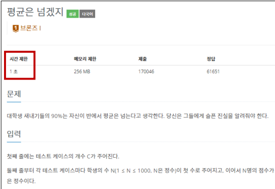

# 7/26

# 🌇 오전

## 🕓 9:00 ~ 12:00

### ✅ 코드 리뷰

- 코테할 때, 모르는거나 애매한게 있으면 물어보는게 최고
- 프로그래머스 문제는 프로그래머스 환경에서 문제 푸는 습관 들이자

 

### ✅ 시간 복잡도 & 빅오 표기법

#### 💻 1. 시간 복잡도

- 좋은 알고리즘이란 무엇일까?

  > Input을 넣은 후 Output이 나오는 시간이 짧은 알고리즘!

- 알고리즘의 소요 시간 측정하기 -1

  > 객관적인 측정을 위해 알고리즘 내부에서 `기본연산이 몇 번 일어나는지`

- 알고리즘의 소요 시간 측정하기 -2

  > 성능을 축정할 때는 `가장 기본연산이 많이 일어나는 최악의 입력 n개`가 들어온다고 가정!

-  시간 복잡도(Time Complexity)

  > 알고리즘의 수행 시간
  >
  > 시간 복잡도가 높다 👉 느린 알고리즘
  >
  > 시간 복잡도가 낮다 👉 빠른 알고리즘

 

#### 💻 2. 빅오(Big-O) 표기법

- 입력 n이 무한대로 커진다고 가정하고, 시간 복잡도를 간단하게 표시하는 것

- `최고차항만 남기고 계수와 상수는 제거!!`

- 정확한 수치보다는 `증가율`이 중요

  👉 즉 3n과 6n의 차이는 크게 없다고 봄(소요시간은 2배 차이 나지만 동일한 시간대라고 봄)

- 시간 복잡도 목록 

  - `O(1)` : 단순 산술 계산 (덧셈, 뺄셈, 곱셈, 나눗셈)

  - `O(logN)` : 크기 N인 리스트를 반절씩 순회 / 탐색, 이진탐색

  - `O(N)` : 크기 N인 리스트를 순회, 1중 for문

  - `O(NlogN)` : 크기 N인 리스트를 반절씩 탐색 * 순회, 높은 성능의 정렬

  - `O(N^2)` : 크기 M, N인 2중 리스트를 순회, 2중 for문

  - `O(N^3)` : 3중 for문

  - `O(2^n)` : 크기 N 집합의 부분 집합

  - `O(N!)` : 크기 N 리스트의 순열 

  

- 실제 문제에 적용은 어떻게?

  

  > 보통 `1초에 1억 번` 연산을 계산

- 내장 함수와 메서드의 시간 복잡도도 확인할 필요가 있다

  - for문 1번 썼는데 왜 시간 초과가 날까요?

    👉 for문이 1번이라고 해서 무조건 O(n)인 것은 아님,  for문 안에 내장 함수 사용했다면 사실상 이중 for문과 다를 것이 없기 때문!

  - 그래서 메서드, 내장 함수 비싸다고 남발은 별로 좋지 않다 👉 얘네 비싸...

 

### ✅ 배열 vs 연결리스트

- 배열 (Array)
  - 여러 데이터들이 연속된 메모리 공간에 저장되어 있는 자료구조
  - 인덱스를 통해 데이터에 빠르게 접근
- 연결 리스트 (Linked List)
  - 데이터가 담긴 여러 노드들이 순차적으로 연결된 형태의 자료구조
  - 삽입과 삭제가 편리
  - 데이터가 메모리에 연속적으로 저장되지 않음

 

### ✅ 파이썬의 리스트

1. `.append(요소)` : 리스트 맨 끝에 새로운 원소 삽입, `O(1)`
2. `pop(index)` : 특정 인덱스에 있는 원소를 삭제 및 반환, `O(1)` 👉 return이 있음

3. `.count(요소)` : 리스트에 해당 원소의 개수를 반환, `O(N)`
4. `.index(요소)` : 리스트에서 처음으로 원소가 등장하는 인덱스 반환, `O(N)`
5. `.sort()` : 리스트를 오름차순으로 정렬, `O(nlogn)`
6. `.reverse()` : 리스트의 원소들의 순서를 거꾸로 뒤집기, `O(N)`

- 자주 쓰이는 리스트 관련 내장 함수
  - len()
  - sum()
  - max()
  - min()
  - sorted() : 원본 리스트 변화 없음
  - reversed() : 원본 리스트 변화 없음

 

# 🌆 오후

## 🕓 1:00 ~ 6:00

