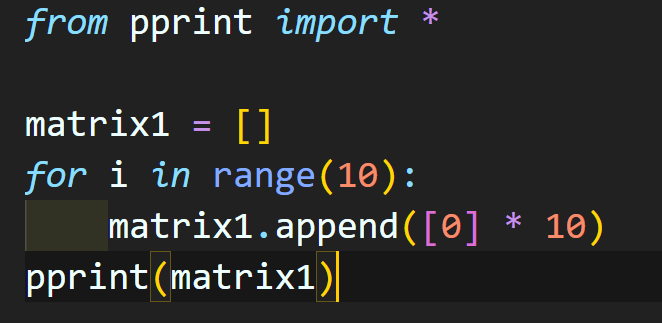
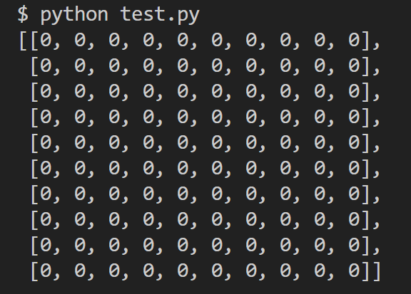
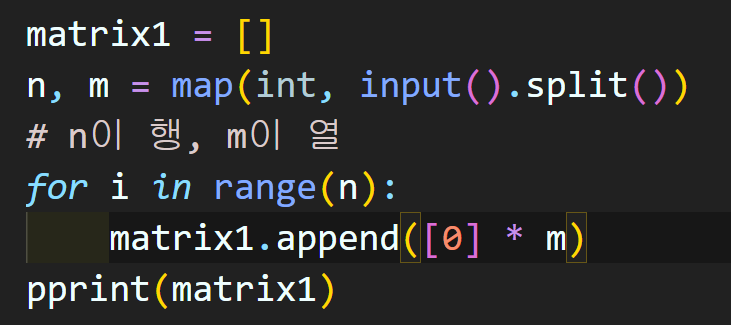
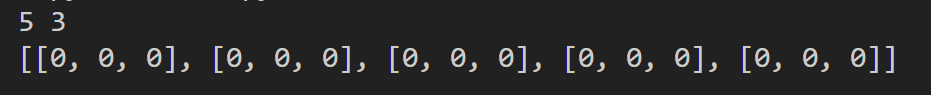

# 8/3

# 🌇 오전

## 🕓 9:00 ~ 12:00

### ✅ 코드 리뷰

- 절대값 힙 문제
  - 일단 힙은 `가장 작은 요소가 항상 루트인 heap[0]`이라는 점이 중요 (뒷부분은 모름, 랜덤성)
  - 리스트가 들어가면 첫 인덱스 요소 부터 비교함
  - 따라서 우리는 리스트안에 [절대값, 원래값] 이렇게 수를 넣을것
  - 때문에 -2는 [2, -2], 2는 [2, 2]이고 정렬은 [2, -2], [2, 2] 순서로 돼기 때문에 -2가 2보다 더 먼저 오게 정렬이 가능!!

<br>


### ✅ 이차원 리스트

- 리스트를 원소로 가지는 리스트 👉 보기 좋게 변경하면 행렬의 형태가 나옴
- 인덱스를 두번 써서 각 요소에 접근 가능

  ```python
  matrix = [[1, 2, 3], [4, 5, 6], [7, 8, 9]]
  print(matrix[0][0])
  ```

- 1차원이지만 우리는 2차원으로 생각을 하는 것이 포인트!

<br>


#### 💻 1. 특정 값으로 초기화 된 이차원 리스트 만들기

- 반복문으로 작성 (예를 들어 100 X 100 행렬)

  

  

- n x m 행렬

  

  

한 줄로 쓴다면 (리스트 컴프리헨션)

```python
matrix1 = [[0] * m for _ in range(n)]
```

> n번 동안 m개를 넣기 

리스트 곱셈 연산은 절대 사용 x

> 겉보기에는 똑같아 보이지만, 주소가 같아지기 때문에 개별 요소를 수정하고 싶어도 다 바뀜

<br>


#### 💻 2. 입력 받기

1. 행렬의 크기가 미리 주어지는 경우

   1. 일단 `0으로 채워진 행렬`을 초기화해서 만들고 입력을 받기
   2. 입력을 그대로 2차원 리스트화

2. 행렬의 크기가 입력으로 주어지는 경우

   1. 한 줄 씩 받고 전체 리스트에 append 해야함

   2. 또는 리스트 컴프리헨션을 이용해서

      ```python
      matrix = [list(map(int, input().split())) for _ in range(n)]
      ```

      이렇게 작성도 가능


# 🌆 오후

## 🕓 1:00 ~ 6:00

- 
