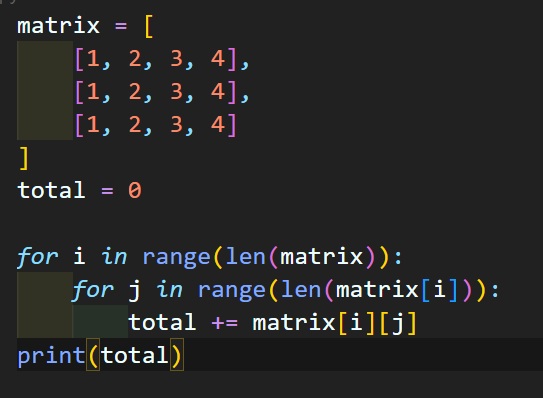
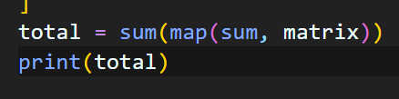

# 8/4

# 🌇 오전

## 🕓 9:00 ~ 12:00

### ✅ 코드 리뷰

- 유니크 문제
  - 배열을 90도 회전해서 입력을 받는 것이 쉽게 푸는 포인트!
  - 원래 전체 리스트가 3 * 5 여서 for문을 range(3) 다음에 range(5)를 썼다면, 바꿔서 작성
  - for문에서 전체 list를 돌리지 말고 row와 column의 range를 이용해서 2중 for문을 돌리자


<br>


### ✅ 이차원 리스트

#### 💻 3. 순회

- 이중 for문을 이용한 행 우선 순회

- 열 우선 순회도 가능

  > 이중 인덱스 순서를 어떻게 하냐에 따라서 가로로 또는 세로로 요소를 순회할 수 있다!

- 어떤 인덱스가 고정되는지 잘 파악해야함!

- 리스트의 총합 구하는 방법

  - 행 우선 순회를 이용

    

  - Ptyhonic하게

    

    > map(함수, iterable)은 iterable 마다 함수를 적용시킴
    >
    > 따라서 matrix의 모든 요소들에 sum함수를 적용시킴 👉 matrix의 요소 3개 중 각각의 sum이 나옴
    >
    > 그 합들을 다시 sum으로 쓰면 전체 matrix의 총합이 나오게 되는것!

<br>


#### 💻 4. 전치 (Transpose)

- 행과 열을 서로 맞바꾸는 것

- 전치 행렬을 담을 초기화된 리스트를 만들고 인덱스 순서를 바꾸어서 새 매트릭스에 집어넣기

- 주어진 행렬이 m * n 이었다면, n * m으로 바꿔야함 👉 행과 열의 크기가 반대

- 만약 4 x 3 이었다면, 전체 리스트의 요소가 4개이고, 각 요소의 요소가 3개씩 있는 것

- 좌표로 생각하면 (0,0), (0,1), (0,2), (1,0), (1,1), ... ,(3,0), (3,1), (3,2) 임

- 얘를 전치하면 3 X 4기 때문에

  ```python
  for i in range(3):
  	for j in range(4):
  	...
  ```

  큰 순회는 3, 그 안의 작은 순회는 4가 되어야함!

<br>


#### 💻 5. 회전

- 90도 또는 270도씩 회전하는 경우 존재

  ```python
  def rotated(a):
    n = len(a)
    m = len(a[0])
  
    result = [[0]* n for _ in range(m)]
  
    for i in range(n):
      for j in range(m):
        result[j][n-i-1] = a[i][j]
    return result	
  ```

<br>


# 🌆 오후

## 🕓 1:00 ~ 6:00

- 
