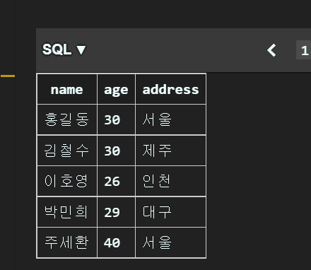
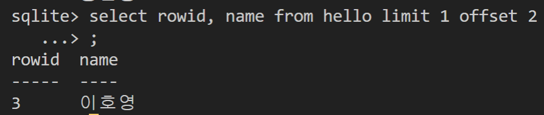

# 8/16

# 🌇 오전

## 🕓 9:00 ~ 12:00

### ✅ Database

- 체계화된 데이터의 모임
- 여러 사람이 공유하고 사용할 목적으로 통합 관리되는 정보의 집합
- 몇 개의 자료파일을 `조직적으로 통합` 👉 자료 항목의 중복을 없애고 자료를 구조화!
- 여러 장점들이 있음
  - 중복 최소화
  - 무결성 (정확한 정보를 보장)
  - 일관성
  - 독립성
  - 표준화
  - 보안 유지 등

<br>


### ✅ RDB (Relational Database) 

> 서로 관련된 데이터를 저장하고 접근할 수 있는 데이터베이스 유형

#### 🟨 스키마 (schema)

- 데이터베이스에서 자료의 구조, 표현방법, 관계 등 전반적인 명세를 기술한 것
- `일종의 틀`을 만들어 놓는 것!

<br>


#### 🟨 테이블 (table)

- `열(컬럼 / 필드)`과 `행(레코드 / 값)`의 모델을 사용해 조직된 데이터 요소들의 집합
- 열(column) : 각 열에 고유한 데이터 형식 지정
  - id는 뭐고, 이름은 뭐고, 주소는 뭐고, 나이는 얼마고...
- 행(row) : 실제 데이터가 저장됨
  - id는 1번에, 이름은 홍길동, 주소는 제주, 나이는 20 이렇게 한 줄에 쭉
- 기본키(Primary Key) : 각 행(레코드)의 고유값 (PK)
  - 반드시 설정해야함, 데이터베이스 관리 및 관계 설정 시 주요하게 활용됨

<br>


### ✅ RDBMS

- `관계형 데이터베이스 관리 시스템` ; MySQL, SQLITE, ORACLE DB, SQL Server 등등 많음

#### 🟨 SQLite

- 비교적 가벼운 데이터베이스
- 구글 안드로이드 운영체제에 기본적으로 탑재된 데이터베이스
- 로컬에서 간단한 DB 구성 가능, 오픈소스 프로젝트

<br>


#### 🟨 Data Type

> Null, INTEGER, REAL, TEXT, BLOB

- 실습에서는 integer, text 위주로 사용할 것

<br>


### ✅ SQL

#### 🟨 SQL(Structured Query Language)

- 데이터 관리를 위해 특수하게 만들어진 언어
- 데이터베이스 스키마 생성 및 수정
- 자료의 검색 및 관리
- 데이터베이스 객체 접근 조정 관리
- DDL(`Definition`), DML(`Manipulation`), DCL(`Control`)로 나뉠 수가 있음

<br>


#### 🟨 Keywords - DML

- INSERT : 새로운 데이터 삽입(추가)
- SELECT : 저장돼있는 데이터 조회
- UPDATE : 저장돼있는 데이터 갱신
- DELETE : 저장돼있는 데이터 삭제

<br>


### ✅ Hello World! ; 이제 시작!

#### 🟨 데이터베이스 생성하기

```sqlite
$ sqlite3 tutorial.sqlite3
sqlite> .database
```


<br>


#### 🟨 csv 파일을 table로 만들기 & 조회

```sqlite
sqlite> .mode csv
sqlite> .import hellodb.csv examples
sqlite> .tables
examples
```


> hellodb.csv 파일을 examples라는 table로 만드는 것


```sqlite
SELECT * FROM examples;
```

조회를 하면 helloda.csv 파일 그대로 table이 조회됨 👉 SELECT 문은 특정 테이블의 레코드(행) 정보를 반환!


> 익스텐션 사용하면 이렇게 좀 더 이쁘게 가능

<br>


#### 🟨 터미널 view 변경


``` sqlite
.mode column
```

을 활용하면 좀 더 깔끔하게 볼 수 있음!

<br>


#### 🟨 sqlite 확장 프로그램 사용하기

- sqlite3 파일 우측 클릭 👉 Open Database

  

- New Query 클릭 후 sql 명령어 작성하는 페이지로 들어감

- 코드 작성 후 Run Query

  

- 코드 실행 후의 결과를 확인해볼 수 있음

  

<br>


#### 🟨 테이블 생성 및 삭제

- **CREATE TABLE**

  ```sqlite
  CREATE TABLE classmates (
  id INTEGER PRIMARY KEY,
  name TEXT
  );
  ```

  > 데이터베이스에서 테이블 생성

- **DROP TABLE**

  ```sqlite
  DROP TABLE classmates;
  ```

  >  데이터베이스에서 테이블 제거

  

- | column  | datatype |
  | ------- | -------- |
  | name    | TEXT     |
  | age     | INT      |
  | address | TEXT     |

  위와 같은 스키마(schema)를 가진 테이블을 만들려면?

  ```sqlite
  sqlite> CREATE TABLE hello (
     ...> name TEXT,
     ...> age INT,
     ...> address TEXT
     ...> );
  ```

  

<br>


#### 🟨 필드 제약 조건

- NOT NULL : NULL 값 입력 금지 
- UNIQUE : 중복 값 입력 금지 (NULL 값은 중복 입력 가능)
- PRIMARY KEY : `테이블에서 반드시 하나`,  NOT NULL + UNIQUE
- FOREIGN KEY : 외래키. 다른 테이블의 Key 
- CHECK : 조건으로 설정된 값만 입력 허용 
- DEFAULT : 기본 설정 값

<br>


### ✅ CRUD

#### 🟨 CREATE

- **INSERT**

  - 테이블에 단일 행 삽입

    ```sqlite
    sqlite> INSERT INTO hello (name, age) VALUES ('홍길동', 23);
    ```

    

  - 한 번 더 삽입해보면

    ```sqlite
    INSERT INTO hello (name, age, address) VALUES ('홍길동', 30, '서울');
    ```

    

  - 예를 들어 주소가 꼭 필요하다면, 위처럼 주소를 넣지 않았을때는 걸러줘야함 👉 그래서 `제약조건`이 중요함

  - `rowid` : SQLite에서 PRIMARY KEY가 없는 경우 자동으로 증가하는 PK 컬럼

    

  - insert 직접 해보기

    

    

<br>


#### 🟨 READ

- **SELECT**

  - 가장 근본이 되는 문
  - 다양한 절과 함께 사용이 가능 : ORDER BY, DISTINCT, WHERE, LIMIT, GROUP BY ...

  - LIMIT 
    - “constrain the number of rows returned by a query” 
    - 쿼리에서 `반환되는 행 수를 제한`
    - 특정 행부터 시작해서 조회하기 위해 `OFFSET 키워드`와 함께 사용하기도 함
  - WHERE 
    - “specify the search condition for rows returned by the query” 
    - 쿼리에서 반환된 행에 대한 `특정 검색 조건`을 지정

  - SELECT DISTINCT 
    - “remove duplicate rows in the result set” 
    - 조회 결과에서 `중복 행을 제거`
    - DISTINCT 절은 `SELECT 키워드 바로 뒤`에 작성해야 함

- 테이블에서 id, name 컬럼 값만 조회하고 싶으면?

  ```sqlite
  SELECT 컬럼1, 컬럼2, ... FROM 테이블 이름;
  ```

  

  > rowid도 가능!

- 값 1개만 조회하고 싶으면?

  ```sqlite
  SELECT 컬럼1, 컬럼2, ... FROM 테이블 이름 LIMIT 1;
  ```

  

- 세번째값 1개만 조회하고 싶으면?

  ```sqlite
  SELECT 컬럼1, 컬럼2, ... FROM 테이블 이름 LIMIT 1 OFFSET 2;
  ```

  

  > 2를 하면 3번째 순서가 나옴!

- OFFSET은 처음 위치를 정해줌

  - 예를 들어 `SELECT * FROM MY_TABLE LIMIT 10 OFFSET 5`의 경우

    > 6번째 행부터 10개의 행을 조회 (0부터 시작)

- 주소가 '서울'인 경우의 데이터만 조회하고 싶으면?

  ```sqlite
  SELECT 컬럼1, 컬럼2, ... FROM 테이블 이름 WHERE 조건;
  ```

  

- 특정 데이터값 전체를 중복없이 조회하고 싶으면?

  ```sqlite
  SELECT DISTINCT 컬럼 FROM 테이블 이름;
  ```

  

  > 홍길동과 김철수가 둘 다 AGE가 30이므로 중복을 제거하고 4개만 보여줌!

<BR>


# 🌆 오후

## 🕓 1:00 ~ 6:00

- 
