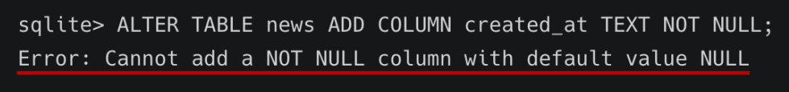

# 8/17

# 🌇 오전

## 🕓 9:00 ~ 12:00

### ✅ 기본 함수와 연산

#### 🟨 문자열 함수

- SUBSTR(문자열, start, length) : 문자열 자르기
  - 시작 인덱스는 1, 마지막 인덱스는 -1
- TRIM(문자열), LTRIM(문자열), RTRIM(문자열) : 문자열 공백 제거
- LENGTH(문자열) : 문자열 길이
- REPLACE(문자열, 패턴, 변경값) : 패턴에 일치하는 부분을 변경
- UPPER(문자열), LOWER(문자열) : 대소문자 변경
- || : 문자열 합치기(concatenation)

<br>


#### 🟨 숫자 함수

- ABS(숫자) : 절대 값
- SIGN(숫자) : 부호 (양수 1, 음수 -1, 0 0)
- MOD(숫자1, 숫자2) : 숫자1을 숫자2로 나눈 나머지
- CEIL(숫자), FLOOR(숫자), ROUND(숫자, 자리) : 올림, 내림, 반올림
- POWER(숫자1, 숫자2) : 숫자1의 숫자2 제곱
- SQRT(숫자) : 제곱근

<br>


#### 🟨 산술 연산자

- +, -, *, / 와 같은 산술 연산자와 우선 순위를 지정하는 () 기호를 연산에 활용할 수 있음

<br>


### ✅ GROUP BY

#### 🟨 ALIAS

- 칼럼명이나 테이블명이 너무 길거나 다른 명칭으로 확인하고 싶을 때 사용
- `AS`를 생략해서 공백으로도 표현이 가능
- BMI처럼 공식이 길 경우 일종의 변수처럼 할당한 후 조건절에서 사용이 가능

<br>


#### 🟨 GROUP BY

- SELECT 문의 optional 절
- 집계함수와 활용했을 때 의미가 있음
- 그룹화된 각각의 그룹이 하나의 집합으로 집계함수의 인수로 넘겨짐
- ` 문장에 WHERE 절이 포함된 경우 반드시 WHERE 절 뒤에 작성해야 함`

- users에서 각 성(last_name)씨가 몇 명씩 있는지 조회한다면?

  ```sqlite
  SELECT last_name, count(*) FROM users GROUP BY last_name;
  ```

- GROUP BY의 결과는 정렬되지 않음
  - 기존의 순서와 바뀔 때도 있지만, 원칙적으로는 ORDER BY가 정렬

<br>


#### 🟨 HAVING

- 집계함수는 WHERE 절의 조건식에서는 사용 불가능 (실행 순서 때문에)

  - 즉, WHERE로 처리하는 것이 GROUP BY 보다 순서상으로 앞서기 때문!

- 집계 결과에서 조건에 맞는 값을 따로 활용하기 위해서 HAVING을 활용!

  ```sqlite
  SELECT * FROM 테이블 이름 GROUP BY 컬럼1, 컬럼2 ,... HAVING 그룹 조건;
  ```

<br>


#### 🟨 SELECT 문장 실행 순서

> FROM 👉 WHERE 👉 GROUP BY 👉HAVING 👉 SELECT 👉 ORDER BY

- FROM : 테이블을 대상으로
- WHERE : 제약조건에 맞춰서 뽑아서
- GROUP BY : 그룹화를 한다
- HAVING : 그룹 중에 조건과 맞는 것만을
- SELECT : 조회하여
- ORDER BY : 정렬하고
- LIMIT / OFFSET : 특정 위치의 값을 몇개 가져온다.

<br>


### ✅ ALTER TABLE

#### 🟨 ALTER TABLE

1. 테이블 이름 변경
2. 새로운 column 추가
3. column 이름 수정
4. column 삭제

```sqlite
-- 1. 테이블 이름 변경
ALTER TABLE table_name
RENAME TO new_name;

-- 2. 새로운 컬럼 추가
ALTER TABLE table_name
ADD COLUMN column_definition;

-- 3. 컬럼 이름 수정
ALTER TABLE table_name
RENAME COLUMN current_name TO new_name;

-- 4. 컬럼 삭제
ALTER TABLE table_name
DROP COLUMN column_name;
```

- title과 content라는 컬럼을 가진 articles라는 이름의 table을 새롭게 만들기

  ```sqlite
  create table articles(
  title text not null,
  content text not null
  );
  ```

- articles 테이블에 값을 추가 해보기

  ```sqlite
  INSERT INTO articles VALUES ('1번제목', '1번내용');
  ```

- articles 테이블의 이름을 바꾸기

  ```sqlite
  ALTER TABLE articles RENAME TO news;
  ```

- 새 칼럼을 추가해보기

  ```sqlite
  ALTER TABLE news ADD COLUMN created_at TEXT NOT NULL;
  ```

- 근데 에러가 뜸!

  

  > 테이블에 있던 기존 레코드들에는 새로 추가할 필드(컬럼)에 대한 정보가 없음
  >
  > 그렇기 때문에 NOT NULL 형태의 컬럼은 추가가 불가능!

  👉 NOT NULL 설정 없이 추가하거나, 기본 값(DEFAULT) 설정하기

<br>


# 🌆 오후

## 🕓 1:00 ~ 6:00

- 
