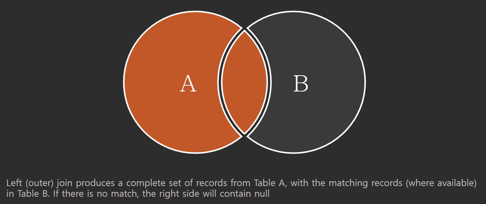

# 8/22

# 🌇 오전

## 🕓 9:00 ~ 12:00

### ✅ Join

#### 🟨 Join

- 관계형 데이터베이스의 가장 큰 장점이자 핵심적인 기능
- 일반적으로 데이터베이스에는 하나의 테이블에 많은 데이터를 저장하는 것이 아니라 여러 테이블로 나눠서 저장하게 되며, 여러 테이블을 결합하여 출력하여 활용
- 일반적으로 레코드는 기본키(PK)나 외래키(FK) 값의 관계에 의해 결합

<br>


#### 🟨 대표적인 Join

- INNER JOIN : 두 테이블에 모두 일치하는 행만 반환
- OUTER JOIN : 동일한 값이 없는 행도 반환
- CROSS JOIN : 모든 데이터의 조합

<br>


#### 🟨 INNER JOIN

> 조건이 일치하는 행만 반환


```sqlite
SELECT *
FROM 테이블1 INNER JOIN 테이블2
	ON 테이블1.칼럼 = 테이블2.칼럼;
```

<br>


- 사용자(users)의 각각의 역할을 출력

```sqlite
SELECT *
FROM users INNER JOIN role
	ON users.role_id = role.id;
```

```sqlite
id  name  role_id  id  title
--  ----  -------  --  -----
1   관리자   1        1   admin
2   김철수   2        2   staff
3   이영희   2        2   staff
```

<br>


- staff(2) 사용자(users)를 역할과 함께 출력

```sqlite
SELECT *
FROM users INNER JOIN role
	ON users.role_id = role.id
WHERE users.role_id = 2;
-- WHERE role.id = 2도 가능!
```

```sqlite
id  name  role_id  id  title
--  ----  -------  --  -----
2   김철수   2        2   staff
3   이영희   2        2   staff
```

<br>


- 사용자(users)와 각각의 역할을 이름의 내림차순으로 출력

```sqlite
SELECT
users.name, role.title
FROM users INNER JOIN role
	ON users.role_id = role.id
ORDER BY users.name DESC;
```

```sqlite
name  title
----  -----
이영희   staff
김철수   staff
관리자   admin
```

<br>


#### 🟨 OUTER JOIN

> 동일한 값이 없는 데이터도 반환할 때 사용
>
> 기준이 되는 테이블에 따라 LEFT / RIGHT / FULL을 지정



```sqlite
SELECT *
FROM 테이블1 LEFT/RIGHT/FULL OUTER JOIN 테이블2
	ON 테이블1.칼럼 = 테이블2.칼럼;
```

<br>


- 모든 게시글을 사용자 정보와 함께 출력

```sqlite
SELECT *
FROM articles LEFT OUTER JOIN users
	ON articles.user_id = users.id;
```

```sqlite
id  title  content  user_id  id  name  role_id
--  -----  -------  -------  --  ----  -------
1   1번글    111      1        1   관리자   1
2   2번글    222      2        2   김철수   2
3   3번글    333      1        1   관리자   1
4   4번글    444
```

<br>


- 작성자가 있는 모든 게시글을 사용자 정보와 함께 출력

```sqlite
SELECT *
FROM articles LEFT OUTER JOIN users
	ON articles.user_id = users.id
WHERE articles.user_id IS NOT NULL;
-- WHERE articles.user_id != ''도 가능
```

```sqlite
id  title  content  user_id  id  name  role_id
--  -----  -------  -------  --  ----  -------
1   1번글    111      1        1   관리자   1
2   2번글    222      2        2   김철수   2
3   3번글    333      1        1   관리자   1
```

<br>


- 모든 게시글과 모든 사용자 정보를 출력

  👉 FULL OUTER JOIN!

  

```sqlite
SELECT * 
FROM articles FULL OUTER JOIN users
    ON articles.user_id = users.id;
```

```sqlite
id  title  content  user_id  id  name  role_id
--  -----  -------  -------  --  ----  -------
1   1번글    111      1        1   관리자   1
2   2번글    222      2        2   김철수   2
3   3번글    333      1        1   관리자   1
4   4번글    444
                             3   이영희   2
```


> 5, 6번째 줄에도 원래는 내용이 들어가지만 중복이라 그냥 삭제됨
>
> 마지막 '이영희'는 사용자 정보는 존재하지만 글은 없음.  따라서 articles의 정보들이 전부 NULL이고, FULL OUTER를 쓰면 전부 다 표현이 되기 때문에 앞쪽은 텅 비어있고, 뒷 쪽에 이영희의 정보만 들어가 있는것!

<br>


#### 🟨 CROSS JOIN

> 모든 가능한 경우의 수의 Join

```sqlite
SELECT *
FROM 테이블1 CROSS JOIN 테이블2;
```

<br>


- users와 role의 CROSS JOIN의 결과를 출력

```sqlite
SELECT *
FROM users CROSS JOIN role;
```

```sqlite
id  name  role_id  id  title
--  ----  -------  --  -------
1   관리자   1        1   admin
1   관리자   1        2   staff
1   관리자   1        3   student
2   김철수   2        1   admin
2   김철수   2        2   staff
2   김철수   2        3   student
3   이영희   2        1   admin
3   이영희   2        2   staff
3   이영희   2        3   student
```

> users와 role에는 3개씩 데이터가 있으므로, 3 X 3 = 9가지의 데이터가 생성됨

<br>


#### 🟨 3개의 테이블을 join

```sqlite
SELECT * 
FROM articles
    JOIN users
        ON articles.user_id = users.id
    JOIN role
        ON users.role_id = role.id;
```

```sqlite
id  title  content  user_id  id  name  role_id  id  title
--  -----  -------  -------  --  ----  -------  --  -----
1   1번글    111      1        1   관리자   1        1   admin
2   2번글    222      2        2   김철수   2        2   staff
3   3번글    333      1        1   관리자   1        1   admin
```

> 3개를 연달아 이어 붙이는 효과!

<br>


# 🌆 오후

## 🕓 1:00 ~ 6:00

- 
