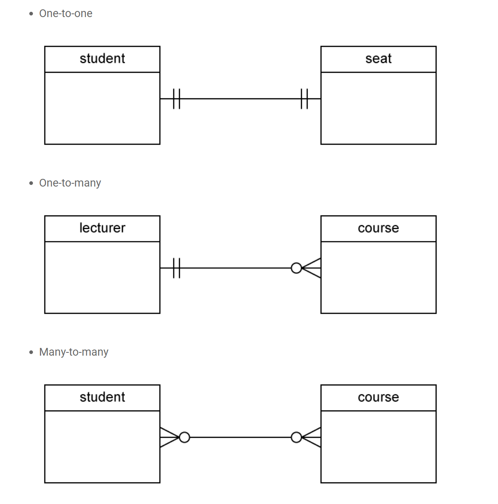
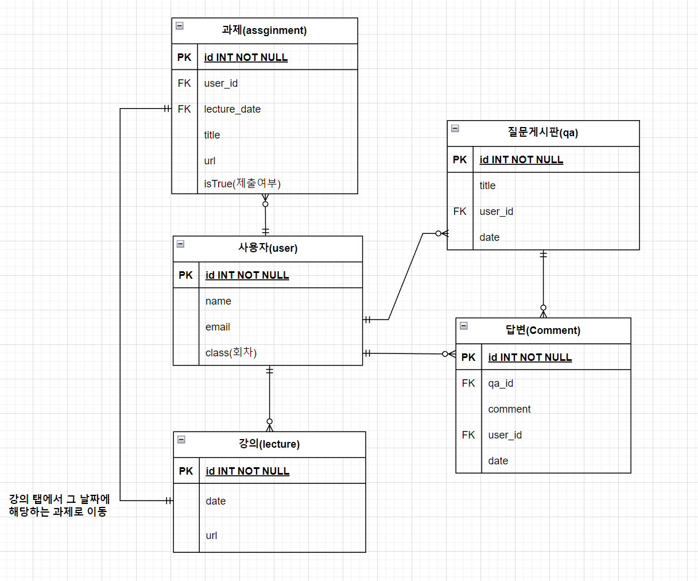
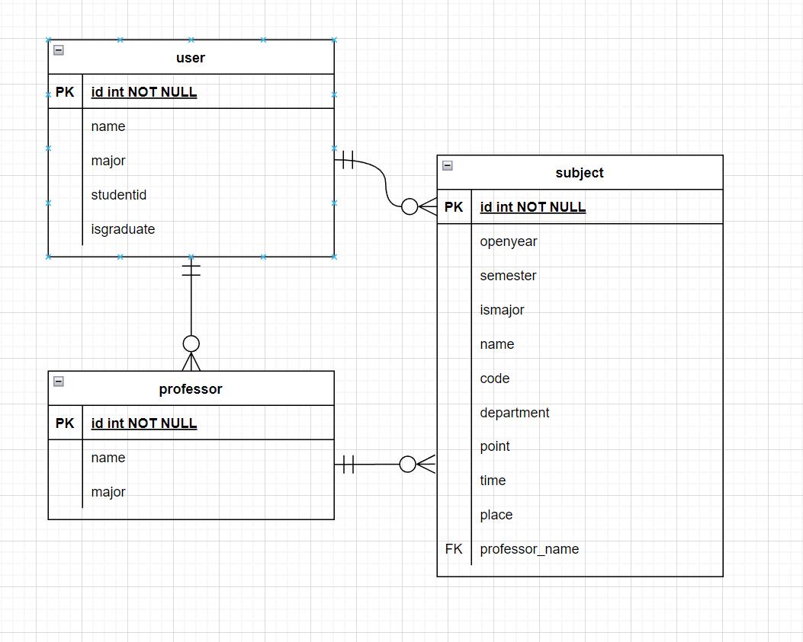

# 8/23

# 🌇 오전

## 🕓 9:00 ~ 12:00

### ✅ 모델링

#### 🟨 모델링이란

- 데이터베이스의 구조나 형식으로 모델 구조만 보고 어떤 데이터를 다루는지 알 수 있음
- 개념적 데이터 모델링
  - 데이터의 요구사항을 찾고 분석하는 과정, 핵심 개체(Entity) 사이의 관계를 찾아내고 표현
- 논리적 데이터 모델링
  - 데이터베이스 설계 프로세스의 과정으로 정보의 논리적인 구조와 규칙을 명확하게 표현하는 기법/과정
- 물리적 데이터 모델링
  - 논리적 데이터 모델이 데이터 저장소로서 어떻게 실제로 저장될 것인가

 

#### 🟨 ERD

- ERD(Entity Relation Diagram) - 개체 관계 모델
- 주요 용어
  - 엔티티 : 업무가 관여하는 정보
  - 속성(Attribute) : 엔터티가 가지는 성격, 데이터 타입과 크기 및 제약사항 지정
  - 관계(Relationship) : Entity 간의 관계, 연관성

 

#### 🟨 ERD의 관계

- 카디널리티(Cardinality) : 수적 관계
  - 1 : 1 관계 : A는 B를 하나 가지고 B도 A를 하나 가짐
  - 1 : N 관계 : A는 B를 여러개 가지고 B는 A의 하나에 해당함
  - M : N 관계 : A는 B를 여러개 가지고 B는 A를 여러개 가짐
- 옵셔널리티
  - (1) : 필수
  - (0) : 선택

 

#### 🟨 Crow's feet

 

#### 🟨 정규화

- 데이터들을 최대한 중복을 제거해서 이상 현상 (Anomaly)을 방지 👉 성능 향상
- 제1 정규화 : 도메인 원자값
- 제2 정규화 : 부분적 함수 종속성 제거
- 제3 정규화 : 이행적 함수 종속성 제거

 

# 🌆 오후

## 🕓 1:00 ~ 6:00

### ✅ ERD 작성해보기

#### 🟨 실라버스

 

#### 🟨 학사 정보 시스템

