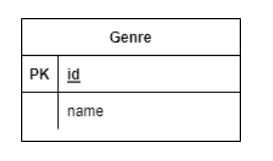

# 8/24

# 🌇 오전

## 🕓 9:00 ~ 12:00

### ✅ 객체

#### 🟨 객체란 (Remind)

- 속성 & 메서드
- `모든 것` 이라고 표현
- 클래스는 틀, 인스턴스는 사례

<br>


### ✅ ORM

#### 🟨 ORM이란

- Object-Relational-Mapping

- 객체 지향 프로그래밍 언어를 사용하여 호환되지 않는 유형의 시스템 간의 데이터를 변환하는 프로그래밍 기술

- 파이썬에서 `객체로 DB를 조작함`!!

  ```python
  Genre.objects.all() # Django
  ```

  ```sqlite
  SELECT * FROM Genre # SQL
  ```

  👉 둘은 같은 코드!

<br>


#### 🟨 모델 설계 및 반영

- SQL에서는 CREATE문을 써서 table을 만들었다면, 파이썬에서는 `클래스`로 정의를 해서 틀을 만든 다음, `개별 인스턴스`를 만드는 것!

1. 클래스를 생성해서 내가 원하는 DB의 구조를 만든다



```python
class Genre(models.Model):
	name = models.CharField(max_length = 30)
```

2. 클래스의 내용으로 데이터베이스에 반영하기 위한 migration file 생성

```python
python manage.py makemigrations
```

3. DB에 migrate ; 저장

```python
python manage.py migrate
```

<br>


#### 🟨 Migration

- Model에 생긴 변화를 DB에 반영하기 위한 방법
- migration file을 만들어 DB schema를 반영
- 명령어
  - makemigrations : 마이그레이션 파일 생성
  - migrate : 마이그레이션을 DB에 반영

```python
BEGIN;
--
-- Create model Genre
--
CREATE TABLE "db_genre" (
"id" integer NOT NULL PRIMARY KEY AUTOINCREMENT,
"name" varchar(30) NOT NULL
);
COMMIT
```

<br>


# 🌆 오후

## 🕓 1:00 ~ 6:00

### ✅ ORM 실습

#### ✔️ 실습 환경 설정

👉 [참고자료](./Practice/220824/README.md)

<br>

#### ✔️ 실습07

👉 [실습파일](./Practice/220824/%EC%8B%A4%EC%8A%B507.md)
