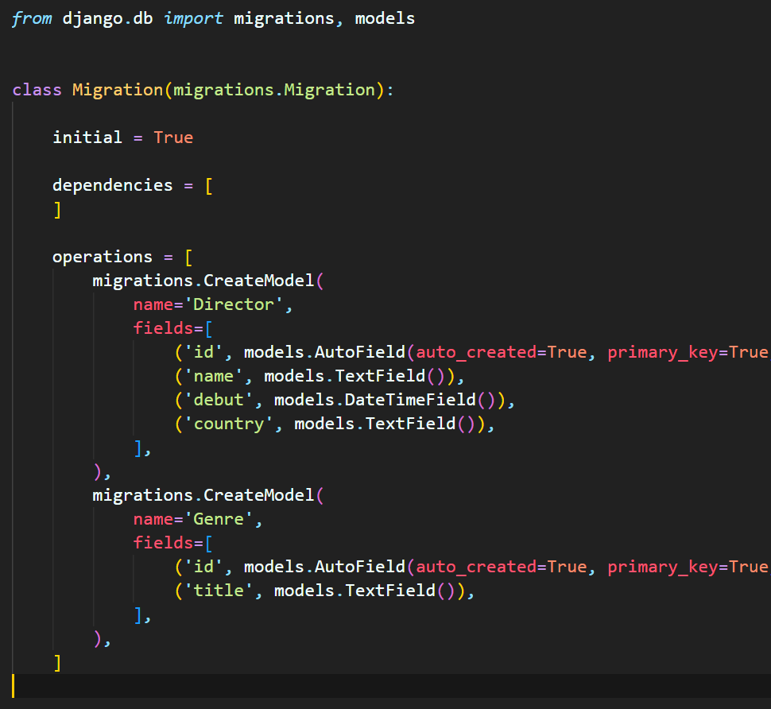
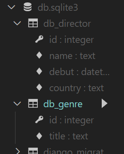
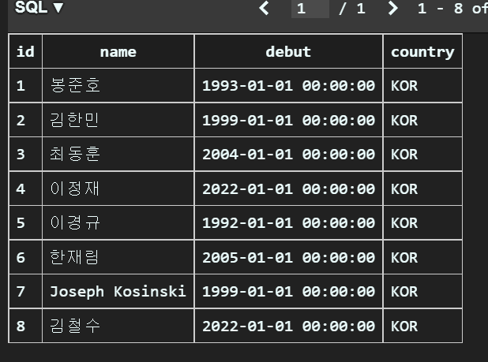
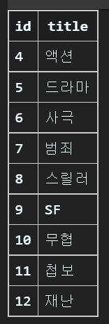

# 데이터베이스 07 - ORM

<aside>
💡 코드를 작성한 실습 파일을 압축해서 실라버스에 제출해주세요.

</aside>

### 1. `db/models.py` 파일에 아래의 모델 2개 `Director` `Genre` 를 작성하세요.

> 기본 코드
> 

```python
class Director(models.Model):
    name = models.TextField()
    debut = models.DateTimeField()
    country = models.TextField()

class Genre(models.Model):
    title = models.TextField()
```

### 2. 모델을 마이그레이트(migrate) 하세요.

```bash
# 가상환경 실행 확인 후 아래 명령어를 터미널에 입력합니다.
python manage.py makemigrations

python manage.py migrate
```

, 

> 자동 생성됨!

### 3. Queryset 메소드 `create` 를 활용해서  `Director` 테이블에 아래 데이터를 추가하는 코드를 작성하세요.

| name | debut | country |
| --- | --- | --- |
| 봉준호 | 1993-01-01 | KOR |
| 김한민 | 1999-01-01 | KOR |
| 최동훈 | 2004-01-01 | KOR |
| 이정재 | 2022-01-01 | KOR |
| 이경규 | 1992-01-01 | KOR |
| 한재림 | 2005-01-01 | KOR |
| Joseph Kosinski | 1999-01-01 | KOR |
| 김철수 | 2022-01-01 | KOR |

> 코드 작성
> 

```python
Director.objects.create(name='봉준호', debut='1993-01-01', country='KOR')
Director.objects.create(name='김한민', debut='1999-01-01', country='KOR')
Director.objects.create(name='최동훈', debut='2004-01-01', country='KOR')
Director.objects.create(name='이정재', debut='2022-01-01', country='KOR')
Director.objects.create(name='이경규', debut='1992-01-01', country='KOR')
Director.objects.create(name='한재림', debut='2005-01-01', country='KOR')
Director.objects.create(name='Joseph Kosinski', debut='1999-01-01', country='KOR')
Director.objects.create(name='김철수', debut='2022-01-01', country='KOR')
```



### 4. `인스턴스 조작` 을 활용하여`Genre` 테이블에 아래 데이터를 추가하는 코드를 작성하세요.

| title |
| --- |
| 액션 |
| 드라마 |
| 사극 |
| 범죄 |
| 스릴러 |
| SF |
| 무협 |
| 첩보 |
| 재난 |

> 코드 작성
> 

```python
genres = ['액션', '드라마', '사극', '범죄', '스릴러', 'SF', '무협', '첩보', '재난']
for i in genres:
    genre = Genre()
    genre.title = i
    genre.save()
```



### 5. Queryset 메소드 `all` 을 활용해서 `Director` 테이블의 모든 데이터를 출력하는 코드를 작성하세요.

> 출력 예시
> 

```
봉준호 1993-01-01 00:00:00 KOR
김한민 1999-01-01 00:00:00 KOR
최동훈 2004-01-01 00:00:00 KOR
이정재 2022-01-01 00:00:00 KOR
이경규 1992-01-01 00:00:00 KOR
한재림 2005-01-01 00:00:00 KOR
Joseph Kosinski 1999-01-01 00:00:00 KOR
김철수 2022-01-01 00:00:00 KOR
```

> 코드 작성
> 

```python
direc = Director.objects.all()
for i in direc:
    print(i.id, i.name, i.debut, i.country)
```

> direc이라는 Director의 전체에 해당하는 인스턴스를 만들고 반복문을 돌리면서, i의 id, name, debut, country를 순서대로 출력하게 함

### 6. Queryset 메소드 `get` 을 활용해서 `Director` 테이블에서 `id` 가 1인 데이터를 출력하는 코드를 작성하세요.

> 출력 예시
> 

```
봉준호 1993-01-01 00:00:00 KOR
```

> 코드 작성
> 

```python
result = Director.objects.get(id = 1)
print(result.name, result.debut, result.country)
```

> result라는 변수에 get 메소드를 이용해서 id가 1인 객체의 데이터를 뽑아낼 수 있음!

### 7. Queryset 메소드 `get` 을 활용해서 `Director` 테이블에서 `country` 가 USA인 데이터를 출력하는 코드를 작성하세요.

> 코드 작성
> 

```python
result = Director.objects.get(country = 'USA')
print(result.name, result.debut, result.country)
```

### 8. 위 문제에서 오류가 발생합니다. 출력된 오류 메세지와 본인이 생각하는 혹은 찾은 오류가 발생한 이유를 작성하세요.

> 오류 메세지
> 

```bash
DoesNotExist: Director matching query does not exist.
```

> 이유 작성
> 

```
매칭되지 않기 때문! country가 USA인 데이터가 없음
```

### 9. Queryset 메소드 `get` 과 `save` 를 활용해서 `Director` 테이블에서  `name` 이 Joseph Kosinski인 데이터를 조회해서 `country` 를 USA 로 수정하고, 출력하는 코드를 작성하세요.

> 출력 예시
> 

```
Joseph Kosinski 1999-01-01 00:00:00 USA
```

> 코드 작성
> 

```python
result = Director.objects.get(name = 'Joseph Kosinski')
result.country = 'USA'
result.save()
result = Director.objects.get(name = 'Joseph Kosinski')
print(result.name, result.debut, result.country)
```

### 10. Queryset 메소드 `get` 을 활용해서 `Director` 테이블에서 `country` 가 KOR인 데이터를 출력하는 코드를 작성하세요.

> 코드 작성
> 

```python
result = Director.objects.get(country = 'KOR')
print(result.name, result.debut, result.country)
```

### 11. 위 문제에서 오류가 발생합니다. 출력된 오류 메세지와 본인이 생각하는 혹은 찾은 오류가 발생한 이유를 작성하세요.

> 오류 메세지
> 

```bash
MultipleObjectsReturned: get() returned more than one Director -- it returned 7!
```

> 이유 작성
> 

```
get 메소드는 1개를 조회할때 씀 👉 여러개는 filter를 써야함!
```

### 12. Queryset 메소드 `filter` 를 활용해서 `Director` 테이블에서 `country` 가 KOR인 데이터를 출력하는 코드를 작성하세요.

> 출력 예시
> 

```
봉준호 1993-01-01 00:00:00 KOR
김한민 1999-01-01 00:00:00 KOR
최동훈 2004-01-01 00:00:00 KOR
이정재 2022-01-01 00:00:00 KOR
이경규 1992-01-01 00:00:00 KOR
한재림 2005-01-01 00:00:00 KOR
김철수 2022-01-01 00:00:00 KOR
```

> 코드 작성
> 

```python
kor_list = Director.objects.filter(country = 'KOR')
for i in kor_list:
    print(i.name, i.debut, i.country)
```

### 13. 본인이 생각하는 혹은 찾은 `get` 과 `filter` 의 차이를 작성하세요.

```
get은 하나의 객체만을 반환하지만, filter는 여러개의 객체를 포함하는 QuerySet을 반환함
```

### 14. Queryset 메소드 `get` 과 `delete`를 활용해서  `Director` 테이블에서 `name` 이 김철수인 데이터를 삭제하는 코드를 작성하세요.

> 코드 작성
> 

```python
result = Director.objects.get(name = '김철수')
result.delete()
direc = Director.objects.all()
for i in direc:
    print(i.id, i.name, i.debut, i.country)
```

> 결과는?

```
1 봉준호 1993-01-01 00:00:00 KOR
2 김한민 1999-01-01 00:00:00 KOR
3 최동훈 2004-01-01 00:00:00 KOR
4 이정재 2022-01-01 00:00:00 KOR
5 이경규 1992-01-01 00:00:00 KOR
6 한재림 2005-01-01 00:00:00 KOR
7 Joseph Kosinski 1999-01-01 00:00:00 USA
```

