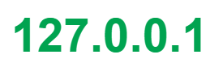

# 9/21

## 🟨 Django 시작하기

### ✅ Framework 이해하기

- 누군가 만들어 놓은 코드를 재사용 하는 것은 이미 익숙한 개발 문화
- 그렇다면 `웹 서비스`도 누군가 개발해 놓은 코드를 재사용하면 된다!
- 전 세계의 수많은 개발자들이 이미 수없이 많이 개발해옴
- 서비스 개발에 필요한 기능들을 미리 구현해서 모아 놓은 것

> Frame(뼈대, 틀) + Work(일하다)

- `소프트웨어 프레임워크`는 복잡한 문제를 
- Framework를 잘 사용하기만 하면 모든 것들을 하나부터 열까지 직접 개발할 필요 없이, 내가 만들고자 하는 본질(로직)에 집중해 개발할 수 있음

 

### ✅ 클라이언트와 서버

- 대부분의 웹 서비스는 클라이언트-서버 구조를 기반으로 동작
- 클라이언트와 서버 역시 하나의 컴퓨터

- 클라이언트
  - 웹 사용자의 인터넷에 연결된 장치 (예를 들어 wi-fi에 연결된 컴퓨터 또는 모바일)
  - Chrome 또는 Firefox와 같은 웹 브라우저
  - 서비스를 요청하는 주체
- 서버
  - 웹 페이지, 사이트 또는 앱을 저장하는 컴퓨터
  - 클라이언트가 웹 페이지에 접근하려고 할 때 서버에서 클라이언트 컴퓨터로 웹 페이지 데이터를 응답해 사용자의 웹 브라우저에 표시됨
  - 요청에 대해 서비스를 응답하는 주체

> 앞으로 우리가 배우는 것도 이 클라이언트-서버 구조를 만드는 방법을 배우는 것이고, 
>
> 이 중에서 Django는 서버를 구현하는 웹 프레임워크!

 

## 🟨 Web brower와 Web page

### ✅ 웹 브라우저란?

- 웹에서 페이지를 찾아서 보여주고, 사용자가 하이퍼링크를 통해 다른 페이지로 이동할 수 있도록 하는 프로그램
- 웹 페이지 파일을 우리가 보는 화면으로 바꿔주는 프로그램 : `렌더링(rendering)`

 

### ✅ 정적 웹 페이지

- Static Web page
- 있는 그대로를 제공하는 것(served as-is)
- HTML 파일의 내용이 변하지 않고 모든 사용자에게 동일한 모습으로 전달되는 것

 

### ✅ 동적 웹 페이지

- Dynamic Web page
- 사용자의 요청에 따라 웹 페이지에 추가적인 수정이 되어 클라이언트에게 전달되는 웹 페이지
- 웹 페이지의 내용을 바꿔주는 주체는 서버!
- 다양한 서버 사이드 프로그래밍 언어(python, java, c++)를 사용 가능
- 파일을 처리하고 DB와의 상호작용이 이루어짐

 

## 🟨 실습

### ✅ Django 개발 환경 설정 가이드 만들기

👉 [바로가기](./setting_guide.md)

 

### ✅ 서버 기초

#### 🧩 IP와 도메인은 무엇일까요?

- 네트워크에 연결돼있는 각각의 장치를 호스트(Host)라고 함
- 데이터를 요청받았을 때 그것에 응답하는 호스트가 `서버`이고, 데이터를 요청하는 호스트가 `클라이언트`

##### ✔️ IP

- 호스트가 다른 호스트와 데이터를 주고 받기 위해, 자신들을 구분하는 특수한 번호가 `IP주소`

> Internet Protocol Address의 약자
>
> 

- IP주소는 위처럼 4개의 숫자와 점으로 이루어짐
- 각각의 숫자는 0 ~ 255 사이의 정수를 가짐 (각 숫자는 8비트로 표현해서 2^8 = 256을 의미)

- 흔히 웹 프로젝트 개발할때 내 컴퓨터를 서버로 설정해서 localhost로 접속하는데

  여기서 로컬 호스트는 `호스트 자기 자신을 가리키는 고유한 별칭`

##### ✔️ 도메인

- 네이버 검색 포털을 이용한다고 했을 때 우리는 `https://www.naver.com`으로 접속함
- 여기서 `naver.com`부분을 도메인(Domain)이라고 함
- 우리가 문자열로 표현된 인터넷 주소로 웹사이트에 접속할 수 있는 것은, 웹 브라우저가 도메인과 연결되어 있는 IP 주소를 찾아서 이동해주기 때문!

> 이것을 도메인 네임 시스템(DNS)라고 하고, 도메인과 IP의 연결 정보가 있는 서버를 네임 서버(Name Server)
>
> 숫자들의 나열인 IP주소 보다는 의미가 있는 문자열을 사용하는 것이 편리하기 때문에 도메인의 개념이 생긴 것!

 

#### 🧩 클라이언트와 서버는 무엇일까요?

- 클라이언트는 서비스를 사용하는 컴퓨터

- 서버는 서비스를 제공하는 컴퓨터

- 서비스의 종류에 따라 파일 서버/ 메일 서버/ 어플리케이션 서브 등으로 나눠지는데

- 서버가 서비스를 제공하기 위해서는 `서버 프로그램`이 있어야하고, 클라이언트가 서비스를 제공받으려면 서버 프로그램과 연결할 수 있는 `클라이언트 프로그램`이 존재해야함

- 연결 방식

  - 서버기반 모델(server-based model) : 전용 서버를 두는 것

  > 안정적인 서비스 제공이 가능
  >
  > 공유 데이터의 관리와 보안이 용이
  >
  > 서버구축비용과 관리비용이 든다는 단점 존재

  - P2P 모델(peer-to-peer model) : 별도의 전용 서버 없이 각 클라이언트가 서버역할을 동시에 수행하는 것

  > 서버 구축 및 운용 비용을 아낄 수 있음
  >
  > 자원의 활용을 극대화
  >
  > 자원 관리가 어려움
  >
  > 보안에 취약

 

#### 🧩 정적 웹 사이트와 동적 웹 사이트의 차이점은 무엇일까요? Django는 무엇을 위한 도구인가요?

- 정적 웹 페이지는 미리 저장된 파일(HTML 파일, 이미지, JS 파일 등)이 그대로 전달되는 웹 페이지
- 동적 웹 페이지는 데이터들을 스크립트에 의해 가공처리한 후 생성되어 전달되는 웹 페이지
- 정적 웹 페이지는 빠르고 비용이 적게 들지만(웹 서버만 구축하면 됨) 서비스가 한정적이고 관리가 어려움
- 동적 웹 페이지는 다양하고 관리가 쉽지만 상대적으로 속도가 느리고 추가적인 비용이 듦(웹 서버외에 추가적으로 처리를 위한 어플리케이션 서버가 필요)
- 요즘 대부분의 웹 사이트는 동적 웹 페이지를 사용하고 동적인 부분이 필요 없는 경우에는 정적으로 구현

> DJango는 이런 동적 웹 페이지의 기능들을 빠르게 개발이 가능함

 

#### 🧩 HTTP는 무엇이고 요청과 응답 메시지 구성은 어떻게 되나요?

- HTTP : HyperText Transfer Protocol
- HTML과 같은 문서를 전송하기 위한 프로토콜(규칙)
- HTTP 메시지에는 요청과 응답 유형이 존재

> <기본 구조>
>
> 1. Start line : 요청이나 응답의 상태를 나타냄, 항상 첫번째 줄에 위치
> 2. HTTP headers : 요청을 지정하거나, 메시지에 포함된 본문을 설명하는 헤더의 집합
> 3. empty line : 헤더와 본문을 구분하는 빈 줄
> 4. body : 요청 / 응답과 관련된 데이터나 문서를 포함
>
> 참고 : https://hanamon.kr/%EB%84%A4%ED%8A%B8%EC%9B%8C%ED%81%AC-http-%EB%A9%94%EC%84%B8%EC%A7%80-message-%EC%9A%94%EC%B2%AD%EA%B3%BC-%EC%9D%91%EB%8B%B5-%EA%B5%AC%EC%A1%B0/

 

#### 🧩 프레임워크는 무엇일까요?

> 특정 프로그램을 개발하기 위한 여러 요소들과 메뉴얼인 룰을 제공하는 프로그램

- 라이브러리는 도구의 모임

> 둘의 결정적인 차이는 `자유도`
>
> 프레임워크를 가지고 만들면 어떤 규약을 꼭 지키면서 만들어야하지만, 라이브러리는 도구이기 때문에 있는 규약을 지키면서 나머지 자유로운 부분은 어떠한 도구를 써도 무방

 

