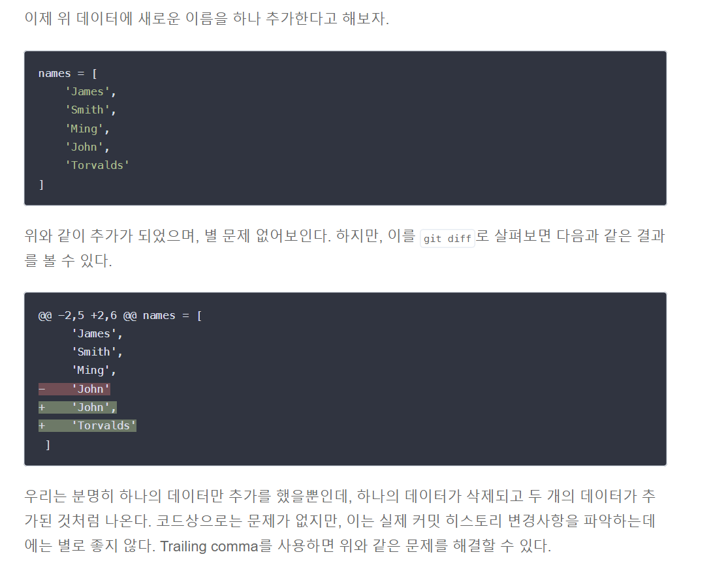

# 9/22

## 🟨 Django Project 구조

### ✅ \_\_init\_\_.py

- Python에게 이 디렉토리를 하나의 Python 패키지로 다루도록 지시
- 별도로 추가 코드를 작성하지 않음

 

### ✅ asgi.py

- Asynchronous Server Gateway Interface
- Django 애플리케이션이 비동기식 웹 서버와 연결 및 소통하는 것을 도움
- 추후 배포 시에 사용하며 지금은 수정하지 않음

 

### ✅ settings.py

- Django 프로젝트 설정을 관리

 

### ✅ urls.py

- 사이트의 url과 적절한 views의 연결을 지정

 

### ✅ wsgi.py

- Web Server Gateway Interface
- Django 애플리케이션이 웹서버와 연결 및 소통하는 것을 도움
- 추후 배포 시에 사용하며 지금은 수정하지 않음

 

### ✅ manage.py

- Django 프로젝트와 다양한 방법으로 상호작용 하는 커맨드라인 유틸리티

 

## 🟨 Django Application 구조

> python manage.py startapp articles
>
> startapp 뒤에 원하는 이름 넣는데 보통은 복수형으로 작성하는 것을 권장

### ✅ admin.py

- 관리자용 페이지를 설정 하는 곳

 

### ✅ apps.py

- 앱의 정보가 작성된 곳
- 별도로 추가 코드를 작성하지 않음

 

### ✅ models.py

- 애플리케이션에서 사용하는 Model을 정의하는 곳
- MTV 패턴의 M에 해당

 

### ✅ tests.py

- 프로젝트의 테스트 코드를 작성하는 곳

 

### ✅ views.py

- view 함수들이 정의 되는 곳
- MTV 패턴의 V에 해당
- 애플리케이션 구조에서 제일 중요!

 

### ✅ 애플리케이션 구조

- `settings.py`에 `INSTALLED_APPS`에 새로 추가한 프로젝트이름(예를 들어 articles)을 추가해야함

> 보통 맨 위에 추가

- 마지막 요소 뒤에도 쉼표 👉 트레일링 컨벤션
  - 실수 방지와 Git 통한 소스코드 관리가 용이하기 때문

 

### ✅ Project & Application

- Project
  - “collection of apps”
  - 프로젝트는 앱의 집합
  - 프로젝트에는 여러 앱이 포함될 수 있음
  - 앱은 여러 프로젝트에 있을 수 있음
- Application
- 앱은 실제 요청을 처리하고 페이지를 보여주는 등의 역할을 담당
- 일반적으로 앱은 하나의 역할 및 기능 단위로 작성하는 것을 권장함

 

## 🟨 요청과 응답

### ✅ 요청 & 응답

- URL 👉 VIEW 👉 TEMPLATE 순의 작성 순서로 코드를 작성해보고 데이터의 흐름을 이해하기
- URL은 `urls.py`, VIEW는 `views.py`, HTML 페이지 구성은 `template.index.html` 이런식으로 구성
- 네이버 주식 시세 페이지를 만든다 이런식으로 생각을 하면서 공부하기

 

#### ✔️ urls.py

> view 메소드(views.py와 연결)를 연결하고 요청 url을 정의하는 파일. 도메인 이하를 `path`라고 하며, 어떤 화면으로 연결할 지 선언하는 것을 `라우팅`이라고 한다.
>
> path 함수의 첫 번째 인자는 클라이언트가 요청할 path를 말한다.
>
> url을 설정하고 views.py에서 정의한 view 메소드와 연결한다.

 

#### ✔️ views.py

> HTTP 요청을 수신하고 HTTP 응답을 반환하는 함수 작성
>
> Template에게 HTTP 응답 서식을 맡김
>
> 데이터를 처리하는 로직인 view 메소드를 정의하는 파일

 

### ✅ render()

- 주어진 템플릿을 주어진 context 데이터와 결합하고 렌더링된 텍스트와 함께 HttpResponse(응답) 객체를 반환하는 함수

> render(request, template_name, context)
>
> request : 응답 생성하는데 사용되는 요청 객체
>
> template_name : 템플릿의 전체 이름 또는 템플릿 이름의 경로
>
> context : 템플릿에서 사용할 데이터 (딕셔너리 타입) 

 

### ✅ Templates

- 실제 내용을 보여주는데 사용되는 HTML 파일
- 파일 구조나 레이아웃을 정의
- 기본 경로는 app 폴더 안의 templates 폴더 (만든 app 폴더 안에 templates 폴더를 만들고 거기에 넣어야함)

> training이라는 app 안에 templates 폴더를 만든 후 index.html 과 template.html 파일이 존재하는 모습

 

### ✅ 코드 작성 순서

- URL 👉 View 👉 Template

> URL 경로를 먼저 설정한 후, 그 URL에서 실행시킬 함수를 정의, 마지막으로 보여지는 페이지를 작성

 

## ⚙️실습

### ✅ 초기 설정 관련

#### ✔️ 왜 pip list로 보면 다를까?

> 가상환경을 안 돌리고 pip list를 해서 나오는 목록들은 global 영역에 깔려있는 목록을 보여주는 것이고
>
> 가상환경을 돌리고 pip list를 보면 가상환경 내에 깔려져있는 목록들을 보여줌(나는 가상환경 내에서 장고를 설치했기 때문에 글로벌 영역에서는 장고가 안보이는것)

 

> articles를 import하고 urls.py를 수정

- 서버 돌린 후 localhost:80000 들어가보면 에러

> 주문서로 정의한 index 경로를 추가하면 잘 나옴

img 추가로 넣어보면?

> data를 가져올 수 있음

> welcome/ 뒤에 입력한 그대로 출력이 됨!

 

### ✅ 실습 - 1 : 오늘의 저녁

- 랜덤으로 메뉴와 메뉴 이미지를 추천해주는 화면을 응답하는 프로그램을 개발

 

### ✅ 실습 - 2 : 로또 번호 추첨

- lotto 주소를 요청하면 랜덤으로 로또 다섯 줄을 뽑아주는 화면을 응답하는 프로그램을 개발
- 1등 당첨 번호가 3 11 15 29 35 44 이고 보너스 번호가 10일 때, 각 줄의 번호가 몇 등 인지도 출력

#### 👉 [실습 1, 2 바로가기]() 

 

