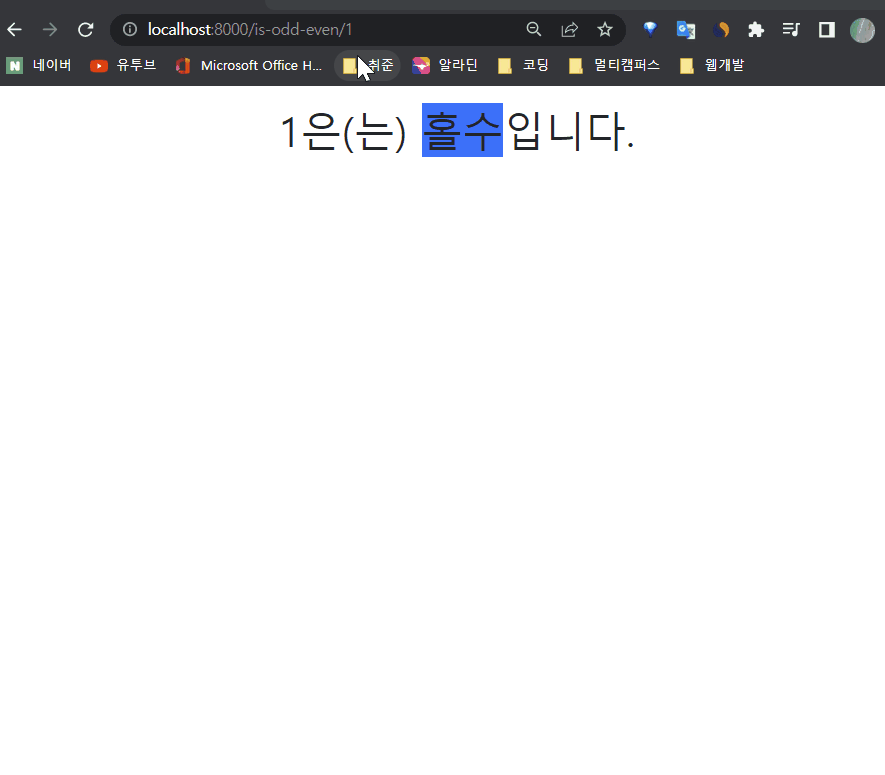
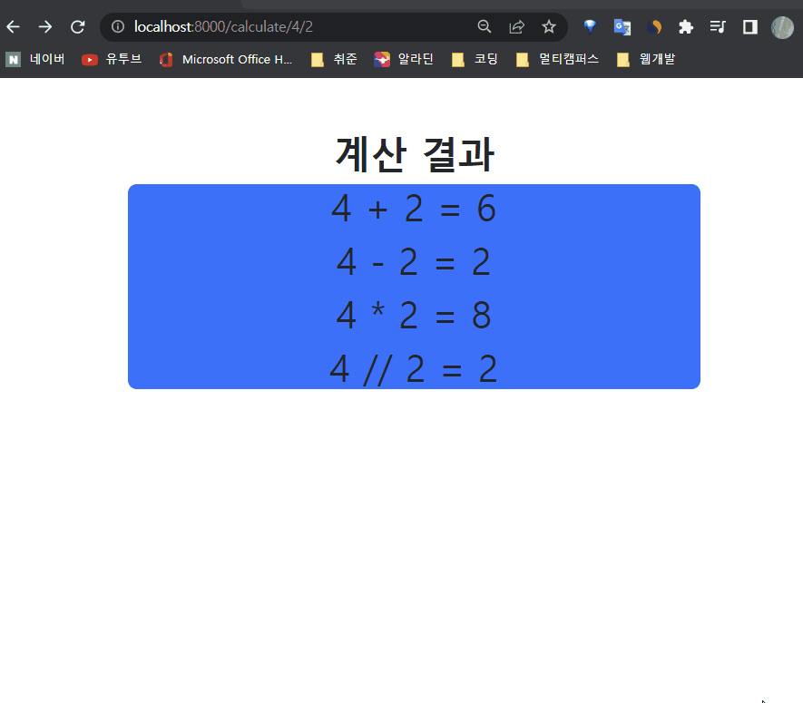
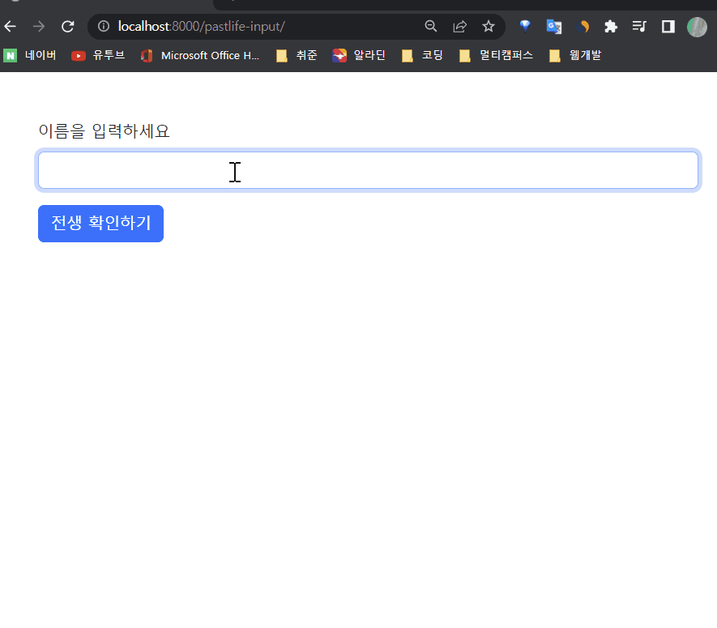
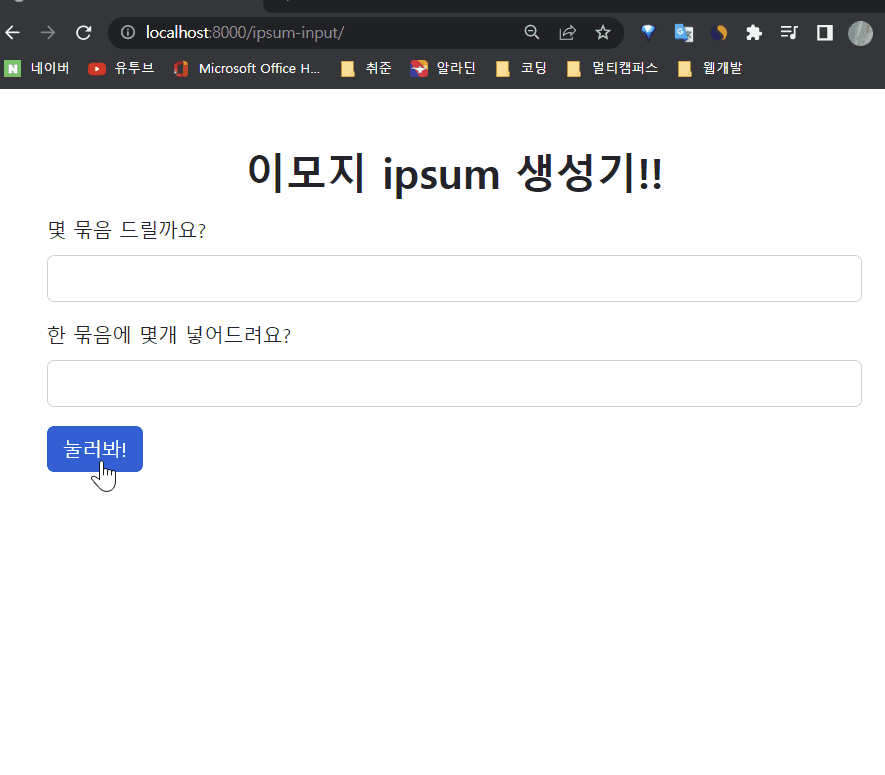

# 9/22

## 🟨 Variable routing

### 🧩 Variable routing 이란

> 템플릿의 많은 부분이 중복되고, 일부분만 변경되는 상황에서 비슷한 URL과 템플릿을 계속해서 만들어야 할까?

URL 주소를 변수로 사용하는 것을 의미

URL의 일부를 변수로 지정하여 view 함수의 인자로 넘길 수 있음

즉, 변수 값에 따라 하나의 path()에 여러 페이지를 연결 시킬 수 있음

<br>

### 🧩 Variable routing 작성법

변수는 “<>”에 정의하며 view 함수의 인자로 할당됨

기본 타입은 string이며 5가지 타입으로 명시할 수 있음

1. str
   - `/`를 제외하고 비어 있지 않은 모든 문자열
   - 작성하지 않을 경우 기본값
2. int
   - 0 또는 양의 정수와 매치

```django
# urls.py
urlpatterns = [
	...,
	# path('hello/<str:name>/', views.hello),
	path('hello/<name>/', views.hello),
]
```

<br>

## 🟨 Django Template

### 🧩 Django Template

데이터 표현을 제어하는 도구이자 표현에 관련된 로직

Django Template을 이용한 HTML 정적 부분과 동적 컨텐츠 삽입

Template System의 기본 목표를 숙지

<br>

### 🧩 Django Template Language (DTL)

Django template에서 사용하는 built-in template system

조건, 반복, 변수 치환, 필터 등의 기능을 제공

Python처럼 일부 프로그래밍 구조(if, for 등)를 사용할 수 있지만 `이것은 Python 코드로 실행되는 것이 아님

Django 템플릿 시스템은 단순히 Python이 HTML에 포함 된 것이 아니니 주의

프로그래밍적 로직이 아니라 `프레젠테이션을 표현하기 위한 것임을 명심할 것`

<br>

#### ✔️ Variable

`{{ variable }}`

영어, 숫자와 밑줄의 조합으로 구성 가능한데, 밑줄로는 시작 불가능

dot(.)을 사용해서 변수 속성에 접근할 수 있음

render()의 세번째 인자로 {'key': value} 와 같이 `딕셔너리 형태`로 넘겨주며, 여기서 정의한 `key`에 해당하는 문자열이 template에서 사용 가능한 변수명이 됨

<br>

#### ✔️ Filters

`{{ variable|filter }}`

표시할 변수를 수정할 때 사용

예를 들어 `{{ name|lower }}` 라고 쓰면 name 변수를 모두 소문자로 출력하는 것!

chained가 가능하고 일부 필터는 인자를 받기도 함

<br>

#### ✔️ Tags

``

출력 텍스트를 만들거나, 반복 또는 논리를 수행하여 제어 흐름을 만드는 등 변수보다 복잡한 일들을 수행

일부 태그는 시작과 종료 태그가 필요 👉 ``

<br>

#### ✔️ Comments

`{# #}`

주석 표현, 한 줄에만 가능

여러 줄 쓰려먼 `` 사이에 입력

<br>

## 🟨 Template inheritance

### 🧩 템플릿 상속

템플릿 상속은 기본적으로 코드의 재사용성에 초점을 맞춤

템플릿 상속을 사용하면 사이트의 모든 공통 요소를 포함하고, 하위 템플릿이 재정의(override) 할 수 있는 블록을 정의하는 기본 ‘skeleton’ 템플릿을 만들 수 있음

만약 모든 템플릿에 부트스트랩을 적용하려면 어떻게 해야 할까?

👉 기본 CSS 스타일을 정의한 skeleton 템플릿을 모든 템플릿에 상속을 시키자!

<br>

### 🧩 템플릿 상속 관련 태그

``

자식 템플릿이 부모 템프릿을 확장한다는 의미

반드시 템플릿 최상단에 작성돼야 함

<br>

``

하위 템플릿에서 재지정할 수 있는 블록을 정의

즉, 하위 템플릿이 채울 수 있는 공간

<br>

## 🟨 Sending form data(Client)

### 🧩 HTML \<form> element

데이터가 전송되는 방법을 정의

웹에서 사용자 정보를 입력하는 여러 방식(text, button, submit 등)을 제공하고,

사용자로부터 할당된 데이터를 서버로 전송하는 역할을 담당

데이터를 `어디(action)`로 `어떤 방식(method)`으로 보낼지가 중요!!

#### ✔️ 1. action

입력 데이터가 전송될 URL을 지정

데이터를 어디로 보낼 것인지 지정하는 것이며 이 값은 반드시 유효한 URL이어야 함

만약 이 속성을 지정하지 않으면 데이터는 현재 form이 있는 페이지의 URL로 보내짐

<br>

#### ✔️ 2. method

데이터를 어떻게 보낼 것인지 정의

입력 데이터의 HTTP request methods를 지정

HTML form 데이터는 오직 2가지 방법으로만 전송 할 수 있는데 👉 바로 GET 방식과 POST 방식

<br>

### 🧩 HTML \<input> element

사용자로부터 데이터를 입력 받기 위해 사용

“type” 속성에 따라 동작 방식이 달라진다.

input 요소의 동작 방식은 type 특성에 따라 현격히 달라지므로 각각의 type은 별도로 MDN 문서에서 참고하여 사용하도록 함

type을 지정하지 않은 경우, 기본값은 ”text”

핵심 속성은 `name`

<br>

#### ✔️ name

`?key=value&key=value/`

form을 통해 데이터를 제출(submit)했을 때 name 속성에 설정된 값을 서버로 전송하고, 서버는 name 속성에 설정된 값을 통해 사용자가 입력한 데이터 값에 접근할 수 있음

주요 용도는 GET/POST 방식으로 서버에 전달하는 파라미터(name은 key, value는 value)로 매핑하는 것

GET 방식에서는 URL형식으로 데이터를 전달

## ⚙️실습

👉 [링크](./Practice/220926/prac0926/)

### ✏️ 입력한 숫자가 홀수인지 짝수인지 확인하기

숫자를 입력하면 숫자가 홀수인지 짝수인지 0인지 판단하고 화면에 표시하는 프로그램을 개발하세요.

해당 프로그램은 Path parameter를 활용해야 합니다.

주소창에 직접 값을 넣는 형태로 실습을 진행합니다.(form 사용 x)

- EX) is-odd-even/1 , is-odd-even/2 , is-odd-even/0



<br>

### ✏️ 사칙연산 수행하기

숫자 2개를 입력하면 사칙연산 수행 결과를 화면에 표시하는 프로그램을 개발하세요.

해당 프로그램은 `Path parameter`를 활용해야 합니다.

- 주소창에 직접 값을 넣는 형태로 실습을 진행합니다.(form 사용 x)
- 사칙연산은 view에서 수행합니다. view에서 연산한 결과를 템플릿에 출력합니다.



<br>

### ✏️ 랜덤 전생

이름을 입력하면 랜덤으로 대상의 전생을 화면에 표시하는 프로그램을 개발하세요.

해당 프로그램은 form 태그를 활용하여 사용자에게 텍스트 1개를 입력 받아야 합니다.



<br>

### ✏️ Lorem ipsum 한글 버전

해당 프로그램은 form 태그를 활용하여 사용자에게 숫자 2개를 입력 받아야 합니다.

- 문단의 수
- 문단 별 단어의 수
  - 사용할 단어 꾸러미는 자유롭게 만들어주세요.



<br>
