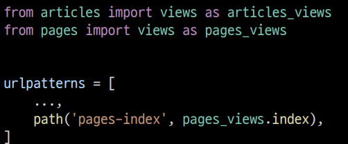
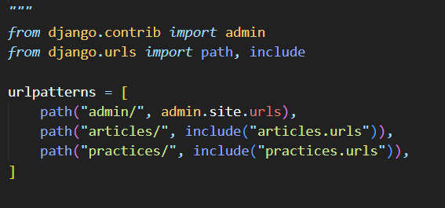
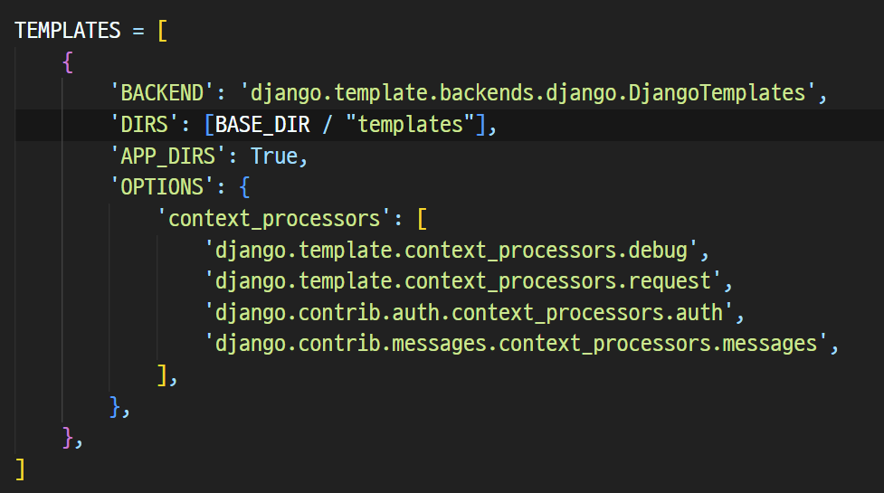
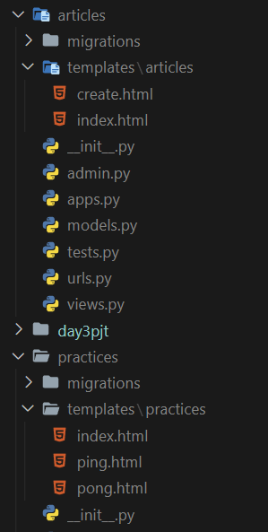
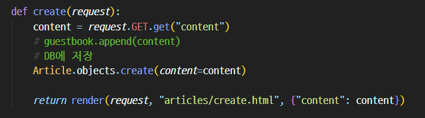
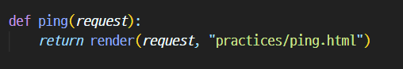

# 9/27

## 🟨 App URL mapping

### 🧩 URL mapping 이란

- 목표

앱이 많아졌을 때 urls.py를 각 app에 매핑하는 방법을 이해하기

두번째 app인 pages를 생성 및 등록 하고 진행

app의 view 함수가 많아지면서 사용하는 path() 또한 많아지고, app 또한 더 많이 작성되기 때문에 프로젝트의 urls.py에서 모두 관리하는 것은 프로젝트 유지보수에 좋지 않음! 👉 나눠서 관리하자

 

위의 경우는 app이 articles와 pages 2개가 있는 경우(project의 urls.py)

각 app에 views가 있기 때문에 그냥 views를 import하면 이름이 섞여서 의도대로 url이 연결되지 않을 수 있기 때문에 as를 써서 각각 따로 import를 함

위 방식도 가능하지만 좀 더 좋은 방법은?

 

하나의 프로젝트의 여러 앱이 존재한다면, 각각의 앱 안에 urls.py을 만들고 프로젝트 urls.py에서 각 앱의 urls.py 파일로 URL 매핑을 위탁할 수 있음

각각의 app 폴더 안에 urls.py를 작성하고 다음과 같이 수정 진행

import에 include를 추가하고, 각 app의 이름을 경로로 설정

그리고 include를 각 app의 urls.py를 포함시킴

 

### 🧩 include()

다른 URLconf(app1/urls.py)들을 참조할 수 있도록 돕는 함수

함수 include()를 만나게 되면 URL의 그 시점까지 일치하는 부분을 잘라내고, 남은 문자열 부분을 후속 처리를 위해 include된 URLconf로 전달

👉 app의 URL을 project의 urls.py에서 관리하던걸 각각의 app에서 관리할 수 있게 바꿔주는것!

 

## 🟨 Template namespace

### 🧩 개요

Django는 기본적으로 app_name/templates/ 경로에 있는 templates 파일들만 찾을 수 있으며, settings.py의 INSTALLED_APPS에 작성한 app 순서로 template을 검색 후 렌더링 함

바로 이 속성 값이 해당 경로를 활성화하고 있음

 

### 🧩 디렉토리 생성을 통해 물리적인 이름공간 구분

Django templates의 기본 경로에 app과 같은 이름의 폴더를 생성해 폴더 구조를 app_name/templates/app_name/ 형태로 변경

Django templates의 기본 경로 자체를 변경할 수는 없기 때문에 물리적으로 이름 공간을 만드는 것!

각 app에 있는 templates 폴더 안에 각 app 이름으로 된 폴더를 다시 만들고 그 안에 html 파일들을 넣는다

이런식으로 이름 공간을 만드는 것

 

폴더 구조 변경했으면, 변경된 경로로 해당하는 모든 부분을 수정하기 (views.py)

 

## ⚙️실습

### ✏️ Django QuerySet 실습

shell_plus를 활용

> QuerySet API를 사용해 복잡한 로직을 구현할 때 views.py에서 테스트 하는 것에 한계가 있기 때문에 shell에서 활용하는 방법을 배워야 함.

shell_plus 진입은

> python manage.py shell_plus

[실습 파일](./Practice/220927/todo/%EC%8B%A4%EC%8A%B5.md)
