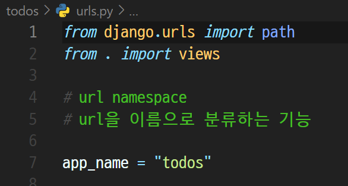
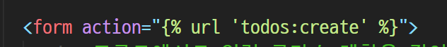
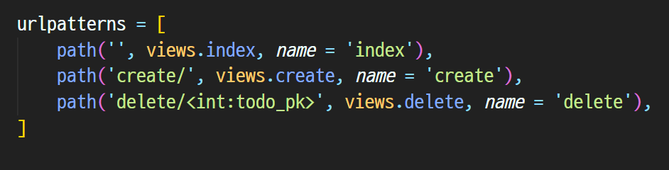
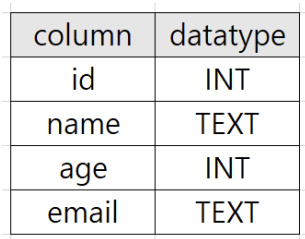
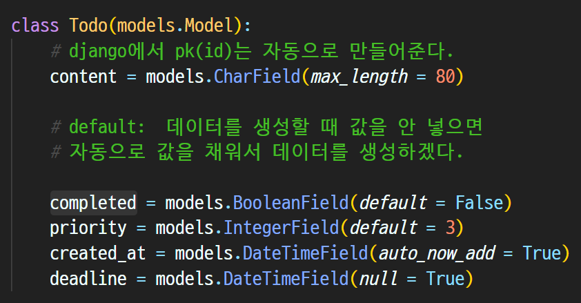

# 9/28

## 🟨 URL namespace

### 🧩 URL namesplace

서로 다른 앱에서 동일한 URL 이름을 사용하는 경우에도 이름이 지정된 URL을 고유하게 사용 할 수 있음

`app_name attribute`를 작성해 URL namespace를 설정



> todos app 안의 urls.py 에서 app_name을 todos라고 지정해두는 것



> 이전에는  라고 썼지만 todos:create 라고 더 정확하게 명시해줘야함
>
> app_name을 지정한 이후에는 url 태그에서 반드시 `url 'app_name:url_name'`의 형태로 작성해야 함!
>
> 예를 들어, app_name이 articles이고 URL name이 index인 주소 참조는 articles:index가 됨

<br>

## 🟨 Naming URL patterns

### 🧩 Naming URL patterns 필요성

이제는 링크에 URL을 직접 작성하는 것이 아니라 `path() 함수`의 `name 인자`를 정의해서 사용

DTL의 Tag 중 하나인 URL 태그를 사용해서 “path()” 함수에 작성한 name을 사용할 수 있음

이를 통해 URL 설정에 정의된 특정한 경로들의 의존성을 제거할 수 있음

Django는 URL에 이름을 지정하는 방법을 제공함으로써 view 함수와 템플릿에서 특정 주소를 쉽게 참조할 수 있도록 도움



> 위와 같이 name을 정의해서 URL 패턴 이름 및 선택적 매개 변수와 일치하는 절대 경로 주소를 반환함

<br>

### 🧩 참고: DRY 원칙

Don’t Repeat Yourself의 약어

더 품질 좋은 코드를 작성하기 위해서 알고, 따르면 좋은 소프트웨어 원칙들 중 하나로 “소스 코드에서 동일한 코드를 반복하지 말자” 라는 의미

동일한 코드가 반복된다는 것은 잠재적인 버그의 위협을 증가 시키고 반복되는 코드를 변경해야 하는 경우, 반복되는 모든 코드를 찾아서 수정해야 함

이는 프로젝트 규모가 커질수록 애플리케이션의 유지 보수 비용이 커짐

<br>

### 🧩 Django의 설계 철학 (Templates System)

1. 표현과 로직(view)을 분리

템플릿 시스템은 표현을 제어하는 도구이자 표현에 관련된 로직일 뿐

2. 중복을 배제

대다수의 동적 웹사이트는 공통 header, footer, navbar 같은 사이트 공통 디자인을 갖음

Django 템플릿 시스템은 이러한 요소를 한 곳에 저장하기 쉽게 하여 중복 코드를 없애야 함

템플릿 상속의 기초가 되는 철학

<br>

### 🧩 Framework의 성격

#### ✔️ 독선적

어떤 특정 작업을 다루는 '올바른 방법'에 대한 분명하나 의견(규약)을 가지고 있음

대체로 특정 문제내에서 빠른 개발 방법을 제시

어떤 작업에 대한 올바른 방법이란 보통 잘 알려져 있고 문서화가 잘 돼있기 때문

하지만 주요 상황을 벗어난 문제에 대해서는 그리 유연하지 못한 해결책을 제시할 수 있음

<br>

#### ✔️ 관용적

관용적(Unopinionated)

관용적인 프레임워크들은 구성요소를 한데 붙여서 해결해야 한다거나 심지어 어떤 도구를 써야 한다는 '올바른 방법'에 대한 제약이 거의 없음

이는 개발자들이 특정 작업을 완수하는데 가장 적절한 도구들을 이용할 수 있는 자유도가 높음

하지만 개발자 스스로가 그 도구들을 찾아야 한다는 수고가 필요

> Django는 `다소 독선적`

<br>

## 🟨 Django 구조 이해하기

### 🧩 MVC - 기존 소프트웨어 디자인 패턴

**Model - View - Controller의 준말**

하나의 큰 프로그램을 세가지 역할로 구분한 개발 방법론

Model : 데이터와 관련된 로직을 처리

View : 레이아웃과 화면을 처리

Controller : 명령을 model과 view 부분으로 연결

> 관심사 분리
>
> 더 나은 업무의 분리와 향상된 관리를 제공
>
> 각 부분을 독립적으로 개발할 수 있어, 하나를 수정하고 싶을 때 모두 건들지 않아도 됨
>
> 👉 개발 효율성 및 유지보수가 쉬워지고, 다수의 멤버로 개발하기 용이함

<br>

### 🧩 MTV - Django의 디자인 패턴

> Model - Template - View의 준말

#### ✔️ Model

- MVC 패턴에서 Model에 해당
- 데이터와 관련된 로직을 관리
- 응용프로그램의 데이터 구조를 정의하고 데이터베이스의 기록을 관리

#### ✔️ Template

- 레이아웃과 화면을 처리
- 화면상의 사용자 인터페이스 구조와 레이아웃을 정의
- MVC 패턴에서 View의 역할에 해당

#### ✔️ View

- Model & Template과 관련한 로직을 처리해서 응답을 반환

- 클라이언트의 요청에 대해 처리를 분기하는 역할

- 동작 예시
  - 데이터가 필요하다면 model에 접근해서 데이터를 가져오고 가져온 데이터를 template로 보내 화면을 구성하고 구성된 화면을 응답으로 만들어 클라이언트에게 반환
- MVC 패턴에서 Controller의 역할에 해당


> HTTP 요청이 들어오면 urls.py(문지기)를 통해 어떤 app의 어떤 주소로 가야하는지 판단
>
> 그에 맞는 views.py의 함수가 실행이 되고, 이 함수들을 실행할때 template의 html 파일로부터 데이터를 가져옴.
>
> 또 models.py를 통해 데이터들이 어떤 형태로 있는지 파악을 한 다음에 최종적으로 함수를 실행(CRUD)
>
> 이후 사용자에게 변경사항을 보여줄 수 있게 수정사항을 저장하고 HTTP 응답을 내보낸다

<br>

## 🟨 Django Model

### 🧩 Database

체계화된 데이터의 모임

검색 및 구조화 같은 작업을 보다 쉽게 하기 위해서 조직화된 데이터를 수집하는 저장 시스템

#### ✔️ 1. 스키마(Schema)

**뼈대(Structure)에 해당**

DB에서 자료의 구조, 표현 방법, 관계 등을 정의한 구조



id는 int형으로, name은 텍스트로... 정의를 해놓음

<br>

#### ✔️ 2. 테이블(Table)

필드와 레코드를 사용해 조직된 데이터 요소들의 집합

필드는 column, 레코드는 row

<br>

#### ✔️ 3. PK(Primary Key)

기본 키

각 레코드의 고유한 값 (식별자로 사용)

기술적으로 다른 항목과 `절대로 중복될 수 없는 단일 값`

데이터베이스 관리 및 테이블 간 관계 설정 시 주요하게 활용 됨

<br>

#### ✔️ 4. 쿼리(Query)

데이터를 조회하기 위한 명령어

조건에 맞는 데이터를 추출하거나 조작하는 명령어 (주로 테이블형 자료구조에서)

"Query를 날린다." 👉 “데이터베이스를 조작한다.”

<br>

### 🧩 Model

Django는 Model을 통해 데이터에 접근하고 조작

사용하는 데이터들의 필수적인 필드들과 동작들을 포함

저장된 데이터베이스의 구조 (layout)

**일반적으로 각각의 모델은 하나의 데이터베이스 테이블에 매핑(mapping)**

Django에서는 models.py 에서 관리

<br>

#### ✔️ Model 작성하기



**클래스를 작성하는 것은 DB 테이블의 스키마를 정의하는 것**

**각 모델은 django.models.Model 클래스의 서브 클래스**

Django 프레임워크 자체가 클래스 상속 기반으로 만들어졌기 때문에 우리는 잘 만들어진 도구를 잘 쓰면 됨

데이터 유형에 따라서 다양한 모델 field가 존재

#### ✔️ Model Field 종류

##### IntegerField

기본 데이터베이스가 지원하는 값을 기반으로 입력의 유효성을 검사

- 접두사 Positive가 붙으면 음수 값은 Value Error가 나고, 무조건 0부터 시작한다.

##### charField

- 길이의 제한이 있는 문자열을 넣을 때 사용
- max_length
  - 필드의 최대 길이(문자)
  - CharField의 필수 인자
  - 데이터베이스와 Django의 유효성 검사(값을 검증하는 것)에서 활용됨

##### BooleanField

- true / false를 저장하는 필드

- default값을 지정하지 않고, 옵션 값을 아무것도 넣지 않으면 None값이 default

  👉 default 설정하는 것이 데이터의 정확성을 올려줌

##### TextField

- 글자 수가 많을 때 사용
- max_length 옵션 작성 시 사용자 입력 단계에서는 반영 되지만, 모델과 데이터베이스 단계에는 적용되지 않음 (CharField를 사용해야 함)
- 실제로 저장될 때 길이에 대한 유효성을 검증하지 않음

##### DateField

- Python by a datetime.date 인스턴스(object)기반으로 만들어지는 date관련 필드
- DateField.auto_now
  - auto_now를 True로 주면 save될 때 마다 자동으로 업데이트 된다.
  - 하지만 QuerySet으로 접근해 object를 직접적으로 update하는 경우에는 업데이트 되지 않는다. **django에서 보통 update할때 save를 사용**하며 그에따라 update_at 처럼 마지막 수정날짜를 보관하는데에 좋다.
- DateField.auto_now_add
  - auto_now_add를 True로 주면 처음 created될 때 날짜를 저장한다. 그래서 DB row 생성일, 특히 데이터 created_at에 많이 활용이 된다. **DateField와 DateTimeField의 default 설정 기본값이 상이하니 꼭 체크하고 사용**해야 한다.
  - DateField: default=date.today - from datetime.date.today()
  - DateTimeField: default=timezone.now - from django.utils.timezone.now()

##### DateTimeField

- 기본 설정은 DateField와 똑같은데 datetime.datetime 인스턴스(object)기반으로 만들어지는 것에 차이점이 있다. 👉 시간 까지 저장된다

[참고자료](https://developer.mozilla.org/ko/docs/Learn/Server-side/Django/Models)

<br>

## 🟨 Migrations

> Model Field를 이용해서 기본적인 틀인 DB 스키마를 정의한 다음에는
>
> 모델의 변경 사항들을 실제 DB에 반영하기 위한 과정이 필요한데 바로 `migrations`

### 🧩 주요 명령어

#### ✔️ 1. makemigrations

모델이 변경될 때 마다 항상 새로운 migration을 만들어야 함

**즉, 변경사항이 저장된 설계도**

`python manage.py makemigrations`

#### ✔️ 2. migrate

makemigrations로 만든 설계도를 실제 DB에 반영하려면(sqlite3 파일) 모델의 변경 사항과 데이터베이스를 동기화해야함

`python manage.py migrate`

<br>

## 🟨 ORM

### 🧩 개요

> Object-Relational-Mapping

객체 지향 프로그래밍 언어를 사용하여 호환되지 않는 유형의 시스템 간에 (Django <-> DB)데이터를 변환하는 프로그래밍 기술

객체 지향 프로그래밍에서 데이터베이스을 연동할 때, 데이터베이스와 객체 지향 프로그래밍 언어 간의 호환되지 않는 데이터를 변환하는 프로그래밍 기법

Django는 내장 Django ORM을 사용

> SQL을 사용하지 않고 데이터베이스를 조작할 수 있게 만들어주는 매개체

<br>

## 🟨 QuerySet API

query가 데이터베이스에 특정 데이터를 보여 달라는 요청인데

파이썬으로 작성한 코드가 SQL로 mapping 되어 항상 `쿼리셋(QuerySet)`이라는 자료의 형태로 넘어오는데 이를 활용하기 위한 명령어들

<br>

#### ✔️ CREATE

데이터 객체를 만드는 3가지 방법

1. 인스턴스 생성👉 값 할당 👉 save

```shel
article = Article()
article.title = 'first'
article.content = 'django'
article.save()
```

2. 인스턴스 생성 시 초기 값을 함께 작성하여 생성

```shell
article = Article(title='second', content='django')
article.save()
```

3. QuerySet API 중에서 create() 활용

```shell
Article.objects.create(title='third', content='django')
```

<br>

#### ✔️ READ

크게 2가지가 존재; querysets을 반환하는 경우와 안 하는 경우

1. all()
   - 전체 데이터 조회
2. get()
   - 단일 데이터 조회
   - 객체를 찾을 수 없으면 DoesNotExist 예외를 발생시키고, 둘 이상의 객체를 찾으면 MultipleObjectsReturned 예외를 발생시킴
   - 이때문에 primary key와 같이 고유성을 보장하는 조회에서 사용해야함
3. filter()
   - 지정된 매개 변수와 일치하는 객체를 포함하는 새 QuerySet을 반환
   - 조회된 객체가 없거나 1개여도 QuerySet으로 반환 ( 없다면 <QuerySet []> 이렇게 반환됨)

<br>

#### ✔️ UPDATE

수정하고자 하는 article 인스턴스 객체를 조회 후 반환 값을 저장

article 인스턴스 객체의 인스턴스 변수 값을 새로운 값으로 할당

save() 인스턴스 메서드 호출

```shell
article = Article.objects.get(pk=1)
article.title = 'byebye'
article.save()
```

<br>

#### ✔️ DELETE

마찬가지로 객체 조회해서 반환 값 저장 후 delete() 메서드 활용

```shell
article = Article.objects.get(pk=1)
article.delete()
```

> 이제 이 CRUD를 views.py에서 실제로 활용해보자

<br>

## ⚙️ 실습

### ✏️ CRUD 기능이 있는 todo 리스트 게시판 만들기

[README로 이동하기](./Practice/220928/prac0928/README.md)

