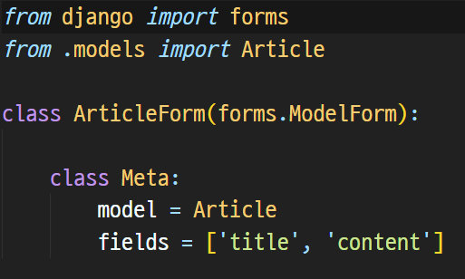
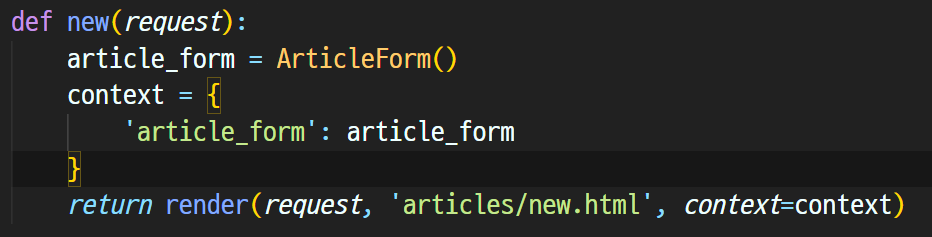
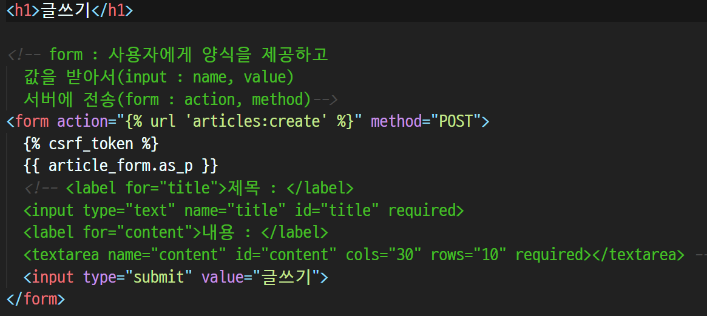

# 10/4

## 🟨 Django ModelForm

### 🧩 ModelForm Class

DB 기반의 어플리케이션을 개발하다보면, `HTML Form(UI)`은 `Django의 모델(DB)`과 매우 밀접한 관계를 가지게 됨

👉 **사용자로부터 값을 받아서 DB에 저장하기 때문**

이 때, 사용자가 입력한 값이 DB의 데이터 형식과 일치하는지를 확인하는 유효성 검증이 반드시 필요하며 이는 서버 사이드에서 처리해야 함.

`ModelForm Class`란 Model을 통해 Form Class를 만들 수 있는 helper class이고, form과 똑같은 방식으로 view 함수에서 사용함

 

### 🧩 ModelForm 선언

forms 라이브러리의 ModelForm 클래스를 상속받음

정의한 ModelForm 클래스 안에 `Meta` 클래스를 선언하고 **어떤 모델을 기반으로 form을 작성할 것인지에 대한 정보를 Meta 클래스에 지정함**

fields 속성에 `__all__`를 사용해서 모델의 모든 필드를 포함할 수도 있고, 위처럼 지정할 수도 있음

 

### 🧩 ModelForm 활용

1. **ModelForm 객체를 context로 전달**

2. **Input Field 활용**

> as_p() : 각 필드가 p 태그로 감싸져서 렌더링
>
> as_ul() : 각 필드가 li 태그로 감싸져서 렌더링, ul 태그는 직접 작성해야 함
>
> as_table() : 각 필드가 tr 태그로 감싸져서 렌더링

 

## 🟨 ModelForm with view functions

### 🧩 ModelForm 활용 로직

브라우저에서 page와 함께 form을 요청하는데 데이터가 유효하다면 요청된 동작을 수행(위에서는 redirect)하고 그렇지 않을 경우에는 유저가 입력한 값과 에러 메시지를 출력함

위의 로직을 참고해서 로그인 동작 로직의 순서를 살펴보면

> 1. Django는 login url을 urls.py에 따라 views.py의 login 함수를 호출
> 2. login 함수는 forms.py의 ArticleForm 인스턴스를 생성
> 3. 유효하면 DB에 save를 하고 상세 페이지로 redirect를 해주고, 유효하지 않다면 작성 페이지로 다시 redirect!

 

### 🧩 save() method

form 인스턴스에 바인딩 된 데이터를 통해 **데이터베이스 객체를 만들고 저장**

ModelForm의 하위 클래스는 **키워드 인자 instance 여부를 통해 생성할 지, 수정할 지를 결정함**

- **제공되지 않은 경우** save()는 **지정된 모델의 새 인스턴스를 만듦(CREATE)**

- **제공되면** save()는 **해당 인스턴스를 수정(UPDATE)**

 

## ⚙️ 실습

### ✏️ CRUD 복습 및 흐름 정리

[README로 이동하기](./Practice/221004/README.md)
