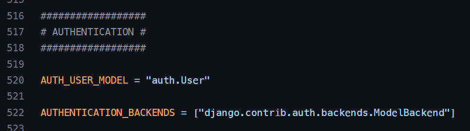
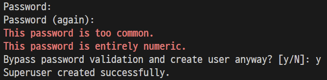
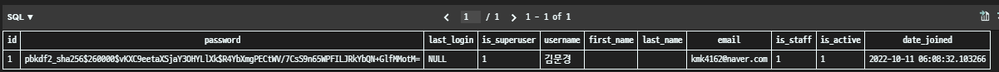
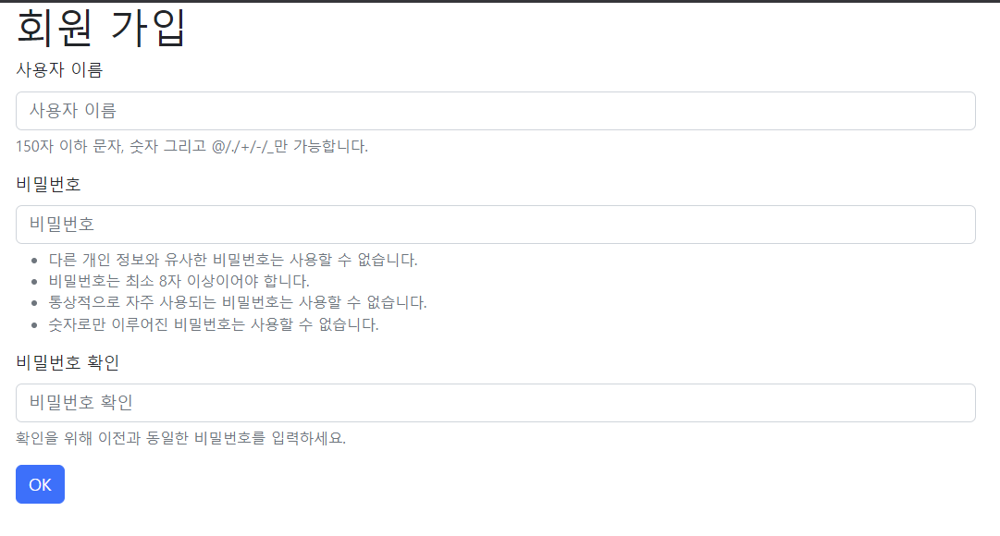
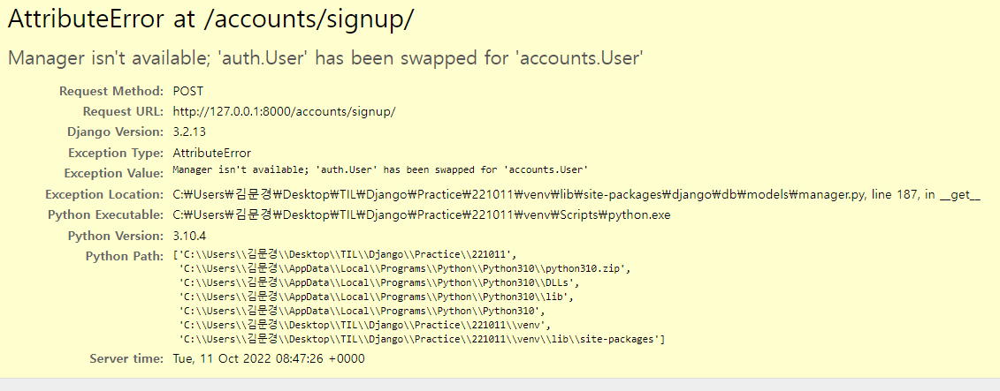
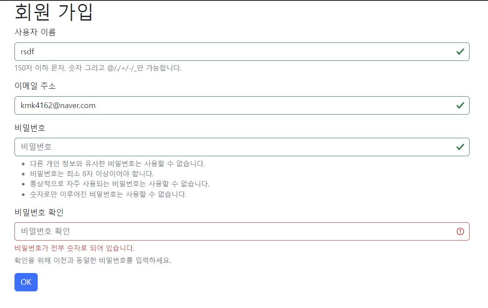
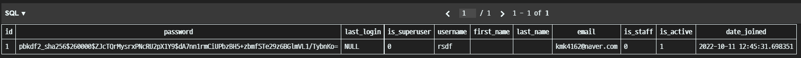

# 10/11

## 🟨 Django Auth

### 🧩 Django Auth 개요

Django authentications system(인증 시스템)은 인증과 권한 부여를 함께 제공함 👉 내장돼있음!

**Authentication(인증)**

- 신원 확인
- 사용자가 자신이 누구인지 확인하는 것

**Authorization(권한, 허가)**

- 권한 부여
- 인증된 사용자가 수행할 수 있는 작업을 결정

<br>

## 🟨 User model 활용하기

### 🧩 Django User Model

> Custom User Model로 대체하기

Django는 기본적인 인증 시스템과 여러 가지 필드가 포함된 User Model을 제공

👉 대부분의 개발 환경에서 기본 User Model을 **Custom User Model로 대체함**

새 프로젝트를 시작하는 경우 비록 기본 User 모델이 충분 하더라도 **커스텀 User 모델을 설정하는 것을 강력하게 권장(highly recommended)**

👉 커스텀 User 모델은 기본 User 모델과 동일하게 작동 하면서도 필요한 경우 나중에 맞춤 설정할 수 있기 때문

<br>

### 🧩 AUTH_USER_MODEL

개발자들이 작성하는 일부 프로젝트에서는 django에서 제공하는 **built-in User model**의 기본 인증 요구사항이 적절하지 않을 수 있음

예를 들어, 내 서비스에서 회원가입 시 username 대신 email을 식별 값으로 사용하는 것이 더 적합한 사이트인 경우, Django의 User Model은 기본적으로 username를 식별 값으로 사용하기 때문에 적합하지 않음

> 그렇기 때문에 Django는 현재 프로젝트에서 사용할 User Model을 결정하는 AUTH_USER_MODEL 설정 값으로 Default User Model을 재정의(override)할 수 있도록 해둠!

#### ✔️ AUTH_USER_MODEL 이란?

**프로젝트에서 User를 나타낼 때 사용하는 모델**

**프로젝트가 진행되는 동안 (모델을 만들고 마이그레이션 한 후) 변경할 수 없음**

프로젝트 시작 시 설정하기 위한 것이며, 참조하는 모델은 첫 번째 마이그레이션에서 사용할 수 있어야 함 

- **즉, 첫번째 마이그레이션 전에 확정 지어야 하는 값**

다음과 같은 기본 값을 가지고 있음

```python
# settings.py

AUTH_USER_MODEL = 'auth.User'
```

> 얘는 기본 모델이므로 우리는 이제 'auth.User' 를 바꿔야함

❗근데 settings.py에서 AUTH_USER_MODEL은 어디에 있는걸까?

> 우리가 작성하는 settings.py는 사실 global_settings.py를 상속받아 재정의하는 파일임
>
> https://github.com/django/django/blob/main/django/conf/global_settings.py
>
> 

<br>

### 🧩 Model 대체하기

1. **먼저 auth.User를 accounts.User로 바꿔주고**

```python
# settings.py
AUTH_USER_MODEL = 'accounts.User'
```

2. **models.py에서 상속을 받아야함**

```python
# accounts/models.py
from django.db import models
from django.contrib.auth.models import AbstractUser

# Create your models here.
class User(AbstractUser):
    pass
```

> 이전에는 `models.Model`을 상속받았지만, 이제는 `AbstractUser`를 상속받는다.
>
> 기존 User 클래스도 AbstractUser를 상속받기 때문에 커스텀 User 클래스도 상속 그대로...
>
> 일단은 별도 설정 없이 pass만
>
> 기본적으로 프로젝트 시작 전에 미리 세팅하는 것!!

3. **admin.py에 custom User Model을 등록하기**

```python
# accounts/admin.py

from django.contrib import admin
from django.contrib.auth.admin import UserAdmin
from .models import User

admin.site.register(User, UserAdmin)
```

> 기본 User 모델이 아니기 때문에 등록하지 않으면 admin site에 출력되지 않음

4. **makemigrations, migrate 후 superuser를 만들고 쭉 데이터를 입력해보면?**





> accounts_user에 데이터가 저장됨

<br>

❗참고1 : `abstractUser`가 무엇인가?

```python
class AbstractUser(AbstractBaseUser, PermissionsMixin):
    """
    An abstract base class implementing a fully featured User model with
    admin-compliant permissions.
    Username and password are required. Other fields are optional.
    """

    username_validator = UnicodeUsernameValidator()

    username = models.CharField(
        _("username"),
        max_length=150,
        unique=True,
        help_text=_(
            "Required. 150 characters or fewer. Letters, digits and @/./+/-/_ only."
        ),
        validators=[username_validator],
        error_messages={
            "unique": _("A user with that username already exists."),
        },
    )
    first_name = models.CharField(_("first name"), max_length=150, blank=True)
    last_name = models.CharField(_("last name"), max_length=150, blank=True)
    email = models.EmailField(_("email address"), blank=True)
    is_staff = models.BooleanField(
        _("staff status"),
        default=False,
        help_text=_("Designates whether the user can log into this admin site."),
    )
    is_active = models.BooleanField(
        _("active"),
        default=True,
        help_text=_(
            "Designates whether this user should be treated as active. "
            "Unselect this instead of deleting accounts."
        ),
    )
    date_joined = models.DateTimeField(_("date joined"), default=timezone.now)

    objects = UserManager()

    EMAIL_FIELD = "email"
    USERNAME_FIELD = "username"
    REQUIRED_FIELDS = ["email"]

    class Meta:
        verbose_name = _("user")
        verbose_name_plural = _("users")
        abstract = True

    def clean(self):
        super().clean()
        self.email = self.__class__.objects.normalize_email(self.email)

    def get_full_name(self):
        """
        Return the first_name plus the last_name, with a space in between.
        """
        full_name = "%s %s" % (self.first_name, self.last_name)
        return full_name.strip()

    def get_short_name(self):
        """Return the short name for the user."""
        return self.first_name

    def email_user(self, subject, message, from_email=None, **kwargs):
        """Send an email to this user."""
        send_mail(subject, message, from_email, [self.email], **kwargs)
```

> django/contrib/auth/models.py를 살펴보면 AbstractUser 클래스가 이미 정의돼있음
>
> username, first_name, last_name, email, 여러 메서드들이 다 있음
>
> 👉 User Model을 구현하는 추상 기본 클래스

```python
class AbstractBaseUser(models.Model):
    password = models.CharField(_("password"), max_length=128)
    last_login = models.DateTimeField(_("last login"), blank=True, null=True)

    is_active = True

    REQUIRED_FIELDS = []

    # Stores the raw password if set_password() is called so that it can
    # be passed to password_changed() after the model is saved.
    _password = None

    class Meta:
        abstract = True

    def __str__(self):
        return self.get_username()

    def save(self, *args, **kwargs):
        super().save(*args, **kwargs)
        if self._password is not None:
            password_validation.password_changed(self._password, self)
            self._password = None

    def get_username(self):
        """Return the username for this User."""
        return getattr(self, self.USERNAME_FIELD)
    ...
```

> 또 AbstractUser는 AbstractBaseUser를 상속받기 때문에 이것도 확인해보면
>
> password, last_login, password 관련 여러 메서드들이 존재
>
> 그리고 이 AbstracBaseUser는 최종적으로 models.Model을 상속받고 있음!

<br>

❗참고2 : User 모델 상속 관계


> 내가 필요한 기능들을 내가 직접 만들던가 아니면 상속받던가 해야하는데 이를 편리하게 하기위해 상속 구조를 만들어 놓은 것!

<br>

## 🟨 회원 가입

### 🧩 User 객체 활용

인증 시스템의 가장 기본

기본 속성에는 username, password, email, first_name, last_name 등이 있음

<br>

### 🧩 암호 관리

회원은 가입시 일반적으로 암호(password)를 저장이 필수적이며, 별도의 처리가 필요

> 왜? DB에 create할 때, 그냥 암호를 그대로 써버리면 DB에 비밀번호가 노출이 됨...

Django에서는 기본으로 `PBKDF2`를 (Password-Based Key Derivation Function) 사용하여 저장

단방향 해시함수를 활용하여 비밀번호를 다이제스트로 암호화하며, 이는 복호화가 불가능함

단방향 해시함수는 MD5, SHA-1, SHA-256 등이 존재하며, Django는 `SHA256` 활용

단방향 해시함수의 경우 레인보우 공격 및 무차별 대입 공격 등의 문제가 발생 가능함

이를 보완하기 위하여 아래의 기법을 추가적으로 활용함

- 솔팅(Salting) : 패스워드에 임의의 문자열인 salt를 추가하여 다이제스트를 생성
- 키 스트레칭(Key Stretching) : 해시를 여러 번 반복하여 시간을 늘림

<br>

### 🧩 User 객체 활용

**User 생성**

```py
user = User.objects.create_user('유저이름', '이메일', ‘비밀번호’)
```

> create_user를 사용하면 비밀번호가 암호화 되어서 저장됨

**User 비밀번호 변경**

```python
user = User.objects.get(pk=2)
User.set_password(‘new password’)
User.save()
```

**User 인증(비밀번호 확인)**

```python
from django.contrib.auth import authenticate
user = authenticate(username='john', password='secret')
```

<br>

### 🧩 UserCreationForm

**username과 password로 권한이 없는 새 user를 생성하는 ModelForm**

3개의 필드를 가짐

- username (from the user model)
- password1
- Password2

urls.py, views.py, 그에 해당하는 페이지까지 기본 설정을 먼저 하고 실행해보면

```python
# accounts/urls.py

app_name = 'accounts'
urlpatterns = [
	...,
	path('signup/', views.signup, name='signup'),
]
```

```python
# accounts/views.py
from django.contrib.auth.forms import UserCreationForm

def signup(request):
    if request.method == 'POST':
        form = UserCreationForm(request.POST)
        if form.is_valid():
            form.save()
            return redirect('accounts:index')
    else:   
        form = UserCreationForm()
    context = {
        'form': form
    }
    return render(request, 'accounts/signup.html', context)
```

```django
<!-- accounts/signup.html -->






<h1>회원 가입</h1>
<form action="" method="POST">
  
  
  
</form>

```

> 

❗근데 에러 발생함



> 회원가입에 사용하는 `UserCreationForm`이 우리가 대체한 커스텀 유저 모델이 아닌 기존 유저 모델로 인해 작성된 클래스이기 때문
>
> 원래 기본값은 `auth.User`인데 우리는 `accounts.User`로 바꿨기 때문에 Form도 바꿔줘야함!!
>
> 👉 작성한 코드를 인지하고 어디서 어떤 에러가 났는지 잘 파악하자!

```python
# accounts/forms.py

from django.contrib.auth.forms import UserCreationForm
from .models import User

class CustomUserCreationForm(UserCreationForm):

    class Meta:
        model = User
        fields = ('username', )
```

> app 아래에 forms 파일을 만든 다음 django 개발자들이 만들어 놓은 forms에서 `UserCreationForm`을 불러옴
>
> 그런 다음 우리가 models.py에서 설정해둔 **User(AbstractUser)**를 쓰기 위해 import함
>
> 그 UserCreationForm을 상속받아서 User 모델을 재정의하는데 그 이름이`CustomUserCreationForm`

그런데 프로젝트 중간에 model을 바꿀 경우에는 매우 복잡한 과정들을 거쳐야 함(schema 바꾸고, 이전 db 테이블에서 데이터 옮기고, 다시 makemigrations/migrate...)

그래서 직접 참조하는 대신 `get_user_model()`로 바꿔서 사용하면 편리함

👉 **views.py 에서도 이제는 User 참조할때 get_user_model()을 대신 사용!**

```python
# 바뀐 accounts/forms.py

from django.contrib.auth.forms import UserCreationForm
from django.contrib.auth import get_user_model

class CustomUserCreationForm(UserCreationForm):

    class Meta:
        model = get_user_model()
        fields = ('username', )
```

```python
# accounts/views.py

from django.shortcuts import render, redirect
from .forms import CustomUserCreationForm

def signup(request):
    if request.method == 'POST':
        form = CustomUserCreationForm(request.POST)
        if form.is_valid():
            form.save()
            return redirect('accounts:index')
    else:   
        form = CustomUserCreationForm()
    context = {
        'form': form
    }
    return render(request, 'accounts/signup.html', context)

def index(request):
    pass
    return render(request, 'accounts/index.html')
```

> views 함수에서도 기존의 UserCreationForm에서 CustomUserCreationForm으로 바꿔줘야함
>
> 그렇기 때문에 django에서 기본적으로 제공하는 forms에서 UserCreationForm을 import하는 `from django.contrib.auth.forms import UserCreationForm`를 지우고, 내가 작성한 forms 파일에서 새로 정의한 CustomUserCreationForm을 사용하기 위해 `from .forms import CustomUserCreationForm`을 사용하고 함수 내에서 사용했던 form 이름도 바꿈





> 이젠 데이터 입력후 DB에도 잘 저장돼있는 모습!

<br>

## ⚙️ 실습

> 나머지는 실습 파일에서 실습 진행 하면서 내용 정리!

### ✏️ 회원가입 서비스 만들기

[README로 이동하기](./Practice/221011/README.md)
