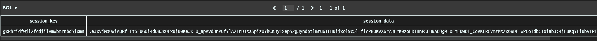
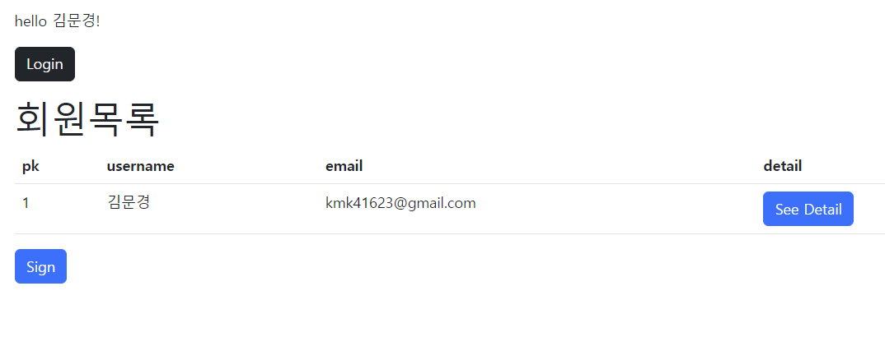
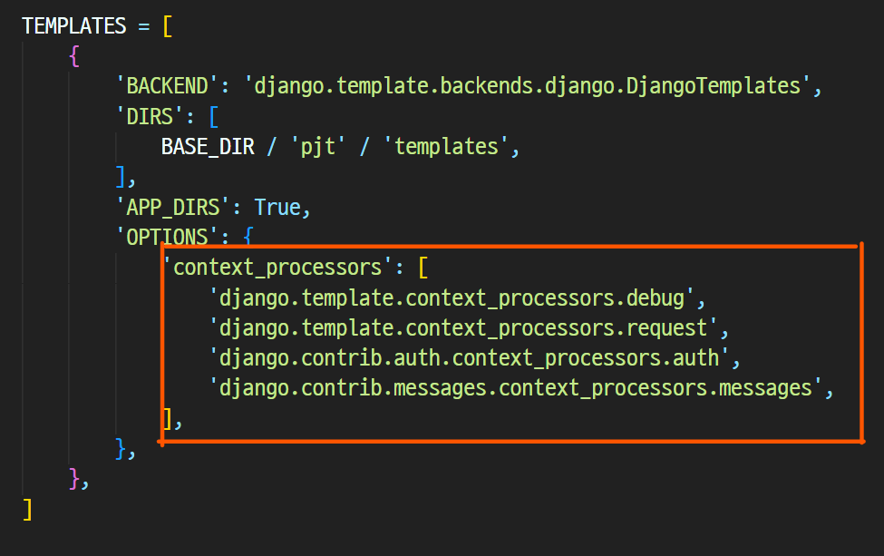
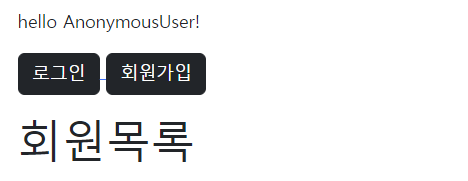
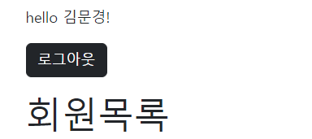

# 10/12

## 🟪 Auth Q&A

### 🧩 accounts.User에 만들고 시작하는 이유?

Model은 DB를 조작하는데 밀접한 관계를 가지고 있다.

Model의 Field가 수정되거나 하는 것들은 마이그레이션 파일 등을 통해서 자동 관리하는데

모델 자체가 변화하고 나면 별도의 수작업이 필요

👉 따라서 미리 바꿔두자, 우리는 django 내부(auth)가 아닌 accounts User를 만들고 간다!

<br>

### 🧩 왜 AbstractUser를 상속받나요? User를 상속받으면 안되나요?

User를 상속받고 있는 AbstractUser를 바로 상속받으면 그게 그거니까

<br>

### 🧩 UserCreationForm의 custom 방식?

UserCreationForm은 ModelForm을 상속 받아서 만들고 있다

우리가 ModelForm을 정의할 때 가장 중요했던 설정은 모델과 필드

<br>

### 🧩 get_user_model 사용 이유

User 모델이라는게 결국에는 변경이 가능한 개념이면서 django와 사용자 둘 다 사용

변경 가능한 것은 변수화 등을 통해 호출하도록 하는게 가장 좋다!

url에 name을 붙여서 쓰는 것도 마찬가지

유저 모델 클래스는 어딘가에 있겠지만 이것을 get_user_model() 호출해서 쓰자

그러면 알아서 AUTH_USER_MODEL에 정의된 클래스를 준다!

<br>

## 🟪 로그인 이해

### 🧩 HTTP

> Hyper Text Transfer Protocol

HTML 문서와 같은 리소스들을 가져올 수 있도록 해주는 프로토콜(규칙, 규약)

웹(WWW)에서 이루어지는 모든 데이터 교환의 기초

클라이언트 - 서버 프로토콜이라고도 부름

<br>

### 🧩 HTTP 특징

**비연결지향(connectionless)**

서버는 요청에 대한 응답을 보낸 후 연결을 끊음

네이버 메인 페이지에 들어가서 페이지를 보고있을때 서버와 항상 연결돼있는게 아니라 네이버 서버는 우리에게 메인 페이지를 응답하고 연결을 끊은 것

**무상태(stateless)**

연결을 끊는 순간 클라이언트와 서버 간의 통신이 끝나며 상태 정보가 유지되지 않음

클라이언트와 서버가 주고받는 메시지들은 서로 완전히 독립적

<br>

### 🧩 로그인 상태 유지하는 방법?

하지만 우리가 로그인을 하고 웹 사이트를 사용하면서 페이지를 이동해도 로그인 상태가 유지되는데 이건 어떻게 가능한걸까?

> 쿠키와 세션

<br>

### 🧩 쿠키

#### 개념

서버가 사용자의 웹 브라우저(클라이언트)에 전송하는 작은 데이터 조각

클라이언트는 쿠키를 로컬에 `key-value`의 데이터 형식으로 저장

동일한 서버에 재요청 시 저장된 쿠키를 함께 전송

<br>

#### 사용 목적

**세션 관리 (Session management)**

- 로그인, 아이디 자동완성, 공지 하루 안 보기, 팝업 체크, 장바구니 등의 정보 관리

**개인화 (Personalization)**

- 사용자 선호, 테마 등의 설정

**트래킹 (Tracking)**

- 사용자 행동을 기록 및 분석

<br>

### 🧩 세션(Session)

사이트와 특정 브라우저 사이의 state(상태) 를 유지시키는 것

클라이언트가 서버에 접속하면 서버가 특정 session id를 발급하고, 클라이언트는 session id를 쿠키에 저장

- 클라이언트가 다시 동일한 서버에 접속하면 요청과 함께 쿠키(session id가 저장된)를 서버에 전달
- 쿠키는 요청 때마다 서버에 함께 전송 되므로 서버에서 session id를 확인해 알맞은 로직을 처리

> session id 는 세션을 구별하기 위해 필요하며, 쿠키에는 session id 만 저장

Session은 브라우저 종료시 삭제되고, 쿠키는 브라우저가 종료되더라도 만료시점이 지나지 않으면 삭제되지 않음

<br>

### 🧩 Session in Django

Django는 **database-backed sessions** 저장 방식을 기본 값으로 사용

session 정보는 Django DB의 django_session 테이블에 저장

설정을 통해 다른 저장방식으로 변경 가능👉 https://docs.djangoproject.com/en/3.2/topics/http/sessions/

Django는 특정 session id를 포함하는 쿠키를 사용해서 각각의 브라우저와 사이트가 연결된 session을 확인함

<br>

## 🟪 LogIn

### 🧩 AuthenticationForm

로그인을 위한 built-in form

로그인 하고자 하는 사용자 정보를 입력 받음(username, password)

ModelForm이 아닌 **일반 Form을 상속** 받고 있으며, **request를 첫번째 인자**로 취함

<br>

### 🧩 login()

**login(request, user, backed=None)**

인증된 사용자를 로그인

- 유저의 ID를 세션에 저장해서 세션을 기록

HTTPReqeust 객체와 User 객체가 필요

유저 정보는 반드시 인증된 유저 정보여야함

👉 이 인증을 위해 **authenticate()**함수를 활용하고, **AuthenticationForm**을 이용해서 유효성 검사를 함

<br>

### 🧩 로그인 로직 작성

일반적인 ModelForm 기반의 Create 로직과 동일하지만

여기서는 ModelForm이 아닌 **Form**을 쓰기 때문에 **필수 인자 구성이 다름**

DB에 저장하는 것 대신 `세션에 유저를 기록하는 함수 호출함`

👉 **get_user()** : AuthenticationForm의 인스턴스 메서드이고, 유효성 검사를 통과했을 경우 **로그인 한 사용자 객체를 반환**

View 함수와 이름이 동일해서 login 대신 auth_login으로 대신 씀 (as 사용)

로그인 URL이 ‘/accounts/login/’에서 변경되는 경우 settings.py LOGIN_URL을 변경하여야 함

```python
# accounts/views.py
from django.shortcuts import render, redirect
from .forms import CustomUserCreationForm
from django.contrib.auth import get_user_model
from django.contrib.auth import login as auth_login # 함수 이름과 겹치니까 auth_login으로!
from django.contrib.auth.forms import AuthenticationForm

def login(request):
    if request.method == 'POST':
        form = AuthenticationForm(request, data = request.POST)
        if form.is_valid():
            auth_login(request, form.get_user())
            return redirect('accounts:index')
    else:
        form = AuthenticationForm()
    context = {
        'form' : form,
    }
    return render(request, 'accounts/login.html', context)
```

<br>

### 🧩 세션 데이터 확인하기



> 로그인 후 django_session 테이블 확인해보면 데이터가 잘 들어와 있음을 알 수 있다

<br>

## 🟪 Authentication with User

### 🧩 현재 로그인 돼있는 유저 정보 출력하기

```django
<div class="container mt-5">
  <p>hello {{ user }}!</p>
  <div class="mb-3">
    <a href="">
      <button type="button" class="btn btn-dark">Login</button>
    </a>
  </div>
  
  
</div>
```

> 
>
> user 변수를 사용하면 현재 로그인 돼있는 유저의 이름이 나오는데 문제는 넘겨준 데이터가 없는데 어떻게 되는걸까?
>
> 👉 **settings.py의 context processors 설정의 ‘django.contrib.auth.context_processors.auth’**

<br>

### 🧩 context processors

템플릿이 렌더링 될 때 호출 가능한 컨텍스트 데이터 목록

작성된 컨텍스트 데이터는 기본적으로 템플릿에서 사용 가능한 변수로 포함됨

**즉, django에서 자주 사용하는 데이터 목록을 미리 템플릿에 로드 해 둔 것**



그 중에서 `django.contrib.auth.context_processors.auth` 안에 이미 user가 들어있음 그렇기 때문에 user를 넘겨받지 않았어도 사용이 가능

<br>

## 🟪 Logout

### 🧩 logout()

logout(request)

요청 유저에 대한 세션 정보를 삭제함

**DB에서 session data 삭제**

클라이언트의 쿠키에서 sessionid 삭제

HttpRequest 객체를 인자로 받고 반환 값이 없음

사용자가 로그인하지 않은 경우 오류를 발생시키지 않음

<br>

## 🟪 로그인 사용자에 대해 접근 제한하기

로그인이 이미 된 사용자는 로그인 기능에 접근이 불가능해야함 이를 구현하려면 2가지가 존재

### 🧩 is_authenticated attribute 활용

#### is_authenticated

User model의 속성(attributes) 중 하나

**사용자가 인증 되었는지 여부를 알 수 있는 방법**

모든 User 인스턴스에 대해 항상 True인 읽기 전용 속성

**AnonymousUser에 대해서는 항상 False**

👉 이를 활용해서 로그인일때와 아닐때를 조건문으로 구별해서 사용이 가능

일반적으로 request.user에서 이 속성을 사용 (request.user.is_authenticated)

권한(permission)과는 관련이 없으며, 사용자가 활성화 상태(active)이거나 유효한 세션(valid session)을 가지고 있는지도 확인하지 않음

```django

    <a href="">
      <button type="button" class="btn btn-dark">로그아웃</button>
    </a>

    <a href="">
      <button type="button" class="btn btn-dark">로그인</button>
    </a>
    <a href="">
      <button type="button" class="btn btn-dark">회원가입</button>
    </a>

```

> (뒤에 로그아웃 기능 만든다고 하면) 로그인이 된 상태면 로그아웃 기능만 활성화 해두고, 로그인이 안 된 상태라면 로그인과 회원가입 기능을 활성화 해둘 수 있음
>
> 

<br>

### 🧩 login_required decorator 활용

#### login_required decorator

사용자가 로그인 되어 있으면 정상적으로 view 함수를 실행

로그인 하지 않은 사용자의 경우 settings.py의 LOGIN_URL 문자열 주소로 redirect 

```python
# accounts/views.py

def login(request):
    if request.method == 'POST':
        form = AuthenticationForm(request, data = request.POST)
        if form.is_valid():
            auth_login(request, form.get_user())
            return redirect(request.GET.get('next') or 'articles:index')
    else:
        form = AuthenticationForm()
    context = {
        'form' : form,
    }
    return render(request, 'accounts/login.html', context)
```

> 인증 성공 시 redirect 되어야하는 경로는 'next'라는 쿼리 문자열 매개 변수에 저장이됨
>
> **/accounts/login/?next=/articles/create/** 이런식으로
>
> return 문의 표현은 단축 평가인데
>
> 없다면 None이나 'articles:index'로 보내고, 있다면 /articles/1/update/ or 'articles:index' 로 보냄
>
> 앞에 값이 True면 리턴하고 뒤는 X, 앞에 값이 False면 뒤를 리턴

```python
@login_required
def update(request, pk):
    article = Article.objects.get(pk=pk)
    if request.method == 'POST':
        # POST : input 값 가져와서, 검증하고, DB에 저장
        article_form = ArticleForm(request.POST, instance=article)
        if article_form.is_valid():
            # 유효성 검사 통과하면 저장하고, 상세보기 페이지로
            article_form.save()
            return redirect('articles:detail', article.pk)
        # 유효성 검사 통과하지 않으면 => context 부터해서 오류메시지 담긴 article_form을 랜더링
    else:
        # GET : Form을 제공
        article_form = ArticleForm(instance=article)
    context = {
        'article_form': article_form
    }
    return render(request, 'articles/form.html', context)
```

> articles앱의 update함수인데 함수 앞에 **@login_required** 데코레이터를 사용해서 로그인이 돼있는 경우에만 함수가 동작하도록 수정하는 것!

<br>

## ⚙️ 실습

### ✏️ 회원관리(회원가입, 조회, 로그인, 로그아웃) 서비스 개발

[README로 이동하기](./Practice/221012/README.md)
