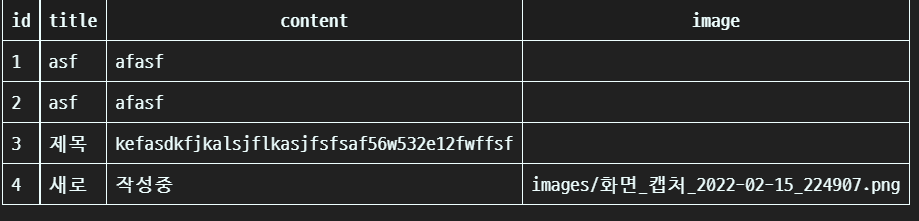
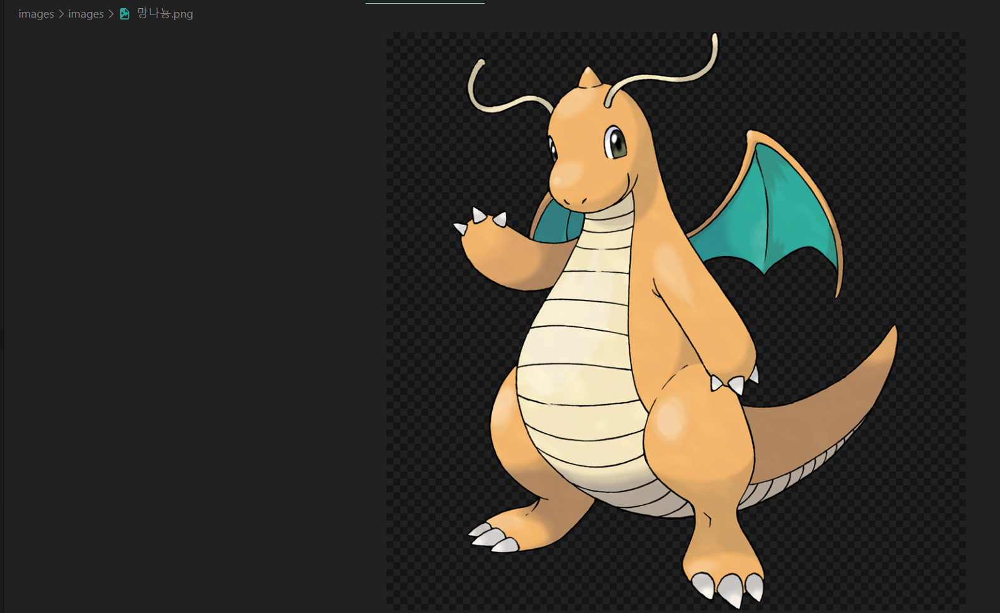
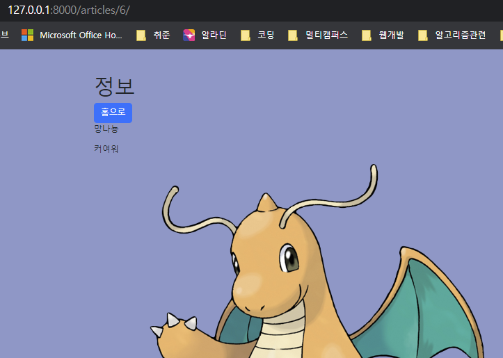

# 10/17

## 🟨 이미지 업로드 기본 설정

### 🧩 미디어 파일이란

사용자가 웹에서 업로드하는 정적인 파일들

<br>

### 🧩 Media 관련 필드

#### ImageField

이미지 업로드에 사용하는 모델 필드

FileField를 상속받는 서브 클래스이기 때문에 FileField의 모든 속성 및 메서드를 사용 가능하며 더해서 사용자에 의해 업로드 된 객체가 유효한 이미지인지 검사함

ImageField 인스턴스는 최대 길이가 100자인 문자열로 DB에 생성되며,  max_length 인자를 사용하여 최대 길이를 변경 할 수 있음

❗주의: 사용하려면 반드시 **Pillow 라이브러리**가 필요

<br>

#### FileField

파일 업로드에 사용하는 모델 필드

##### upload_to argument

문자열 경로 지정 방식

```python
# models.py

class Article(models.Model):
    title = models.CharField(max_length=30)
    content = models.TextField()
    image = models.ImageField(blank=True, upload_to='images/')
```

> 이미지 파일의 경로를 **images/**로 하겠다 라는 설정과, 이미지를 항상 넣을 필요는 없으니 **blank**옵션을 True로 설정 👉 모델 만들었으니 makemigrations/migrate

<br>

### 🧩 URL 설정

settings.py에 MEDIA_ROOT, MEDIA_URL 설정

**upload_to 속성을 정의하여 업로드 된 파일에 사용 할 MEDIA_ROOT의 하위 경로를 지정**

업로드 된 파일의 경로는 django가 제공하는 ‘url’ 속성을 통해 얻을 수 있음

```django

```

#### 1. MEDIA_ROOT

**사용자가 업로드 한 파일들을 보관할 디렉토리의 절대 경로**

django는 성능을 위해 업로드 파일은 DB에 저장하지 않음

> 실제로 DB에 저장되는 것은 파일의 경로!

#### 2. MEDIA_URL

**MEDIA_ROOT에서 제공되는 미디어를 처리하는 URL**

**업로드 된 파일의 주소(URL)를 만들어 주는 역할**

비어 있지 않은 값으로 설정 한다면 반드시 slash(/)로 끝나야 함

```python
# settings.py

MEDIA_ROOT = BASE_DIR / 'images'
MEDIA_URL = '/media/'
```

#### 3. URL 설정

```python
# urls.py

from django.conf import settings
from django.conf.urls.static import static

urlpatterns = [
    path('admin/', admin.site.urls),
    path('articles/', include('articles.urls')),
] + static(settings.MEDIA_URL, document_root = settings.MEDIA_ROOT)
```

> 사용자가 업로드 한 파일이 우리 프로젝트에 업로드 되지만, 실제로 사용자에게 제공하기 위해서는 업로드 된 파일의 URL이 필요함

<br>

## 🟪 이미지 업로드(Create)

### 🧩 모델 설정

#### 1. ImageField

**upload_to 옵션**: 실제 이미지가 저장되는 경로 지정

**blank=True**: 이미지 필드에 빈 값(빈 문자열)이 허용되도록 설정

- 기본 값은 False이고 유효성 검사에서 사용이 됨(is_valid)
- 필드에 blank=True가 있으면, form 유효성 검사에서 빈 값 입력이 가능

**null 옵션**: 빈 값을 DB에 NULL로 저장

- 기본 값은 False
- CharField, TextField와 같은 문자열 기반 필드에는 사용하는 것을 피해야함
- 문자열 기반 필드에 True로 설정 시 ‘데이터 없음(no data)’에 “빈 문자열(1)”과 “NULL(2)”의 2가지 가능한 값이 있음을 의미하게 됨
- 대부분의 경우 "데이터 없음"에 대해 두 개의 가능한 값을 갖는 것은 중복되며, Django는 NULL이 아닌 빈 문자열을 사용하는 것이 규칙

> blank=True 쓰자

```python
# articles/models.py

from django.db import models

class Article(models.Model):
    title = models.CharField(max_length=30)
    content = models.TextField()
    image = models.ImageField(blank=True, upload_to='images/')
```

> imageField를 사용하기 위해서는 `pip install Pillow`를 통해서 라이브러리 설치 후 makemigrations/migrate 진행해야함

<br>

### 🧩 HTML 설정

게시글 작성 form의 enctype 속성을 지정

#### enctype 속성

form data가 서버로 제출될 때 해당 데이터가 인코딩 되는 방법을 명시

method가 POST일때만 사용이 가능

기본적으로는 모든 문자들은 서버로 보내기 전에 인코딩이 되는데

`multipart/form-data`는 모든 문자를 인코딩 하지 않음을 뜻함

👉 **form 요소가 파일이나 이미지를 서버로 전송할 때 주로 사용함**

> 설정을 따로 하지 않으면, 웹 서버로 데이터를 넘길때 파일의 경로명만 전송되고 파일 내용 자체는 전송이 안 되기 때문!

```html
articles/create.html

 
<h1>글 작성하기</h1>
<form action="" method="POST" enctype="multipart/form-data">
  
  
  
</form>

```



> 고치고 다시 입력해보면 DB에 저장이 잘 됨

<br>

### 🧩 View 설정

 업로드 한 파일은 request.FILES 객체로 전달됨

```python
# views.py

def create(request):
    if request.method == 'POST':
        article_form = ArticleForm(request.POST, request.FILES)
        if article_form.is_valid():
            article_form.save()
            return redirect('articles:index')
    else:
        article_form = ArticleForm()
    context = {
        'article_form' : article_form,
    }
    return render(request, 'articles/create.html', context)
```

> 이제 images 폴더를 확인해보면
>
> 
>
> images 폴더 내에 저장이 되고 화면상에도 잘 나타남을 알 수 있음
>
> 

<br>

## 🟪 이미지 업로드(Read)

### 🧩 img 태그 활용

**article.image.url : 업로드 파일의 경로**

**article.image : 업로드 파일의 파일 이름**

```html
 
<h1>정보</h1>
<div>
  <a href="">
    <button type="button" class="btn btn-primary">홈으로</button>
  </a>
</div>
  <h2>{{ article.title }}</h2>
  <h3>{{ article.content }}</h3>
  

```

> img 태그의 src에는 경로를, alt에는 파일 이름을 넣기(파일 안 나올때 대비한 텍스트)

<br>

## 🟪 이미지 사이즈 조정(Resizing)

### 🧩 Django-imagekit

실제 원본 이미지를 서버에 그대로 업로드 하는 것은 서버의 부담이 큰 작업

img 태그에서 직접 사이즈를 조정할 수도 있지만 (width 와 height),  **업로드 될 때 이미지 자체를 resizing 하는 것**을 사용해 볼 것

django-imagekit 라이브러리 활용

#### 1. pip install django-imagekit

#### 2. settings.py에 imagekit 추가

#### 3. 이미지 크기 변경

models.py를 변경

```python
# models.py

from django.db import models
from imagekit.models import ProcessedImageField
from imagekit.processors import Thumbnail

class Article(models.Model):
    title = models.CharField(max_length=30)
    content = models.TextField()
    image = models.ImageField(blank=True, upload_to='images/')
    thumbnail = ProcessedImageField(
        blank=True,
        processors=[Thumbnail(300,300)],
        format='JPEG',
        options={'quality': 90},
    )
```

<br>

## ⚙️ 실습

### ✏️ 이미지 넣는 CRUD


