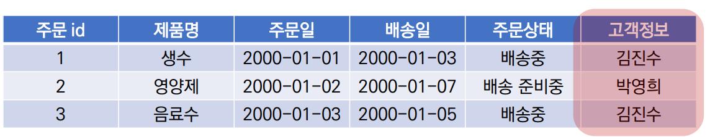

# 10/18

## 🟨 RDB(관계형 데이터베이스)

### 🧩 복습

데이터를 테이블, 행, 열 등으로 나누어서 구조화하는 방식

RDB의 모든 테이블에는 행에서 고유하게 식별 가능한 **기본 키**라는 속성이 있으며, **외래 키**를 사용해서 각 행에서 서로 다른 테이블 간 관계를 만드는데 사용 가능

 

### 🧩 테이블 간 관계 예시

주문 서비스를 만든다고 가정하자

주문 서비스 DB에는 고객 테이블과, 주문 테이블이 존재할 것이다

고객 테이블에는 고객의 정보(이름, 주소정보 등), 주문 테이블에는 주문 정보(제품명, 주문일, 배송일, 주문 상태 등)이 있음

그런데 위와 같이 저장하면 id1과 3의 '김진수'는 동명이인인지 아닌지 구별이 가능할까...?

이를 해결하기 위해 고객 정보의 유일한 값인 `id(pk)`를 활용

 

### 🧩 RDB에서의 관계

#### 1:1

One-to-one relationships

한 테이블의 레코드 하나가 다른 테이블의 레코드 단 한 개와 관련된 경우

> user와 프로필 간의 관계

 

#### 1:N

One-to-many relationships

한 테이블의 레코드 여러개가 다른 테이블의 레코드 단 한 개와 관련된 경우

> 댓글, 사용자의 글/ 사용자의 댓글 (user와 article)

 

#### M:N

Many-to-many relationships

한 테이블의 레코드 여러개가 다른 테이블의 레코드 여러개와 관련된 경우

양쪽 모두에서 1:N 관계를 가짐

> 우리가 생각하는 대부분것들

 

## 🟨 Foreign Key

### 🧩 개념 및 특징

관계형 DB에서 다른 테이블의 행을 식별할 수 있는 키

참조되는 테이블의 **기본 키(Primary Key)**를 가리킴

부모 테이블의 **유일한 값**을 참조 (참조 무결성)

외래 키의 값이 반드시 부모 테이블의 기본 키일 필요는 없지만, 유일한 값이어야 함!

 

## 🟨 1:N(Article - Comment)

### 🧩 모델 관계 설정

> Article이 1이면, Comment는 N

게시글(1)은 여러 개의 댓글(N)을 가짐

게시글(1)은 댓글을 0개 이상 가진다

- 게시글(1)은 댓글을 가지지 않을 수도 있다
- 댓글은 반드시 하나의 게시글에 속한다

 

### 🧩 Django Relationship fields

**OneToOneField()**

**ForeignKey()**

**ManyToManyField()**

 

### 🧩 ForeignKey()

A one-to-many relationship을 담당하는 Django의 모델 필드 클래스

Django 모델에서 관계형 DB의 외래 키 속성을 담당

2개의 필수 위치 인자가 필요

- **참조하는 model class**
- **on_delete 옵션**

 

#### on_delete

외래 키가 참조하는 객체가 사라졌을 때 외래 키를 가진 객체를 어떻게 처리할 지를 정의 👉 댓글은 부모객체인 게시글을 참조하는데 게시글이 사라지면 댓글도 같이 사라지게 하는것이 on_delete

데이터 무결성을 위해서 매우 중요한 설정

옵션에는 CASCADE, PROTECT, SET_NULL, SET_DEFAULT 등이 있음

 

### 🧩 Comment 모델 정의

외래 키 필드는 ForeignKey 클래스를 작성하는 위치와 관계없이 필드의 마지막에 작성됨

ForeignKey() 클래스의 인스턴스 이름은 참조하는 모델 클래스 이름의 단수형(소문자) 으로 작성하는 것을 권장

 

### 🧩 댓글 기능 구현

app은 어디에? 기존에 쓰던 articles에 하자(글과 댓글이 서로 관계가 있으니까)

Model에는 생성 id, FK, 댓글 내용, 생성 시간 정도가 필요할듯

댓글 목록은 게시글 상세(articles:detail)

댓글 작성은 게시글 상세(articles:detail)

생성은 DB에 저장(.save())이고, 생성 완료 후에는 게시글 상세(articles:detail)로 다시 가게(redirect)

 

## 🟨 관계 모델 참조

### 🧩 Related manager

Related manager는 1:N 혹은 M:N 관계에서 사용 가능한 문맥(context)

Django는 모델 간 1:N 혹은 M:N 관계가 설정되면 **역참조할 때에 사용할 수 있는 manager를 생성**

우리가 이전에 모델 생성 시 objects라는 매니저를 통해 queryset api를 사용했던 것처럼 related manager를 통해 queryset api를 사용할 수 있게 됨

 

### 🧩 역참조

**나를 참조하는 테이블(나를 외래 키로 저장한)을 참조하는 것**

**즉, 본인을 외래 키로 참조 중인 다른 테이블에 접근하는 것**

1:N 관계에서는 1이 N을 참조하는 상황

> 댓글(N)이 글(1) 안에 포함되기 때문에, 댓글이 글을 참조하는 것은 정참조 이지만, 글이 댓글을 참조하는 것은 역참조!

 

### 🧩 ForeignKey arguments - related_name

ForeignKey 클래스의 선택 옵션

**역참조 시 사용하는 매니저 이름(model_set manager)을 변경할 수 있음**

작성 후, migration 과정이 필요

선택 옵션이지만 상황에 따라 반드시 작성해야 하는 경우가 생기기도 함

> 글이 article, 댓글이 comment일때 `article.comment_set.all()`을 썼었는데 `related_name='comments'` 라고 바꾸면, `article.comments.all()`로 대체가 가능

 

## 🟨 Comment 추가 사항

### 🧩 댓글 개수 출력하기

#### ✔️ 1. DTL filter - length 사용

`{{ comments|length }}`

`{{ article.comment_set.all|length }}`

 

### ✔️ 2. Queryset API - count() 사용

`{{ comments.count }}`

`{{ article.comment_set.count }}`

 

## ⚙️ 실습

### ✏️ 댓글 작성 서비스

[README로 이동하기](./Practice/221018/README.md)
