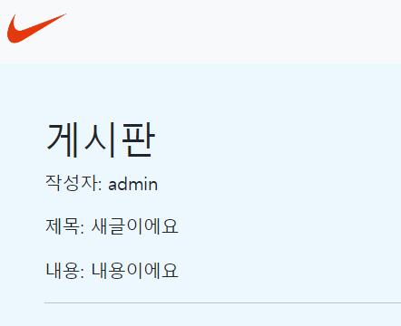
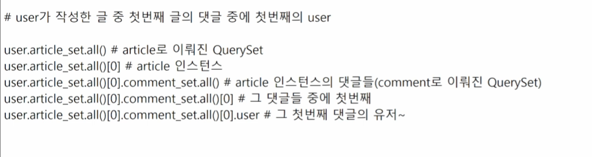

# 10/19

## 🟨 글 작성자 넣기

### 🧩 개념

DB에 각 글마다 해당하는 **user_id**를 같이 넣기

그럼 DB 모델을 수정하고

view도 같이 수정해야함 (저장하는 과정에서 로그인 유저 정보를 같이 줘야함)

마지막으로 template detail.html에 작성자 정보를 같이 보여주게 하면 성공!

<br>

### 🧩 Model 변경

```python
# articles/models.py

class Article(models.Model):
    ...
    user = models.ForeignKey(settings.AUTH_USER_MODEL, on_delete=models.CASCADE)
```

위처럼하고 makemigrations/migrate 하면 에러가 뜸

왜? 너가 user field를 새로 만들었는데 null값이 존재할 수가 없는데 존재하고, 심지어 default값도 설정을 안해놨네?

👉 지금 default값 알려주면 바꿔줄게, 아니면 models.py 다시 들어가서 바꾸고 와

<br>

### 🧩 어떻게 유저 정보를 넣을까?

views.py 함수 정의된 곳에서 내가 사용자로부터 받을 수 있는 정보는?

> request(request.POST, request.GET) / url(variable routing)

사용자는 그럼 어떻게 서버에 값을 전달?

> request 👉 form : form에서 값을 입력하고 전달
>
> url 👉 내가 깔아놓은 길, 버튼 누르면 내가 URL에 값을 넣어놨으니 그 경로대로 이동

따라서 유저 정보를 받으려면 request의 user속성을 활용하면 됨!

```python
# articles.views.py

@ login_required
def create(request):
    if request.method == 'POST':
        article_form = ArticleForm(request.POST)
        if article_form.is_valid():
            article = article_form.save(commit=False)
            article.user = request.user
            article.save()
            return redirect('articles:index')
    else:
        article_form = ArticleForm()
    context = {
        'article_form': article_form,
    }
    return render(request, 'articles/create.html', context)
```

> 글 생성하는 create 함수
>
> `article.user = request.user`를 통해 request로 요청받은 user를 article의 user의 값으로 사용



<br>

참고



## ⚙️ 실습

### ✏️ ModelForm을 활용한 CRUD 실습

[README로 이동하기](./Practice/221019/README.md)
