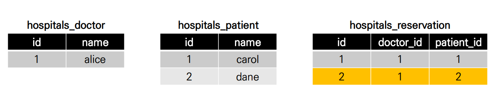
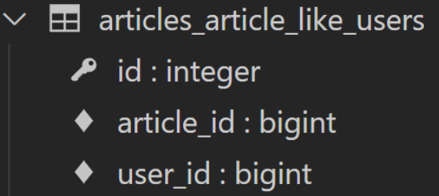

# 10/24

## 🟨 Many to many relationship

### 🧩 개요

병원 예약 시스템 구축을 위한 데이터 베이스 모델링을 진행한다면?

> 환자, 진료과목, 의사 등등...

환자 : 의사 = n : 1이 가능한데 문제는 의사 변경이 불가능함...

**즉, n:1의 한계!**

<br>

### 🧩 N:1의 한계

동일한 환자지만 다른 의사에게 예약하기 위해서는 개체를 하나 더 만들어서 예약을 진행해야함(의사는 1이니까)

외래키 칼럼에 '1, 2' 형태로 참조하는 것은 **Integer** 타입이 아니기 때문에 불가능

> 예약 테이블을 따로 만들자!



> doctor_id가 의사, patient_id가 환자일 때
>
> 1번 환자가 1번 의사에게, 2번 환자가 1번 의사에게 진료받음을 확실하게 표현할 수 있음!
>
> 이런식으로 하면 예약이 들어올 때 마다 reservation 테이블에 계속 데이터가 생성되는 방식

그런데 장고에서는 이런식으로 진행하지는 않음! 왜냐면 더 좋은 필드가 이미 내장돼있기 때문!

<br>

### 🧩 ManyToManyField

```python
# hospitals/models.py

class Patient(models.Model):
    # ManyToManyField 작성
    doctors = models.ManyToManyField(Doctor)
    name = models.TextField()
    
    def __str__(self):
    return f'{self.pk}번 환자 {self.name}’
```

```shell
# patient1이 doctor1에게 예약
patient1.doctors.add(doctor1)

# patient1 - 자신이 예약한 의사목록 확인
patient1.doctors.all()
<QuerySet [<Doctor: 1번 의사 alice>]>

# doctor1 - 자신의 예약된 환자목록 확인
doctor1.patient_set.all() 
<QuerySet [<Patient: 1번 환자 carol>]>
```

> 명령어도 이제 **add**로 바뀜
>
> manytomany를 쓰면 역참조가 훨씬 쉬워짐

```shell
# patient1이 doctor1에게 예약
patient1.doctors.add(doctor1)
# patient1 - 자신이 예약한 의사목록 확인
patient1.doctors.all()
<QuerySet [<Doctor: 1번 의사 alice>]>
# doctor1 - 자신의 예약된 환자목록 확인
doctor1.patient_set.all() 
<QuerySet [<Patient: 1번 환자 carol>]>
```

> 환자가 의사에게 예약을 하거나

```shell
# doctor1이 patient2을 예약
doctor1.patient_set.add(patient2)
# doctor1 - 자신의 예약 환자목록 확인
doctor1.patient_set.all() 
<QuerySet [<Patient: 1번 환자 carol>, <Patient: 2번 환자 dane>]>
# patient1, 2 - 자신이 예약한 의사목록 확인
patient1.doctors.all()
<QuerySet [<Doctor: 1번 의사 alice>]>
patient2.doctors.all()
<QuerySet [<Doctor: 1번 의사 alice>]>
```

> 의사가 환자를 예약을 하는 것도 가능

> 한마디로, ManyToManyField을 사용하면 중개 테이블이 자동으로 만들어진다!

<br>

### 🧩 related_name argument

target model이 source model을 참조할 때 사용할 manager name

ForeignKey()의 related_name과 동일

**ManyToManyField에서는 거의 필수적으로 해주는게 좋음**

```python
class Patient(models.Model):
    # ManyToManyField - related_name 작성
    doctors = models.ManyToManyField(Doctor, related_name='patients')
    name = models.TextField()
    
    def __str__(self):
    	return f'{self.pk}번 환자 {self.name}'
```

> related_name을 patients라고 지정해줬으므로
>
> 이제 1번의사의 모든 환자를 보는 명령어는
>
> Doctor.objects.get(pk=1).patient_set.all()이 아니고
>
> Doctor.objects.get(pk=1).patients.all()로 바뀜!

<br>

### 🧩 ‘through’ argument

중개 테이블을 직접 지정하려는 경우 through 옵션을 사용하여 사용하려는 중개 테이블을 나타내는 Django 모델을 지정할 수 있음

가장 일반적인 용도는 중개테이블에 추가 데이터를 사용해 다대다 관계와 연결하려는 경우

```python
class Patient(models.Model):
    doctors = models.ManyToManyField(Doctor, through='Reservation')
    name = models.TextField()
    
    def __str__(self):
    	return f'{self.pk}번 환자 {self.name}'
    
class Reservation(models.Model):
    doctor = models.ForeignKey(Doctor, on_delete=models.CASCADE)
    patient = models.ForeignKey(Patient, on_delete=models.CASCADE)
    symptom = models.TextField()
    reserved_at = models.DateTimeField(auto_now_add=True)
    
    def __str__(self):
    	return f'{self.doctor.pk}번 의사의 {self.patient.pk}번 환자'
```

> 예약정보(Reservation)에 증상(symptom)과 예약일(reserved_at)이라는 추가 데이터가 생김

<br>

## 🟨 좋아요 기능

### 🧩 개요, 생각...

Article : User는 M : N

Article은 0명 이상의 User에게 좋아요를 받는다.

User는 0개 이상의 글에 좋아요를 누를 수 있다.

**상세보기 페이지**에서 좋아요 링크를 누르면, 좋아요를 DB에 추가하고 다시 상세보기 페이지로 redirect!

<br>

### 🧩 모델 관계 설정

ManyToManyField 작성

```python
# articles/models.py

class Article(models.Model):
    user = models.ForeignKey(settings.AUTH_USER_MODEL, on_delete=models.CASCADE)
    like_users = models.ManyToManyField(settings.AUTH_USER_MODEL)
    title = models.CharField(max_length=10)
    content = models.TextField()
    created_at = models.DateTimeField(auto_now_add=True)
    updated_at = models.DateTimeField(auto_now=True)
```

like_users 필드 생성 시 자동으로 역참조에는 **article_set 매니저**가 생성됨

**그러나 이전 N:1(Article-User) 관계에서 이미 해당 매니저를 사용 중**

- user.article_set.all() 👉 **해당 유저가 작성한 모든 게시글 조회**
- **user가 작성한 글들**(user.article_set)과 **user가 좋아요를 누른 글**(user.article_set)을 구분할 수 없게 됨

> user와 관계된 ForeignKey 혹은 ManyToManyField 중 하나에 related_name을 작성해야 함

<br>

```python
# articles/models.py

class Article(models.Model):
	user = models.ForeignKey(settings.AUTH_USER_MODEL, on_delete=models.CASCADE)
	like_users = models.ManyToManyField(settings.AUTH_USER_MODEL, related_name='like_articles')
	title = models.CharField(max_length=10)
	content = models.TextField()
	created_at = models.DateTimeField(auto_now_add=True)
	updated_at = models.DateTimeField(auto_now=True)
```

> like_users에 **related_name='like_articles'** 추가함!



> 중개 테이블에 article_id와 user_id가 추가됨

<br>

### 🧩 좋아요 구현

```python
# articles/urls.py

urlpatterns = [
    ...
    path('<int:article_pk>/likes/', views.likes, name='likes'),
]
```

```python
# articles/views.py

def likes(request, article_pk):
    article = Article.objects.get(pk=article_pk)
    if article.like_users.filter(pk=reqeust.user.pk).exists():
        article.like_users.remove(request.user)
    else:
        article.like_users.add(request.user)
    return redirect('articles:index')
```

> article.like_users.all에 있는 user라면 이미 이 게시글에 좋아요를 눌렀다는 뜻이므로 article.like_users에서 지운다!

QuerySet에 결과가 포함되어 있으면 True를 반환하고 그렇지 않으면 False를 반환

특히 큰 QuerySet에 있는 특정 개체의 존재와 관련된 검색에 유용

```django
<!-- articles/index.html -->


…

…
<div>
    <form action="" method="POST">
    
    
    <input type="submit" value="좋아요 취소">
    
    <input type="submit" value="좋아요">
    
    </form>
</div>
<a href="">DETAIL</a>
<hr>


```

> 각 게시글에 좋아요 버튼 출력하기

<br>

