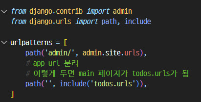
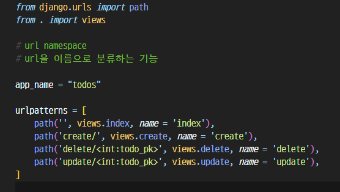
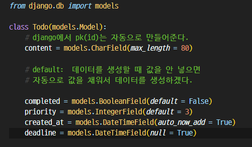
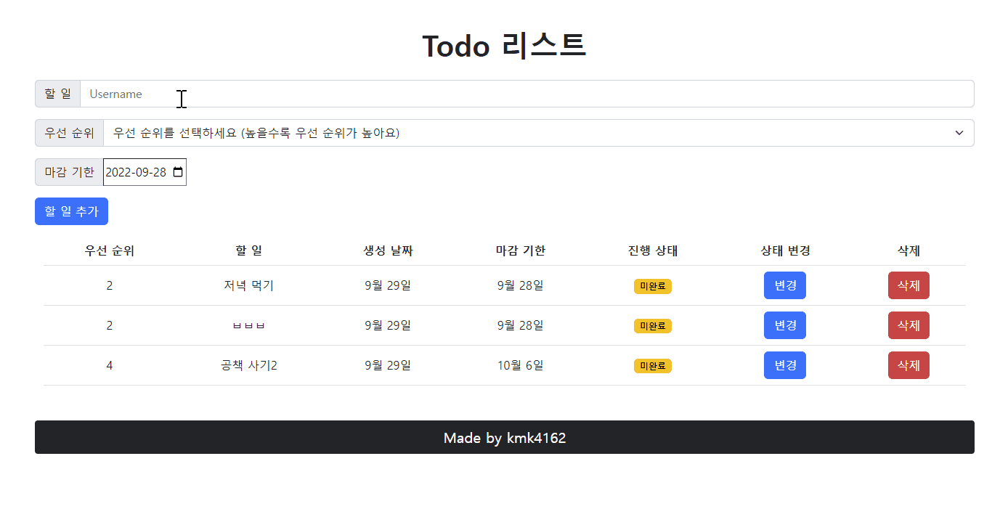
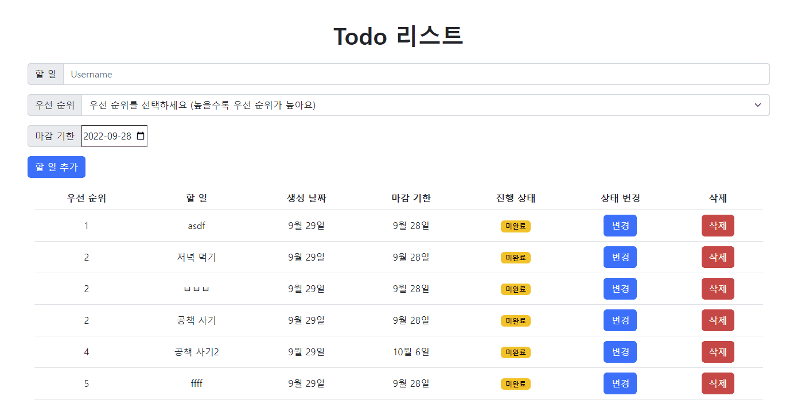
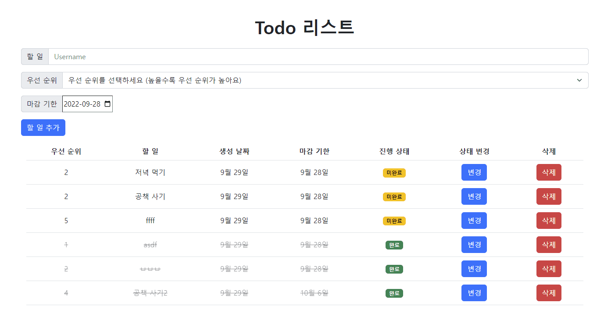

# 🖥️ CRUD 기능이 있는 todo 리스트

## 🧩 목차

- [기간](#🧩-기간)
- [목표](#🧩-목표)
- [사용 기술](#🧩-사용-기술)
- [설명](#🧩-설명)
- [프로젝트 결과 완성본](#🧩-프로젝트-결과-완성본)
- [후기 및 배운점](#🧩-후기-및-배운점)

 

## 🧩 기간

- 220928 ~ 220929

 

## 🧩 목표

- CRUD 기능 구현

  - 할 일 추가하기 Create

  - 할 일 목록보기 Read

  - 할 일 완료 여부 변경기능 Update

  - 할 일 삭제하기 Delete

 

## 🧩 사용 기술

- HTML
- CSS
- Bootstrap
- Django
- Shell_plus

 

## 🧩 설명

> Django를 활용해서 게시판에 필요한 CRUD 기능을 구현

### 📁 초기설정

settings.py에 app이름(todos) 추가

> include를 활용
>
> todos.urls가 메인 페이지(localhost:8000)이 되도록!

todos에 urls.py를 만들고 경로를 바꿔줌

> app_name을 'todos'라고 지정하기 👉 URL namespace
>
> 이후 추가하는 views의 함수마다 URL 패턴, 함수이름, name 인자를 일치시켜서 추가하기

models.py에서 받으려는 데이터에 맞는 조건과 field를 생성

> 이렇게 생성 후 makemigration, migrate로 반영하기

 

### 📁 할 일 추가하기; CREATE

할 일 추가를 위해 내용, 우선 순위, 마감 기한의 데이터를 사용자로부터 입력을 받아야함

**HTML의 form 태그를 활용해서 input을 받음**

이 때 form 태그의 action을 `todos:create`로 지정하고 밑의 3개의 값들이 name을 이용해서 views.py쪽과 맞춘다. 이렇게 되면 name을 참조해서 HTML 쪽에서 입력되는 input 데이터 들을 get 메소드를 이용해서 가져와서 조작이 가능!

create를 위해 데이터를 받아와서 그대로 객체를 만든 다음에 render가 아닌 `redirect`를 쓴다

이렇게 되면 create 함수가 실행되고 redirect에서 설정해둔 경로(함수)로 이동해서 그 함수가 실행이 된다. (READ 기능을 하는 `index` 함수를 redirect의 parameter로 설정)

#### ✔️ 일 내용(content)

직접 입력하는데 글자수 제한을 두기 위해 `charField`에서 `max_length` 값을 설정함

#### ✔️ 우선 순위(priority)

Bootstrap 활용

select option을 활용

default 값은 3으로 두고 숫자가 낮아질수록 우선 순위가 높음을 명시

#### ✔️ 마감 기한(deadline)

\<input type="data"\> 을 활용

최솟값과 최댓값 범위를 설정

 

### 📁 할 일 목록 보기; READ

todo 리스트는 `우선순위`가 중요하기 때문에(그렇다고 생각했기 때문에) 일 데이터를 입력할때마다 우선순위의 오름차순으로 정렬해주고 render 함수를 return 하도록 구현했다.

`할 일 추가` 버튼을 눌러서 할 일을 추가하게 되면 create 함수가 실행되고 redirect 때문에 설정해둔 index함수가 다시 실행됨

index함수는 항상 우선 순위를 기준으로 오름차순 정렬을 한 뒤 반환

`Todo` class를 활용한 Todo 인스턴스의 데이터를 전부 조회하는 `Todo.objects.all()` 쿼리셋 API를 이용해서 `todos`라는 변수에 담는다.

이렇게 되면 todos라는 변수에 Todo 인스턴스의 데이터가 전부 담기게 됨

이 todos를 HTML쪽에서 for문을 활용해서 차례로 한개씩 출력 (테이블 형식으로 출력)

세부적인 추가 기능은 밑에서 설명 

 

### 📁 할 일 완료 여부 변경하기; UPDATE

할 일 완료 버튼을 누르면 상태가 변경이 되는 기능

일을 완료하고 버튼을 누르면 `completed` 값이 default 값인 False에서 True로 바뀜

True로 바뀌게 되면 일을 완료했다는 의미로 텍스트에 가로줄(`strike 태그`)을 넣고 `opacity`를 활용해서 흐릿하게 해서 일이 완료됨을 좀 더 직관적으로 표현

다시 버튼을 누르면 False로 바뀌게 되므로 그대로 돌아옴

일을 완료하게 되면 아직 끝내지 못한 일보다는 덜 중요하기 때문에, 우선순위에 상관없이 맨 밑으로 가게해서, 내가 완료한 일 보다는 앞으로 해야될 일을 더 중점을 두었음

유일한 값인 `todo.pk`를 이용해서 바꾸고 싶은 데이터의 pk를 가져와서 update 함수를 실행

수정된 후 `save()`로 반영한 후 index함수를 redirect 👉 완료 상태가 바뀐 뒤에 원래대로 다시 데이터를 순서대로 정렬해야 하기 때문! 

 

### 📁 할 일 삭제하기; DELETE

삭제 버튼을 누르면 한 줄의 데이터가 삭제되는 기능

역시 todo.pk와 get을 이용해서 1개의 데이터만 특정한 다음 그대로 삭제한 다음 index 함수를 redirect하면 됨

 

## 🧩 프로젝트 결과 완성본

CREATE & READ (우선순위 따라 오름차순 정렬)

 

UPDATE

 

DELETE

 

## 🧩 후기 및 배운점

Django를 학습하고 처음으로 나름 의미있는, 디테일이나 기능들을 더 추가한다면 실제로도 사용할만한 결과물을 만들어냈다. 물론 강사님과 강의자료, 구글링을 참고하면서 만들었고 아직까지 문법이 손에 익지 않는다. 특히 url, app namespace를 설정하는 것과 get 메소드를 가져와서 어떻게 처리를 하고 저장할지가 많이 헷갈린다. 한마디라 Django의 디자인 구조인 MTV에 대해 내가 제대로 이해하지 못했기 때문이라고 느꼈다. 결국 해답은 끊임없는 반복이 아닐까 생각한다. 
