# ⚙️Django CRUD 흐름 정리

## 1. 가상환경 및 Django 설치

### 1-1 가상환경 생성 및 실행

- 가상환경 폴더를 `.gitignore`로 설정을 해둔다.

```
$ python -m venv venv
$ source venv/Scripts/activate
(venv) $
```

### 1-2 Django 설치 및 기록

```
$ pip install django==3.2.13
$ pip freeze > requirements.txt
```

### 1-3 Django 프로젝트 생성

```
$ django-admin startproject pjt .
```

<br>

## 2. articles app

### 2-1 app 생성

```django
python manage.py startapp articles .
```

### 2-2 app 등록

settings.py에 가서 INSTALLED_APPS 리스트 최상단에 apps 이름(articles)를 작성 

### 2-3 urls.py 설정

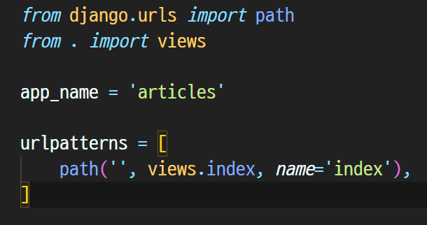

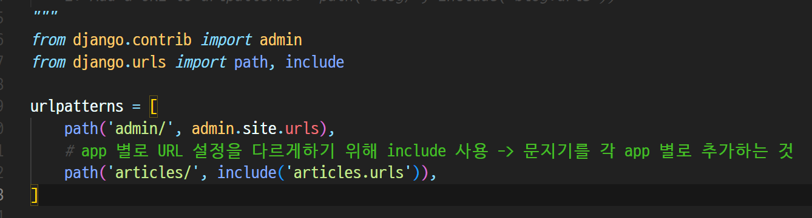

> articles의 urls.py에는 기본 페이지를 index 함수로 설정하고, app_name을 지정해줌
>
> 이걸 이용해서 전체 pjt의 urls.py에 가서 include를 활용해서 articles의 url만 따로 관리할 수 있게 설정

<br>

## 3. Model 정의 (DB 설계)

### 3-1 클래스 정의

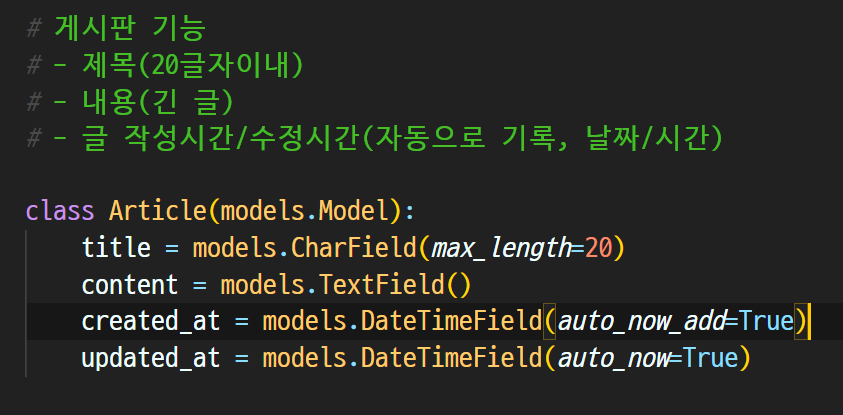

> 제목, 내용, 작성시간, 수정시간이 필요하고 각각 알맞는 field와 조건들을 추가

### 3-2 마이그레이션 파일 생성

```
python manage.py makemigrations
```

### 3-3 DB 반영(`migrate`)

```
python manage.py migrate
```

<br>

## 4. CRUD 기능 구현

### 4-1 게시글 생성

> 사용자에게 HTML Form 제공, 입력받은 데이터를 처리 (ModelForm 로직으로 변경)

#### 1. HTML Form 제공

> http://127.0.0.1:8000/articles/new/

#### 2. 입력받은 데이터 처리

> http://127.0.0.1:8000/articles/create/

> 게시글 DB에 생성하고 index 페이지로 redirect

---

일단 create 함수 먼저 만들기

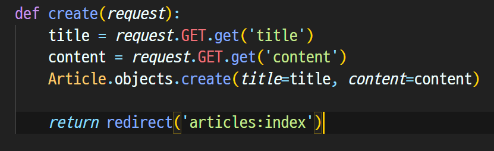

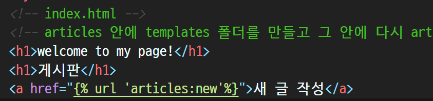

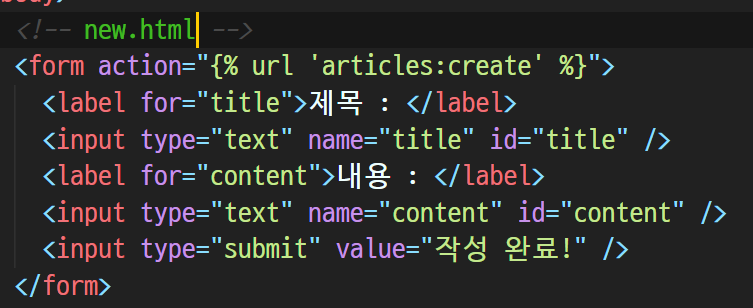

> index.html 페이지에서 `새 글 작성`을 누르면 a 태그에 의해 new.html 페이지로 이동
>
> new.html은 action이 create.html인 form 형식이 존재하고 submit을 하면 create 함수에 의해 title, content를 가져와서 Article 클래스의 인스턴스를 새로 create 한 후 index.html로 redirect를 하는 방식

<br>

### 4-2 게시글 목록

> DB에서 게시글을 가져와서, template에 전달

index.html에 반복문을 활용해서 전체 DB 데이터를 보이게하기

create 함수를 통해 데이터가 작성될때마다 업데이트 되어야함

따라서 index함수에서 get을 처리해줘야함

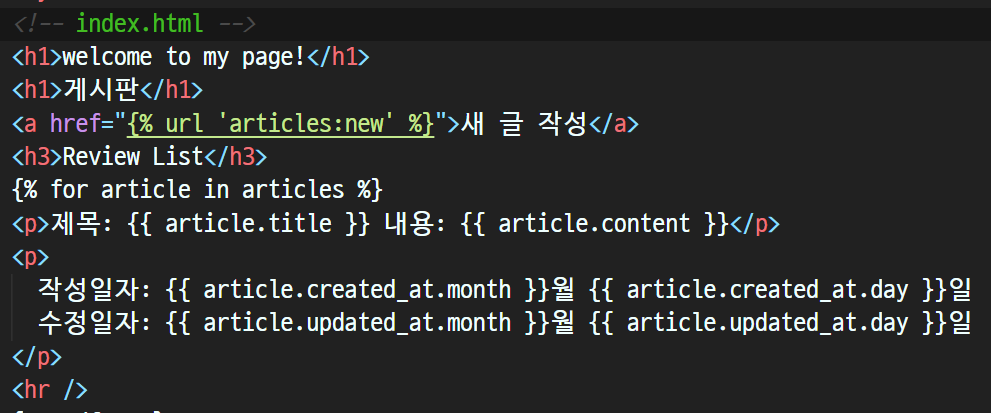

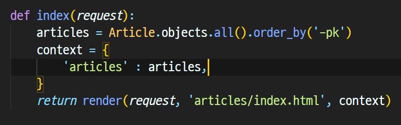

> 메인 페이지는 index.html인데 여기서 보이게 해야하므로 index 함수를 수정해야함
>
> Article.objects.all()를 이용해서 데이터 전부를 가져오고 pk의 내림차순으로 정렬을 해줌
>
> 그 다음 context 딕셔너리에 내용 전부를 담고 render 시 데이터를 함께 넣어줌
>
> index 함수 실행으로 인해 render가 되면 index.html의 반복문이 작동하고, articles에 대해 반복문을 돌려주면서 데이터 하나하나를 그대로 출력해주는 형태


<br>

### ⭐ 이젠 게시글 생성을 GET에서 POST로!!

만약 create함수가 로그인 시 아이디와 비밀번호를 입력하는 형태라면?

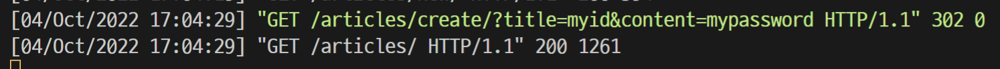

> 입력한 id와 비밀번호가 고스란히 기록에 남음
>
> 이렇게 되면 보안에 당연히 문제가 생기기 때문에 우리는 이 내역을 숨기는 형태로 데이터를 주고 받아야함

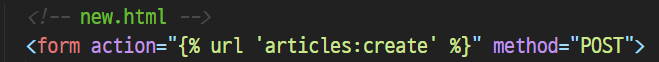

form의 method를 추가하면 `POST 방식으로 create로 보낼게` 라는 뜻인데 그대로 쓰면?


위와 같은 에러가 뜸 👉 CSRF 검증에 실패함

> CSRF란?
>
> 다른 사이트에서 유저가 보내는 요청을 조작하는 **공격**. 예시로는 이메일에 첨부된 링크를 누르면 내 은행계좌의 돈이 빠져나가는 방식의 해킹 등이 있음
> 회원가입시 페이지를 바꿔치기 하는등의 방법으로 해킹을 하기도 하기 때문에 이를 방지하기 위한것이 CSRF 토큰이다
>
> 이를 막기 위해 form 태그 안에 ``를 넣어야함!!
>
> 만약 유효하지 않은 요청이라면(token 값이 없거나 잘못된 경우) 403 Forbidden Response를 반환
>
> 

이대로 작성하고 다시 실행하면 이번에는 다른 에러가 뜬다

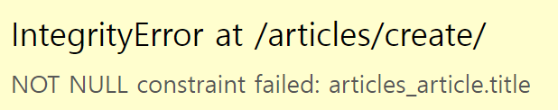

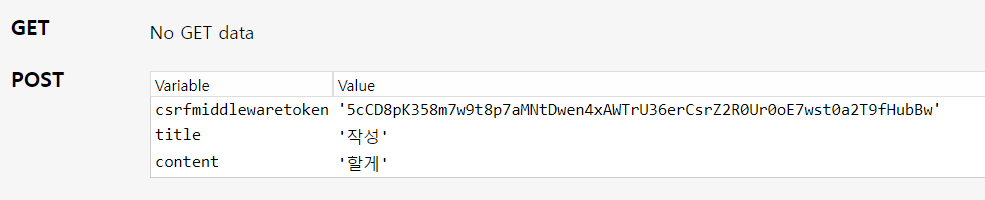

> 요청받는 데이터의 형식이 달라졌기 때문에 그럼
>
> POST의 요청을 받는데 정작 views의 create 함수는 여전히 기존의 GET 방식으로 데이터를 받고 있어서 에러가 발생하는 것

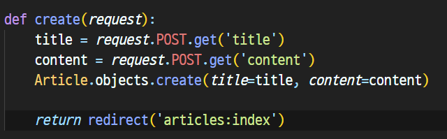

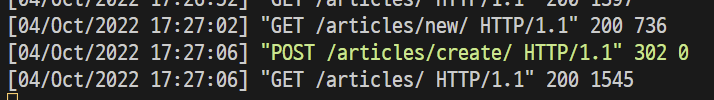

이전과 달리 title과 content의 내용이 보이지 않게 전송이 된다!!

> **GET은 가져오는 것이고 POST는 수행하는 것이다!**
>
> `GET`은 서버에서 어떤 데이터를 가져와서 보여준다거나 하는 용도이지 서버의 값이나 상태등을 바꾸지 않음. 게시판의 리스트라던지 글보기 기능 같은 것이 이에 해당
>
> 반면에 `POST`는 서버의 값이나 상태를 바꾸기 위해서 사용. 글쓰기를 하면 글의 내용이 디비에 저장이 되고 수정을 하면 디비값이 수정이 되는 경우에 사용
>
> ❗이 둘의 차이를 잘 인지하자

<br>

### ⭐ Django ModelForm 활용하기

사용자가 입력한 값과 DB의 데이터 형식이 일치하는지 확인하는 `유효성 검증`이 반드시 필요하기 때문에 이전과 다르게 ModelForm을 사용해야함!

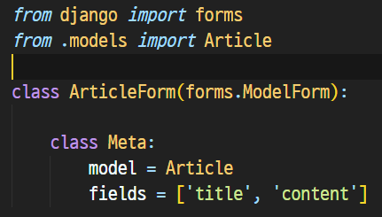

ModelForm의 인스턴스를 넘겨줘서 이전 input의 form태그를 대체할 수 있음!

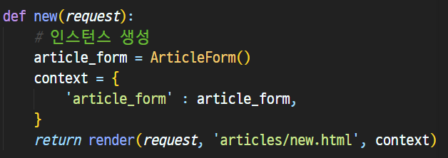

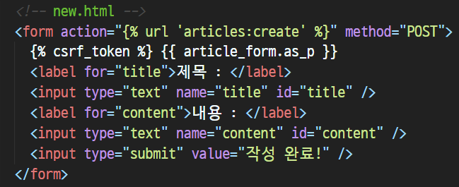

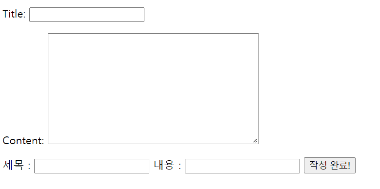

> new 함수에서 이제 인스턴스를 생성하고 context로 데이터를 넘겨주고, new.html에서는 이를 이용하기 위해 {{ article_form.as_p }}를 쓰면 기존의 긴 form 태그 코드를 대체할 수 있음(위가 ModelForm 활용)

이제 유효성 검증(validation)을 위해서 create 함수를 기존 방식에서 바꿔줘야함

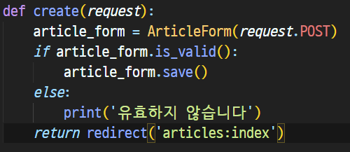

> article_form 자체를 `request.POST`로 가지고 온 다음 `.is_valid()`을 써서 유효한지 판단하고 유효하면 저장을, 그렇지 않으면 문장을 출력하게 함
>
> 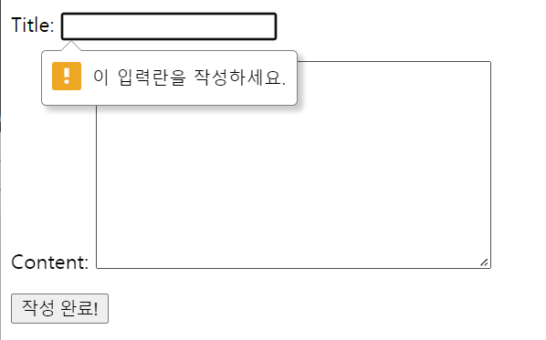
>
> 아무것도 입력하지 않은 채 제출하려하면 자동으로 `required` 설정이 들어가있음
>
> 개발자 도구를 이용해서 textarea의 required 부분을 삭제하고 강제로 제출하면 redirect는 실행되지만
>
> 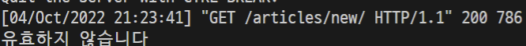
>
> 유효하지 않기 때문에 else 조건에 의해 문장이 출력이 됨

이제 if-else문을 활용해서 유효하지 않은 입력이 들어오면 처리를 어떻게 해줘야 하는가?

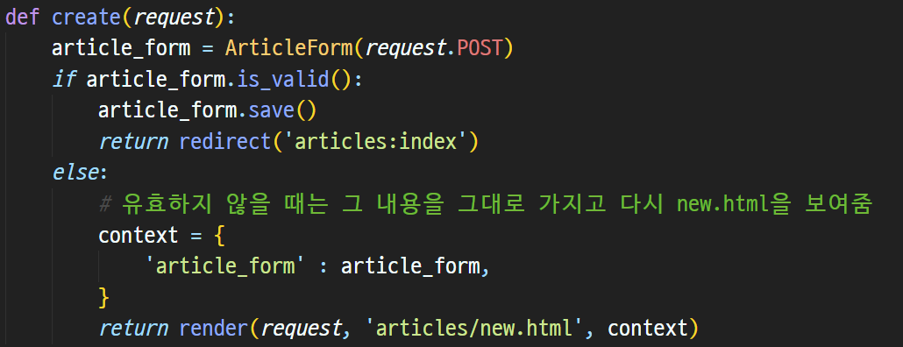

> 유효하지 않을 때는 그 값을 가지고 그대로 return을 해주는 방식을 사용

그런데 create를 이렇게 만들고 나니 new 함수와 매우 유사함을 알 수 있음

👉 new와 create를 하나로 합칠 수가 있음!

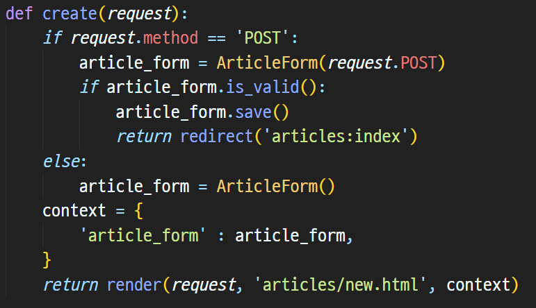

> new를 없애고 create에 합침
>
> request의 요청이 POST면 DB에 저장을 하는 것이기 때문에 유효한지 아닌지를 따진 후 저장을 하는 기존의 create 함수가 실행되면 되고,
>
> 그렇지 않은 경우(GET 요청)에는 기존의 new 함수가 실행이 되도록 하는것! (index.html에서 작성버튼을 눌렀을 때이고, 빈 form 생성 후 form을 context에 담아서 반환)
>
> ❗기존에 쓰던 new 경로는 create로 다 바꿔줘야함

<br>

### 4-3 상세보기

> 특정한 글을 본다.

> http://127.0.0.1:8000/articles/int:pk/

하나의 데이터를 특정하려면 유일한 값을 이용해서 구별할 수 있어야함 그것이 바로 pk!

```python
def detail(request, pk):
    article = Article.objects.get(pk = pk)
    context = {
        'article' : article,
    }
    return render(request, 'articles/detail.html', context)
```

```html
<p>{{ article.pk }}번 게시글</p>
<p>제목: {{ article.title }} 내용: {{ article.content }}</p>
<p>작성일자: {{ article.created_at.month }}월 {{ article.created_at.day }}일
   수정일자: {{ article.updated_at.month }}월 {{ article.updated_at.day }}일
</p>
```

>  pk로 값을 들고와서 context에 내용을 다 담고 detail.html 페이지로 return
>
> 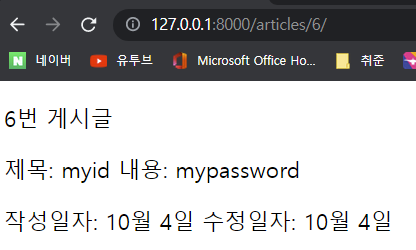

<br>

### 4-4 삭제하기

> 특정한 글을 삭제한다.

> http://127.0.0.1:8000/articles/int:pk/delete/

```python
def delete(request, pk):
    article = Article.objects.get(pk = pk)
    article.delete()
    return redirect('articles:index')
```

> 삭제는 get으로 가져온 뒤 삭제하고 그 정보를 반영하고 index.html을 redirect만 해주면 됨

<br>

### 4-5 수정하기

> 특정한 글을 수정한다. => 사용자에게 수정할 수 양식을 제공하고(GET) 특정한 글을 수정한다.(POST)

> http://127.0.0.1:8000/articles/int:pk/update/

update.html 파일을 만들고 detail 페이지에서 수정 버튼을 누르면 이동하도록 함

그런데 문제는 수정하기 버튼을 누르면 빈 form값으로 항상 초기화가 됨

짧은 글이면 몰라도 긴 글을 수정할 때는 처음부터 다시 쳐야하는 곤란함이 있으므로 이전 사항이 유지되면 좋겠음

```python
def update(request, pk):
    article = Article.objects.get(pk = pk)
    article_form = ArticleForm(instance = article)
    context = {
        'article_form' : article_form,
    }
    return render(request, 'articles/update.html', context)
```

> 특정 pk의 값을 article에 저장해두고 ArticleForm으로 modelForm을 형성한 instance가 article이라고 설정해두면 기존 값이 그대로 초기값이 됨
>
> 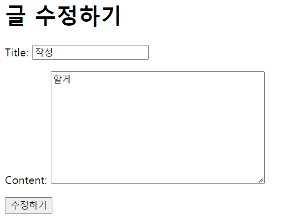

이제 수정하기 버튼을 누른 뒤 다시 update 페이지로 돌아오는 것이 아니라 POST 요청일 때 DB에 수정된 값을 반영하는 작업을 해줘야함

```python
def update(request, pk):
    # DB에서 pk 값이 같은 데이터를 가져옴
    article = Article.objects.get(pk = pk)

    if request.method == 'POST':
        # POST : input 값 가져와서, 검증하고, DB에 저장
        article_form = ArticleForm(request.POST, instance = article)
        
        # 유효성 검사 통과하면 저장하고 상세보기 페이지로
        if article_form.is_valid():
            article_form.save()
            return redirect('articles:detail', article.pk)

    # 통과 못하면 해당 pk의 인스턴스를 return한다.
    else:
        article_form = ArticleForm(instance = article)
    context = {
        'article' : article,
        'article_form' : article_form,
    }
    return render(request, 'articles/update.html', context)
```


