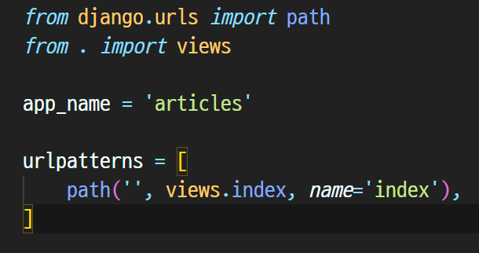
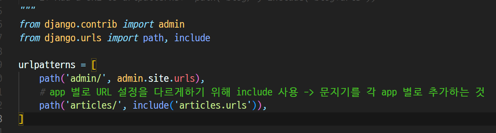
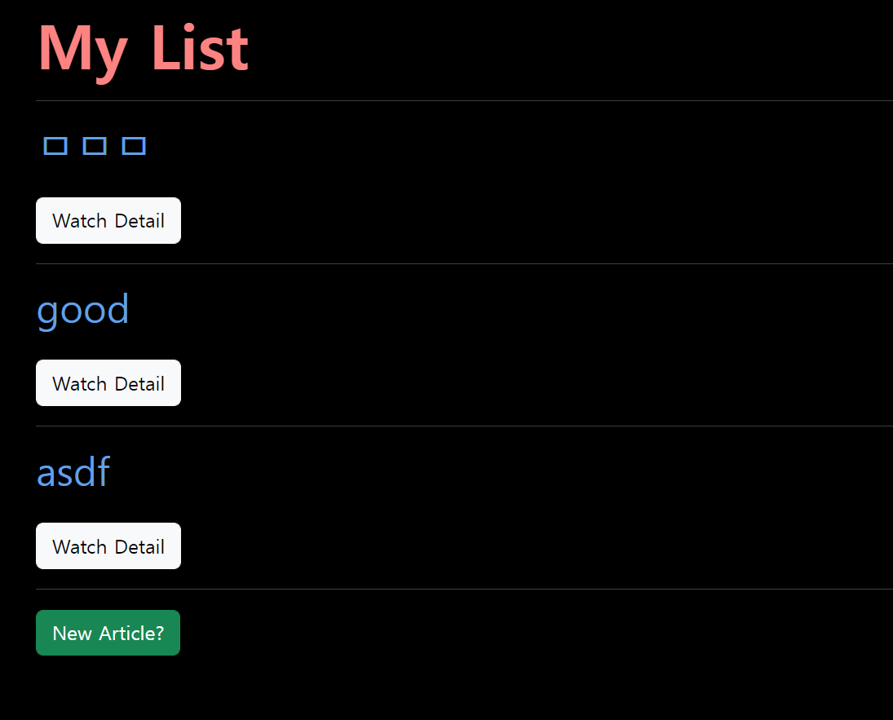
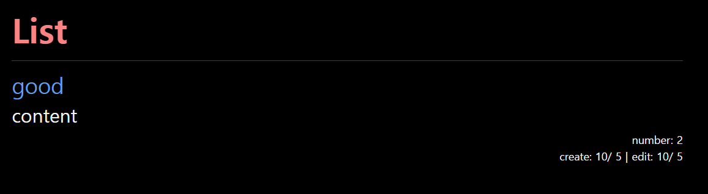
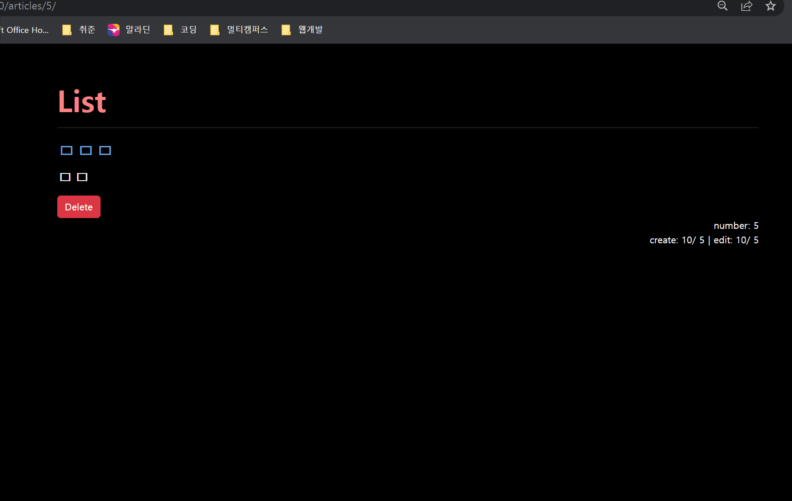
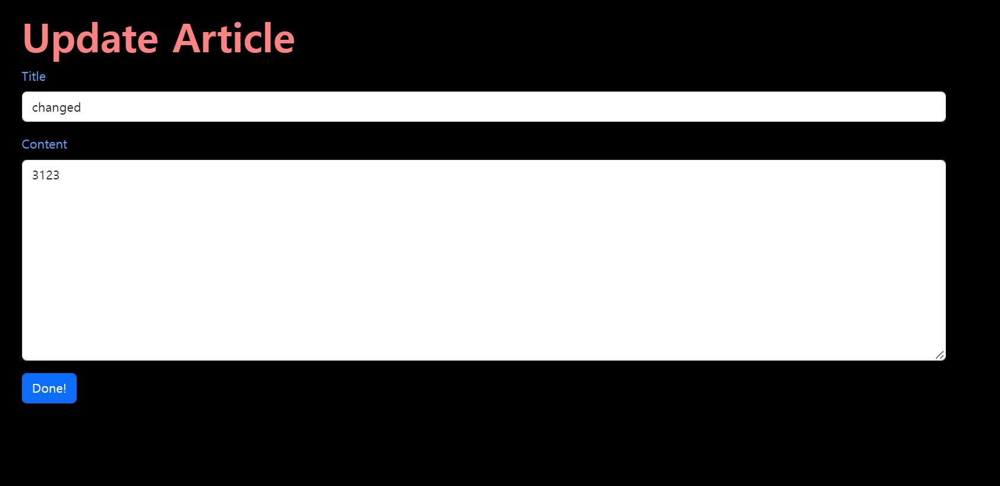

# ⚙️Django CRUD 흐름 정리

## 1. 가상환경 및 Django 설치

### 1-1 가상환경 생성 및 실행

- 가상환경 폴더를 `.gitignore`로 설정을 해둔다.

```
$ python -m venv venv
$ source venv/Scripts/activate
(venv) $
```

### 1-2 Django 설치 및 기록

```
$ pip install django==3.2.13
$ pip freeze > requirements.txt
```

### 1-3 Django 프로젝트 생성

```
$ django-admin startproject pjt .
```

<br>

## 2. articles app

### 2-1 app 생성

```django
python manage.py startapp articles .
```

### 2-2 app 등록

settings.py에 가서 INSTALLED_APPS 리스트 최상단에 apps 이름(articles)를 작성 

### 2-3 urls.py 설정





> articles의 urls.py에는 기본 페이지를 index 함수로 설정하고, app_name을 지정해줌
>
> 이걸 이용해서 전체 pjt의 urls.py에 가서 include를 활용해서 articles의 url만 따로 관리할 수 있게 설정

<br>

## 3. Model 정의 (DB 설계)

### 3-1 클래스 정의


> 제목, 내용, 작성시간, 수정시간이 필요하고 각각 알맞는 field와 조건들을 추가

### 3-2 마이그레이션 파일 생성

```
python manage.py makemigrations
```

### 3-3 DB 반영(`migrate`)

```
python manage.py migrate
```

<br>

## 4. CRUD 기능 구현

### 4-1 게시글 생성

> 사용자에게 HTML Form 제공, 입력받은 데이터를 처리 (ModelForm 로직으로 변경)

#### 1. HTML Form 제공

> http://127.0.0.1:8000/articles/new/

#### 2. 입력받은 데이터 처리

> http://127.0.0.1:8000/articles/create/

이번에는 한번에 작성해보도록 하겠다

이제까진 create, new 만들고 input form을 ModelForm으로 바꾸고 create함수와 new 함수를 합치는 방식으로 했는데 이젠 if-else문으로 한번에 바꿀 수 있음!

```python
def create(request):
    # 제출 버튼을 눌러서 method가 POST 라면
    if request.method == 'POST':
        article_form = ArticleForm(request.POST)
        # 유효성 검사를 진행 유효하면 저장하고 index 페이지로 redirect
        if article_form.is_valid():
            article_form.save()
            return redirect('articles:index')
    else:
        # 버튼을 누른게 아니라면 초기 화면인 빈 상태
        # 그렇기 때문에 빈 form을 만들고 context로 넘겨준다
        article_form = ArticleForm()

    # 요청이 POST인데 유효성 검사에 실패를 하면 기존에 잘못 입력한 값들은
    # 그대로 유지하고 싶기 때문에 form에 넣어서 데이터를 넘겨줌
    context = {
        'article_form' : article_form,
    }
    return render(request, 'articles/create.html', context)
```

index.html

```html





<link rel="stylesheet" href="" />



<div class="index-container">
  <h1 class="index-title">My List</h1>
  <hr style="color:white">
  
    <h2>{{ article.title }}</h2>
    <div>
      <button type="button" class="btn btn-light mt-3" href="">Watch Detail</button>
    </div>
    <hr style="color:white">
  
  <a href="">
    <button type="button" class="btn btn-success" >New Article?</button>
  </a>
</div>


```

> bootstrap의 form을 이용해서 style을 줌
>
> 이를 이용하기 위해 `` 처리를 해줘야함



<br>

### 4-3 상세보기

> 특정한 글을 본다.

> http://127.0.0.1:8000/articles/int:pk/

```python
def detail(request, pk):
    article = Article.objects.get(pk = pk);
    context = {
        'article' : article, 
    }
    return render(request, 'articles/detail.html', context)
```

index.html에 링크 기능을 넣은 버튼을 추가

```html
<a href="">
  <button type="button" class="btn btn-light mt-3">Watch Detail</button>
</a>
```



<br>

### 4-4 삭제하기

> 특정한 글을 삭제한다.

> http://127.0.0.1:8000/articles/int:pk/delete/

마찬가지로 pk로 특정 데이터를 긁어온다음 delete() 후 redirect 해주면 됨

modal로 만들어 봄

```html
<!-- 삭제 버튼 -->
<!-- Button trigger modal -->
<button type="button" class="btn btn-danger" data-bs-toggle="modal" data-bs-target="#staticBackdrop">
    Delete
</button>

<!-- Modal -->
<div class="modal fade" id="staticBackdrop" data-bs-backdrop="static" data-bs-keyboard="false" tabindex="-1" aria-labelledby="staticBackdropLabel" aria-hidden="true">
    <div class="modal-dialog">
        <div class="modal-content">
            <div class="modal-header">
                <h1 class="modal-title fs-5" id="staticBackdropLabel">Warning</h1>
                <button type="button" class="btn-close" data-bs-dismiss="modal" aria-label="Close"></button>
            </div>
            <div class="modal-body">
                Do you really want to delete it?
            </div>
            <div class="modal-footer">
                <a href="">
                    <button type="button" class="btn btn-primary">Yes</button>
                </a>
                <button type="button" class="btn btn-secondary" data-bs-dismiss="modal">No</button>
            </div>
        </div>
    </div>
</div>
```



<br>

### 4-5 수정하기

> 특정한 글을 수정한다. => 사용자에게 수정할 수 양식을 제공하고(GET) 특정한 글을 수정한다.(POST)

> http://127.0.0.1:8000/articles/int:pk/update/

update.html로 넘겨줄때 url 뒤에 article.pk 추가하는거 잊지말자!

```python
def update(request, pk):
    # 일단 가져와서 바꿔줘야함
    article = Article.objects.get(pk = pk)
    # POST 요청과 유효함이 통과할 때만 바꿔서 저장
    if request.method == 'POST':
        article_form = ArticleForm(request.POST, instance = article)
        if article_form.is_valid():
            article_form.save()
            return redirect('articles:detail', article.pk)

    # POST 요청이 아닌 경우는 처음 페이지를 render 했을 때임
    # 그렇기 때문에 이전에 작성한 데이터를 그대로 제공
    else:
        article_form = ArticleForm(instance = article)
    context = {
        'article_form' : article_form, 
    }
    return render(request, 'articles/update.html', context)
```

```html

<div class="update-container">
  <h1>Update Article</h1>
  <form action="" method="POST">
    
    <div class="create-form"></div>
    
    
  </form>
</div>

```



> ❗form태그의 action속성이 없는 경우는 현재의 페이지로 전송된다!!
>
> update.html에서 action 을 ''으로 두면 그대로 update.html로 전송되고, update.html페이지에 해당하는 view함수를 설정했기 때문에 그대로 실행되는 것

<br>
