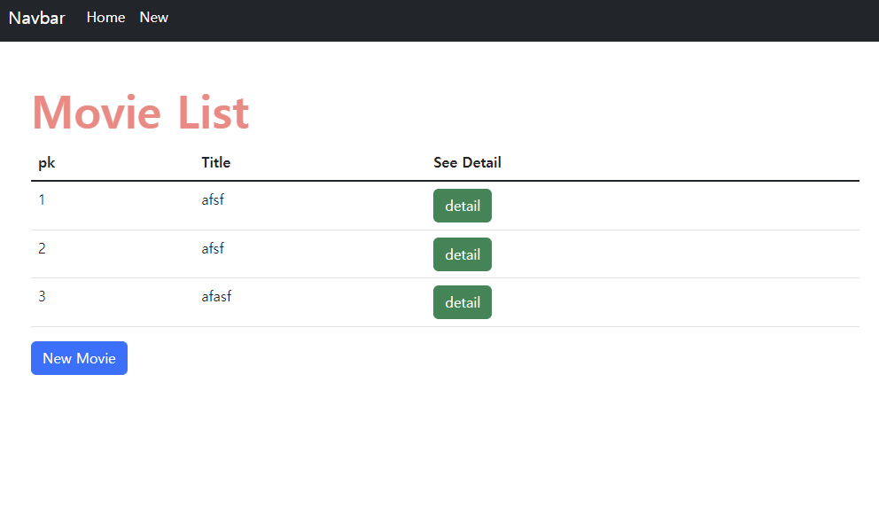
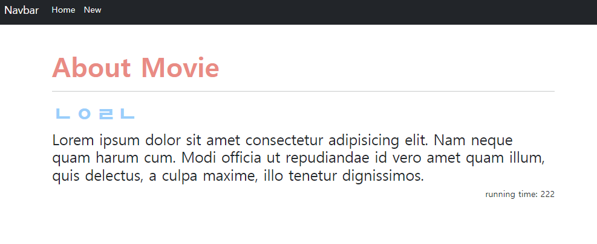
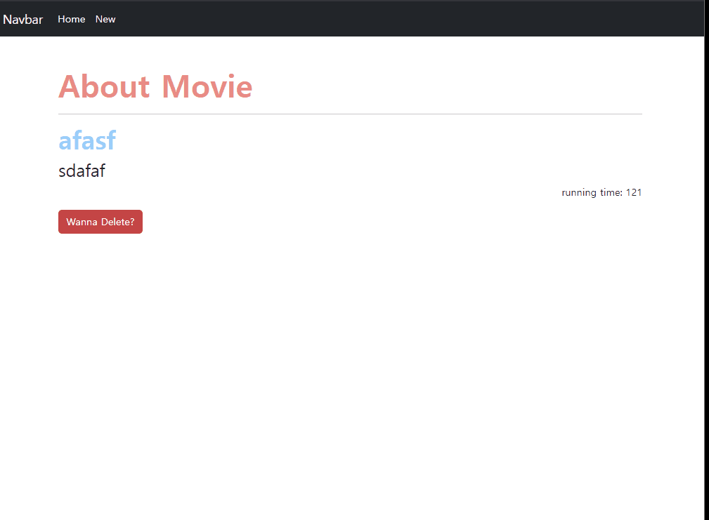
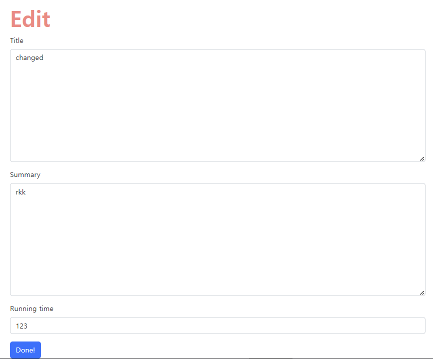

# ⚙️영화 정보 제공 서비스

## 1. 가상환경 및 Django 설치

### 1-1 가상환경 생성 및 실행

- 가상환경 폴더를 `.gitignore`로 설정을 해둔다.

```
$ python -m venv venv
$ source venv/Scripts/activate
(venv) $
```

### 1-2 Django 설치 및 기록

```
$ pip install django==3.2.13
$ pip freeze > requirements.txt
```

### 1-3 Django 프로젝트 생성

```
$ django-admin startproject pjt .
```

<br>

## 2. articles app

### 2-1 app 생성

```django
python manage.py startapp movies .
```

### 2-2 app 등록

settings.py에 가서 INSTALLED_APPS 리스트 최상단에 apps 이름(movies)를 작성 

### 2-3 urls.py 설정

```python
from django.urls import path
from . import views

app_name = 'movies'

urlpatterns = [
    path('', views.index, name='index'),
]
```

<br>

## 3. Model 정의 (DB 설계)

### 3-1 클래스 정의

> 제목, 줄거리, 영화 상영 시간이 필요하고 각각 알맞는 field와 조건들을 추가

```python
from django.db import models

class Movie(models.Model):
    title = models.TextField()
    summarty = models.TextField()
    running_time = models.IntegerField()
```

### 3-2 마이그레이션 파일 생성

```
python manage.py makemigrations
```

### 3-3 DB 반영(`migrate`)

```
python manage.py migrate
```

<br>

## 4. CRUD 기능 구현

### 🧩영화 데이터 목록 조회

> http://127.0.0.1:8000/movies/

ModelForm으로 입력받고 데이터를 DB에 저장하면, 그 DB에 있는 데이터들을 다 긁어와서 index.html 페이지가 실행될때마다 보여주도록 설정

```django

  <div class="container">
    <h1>Movie List</h1>
    
      {{ movie.title }}
    
    <a href="">
      <button type="button" class="btn btn-primary">New Movie</button>
    </a>
  </div>

```

```python
def index(request):
    movies = Movie.objects.all().order_by('pk')
    context = {
        'movies' : movies,
    }
    return render(request, 'movies/index.html', context)
```

> 일단 create로 넘어가는 버튼까지 생성
>
> base.html에 상속을 받기 때문에 항상   안에 내용들 써야함 👉 저 안의 코드들이 base.html로 넘어가서 최종적으로 화면이 보여지는 것!

<br>

### 🧩영화 데이터 생성

> 사용자에게 HTML Form 제공, 입력받은 데이터를 처리 (ModelForm 로직으로 변경)

> http://127.0.0.1:8000/movies/create/

```python
from django import forms
from .models import Movie

class MovieForm(forms.ModelForm):

    class Meta:
        model = Movie
        fields = ['title', 'summary', 'running_time']
```

> models.py를 바탕으로 forms.py를 작성

```python
def create(request):
    if request.method == 'POST':
        movie_form = MovieForm(request.POST)
        if movie_form.is_valid():
            movie_form.save()
            return redirect('articles:index')
    else:
        movie_form = MovieForm()
        
    context = {
        'movie_form': movie_form,
    }
    return render(request, 'movies/create.html', context)
```

```django





<link rel="stylesheet" href="" />



  <div class="container">
    <h1>About New Movie</h1>
    <form action="" method="POST">
      
      <div></div>
      
    </form>
  </div>

```

> create.html 설정
>
> bootstrap의 form을 이용해서 style을 줌
>
> 이를 이용하기 위해 `` 처리를 해줘야함




<br>

### 🧩영화 데이터 정보 조회

> 특정한 데이터를 본다.

> http://127.0.0.1:8000/movies/int:pk/

```python
def detail(request, pk):
    movie = Movie.objects.get(pk=pk)
    context = {
        'movie' : movie,
    }
    return render(request, 'movies/detail.html', context)
```

```html





<link rel="stylesheet" href="" />



<div class="container"> 
  <h1>About Movie</h1>
  <hr>
  <h2>{{ movie.title }}</h2>
  <h3>{{ movie.summary }}</h3>
  <p class="text-end">running time: {{ movie.running_time }}</p>
</div>

```



<br>

### 🧩영화 데이터 삭제

> 특정한 글을 삭제한다.

> http://127.0.0.1:8000/movies/int:pk/delete/

마찬가지로 pk로 특정 데이터를 긁어온다음 delete() 후 redirect 해주면 됨

detail 페이지에서 기능

modal로 만들어 봄

```django
 삭제 버튼 with 모달 
    <!-- Button trigger modal -->
    <div class="delete-btn">
      <button type="button" class="btn btn-danger" data-bs-toggle="modal" data-bs-target="#exampleModal">
        Wanna Delete?
      </button>
      <!-- Modal -->
      <div class="modal fade" id="exampleModal" tabindex="-1" aria-labelledby="exampleModalLabel" aria-hidden="true">
        <div class="modal-dialog">
          <div class="modal-content">
            <div class="modal-header">
              <h1 class="modal-title fs-5" id="exampleModalLabel">Warning</h1>
              <button type="button" class="btn-close" data-bs-dismiss="modal" aria-label="Close"></button>
            </div>
            <div class="modal-body">
              Do you really want to delete it?
            </div>
            <div class="modal-footer">
              <a href="">
                <button type="button" class="btn btn-primary">Yes</button>
              </a>  
              <button type="button" class="btn btn-secondary" data-bs-dismiss="modal">No</button>
            </div>
          </div>
        </div>
      </div>
    </div>
```



<br>

### 🧩영화 데이터 수정

> 특정한 글을 수정한다. => 사용자에게 수정할 수 양식을 제공하고(GET) 특정한 글을 수정한다.(POST)

> http://127.0.0.1:8000/movies/int:pk/update/

update와 create는 유사하기 때문에 한번에 처리가 가능!

```python
def update(request, pk):
    movie = Movie.objects.get(pk = pk)
    if request.method == 'POST':
        movie_form = MovieForm(request.POST, instance = movie)
        if movie_form.is_valid():
            movie_form.save()
            return redirect('movies:detail', movie.pk)
    else:
        movie_form = MovieForm(instance = movie)
    context = {
        'movie_form' : movie_form,
    }
    return render(request, 'movies/update.html', context)
```

```html

  <div class="container">
    <h1>Edit</h1>
    <form action="" method="POST">
      
      <div></div>
      
    </form>
  </div>

```




<br>
