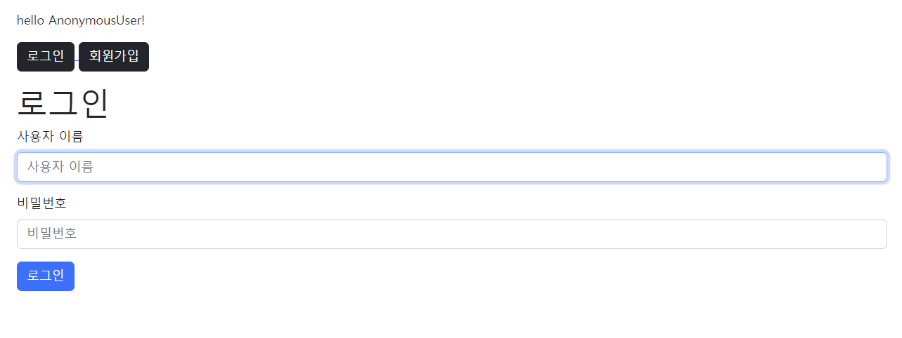
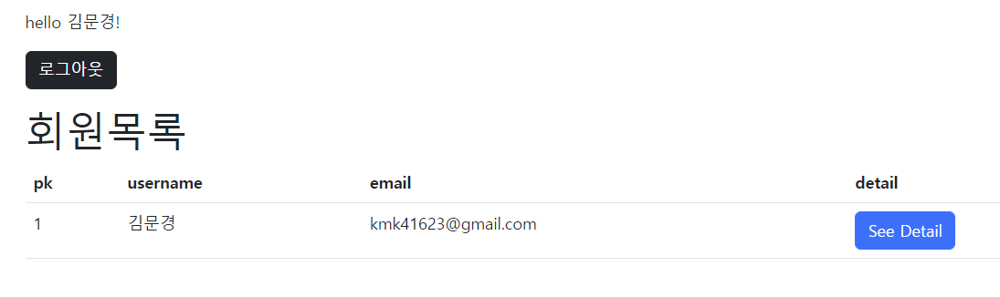

# ⚙️회원 가입 서비스 + 로그인/로그아웃

## 1. 가상환경 및 Django & 사전 설정

### 🧩 가상환경 생성 및 실행

- 가상환경 폴더를 `.gitignore`로 설정을 해둔다.

```
$ python -m venv venv
$ source venv/Scripts/activate
(venv) $
```

<br>

### 🧩 Django 설치 및 기록

```
$ pip install django==3.2.13
$ pip freeze > requirements.txt
```

<br>

### 🧩 Django 프로젝트 생성

```
$ django-admin startproject pjt .
```

<br>

### 🧩 accounts app 생성 및 등록

```
$ pip manage.py startapp accounts
```

```
# settings.py

INSTALLED_APPS = [
	'articles', # 기존 CRUD app
	'accounts', # 새로 추가할 app
]
```

> auth와 관련한 경로나 키워드들을 Django 내부적으로 accounts라는 이름으로 사용하고 있기 때문에 되도록 accounts로 지정하는 것을 권장
>
> 다른 이름으로 설정해도 되지만 나중에 추가 설정을 해야 할 일들이 생기게 됨

<br>

### 🧩 URL 분리 및 mapping

```python
# accounts/urls.py

from django.urls import path
from . import views

app_name = 'accounts'
urlpatterns = [
]
```

```python
# pjt/urls.py

urlpatterns = [
    ...
    path('accounts/', include('accounts.urls')),
]
```

<br>

## 2. Model & Form 형성

### 🧩 Model 상속 받기

```python
# accounts/models.py

from django.db import models
from django.contrib.auth.models import AbstractUser

# Create your models here.
class User(AbstractUser):
    pass
```

> Django의 AbstractUser를 상속받아서 User 모델을 만든다

<br>

### 🧩 회원가입 Form 만들기

```python
# accounts/forms.py

from django.contrib.auth.forms import UserCreationForm
from django.contrib.auth import get_user_model

class CustomUserCreationForm(UserCreationForm):

    class meta:
        model = get_user_model()
        fields = ('name', 'email', 'password1', 'password2')
```

> 내장 회원가입 폼인 UserCreationForm을 상속받은 CustomUserCreationForm을 사용
>
> User 모델을 사용하기 위해 models.py에서 User를 import 해옴
>
> models에서 User를 가져와서 쓰는대신 DB를 중간에 바꾸더라도 큰 문제가 안생기는(귀찮지 않은) get_user_model을 내부에서 끌어와서 사용

<br>

## 3. 기능 만들기(View & Template)

### 🧩 회원가입(Create)

http://127.0.0.1:8000/accounts/signup/

CustomUserCreationForm을 활용

```django

<h1>회원가입</h1>
<form action="" method="POST">
  
  
  
</form>

```

```python
# views.py

def signup(request):
    if request.method == 'POST':
        form = CustomUserCreationForm(request.POST)
        if form.is_valid():
            form.save()
            return redirect('accounts:index')
    else:
        form = CustomUserCreationForm()
    context = {
        'form' : form,
    }
    return render(request, 'accounts/signup.html', context)
```

> 기존 방식에서는 model을 직접 정의해서 ModelForm을 상속받은 User로 썼지만, 이제는 UserCreationForm을 상속받은 CustomUserCreationForm을 사용함

<br>

### 🧩 회원 목록 조회(Read)

http://127.0.0.1:8000/accounts/

```python
def index(request):
    users = get_user_model().objects.all()
    context = {
        'users': users
    }
    return render(request, 'accounts/index.html', context)
```

```django

<h1>회원목록</h1>
<table class="table">
  <thead class="fw-bold">
    <tr>
      <th scope="col">pk</th>
      <th scope="col">username</th>
      <th scope="col">email</th>
      <th scope="col">detail</th>
    </tr>
  </thead>
  <tbody>
  
    <tr>
      <td>{{ user.pk }}</td>
      <td>{{ user.username }}</td>
      <td>{{ user.email }}</td>
      <td><a href="">
        <button type="button" class="btn btn-primary">See Detail</button>
      </a></td>
    </tr>
  </tbody>
  
</table>

```

> User 참조할 때 get_user_model()를 사용한다

<br>

### 🧩 회원 상세 정보 조회(Read)

 http://127.0.0.1:8000/accounts/<user_pk>/

```
def detail(request, pk):
    user = get_user_model().objects.get(pk=pk)
    context = {
        'user' : user,
    }
    return render(request, 'accounts/detail.html', context)
```

```django

<h1 class="mb-3"><span>{{ user.username }}</span>님 회원 정보</h1>
<p><span class="fw-bold">ID</span>: {{ user.pk }}</p>
<p><span class="fw-bold">name</span>: {{ user.username }}</p>
<p><span class="fw-bold">email</span>: {{ user.email}}</p>

```

<br>

### 🧩 로그인

 http://127.0.0.1:8000/accounts/login/

```
def login(request):
    if request.method == 'POST':
        form = AuthenticationForm(request, data = request.POST)
        if form.is_valid():
            auth_login(request, form.get_user())
            return redirect(request.GET.get('next') or 'accounts:index')
    else:
        form = AuthenticationForm()
    context = {
        'form' : form,
    }
    return render(request, 'accounts/login.html', context)
```

```django

<h1>로그인</h1>
<form action="" method="POST">
  
  
  
</form>

```





> 로그인은 AuthenticationForm을 사용하고 유효한 사용자 정보라면 로그인 처리를 해주는 것
>
> *from* django.contrib.auth *import* login을 통해 장고 안에 있는 login 함수 기능을 씀

<br>

### 🧩 로그아웃

 http://127.0.0.1:8000/accounts/logout/

```
def logout(request):
    auth_logout(request)
    return redirect('accounts:index')
```

> 로그인과 마찬가지로 django.contrib.auth에서 logout 함수를 import해서 사용

<br>
