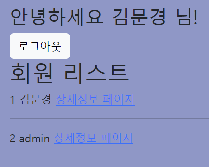
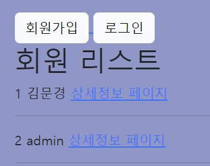
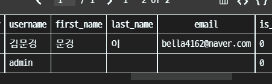

# ⚙️회원 가입 서비스 + 로그인/로그아웃

## 1. 가상환경 및 Django & 사전 설정

### 🧩 가상환경 생성 및 실행

- 가상환경 폴더를 `.gitignore`로 설정을 해둔다.

```
$ python -m venv venv
$ source venv/Scripts/activate
(venv) $
```

<br>

### 🧩 Django 설치 및 기록

```
$ pip install django==3.2.13
$ pip freeze > requirements.txt
```

<br>

### 🧩 Django 프로젝트 생성

```
$ django-admin startproject pjt .
```

<br>

### 🧩 accounts app 생성 및 등록

```
$ pip manage.py startapp accounts
```

```
# settings.py

INSTALLED_APPS = [
	'articles', # 기존 CRUD app
	'accounts', # 새로 추가할 app
]
```

> auth와 관련한 경로나 키워드들을 Django 내부적으로 accounts라는 이름으로 사용하고 있기 때문에 되도록 accounts로 지정하는 것을 권장
>
> 다른 이름으로 설정해도 되지만 나중에 추가 설정을 해야 할 일들이 생기게 됨

<br>

### 🧩 URL 분리 및 mapping

```python
# accounts/urls.py

from django.urls import path
from . import views

app_name = 'accounts'
urlpatterns = [
]
```

```python
# pjt/urls.py

urlpatterns = [
    ...
    path('accounts/', include('accounts.urls')),
]
```

<br>

## 2. Model & Form 형성

### 🧩 Model 상속 받기

```python
# accounts/models.py

from django.db import models
from django.contrib.auth.models import AbstractUser

# Create your models here.
class User(AbstractUser):
    pass
```

> Django의 AbstractUser를 상속받아서 User 모델을 만든다

<br>

### 🧩 회원가입 Form + 회원 정보 수정 Form 만들기

```python
# accounts/forms.py

from django.contrib.auth.forms import UserCreationForm, UserChangeForm
from django.contrib.auth import get_user_model

class CustomUserCreationForm(UserCreationForm):

    class meta:
        model = get_user_model()
        fields = ('username', 'password1', 'password2')

class CustomUserChangeForm(UserChangeForm):

    class meta:
        model = get_user_model()
        fields = ('first_name', 'last_name', 'email')
```

> 내장 회원가입 폼인 **UserCreationForm**을 상속받은 **CustomUserCreationForm**을 사용
>
> 그리고 또다른 내장폼인 **UserChangeForm**을 상속받은 **CustomUserChangeForm**을 사용
>
> models에서 User를 가져와서 쓰는대신 DB를 중간에 바꾸더라도 큰 문제가 안생기는(귀찮지 않은) **get_user_model**을 내부에서 끌어와서 사용

<br>

## 3. 기능 만들기(View & Template)

### 🧩 회원가입(Create)

http://127.0.0.1:8000/accounts/signup/

**CustomUserCreationForm**을 활용

```django

<h1>회원 리스트</h1>

  {{ user.pk }}
  {{ user.username }}


```

```python
# views.py

def signup(request):
    if request.method == 'POST':
        form = CustomUserCreationForm(request.POST)
        if form.is_valid():
            form.save()
            return redirect('accounts:index')
    else:
        # GET 방식(처음 들어가거나, 새로고침같은)이면 빈 폼으로
        form = CustomUserCreationForm()
    context = {
        'form': form,
    }
    return render(request, 'accounts/signup.html', context)
```

> 기존 방식에서는 model을 직접 정의해서 ModelForm을 상속받은 User로 썼지만, 이제는 UserCreationForm을 상속받은 CustomUserCreationForm을 사용함

<br>

### 🧩 회원 목록 조회(Read)

http://127.0.0.1:8000/accounts/

```python
def index(request):
    users = get_user_model().objects.all()
    context = {
        'users': users
    }
    return render(request, 'accounts/index.html', context)
```

```django

<h1>회원 리스트</h1>

  {{ user.pk }}
  {{ user.username }}


```

> User 참조할 때 get_user_model()를 사용한다

<br>

### 🧩 회원 상세 정보 조회(Read)

 http://127.0.0.1:8000/accounts/<user_pk>/

```
def detail(request, pk):
    user = get_user_model().objects.get(pk = pk)
    context = {
        'user' : user,
    }
    return render(request, 'accounts/detail.html', context)
```

```django

<h1>회원정보</h1>
{{ user.username }}

```

<br>

### 🧩 로그인

 http://127.0.0.1:8000/accounts/login/

```
def login(request):
    if request.method == 'POST':
        form = AuthenticationForm(request, data = request.POST)
        if form.is_valid():
            auth_login(request, form.get_user())
            return redirect(request.GET.get('next') or 'accounts:index')
    else:
        form = AuthenticationForm()
    context = {
        'form' : form,
    }
    return render(request, 'accounts/login.html', context)
```

```django

<h1>로그인</h1>
<form action="" method="POST">
  
  
  
</form>

```

> 로그인은 **AuthenticationForm**을 사용하고 유효한 사용자 정보라면 로그인 처리를 해주는 것
>
> *from* django.contrib.auth *import* login을 통해 장고 안에 있는 login 함수 기능을 씀

<br>

### 🧩 로그아웃

 http://127.0.0.1:8000/accounts/logout/

```
def logout(request):
    auth_logout(request)
    return redirect('accounts:index')
```

> 로그인과 마찬가지로 django.contrib.auth에서 logout 함수를 import해서 사용

```django
<div class="container my-5">
     조건문 분기 처리를 통해 버튼들을 전부 나오거나 일부만 나오게 처리 
    
    <h2>안녕하세요 {{ user }} 님!</h2>
    <a href="">
      <button type="button" class="btn btn-light">로그아웃</button>
    </a>
    
    <a href="">
      <button type="button" class="btn btn-light">회원가입</button>
    </a>
    <a href="">
      <button type="button" class="btn btn-light">로그인</button>
    </a>
    
    
</div>
```

> base.html에서 `.is_authenticated`를 활용해서 사용자가 인증된 상태(로그인을 한 상태)이거나 아닐때를 조건문으로 나누어서
>
> 보여지는 버튼이 다르게 둘 수 있음!
>
> 
>
> 
>
> 

<br>

### 🧩 회원 정보 수정

 http://127.0.0.1:8000/accounts/update/

회원 정보 수정을 위해서는 django 내장돼있는 **UserChangeForm**을 사용해야함

```python
# accounts/forms.py

from django.contrib.auth import get_user_model
from django.contrib.auth.forms import UserCreationForm, UserChangeForm

class CustomUserChangeForm(UserChangeForm):

    class Meta:
        model = get_user_model()
        fields = ('first_name', 'last_name', 'email')
```

```python
def update(request):
    if request.method == 'POST':
        form = CustomUserChangeForm(request.POST, instance = request.user)
        if form.is_valid():
            form.save()
            return redirect('accounts:index')
    # 처음 페이지 들어올때는 이전에 작성했던 그대로 유지해야함
    else:
        form = CustomUserChangeForm(instance = request.user)
    context = {
        'form' : form,
    }
    return render(request, 'accounts/update.html', context)
```

>UserChangeForm을 상속받은 **CustomUserChangeForm**을 사용
>
>입력한 그대로 사용하기 위해 instance = request.user를 사용
>
>
>
>회원 정보 변경 후 DB에 가보면 이전에 없던 first_name과 last_name, email이 추가로 작성한 그대로 저장돼있는 모습!

<br>
