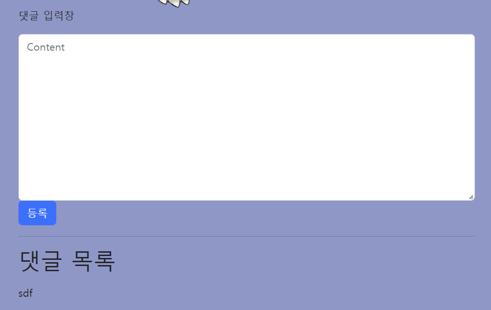
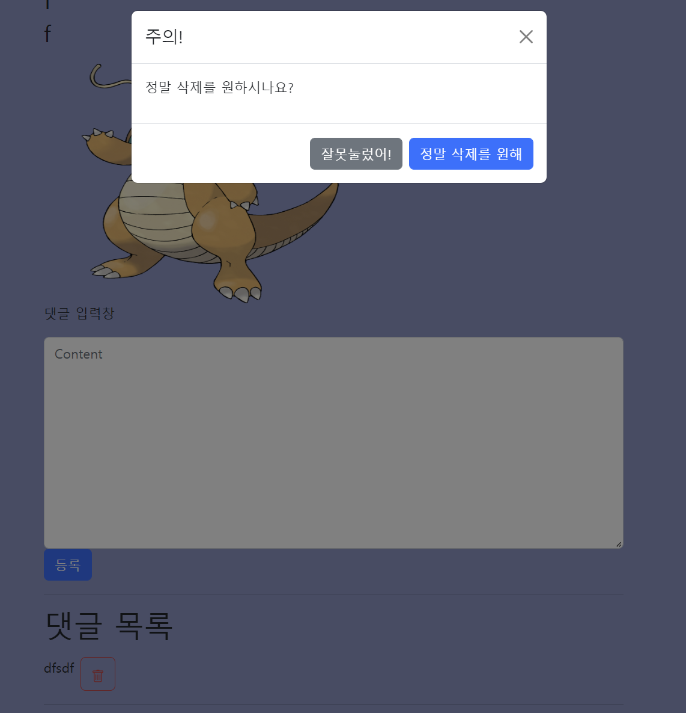
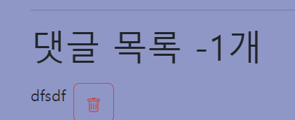

# ⚙️댓글 작성 서비스

## 1. Comment 모델 생성

```python
# accounts/models.py

class Comment(models.Model):
    content = models.TextField()
    created_at = models.DateTimeField(auto_now_add=True)
    article = models.ForeignKey(Article, on_delete=models.CASCADE)
```

> models.Model을 상속받는 새로운 Comment 모델을 만들기
>
> content, created_at, article(참조 게시물) field를 만들어준다

```shell
$ python manage.py makemigrations
$ python manage.py migrate
```

> DB 반영 (가상환경 켰는지 확인 필수)
>
> DB에 articles_comment 생성되었는지 확인

```python
# articles/admin.py

'''
댓글을 관리자 페이지에서 확인하거나
개별적으로 생성, 삭제 가능하도록 등록하고 커스텀
'''

from django.contrib import admin
from .models import Article, Comment

class ArticleAdmin(admin.ModelAdmin):
    list_display = ('title', 'created_at', 'updated_at')

class CommentAdmin(admin.ModelAdmin):
    list_display  = ('content', 'created_at', 'article')

admin.site.register(Article, ArticleAdmin)
admin.site.register(Comment, CommentAdmin)
```

<br>

## 2. 관계 모델 참조

### 2-1. 역참조 모델 이해하기


> X번 게시글에 작성된 모든 댓글을 조회하려면, 외래키를 이용해서 X번 게시글을 참조하고 있는 댓글들을 쿼리셋으로 묶어서 모두 받아와야 함
>
> 이걸 가능하게 만들어주는 코드가 `b.a_set.all`

<br>

### 2-2. detail.html에 댓글 목록을 출력

```python
# articles/views.py

def detail(request, pk):
    article = Article.objects.get(pk=pk)
    context = {
        'article': article,
        'comments': article.comment_set.all(),
    }
    return render(request, 'articles/detail.html', context)
```

```html
<!-- articles/templates/articles/detail.html -->

<!-- Comments -->
  <hr class="my-5">
  
    <p>{{ comment.content }}</p>
    <hr>
    
    <p>안녕하십니까? 댓글이 없는 곳에 번개처럼 나타나는 무플방지위원회입니다.
      <br>
      -무플방지위원회일동-
      <br>
      &nbsp;（｡･ω･｡)つ━☆・*。<br>
      ⊂ &nbsp;&nbsp;&nbsp;&nbsp;&nbsp;&nbsp;ノ ・゜+.<br>
      &nbsp;&nbsp;しー&nbsp;Ｊ °。+ *</p>
  
```

> 반복문 안에 생성된 댓글이 없는 경우, 위와 같이 `` 코드를 활용하자

<br>

## 3. 댓글 작성(Create)

> 사용자에게 form을 제공해 주는 곳이 게시글 상세 페이지(detail.html)니까, detail 함수에서 **CommentForm**을 넘겨주고 새로운 url & 함수 생성해서 댓글이 저장되는 로직 구현

### 3-1. CommentForm 생성

모델폼 상속받아서 CommentForm 생성

```python
# articles/forms.py

from django import forms
from .models import Article, Comment

class ArticleForm(forms.ModelForm):
    class Meta:
        model = Article
        fields = '__all__'
        labels = {
            'title': '제목',
            'content' : '내용',
            'image' : '이미지',
    }

class CommentForm(forms.ModelForm):
    class Meta:
        model = Comment 
        fields = ['content']
```

<br>

### 3-2. views.py에서 detail함수에 comment_form 넘기기

```python
# articles/views.py

from .forms import ArticleForm, CommentForm

def detail(request, pk):
    article = Article.objects.get(pk=pk)
    comment_form = CommentForm()
    context = {
        'article': article,
        'comments': article.comment_set.all(),
        'comment_form': comment_form,
    }
    return render(request, 'articles/detail.html', context)
```

```html

<p>{{ comment.content }}</p>
<hr>

<p>안녕하십니까? 댓글이 없는 곳에 번개처럼 나타나는 무플방지위원회입니다.
    <br>
    -무플방지위원회일동-
    <br>
    &nbsp;（｡･ω･｡)つ━☆・*。<br>
    ⊂ &nbsp;&nbsp;&nbsp;&nbsp;&nbsp;&nbsp;ノ ・゜+.<br>
    &nbsp;&nbsp;しー&nbsp;Ｊ °。+ *
</p>

```

<br>

### 3-3. 댓글 저장 로직

```python
# articles/views.py

def comment_create(request, pk):
    article = Article.objects.get(pk=pk)
    comment_form = CommentForm(request.POST)
    if comment_form.is_valid():
        comment = comment_form.save(commit=False)
        comment.article = article
        comment.save()
    return redirect('articles:detail', article.pk)
```

```python
# articles/urls.py

urlpatterns = [
    ...,
    path('<int:pk>/comments/', views.comment_create, name='comment_create'),
]
```



<br>

## 4. 댓글 삭제(Delete)

```python
# articles/urls.py

urlpatterns = [
    ...,
    path('<int:article_pk>/comments/<int:comment_pk>/delete/', views.comments_delete, name='comments_delete'),
]
```

```python
# articles/views.py

from .models import Article, Comment

def comments_delete(request, article_pk, comment_pk):
    comment = Comment.objects.get(pk=comment_pk)
    comment.delete()
    return redirect('articles:detail', article_pk)
```

```
<div class="d-flex justify-content-start">
      <p>{{ comment.content }}</p>
       댓글 삭제 버튼 
      <button type="submit" class="btn btn-outline-danger ms-2" data-bs-toggle="modal" data-bs-target="#exampleModal">
        <svg xmlns="http://www.w3.org/2000/svg" width="16" height="16" fill="currentColor" class="bi bi-trash" viewbox="0 0 16 16">
          <path d="M5.5 5.5A.5.5 0 0 1 6 6v6a.5.5 0 0 1-1 0V6a.5.5 0 0 1 .5-.5zm2.5 0a.5.5 0 0 1 .5.5v6a.5.5 0 0 1-1 0V6a.5.5 0 0 1 .5-.5zm3 .5a.5.5 0 0 0-1 0v6a.5.5 0 0 0 1 0V6z"/>
          <path fill-rule="evenodd" d="M14.5 3a1 1 0 0 1-1 1H13v9a2 2 0 0 1-2 2H5a2 2 0 0 1-2-2V4h-.5a1 1 0 0 1-1-1V2a1 1 0 0 1 1-1H6a1 1 0 0 1 1-1h2a1 1 0 0 1 1 1h3.5a1 1 0 0 1 1 1v1zM4.118 4 4 4.059V13a1 1 0 0 0 1 1h6a1 1 0 0 0 1-1V4.059L11.882 4H4.118zM2.5 3V2h11v1h-11z"/>
        </svg>
      </button>
     
      <!-- Modal -->
      <div class="modal fade" id="exampleModal" tabindex="-1" aria-labelledby="exampleModalLabel" aria-hidden="true">
        <div class="modal-dialog">
          <div class="modal-content">
            <div class="modal-header">
              <h1 class="modal-title fs-5" id="exampleModalLabel">주의!</h1>
              <button type="button" class="btn-close" data-bs-dismiss="modal" aria-label="Close"></button>
            </div>
            <div class="modal-body">
              <p>정말 삭제를 원하시나요?</p>
            </div>
            <div class="modal-footer">
              <button type="button" class="btn btn-secondary" data-bs-dismiss="modal">잘못눌렀어!</button>
              <a href="">
                <button type="button" class="btn btn-primary">정말 삭제를 원해!</button>
              </a>
            </div>
          </div>
        </div>
      </div>
    </div>
```



<br>

## 5. 댓글 개수 출력하기

```django
<!-- articles/detail.html -->

<h1 class="mb-3">댓글 목록
    -{{ comments|length }}개
  </h1>
```

> DTL filter를 사용해서 댓글 개수 출력



<br>

