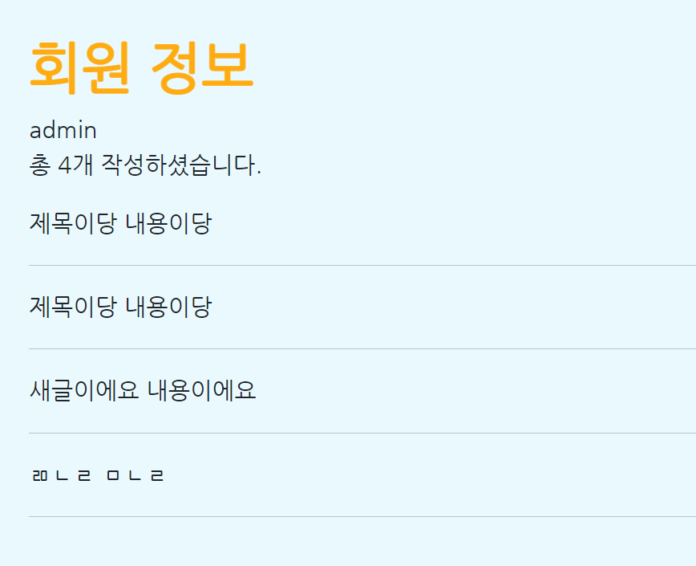

# ✏️ModelForm을 활용한 CRUD 실습

## 1. 모델 생성

User 모델은 Django **AbstractUser** 모델 상속

Article 모델은 밑의 조건을 보고 생성

| 필드 이름 | 역할      | 필드       | 속성                     |
| --------- | --------- | ---------- | ------------------------ |
| user      | 글 작성자 | ForeignKey | on_delete=models.CASCADE |
| title     | 글 제목   | Char       | max_length=80            |
| content   | 글 내용   | Text       |                          |

```python
# articles/models.py

from django.db import models

class Article(models.Model):
    user = models.ForeignKey(on_delete=models.CASCADE)
    title = models.Charfield(max_length=80)
    content = models.TextField()
```

```python
# accounts/models.py

from django.db import models
from django.contrib.auth.models import AbstractUser

class User(AbstractUser):
    pass
```

```shell
$ python manage.py makemigrations
$ python manage.py migrate
```

> DB 반영 (가상환경 켰는지 확인 필수)
>

<br>

## 2. 로그인 폼 및 회원가입 기능

로그인 폼은 Django 내장 로그인 폼인 **AuthenticationForm** 활용

회원가입은 **createsuperuser**를 이용해서 회원을 만들어서 대체

```python
# accounts/forms.py
from django.contrib.auth.forms import UserCreationForm
from .models import User
from django.contrib.auth import get_user_model

class CustomUserCreationForm(UserCreationForm):

    class Meta:
        model = get_user_model()
        fields = '__all__'
```

```python
# accounts/models.py
from django.db import models
from django.contrib.auth.models import AbstractUser

class User(AbstractUser):
    pass
```

<br>

## 3. 회원 정보 페이지

```python
# accounts/views.py
def login(request):
    if request.method == 'POST':
        form = AuthenticationForm(request, data=request.POST)
        if form.is_valid():
            auth_login(request, form.get_user())
            return redirect('articles:index')
    else:
        form = AuthenticationForm()
    context = {
        'form' : form,
    }
    return render(request, 'accounts/login.html', context)

def detail(request, user_pk):
    user = get_user_model().objects.get(pk=user_pk)
    context = {
        'user' : user,
    }
    return render(request, 'accounts/detail.html', context)
```

```django

<h1>회원 정보</h1>
{{ user.username }}
<p>총 {{ user.article_set.count }}개 작성하셨습니다.</p>

 {{ article.title }}
 {{ article.content }}
 <hr>


```

> user.username으로 회원 정보의 이름을 넣기
>
> user.article_set.all를 이용해서 user가 쓴 글 전부를 가져올 수 있음




