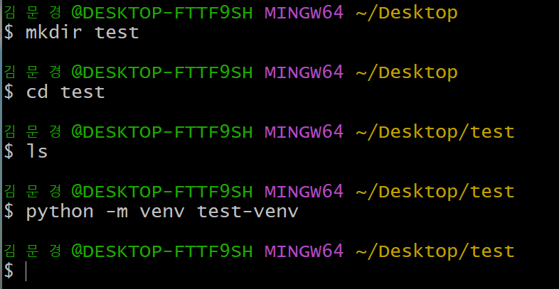
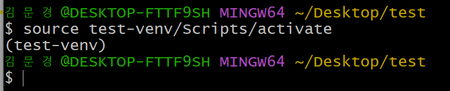
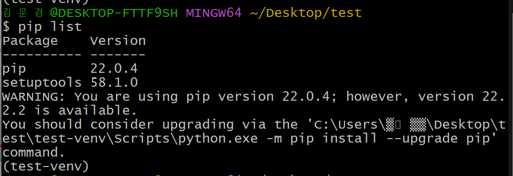
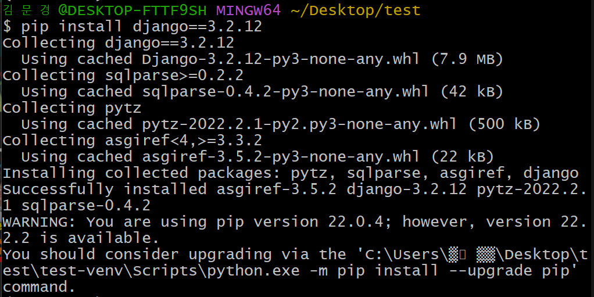
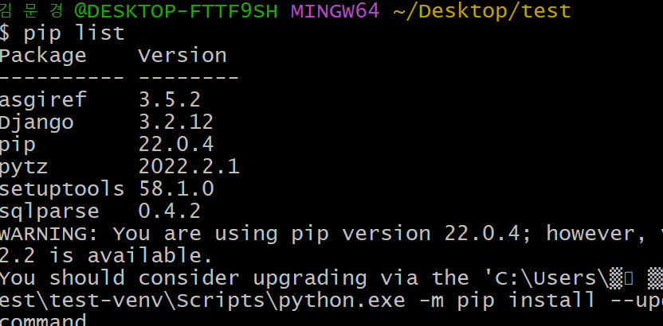
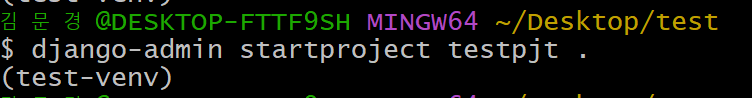
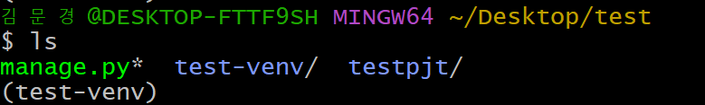
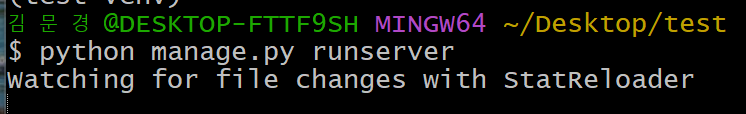
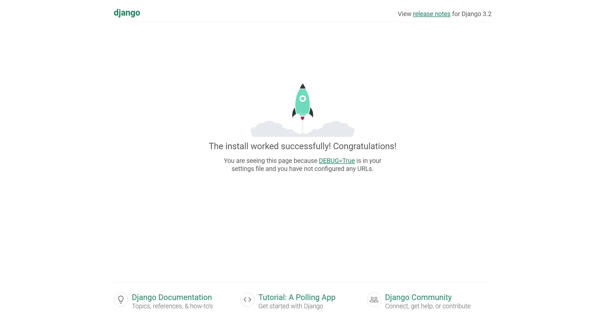
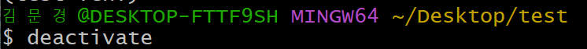

# ⚙️Django 개발 환경 설정 가이드

## 🧩 가상환경 생성 / 실행

> (예를 들어서) test 폴더 생성하고 test 폴더 안에서 `python -m venv test-venv` 실행
>
> 모듈을 사용할건데 가상환경 만드는 venv를 사용할것이고 프로젝트 이름은 test-venv야 라고 알려줌

> Scripts 안의 activate를 실행하기 위해서 위와 같이 코드를 치면 가상환경이 실행됨! 그리고 이름 위에 test-venv라고 표시가 됨 👉 가상환경이 활성화됨을 의미!

> pip list로 어떤 패키지들이 설치됐는지 확인해보기 Django가 없으면 설치를 해줘야함

 

## 🧩 Django LTS 버전 설치

 ### ✔️ LTS란?

- Long Term Support (장기 지원 버전)
- 일반적인 경우보다 장기간에 걸쳐 지원하도록 고안된 소프트웨어의 버전
- 컴퓨터 소프트웨어의 제품 수명주기 관리 정책
- 배포자는 LTS 확정을 통해 장기적이고 안정적인 지원을 보장함

> 즉, 최신 버전보다는 장기적이고 안정적인 버전을 설치하는 것!

> 그냥 pip install django를 하면 최신 버전인 4.0 버전이 설치되기 때문에
>
> 위처럼 버전을 명시해서 설치해야함 + `=` 기호 2개쓰기!!

> pip list로 다시 확인해보면 잘 깔려져있음을 알 수 있음

 

## 🧩 Django 프로젝트 생성

> startproject 뒤에 프로젝트 이름과 설치 경로 넣기
>
> .을 넣으면 현재 디렉토리에 프로젝트를 생성

> test-venv 폴더와 manage.py 파일이 생성됨을 알 수 있음

 

## 🧩 Django 실행

> manage.py를 실행 시키고 localhost: 8000으로 들어가보자

> 이러면 제대로 실행된 것!!

 

## 🧩 Django 실행 종료

> deactivate를 하면 가상환경 종료됨

 

