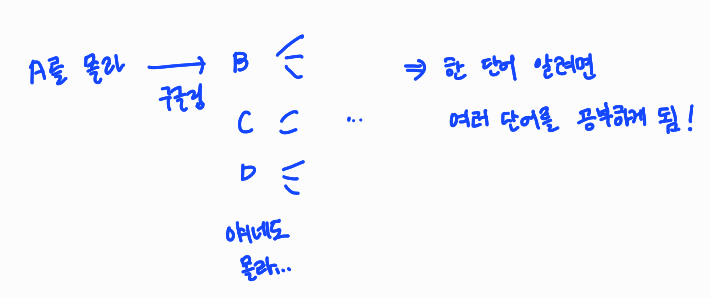
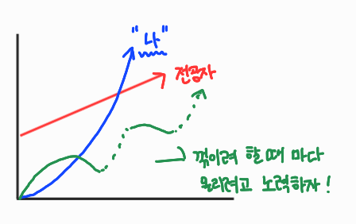
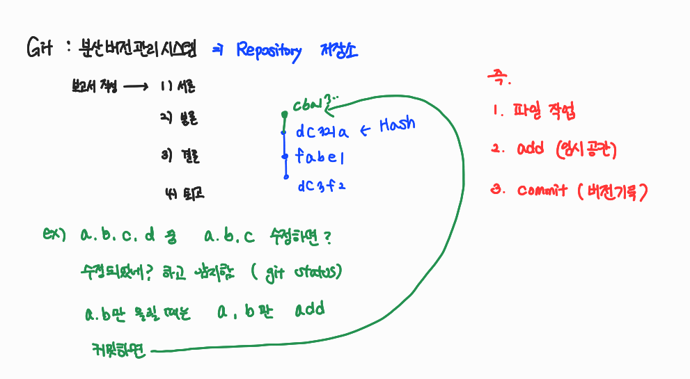
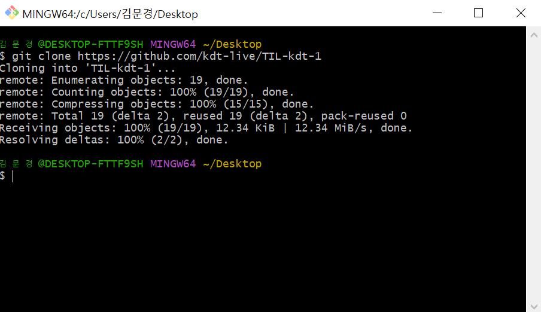
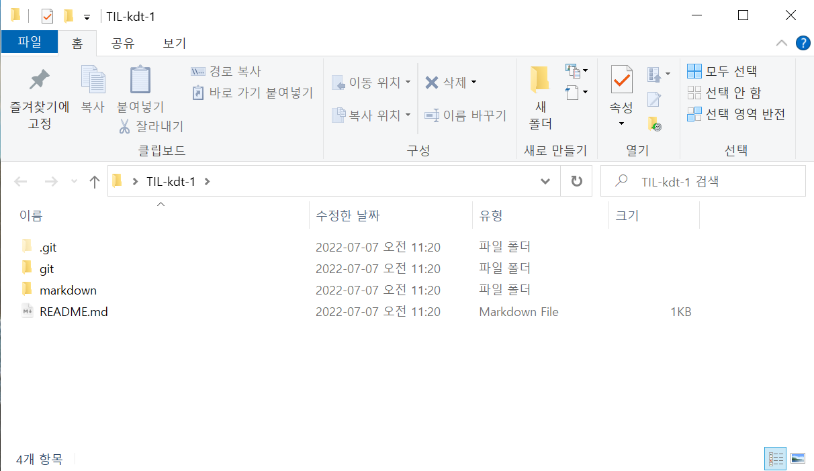
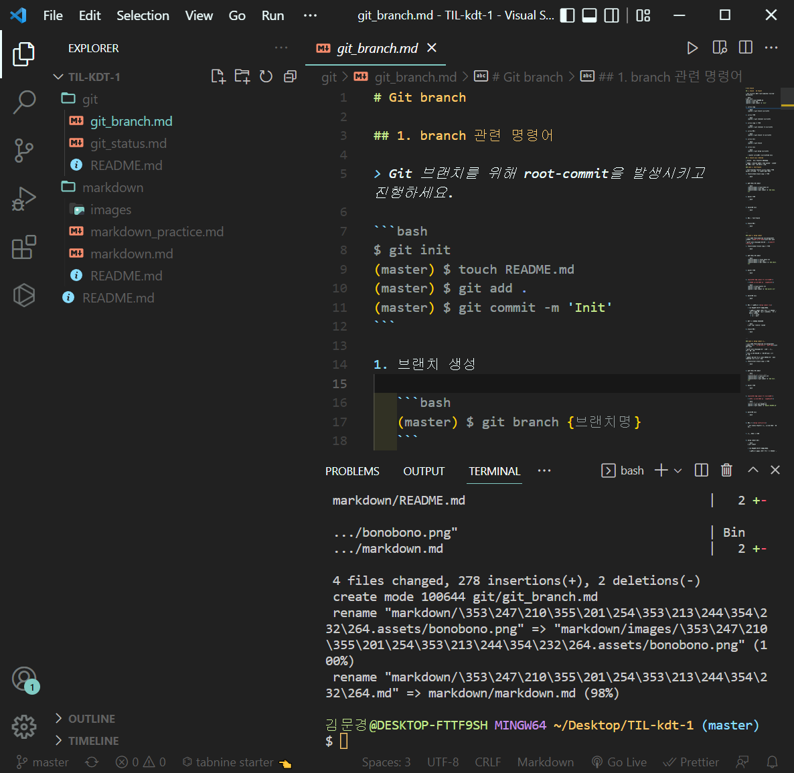
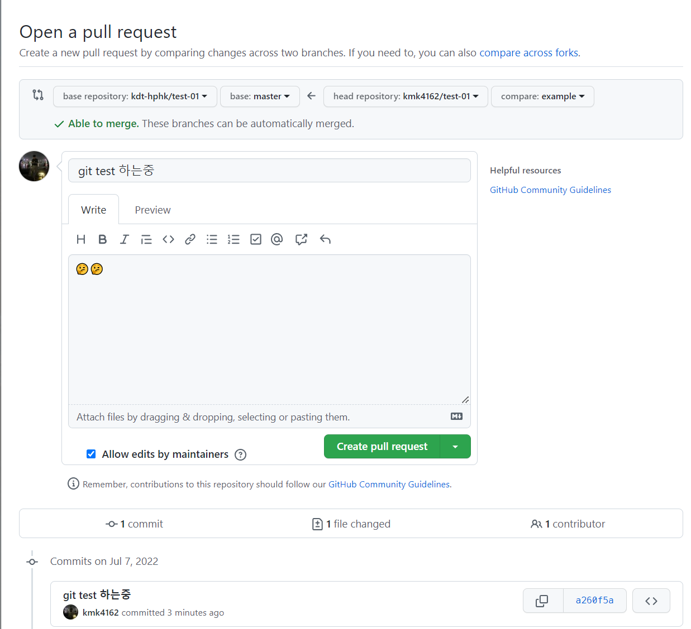

# 7/7

# 🌇 오전

## 🕓 9:00 ~ 10:00

### ✅ 구글링 어떻게 잘해요?

- 자연스럽게 반복적으로 하다보면 는다!
- 강사님은 1차적으로 네이버 블로그 거름 ㅋㅋㅋ




<br>


### ✅ 비전공자라 따라가기 어렵네요...

- 당연하다! 난 남들 6개월~4년 공부한걸 이제서야 따라잡으니까

  > 그니까 조급해하지 말고 어제보다 발전한 나의 모습을 기준으로 꾸준히 성장해 나가자!




<br>


### ✅ 리드미 작성이 어려워요...

- 리드미 자체라기 보단 문서 작성이 아직 덜 익숙한 것
- 반복학습 하다가 보면 나만의 스타일이 생길것


<br>


### ✅ 어제 개념 정리

- 한 폴더 내에서 수정작업 하는 상황에서

  - 파일 수정작업을 하면? 👉 `변경된 파일`로 바뀜

  - 그리고 다시 add를 하면 👉 `커밋할 파일`로 바뀜

  - 이대로 커밋을 하면 👉 수정된 상태를 `하나의 버전`으로 기록하는 것

- 버전을 기록한다  = `지금의 상태를 사진으로 찍는다!`

- 서론쓰고 커밋, 본론쓰고 커밋한 후 본론이 마음에 안 든다?

  👉 서론 쓸 적의 커밋으로 돌아가는 것(되돌리기) 나중에 배움




<br>


## 🕓 10:00 ~ 11:00

### ✅ 추가 정리

- git bash에서 `master`가 없으면 git으로 관리되고 있지 않음

- CLI에선 경로가 중요

  

- 예시: 졸업프로젝트 작성

1. git 저장소로 버전관리 시작하려면

   git init 👉 .git 폴더 만들어지면서 관리 시작

2. 졸프 작업 순서대로 하기(자료조사👉보고서👉발표자료 순서대로 할거야)
   - 먼저 자료조사. txt 작성
   - 그 뒤로 위키피디아, 지식인 txt 파일도 만듦; 이때까지 총 3개 파일

3. 과연 따로따로 올리고싶을까 한번에 올리고싶을까?

   👉 `하나의 버전`으로 만드는게 좋지, '자료조사' 버전으로!

4. 이번엔 보고서.txt 작성

5. 작성하다 보니까 자료가 부실하네? 라고 생각해서 추가적으로 자료조사

   👉 나무위키.txt라고 추가 파일 만들었어

6. git status 찍으면 나무위키 파일과 보고서 파일 2개가 1통에 있음

7. 나는 구별을 위해 자료조사 보충이랑 보고서 작성 버전을 따로 하고싶어

8. 그래서 나무위키 add 하고, 커밋 메시지는 '자료조사보충- 나무위키'

   보고서 add 하고, 커밋 메서지는 '보고서 작성 완료' 이렇게 따로 커밋!(행위에 대한 기록이 커밋메시지!)

9. '자료조사보충- 나무위키' 버전으로 돌아가면 파일 몇개일까요?

   👉 4개!, 타임머신 타고 순서대로 돌아간다고 생각하면 됨!


<br>


### ✅ 파일 삭제

- 상황: 네이버 지식인 자료가 필요가 없네?

1. 그래서 네이버 지식인 파일 삭제(우클릭하고 딜리트해도 됨)하고 status 하면? 

   👉 삭제됐다고 뜸

2.  git add하고 커밋으로 메시지는 '네이버 지식인 자료삭제'

3. 그러면 파일이 삭제된 상태가 새로 업데이트!

4. 그럼 삭제되기 전으로 돌아갈 수 있을까?

   👉 Yes, 그 상황마다 사진을 찍어서 저장해놓은 것이기 때문에!!

5. > **커밋한 모든 내용은 다시 되돌릴 수 있음**
   >
   > **그러나 커밋하지않은 모든 내용은 손 쓸 방법이 없음!**


<br>


### ✅ 파일 수정

- 파일 수정하면 `modified`라고 status에 뜸

- 깃허브에서 파일이나 폴더 지우고 싶어 어떻게할까?

  👉 로컬에서 지우고 다시 푸쉬해! `원격저장소에서는 웬만하면 바꾸지 마!!`

> 그냥 파일 수정, 파일 이름 바꾸든, 폴더 이름을 바꾸든 이거 원래대로 하고 커밋을 해! 그리고 push를 해!!


<br>


### ✅ 타이포라 이슈 정리

- 이미지 경로 assets폴더 이름이 맘에 안들어서 바꿨어

  👉 그럼 타이포라에서 이미지가 깨짐.. 주소 경로가 바뀌어서 ㅠㅠ

- 그럼 어떻게 하나요?

  👉 하나하나 바꿔야해요...

- 하 이미지 경로 자동수정 기능은 없네...
- 처음 만들때 신중하자... 그리고 투박하더라도 맘에 안 들더라도 일단 밀고나가자


<br>


## 🕓 11:00 ~ 12:00

### ✅ Clone

- 강사님의 저장소를 그대로 복제
- 강사님이 업데이트 하면 그대로 상황이 반영되는 것
- `git clone 주소` 만 하면됨
- 주의사항
  - 원격 저장소 이름의 폴더가 생성됨
- 압축파일로 가져오는 것과 clone의 차이점
  - master(.git)의 유무
  - 압축파일 👉 최신 버전의 파일 및 폴더만 가져오는 것
  - clone 👉 git 저장소를 그대로 가져오는 것

> 이것이 github이 분산버전관리시스템이라고 불리는 이유!!


<br>






이런식으로 클론하면 그대로 폴더 생김!

- 이 상태로 강사님이 파일 하나를 추가하고 커밋하고 업로드한다면?

  👉 git pull origin master 하면 파일 그대로 받아올 수 있음!

  git 폴더 안에 git_branch 파일이 나한테도 그대로 업데이트됐어!!

  

  

  근데 우리는 학생입장이라서 수정하고 다시 push할 권한이 없음. 권한을 받아야 수정 가능!!

- clone 이후 init 안해도 된다!

- pull은 커밋을 받아오고, clone은 저장소를 받아옴!

- 팀 프로젝트 시작할 때

  - 조장: 단톡방 개설, 밥 산다, 구글드라이브를 만들고 초대

  - 조원: 구글드라이브 주소를 받아와서 접속

    👇

  - 조장: 저장소(로컬, git init) 만들고 푸쉬해서 원격저장소(깃허브)에 올림

  - 조원: 조장으로부터 깃허브 초대 받고 clone으로 받아옴


<br>


---

# 🌆 오후

## 🕓 1:00 ~ 2:00

### ✅ Git 개념 다시 정리

- `git add .`: 현재 디렉토리 중에서 변경된 파일들만 보임


<br>


### ✅ Git Flow

- `branch`를 활용해서 협업하는 흐름

- 우리는 TIL에서 `master` 브랜치에서만 하나하나 해갔음

- 예시- 만약 내가 네이버 여름 시즌 개발중이다

  1. 홈 휴가로고 팀, 네이버페이 이벤트 팀, 여행지 팀 이런식으로 나눠서 각자 가지를 쳐서 일을 진행

  2. 그러고 합침!

  3. 사용자가 보는것은 master 브랜치

  1일차에 이미지 파일 경로 인터넷에서 어떻게 설정하는지 다시 찾아보기

  <br>

  

### ✅ Branch basic commands 

  1. 브랜치 생성

     ```bash
     (master) $ git branch {브랜치명}
     ```

2. 브랜치 이동

   ```bash
   (master) $ git checkout {브랜치명}
   ```

3. 브랜치 생성 및 이동

   ```bash
   (master) $ git checkout -b {브랜치명}
   ```

4. 브랜치 삭제

   ```bash
   (master) $ git branch -d {브랜치명}
   ```

5. 브랜치 목록

   ```bash
   (master) $ git branch
   ```

6. 브랜치 병합

   ```bash
   (master) $ git merge {브랜치명}
   ```

   - 병합(merge)는 항상 `master`에서 진행해야함!

     

<br>


## 🕓 2:00 ~ 3:00

### ✅ 협업-실전편

- 조장과 조원이 각자 작업한다면

  👉 조장이 수작업으로 고쳐야한다

- 병합 하고 난 뒤의 branch는 바로 삭제

- 브랜치 병합과정에서 충돌나면 어떻게?

  👉 여러분이 개발하는 방향에 맞게 고치세요

- 조모임하다가 조원이 피피티 다르다고 하면 어떻게?

  👉  나보고 하라는건가요 ㅋㅋㅋ

- 3번처럼 충돌하면 두개를 보고 생각하고 수정한 뒤

  👉  add, commit (바로 엔터) 그 뒤로 창 뜨면 그냥 닫으면 merge됨

- 그 뒤에 그래프를 확인해보면?

 

<br>


## 🕓 3:00 ~ 4:00

### ✅ 혼자서 쭉 진행하면

-  master에서만 쭉 하면 문제 No!


<br>


### ✅ 깃허브에서 어떻게 협업?

- github flow 기본원칙
  1. 정리하기 쭉

- feature branch workflow와 forking workflow의 차이점

  👉 내꺼냐 니꺼냐의 차이

- clone으로 가져와서


<br>


## 🕓 4:00 ~ 5:00

### ✅ 실습

- pull request 후 리드미에 후기 쓰기
- 
- 
- 


<br>


## 🕓 5:00 ~ 6:00

###  ✅ 3개 add하고 2개만 commit 하고 싶으면?

<br>

### ✅ 파일 만들고 어디 다녀 오는 동안 파일 내용이 바뀌었다면?

👉 ctrl + z & `restore`

<br>

### ✅ 결론

1. 메시지 잘 읽자!

<br>


