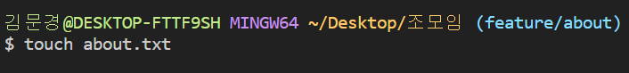
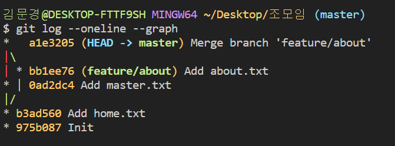
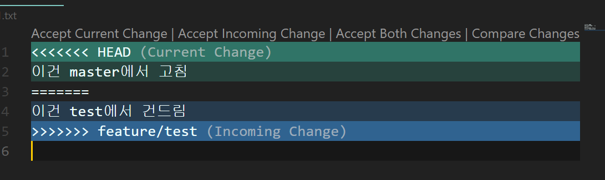
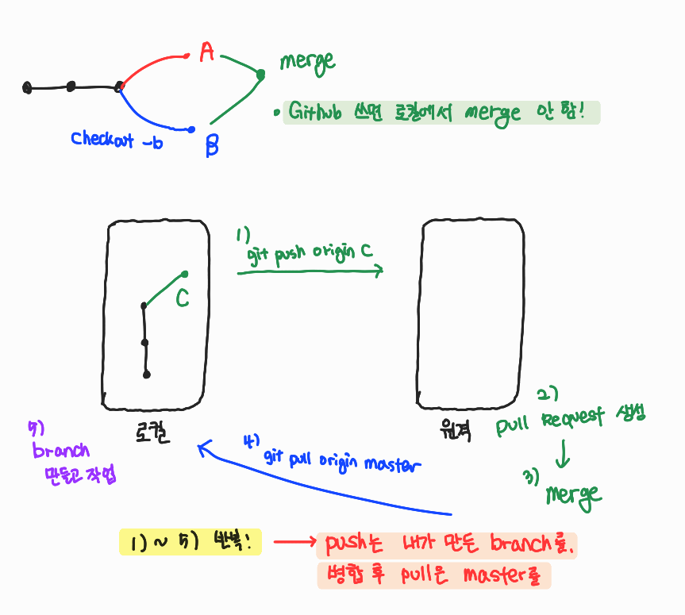

# 7/7

# 🌇 오전

## 🕓 9:00 ~ 10:00

### ✅ 구글링 어떻게 잘해요?

- 자연스럽게 반복적으로 하다보면 는다!
- 강사님은 1차적으로 네이버 블로그 거름 ㅋㅋㅋ


<br>


### ✅ 비전공자라 따라가기 어렵네요...

- 당연하다! 난 남들 6개월~4년 공부한걸 이제서야 따라잡으니까

  > 그니까 조급해하지 말고 어제보다 발전한 나의 모습을 기준으로 꾸준히 성장해 나가자!


<br>


### ✅ 리드미 작성이 어려워요...

- 리드미 자체라기 보단 문서 작성이 아직 덜 익숙한 것
- 반복학습 하다가 보면 나만의 스타일이 생길것


<br>


### ✅ 어제 개념 정리

- 한 폴더 내에서 수정작업 하는 상황에서

  - 파일 수정작업을 하면? 👉 `변경된 파일`로 바뀜

  - 그리고 다시 add를 하면 👉 `커밋할 파일`로 바뀜

  - 이대로 커밋을 하면 👉 수정된 상태를 `하나의 버전`으로 기록하는 것

- 버전을 기록한다  = `지금의 상태를 사진으로 찍는다!`

- 서론쓰고 커밋, 본론쓰고 커밋한 후 본론이 마음에 안 든다?

  👉 서론 쓸 적의 커밋으로 돌아가는 것(되돌리기) 나중에 배움


<br>


## 🕓 10:00 ~ 11:00

### ✅ 추가 정리

- git bash에서 `master`가 없으면 git으로 관리되고 있지 않음

- CLI에선 경로가 중요

  

- 예시: 졸업프로젝트 작성

1. git 저장소로 버전관리 시작하려면

   git init 👉 .git 폴더 만들어지면서 관리 시작

2. 졸프 작업 순서대로 하기(자료조사👉보고서👉발표자료 순서대로 할거야)
   - 먼저 자료조사. txt 작성
   - 그 뒤로 위키피디아, 지식인 txt 파일도 만듦; 이때까지 총 3개 파일

3. 과연 따로따로 올리고싶을까 한번에 올리고싶을까?

   👉 `하나의 버전`으로 만드는게 좋지, '자료조사' 버전으로!

4. 이번엔 보고서.txt 작성

5. 작성하다 보니까 자료가 부실하네? 라고 생각해서 추가적으로 자료조사

   👉 나무위키.txt라고 추가 파일 만들었어

6. git status 찍으면 나무위키 파일과 보고서 파일 2개가 1통에 있음

7. 나는 구별을 위해 자료조사 보충이랑 보고서 작성 버전을 따로 하고싶어

8. 그래서 나무위키 add 하고, 커밋 메시지는 '자료조사보충- 나무위키'

   보고서 add 하고, 커밋 메서지는 '보고서 작성 완료' 이렇게 따로 커밋!(행위에 대한 기록이 커밋메시지!)

9. '자료조사보충- 나무위키' 버전으로 돌아가면 파일 몇개일까요?

   👉 4개!, 타임머신 타고 순서대로 돌아간다고 생각하면 됨!


<br>


### ✅ 파일 삭제

- 상황: 네이버 지식인 자료가 필요가 없네?

1. 그래서 네이버 지식인 파일 삭제(우클릭하고 딜리트해도 됨)하고 status 하면? 

   👉 삭제됐다고 뜸

2.  git add하고 커밋으로 메시지는 '네이버 지식인 자료삭제'

3. 그러면 파일이 삭제된 상태가 새로 업데이트!

4. 그럼 삭제되기 전으로 돌아갈 수 있을까?

   👉 Yes, 그 상황마다 사진을 찍어서 저장해놓은 것이기 때문에!!

5. **커밋한 모든 내용은 다시 되돌릴 수 있음**

6. **그러나 커밋하지않은 모든 내용은 손 쓸 방법이 없음!**


<br>


### ✅ 파일 수정

- 파일 수정하면 `modified`라고 status에 뜸

- 깃허브에서 파일이나 폴더 지우고 싶어 어떻게할까?

  👉 로컬에서 지우고 다시 푸쉬해! `원격저장소에서는 웬만하면 바꾸지 마!!`

> 그냥 파일 수정, 파일 이름 바꾸든, 폴더 이름을 바꾸든 이거 원래대로 하고 커밋을 해! 그리고 push를 해!!


<br>


### ✅ 타이포라 이슈 정리

- 이미지 경로 assets폴더 이름이 맘에 안들어서 바꿨어

  👉 그럼 타이포라에서 이미지가 깨짐.. 주소 경로가 바뀌어서 ㅠㅠ

- 그럼 어떻게 하나요?

  👉 하나하나 바꿔야해요...

- 하 이미지 경로 자동수정 기능은 없네...
- 처음 만들때 신중하자... 그리고 투박하더라도 맘에 안 들더라도 일단 밀고나가자


<br>


## 🕓 11:00 ~ 12:00

### ✅ Clone

- 다른사람의 저장소를 그대로 복제
- 저장소의 주인이 업데이트 하면 그대로 상황이 반영되는 것
- `git clone 주소` 


내가 clone 하려는 저장소의 주소가 보임 👉 그대로 복붙해서 Git bash에 실행


> 클론이 되고 바탕화면에 `원격 저장소 이름의 폴더`가 그대로 생성!
>
> 👉 그 폴더에 들어가서 작업을 하기!

- 압축파일로 가져오는 것과 clone의 차이점
  - `master(.git)의 유무`
  - 압축파일 👉 최신 버전의 파일 및 폴더만 가져오는 것
  - clone 👉 git 저장소를 그대로 가져오는 것

- 저장소의 주인이 커밋한 로그들도 다 볼 수 있음

  

> 이것이 github이 분산버전관리시스템이라고 불리는 이유!!


Q) 이 상태로 강사님이 파일 하나를 추가하고 커밋하고 업로드한다면?

👉 `git pull origin master` 하면 파일 그대로 받아올 수 있음!


- 우리는 학생(권한이 없는)입장이라서 수정하고 다시 push할 권한이 없음. `권한을 받아야 수정 가능!!`

- pull은 `커밋을 받아오고`, clone은 `저장소를 받아옴!`

  👉 그러니 clone 이후 init 안해도 된다!

- 팀 프로젝트 시작할 때

  - 조장: 단톡방 개설, 밥 산다, 구글드라이브를 만들고 초대

  - 조원: 구글드라이브 주소를 받아와서 접속

    👇

  - 조장: 저장소(로컬, git init) 만들고 푸쉬해서 원격저장소(깃허브)에 올림

  - 조원: 조장으로부터 깃허브 초대 받고 clone으로 받아옴


<br>


---

# 🌆 오후

## 🕓 1:00 ~ 2:00

### ✅ Git Flow


- `branch`를 활용해서 협업하는 흐름

- 우리는 TIL에서 `master` 브랜치에서만 하나하나 해갔음

- 예시- 만약 내가 네이버 여름 시즌 개발중이다

  

  1. 홈 휴가로고 팀, 네이버페이 이벤트 팀, 여행지 팀 이런식으로 나눠서 각자 가지를 쳐서 일을 진행

  2. 그러고 합침!

  3. `사용자가 보는것은 master 브랜치`


<br>


### ✅ Git Flow의 특징 및 예시

|            branch            |                          주요 특징                           |                        예시                        |
| :--------------------------: | :----------------------------------------------------------: | :------------------------------------------------: |
|         master(main)         |                   -배포 가능한 상태의 코드                   |     LOL 클라이언트 라이브 버전(9.23.298.3143)      |
|        develop(main)         | - feature branch로 나뉘어지거나, 발생된 버그 수정 등 개발 진행<br />- 개발 이후 release branch로 갈라짐 |            다음 패치를 위한 개발(9.24)             |
| feature branches(supporting) | - 기능별 개발 브랜치(topic branch)<br />- 기능이 반영되거나 드랍되는 경우 브랜치 삭제 | 개발시 기능 별로 ex) 신규 챔피언 개발, 용 업데이트 |
| release branches(supporing)  | - 개발 완료 이후 QA/Test 통해 얻어진 다음 배포 전 minor bug fix 등 반영 |                  9.24a, 9.24b...                   |
|     hotfixes(supporting)     | - 긴급하게 반영해야하는 bug fix<br />- release branch는 다음 버전을 위한 것이라면, hotfix branch는 현재 버전을 위한 것 |               긴급 패치를 위한 작업                |

<br>


### ✅ Branch basic commands 

먼저 root-commit을 해주고 시작하자


```
$ git init
(master) $ touch README.md
(master) $ git add .
(master) $ git commit -m 'Init'
```


  1. 브랜치 생성

     ```bash
     (master) $ git branch {브랜치명}
     ```

     

     > branch 앞에 별모양은 현재 위치하고 있는 branch임을 알려줌

2. 브랜치 이동

   ```bash
   (master) $ git checkout {브랜치명}
   ```

   

   > branch 이동 성공!

3. 브랜치 생성 및 이동

   ```bash
   (master) $ git checkout -b {브랜치명}
   ```

   

   > 생성을 하면서 이동까지 하게 해줌

4. 브랜치 삭제

   ```bash
   (master) $ git branch -d {브랜치명}
   ```

   

   > 속해 있는 branch에서 삭제를 진행하면 error뜸
   >
   > 👉 삭제 하려는 branch에서 벗어나서 삭제해야함

5. 브랜치 목록

   ```bash
   (master) $ git branch
   ```

6. 브랜치 병합

   ```bash
   (master) $ git merge {브랜치명}
   ```

   

   - 병합(merge)는 항상 `master`에서 진행해야함!
   
   - 그리고 병합을 한 후에는 항상 지워주자!

<br>


### ✅ 다른 브랜치에서 작업?

`example`브랜치에서 커밋을 하고 log를 확인하면 2개가있다.

그러고나서 `master`로 돌아오면? log는 1개 밖에 없고, 이전에 커밋한 내용이 master branch에선 반영돼있지 않네... 왜?

> 👉 다른 branch에서 작업을 했기 때문에!!


지금 딱 이 상태!


## 🕓 2:00 ~ 3:00

### ✅ branch 병합 시나리오 실습

#### 💻 상황 1. fast-foward

> feature 브랜치 생성 이후 master 브랜치에 변경 사항이 없는 상황


master에는 아직 feature /home 의 커밋이 반영이 안 된 상황

master에 병합을 하면?


> `Fast-forward`라고 뜨고, HEAD가 master와 feature/home 둘 다 가리키고 있음을 알 수 있다.

 merge를 했으니 feature/home을 삭제하면


> master에는 영향을 안 준다

<br>


#### 💻 상황 2. merge commit

> 서로 다른 이력(commit)을 병합(merge)하는 과정에서 **다른 파일이 수정**되어 있는 상황
>
> git이 auto merging을 진행하고, **commit이 발생된다.**




`feature/about`이라는 브랜치 만들고 `about.txt`라는 파일을 만든 뒤 커밋

`master`와 `feature/about`의 로그를 비교해보면?


> master 브랜치에는 반영이 안 된 상황(1번 상황까지 같음 )

이번엔 master 브랜치에서 추가적인 작업을 한다면?


여기서 master에 병합을 하자


커밋 및 그래프를 확인해보면



> `feature/about` 브랜치는 master 브랜치와 병합이 되었고
>
> 이전에 master에는 없던 about.txt도 추가됨!

-👉 이것이 `merge commit`!!

<br>


#### 💻 상황 3. merge commit 충돌(진정한 협업!)

> 서로 다른 이력(commit)을 병합(merge)하는 과정에서 **같은 파일의 동일한 부분이 수정**되어 있는 상황
>
> git이 `auto merging`을 하지 못하고, 충돌 메시지가 뜬다.
>
> 해당 파일의 위치에 표준형식에 따라 표시 해준다.
>
> 원하는 형태의 코드로 직접 수정을 하고 `직접 commit을 발생` 시켜야 한다.


> 상황 2와 다른 점은 서로 같은 파일을 수정했다는 점
>
> 이 때문에 merge를 할 때 conflict가 발생한다. 


브랜치 병합과정에서 충돌나면 어떻게?

👉 여러분이 개발하는 방향에 맞게 고치세요!

> 즉 정답이 없음. 아예 갈아 엎을수도 있고, 단순히 두 브랜치의 내용을 합칠수도 있고
>
> 개발자들이 서로 보고(협업 시) 적절하게 대처하는 것이 중요!



> 깃은 아주 친절하게 어디서 충돌이 나는지 알려줌 이제 우리가 고쳐야해

그런데 vs코드에서는 더욱 친절하게 가이드를 제시해준다!(위 사진 참고)

1. Accept Current Change

   > master 브랜치의 내용을 따라가자

   

2. Accept Incoming Change

   > 새로운 브랜치의 내용을 따라가자

   

3. Accept Both Changes

   > 두가지 다 적용하자

   

4. Compare Changes

   > 서로 비교하면서 고치자

   

고치고 난 뒤에 다시 merge 하면?


> master|merging 에서 master로 바뀌고 merge도 성공적으로 가능!

<br>


### ✅ 총 정리


<br>


## 🕓 3:00 ~ 4:00

### ✅ Github Flow 기본 원칙

1. master branch는 반드시 `배포 가능한 상태`여야 한다.
2. feature branch는 `각 기능의 의도`를 알 수 있도록 작성한다.
3. commit message는 매우 중요하며 `명확하게` 작성한다.
4. `Pull Request`를 통해 협업을 진행한다.
5. 변경사항을 반영하고 싶다면, `master branch에 병합`한다.

<br>


### ✅ 소유권에 따라 달라지는 Workflow
#### 💻1.  Feature Branch Workflow: `Shared repository model`

1. 각 사용자가 원격 저장소의 소유권을 가진 상태

2. `clone`을 통해서 각자의 로컬에 복제

3. 각자 맡은 역할 따라서 branch 생성하고 기능을 구현

4. 다 만들었으면 원격 저장소에 push

   이때 중요한 점은 master가 아니라 `각자 생성한 branch를 push`해야함!

   

   새로 만든 hotfix 브랜치에 `pull request`를 하라고 설명해줌

   

   

   > hotfix브랜치를 master로 보내게끔 설정해주고 pull을 요청하는 것!

   이 다음에 confirm을 하면?

   

   

   성공했다고 뜨면서 이제 hotfix 브랜치는 지워도 된다고 알려줌

   > 원격저장소에서 병합 성공!!

5. 병합 완료된 브랜치는 삭제 (원격저장소에서 삭제)

   

6. 각 사용자는 master 브랜치로 switch

7. 병합된 master의 내용을 pull

   

8. 이제 `로컬에서도 병합된 브랜치를 삭제` (이미 원격 저장소에서도 그리고 로컬에서도 master로 안전하게 merge 됐으니까!)

9. 이제 각자 새로운 기능 추가를 위해 branch 생성하고 위의 과정을 계속 반복!


<br>


#### 💻2.  Forking Workflow: `Fork & Pull model`

1. 소유권이 없는 저장소를 `fork`를 통해서 복제

   

   > 이렇게 `forked`라고 뜸!

2. 복제한 저장소를 `clone`해옴 

3. 나중에 로컬 저장소를 원본의 원격 저장소와 동기화 하기위해`git remote add '원본 url'`

4. 기능 추가를 위해 branch를 생성하고 기능을 만든다

5. 기능 구현하고 복제해둔 원격 저장소에 브랜치를 반영한다(push)

6. 잘 작동하면 이제 원본 저장소 쪽으로 `pull request` 를 한다

7. 복제된 원격저장소에서 병합 완료된 branch는 삭제하고 나는 master 브랜치로 switch

8. 원본 원격저장소에서 허가를 하면 pull로 땡겨오고 내 로컬에서 기능 구현한 브랜치는 삭제

9. 새 기능 추가를 위해 위 작업 반복

<br>


## 🕓 4:00 ~ 5:00

### ✅ 실습

- pull request 후 리드미에 후기 쓰기


<br>


## 🕓 5:00 ~ 6:00

###  ✅ 정리

- 파일이 3개가 있는데 2개만 커밋하고 싶음 근데 3개 다 add 해버렸으면 어떻게?

​	👉 `git restore --staged 파일이름`을 하면 해당 파일이 `untracked`로 바뀜

- 파일 만들고 어디 다녀 오는 동안 파일 내용이 바뀌었다면?

​	👉`git restore 파일이름` 하면 이전 커밋으로 돌아감(discard)

- 결론은

​    👉 오류가 뜰 때의 Git bash에 나오는 메시지를 잘 읽자!



<br>


