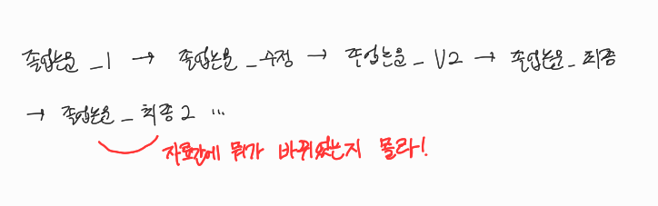
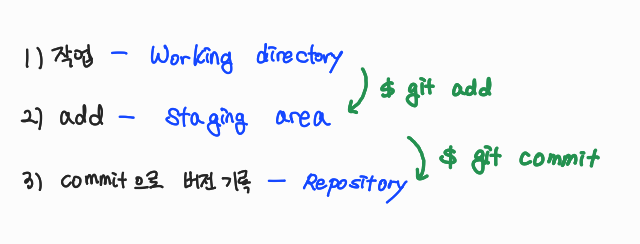
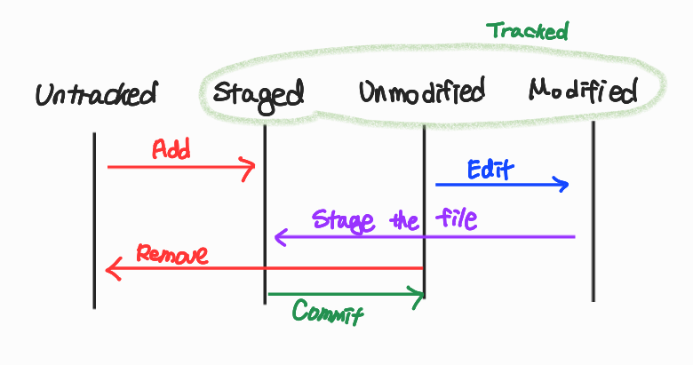
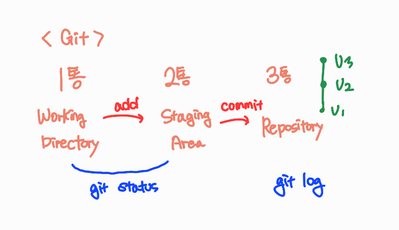

# 7/5

# **🌇 오전**

## 🕓 9:00 ~ 10:00

### ✅ git

- 프로젝트의 버전관리, 형상 관리 도구

  > 분산버전관리 시스템

- git을 통해 `github`에서 프로그램을 서로 공유

- github 프로필에서 밑에 `잔디심기` 부분이 중요

  > 그만큼 꾸준함을 나타낼 수 있음

- 우리는 아직 개발이 안 되니까 `TIL(Today I Learned)` 이라는 곳에서 매일 학습 정리

 

### ✅ Markdown

- 문서 정리의 대표적인 도구
- 텍스트 기반의 가벼운 마크업 언어
- text 👉 HTML로 쉽게 변환할 수 있음
- Readme파일, 기술 벨로그, 노션(조금 변형했지만 베이스는 마크다운), 쥬피터 노트북...

 

### ✅ Typora

- 마크다운 에디터(편집기)

 

## 🕓 10:00 ~ 12:00

### ✅ 마크다운 문법 정리

[여기에 정리해놨음](https://github.com/kmk4162/TIL/blob/master/Markdown/%EB%A7%88%ED%81%AC%EB%8B%A4%EC%9A%B4_%EB%AC%B8%EB%B2%95%EC%A0%95%EB%A6%AC.md)

 

# 🌆 **오후**

## 🕓 1:00 ~ 2:00

### ✅ CLI 란?

Command Ling Interface(명령 + 줄 + 조작)

가상 터미널 또는 텍스트 터미널을 통해서 사용자와 컴퓨터가 상호 작용하는 방식

리눅스는` terminal`, 윈도우는 `cmd`나 `powershell`

> 불편한 것이 아니라 **전혀 다르게** 생각하고 조작하자.

 

### ✅ 주요 명령어들

- `pwd`(print working directory): 현재 디렉토리 출력

- `cd`(change directory): 디렉토리 이동

  - cd . : 현재 디렉토리
  - cd .. : 이전 디렉토리

- `ls`(list): 목록

- `mkdir`(make directory): 디렉토리 생성

  > 폴더 만들 때 띄어쓰기 대신 `_` 쓰자; 이게 훨씬 편함

- `touch`: 파일의 날짜와 시간을 수정(0바이트 빈파일 생성)

- `rm`: 파일을 지우기

- `rm -r`: 폴더 지우기

- `clear`: 이전까지 썼던 코드들 깔끔하게 지우기🗑 (`ctrl + l`도 가능)

 

### ✅ GUI

Graphic User Interface(그래픽 + 유저 + 조작)

 

### ✅ interface?

> 무언가를 조작하는 것

터치가 안되는 노트북인데 터치를 막한다?

터치가 안되니까 의미없어 이 친구야! 라고 하겠지

👉 `인터페이스가 다르다` 라는 특징!

우리는 이제까지 GUI에 절여져있었지만 이제는 CUI를 통해

명령을 하고, 명령을 알아듣고 할 수 있어야 함!

 

## 🕓 2:00 ~ 3:00

### ✅ 버전관리?

> 파일은 버전별로 관리!!

- 구글 docs도 비슷함

 👉 버전별로 기록을 할 수 있어서, 위에 처럼 파일이름 계속 수정할 필요가 없음!

 

### ✅ Git 기초 흐름

Git은

- 파일의 변경사항을 추적하고
- 여러 명의 사용자들 간에 해당 파일들의 작업을 조율

 

### ✅ 분산버전관리시스템(DVCS)

- 원격 저장소를 통해 협업
- 모든 히스토리를 클라이언트들이 공유 가능

 

### ✅ 기본 명령어 - init

- `git init`
  - 특정 폴더에 git 저장소를 만들어 git으로 관리
  - git bash에서는 `(master)`라는 표시를 통해 알 수 있음

 

### ✅ 버전 기록의 기본 흐름

> 머리속으로 3개의 공간을 상상하는 것이 중요

🤔 왜 바로 저장소에 올리지 않고 Staging Area를 쓸까?

 👉 내가 버전으로 기록하기 위한 파일들을 모으기 위해

 

## 🕓 3:00 ~ 4:00

### ✅ 기본 명령어 - add

- `git add 파일 이름`

  - working directory 상의 변경 내용을 staging area에 추가하기 위해 사용

  - 파일의 상태가 `staged`로 바뀜!
- 파일을 올려준다고 해서 파일 위치가 바뀌는 것은 아님!

 

### ✅ 기본 명령어 - commit

- `git commit -m '커밋 메세지'`

  - 메시지 작성이 중요! !

    👉 내가 뭐때문에 이러는지 알아야하니까

  - `staged`상태의 파일들을 `commit`을 통해서 버전으로 기록
  
   

### ✅ 기본 흐름

- Git은 파일을 modified, staged, committed로 관리

  - `modified` : 파일이 수정된 상태

    - Working Directory 영역에 있는 파일들 중 수정을 한 파일들의 상태를 의미

  - `staged` : 수정한 파일을 곧 커밋할 것이라고 표시한 상태 (commit 명령어로 저장소)

  - `committed` : 커밋이 된 상태

    - commit 된 파일은 Working Directory 영역으로 돌아가게 되고

    `대상 파일의 버전을 관리하는 파일들은 Repository에 저장된 상태`를 말합니다.

    - `Commited 상태 대상 파일을 수정하게 되면 Modified 상태`가 됩니다.

  
  
   

### ✅ 현재 상태를 알고싶어요

1. `git log`

- 현재 저장소에 기록된 `커밋(버전)`을 조회

- 다양한 옵션
  - git log -1: `제일 최근 커밋 1개 조회`
  - git log --oneline: `한줄`로 보여줘
  - git log -2 --oneline: `한줄로 최근 커밋 2개`를 조회
  
  

2.  `git status`

- git 저장소에 있는 `파일의 상태`를 확인하기 위해

- 파일의 상태를 알 수 있음

  - Untracked files: `한 번도 커밋 x; 새로 만듦`
  - Changes not staged for commit: `Modified`(수정됨)
  - Changes to be committed: `staged`(staging area에 있으니까 commit해라)

- 비어있는 상태라면?

  
  
  

3. `git log --stat`

- 가장 최근의 커밋부터 순서대로 커밋 메시지와 관련 파일이 나열
- `Enter` 입력 시 다음 로그 화면을 볼 수 있고 `Q`를 누르면 로그 화면을 빠져나올 수 있음.

 

### ✅ 파일 라이프사이클

- Working Directory(1통)에 있는 파일들(Git의 추적 대상이 되는 파일들)은

> 크게 **Tracked** 상태와 **Untracked** 상태로 분류됨

- `Untracked` 상태의 파일은 git이 관리를 하지 않는 파일
- `Tracked` 상태의 파일은 git이 관리를 하는 파일
- Tracked 상태는 좀 더 세부적으로 **Unmodified, Modified, Staged** 상태로 분류될 수 있음
- Git의 파일들은 반드시 해당 4가지 상태중 하나의 상태를 가지게 되고, 4가지 상태를 반복적으로 순환

 

### ✅ 추가적인 git 명령어 궁금하면?

👉 [git 명령어 자료들](https://velog.io/@jinne808/git-%EB%82%B4%EA%B0%80-%EB%B3%B4%EB%A0%A4%EA%B3%A0-%EC%A0%95%EB%A6%AC%ED%95%98%EB%8A%94-git-%EB%AA%85%EB%A0%B9%EC%96%B4)

 

## 🕓 4:00 ~ 5:00

### ✅ 실습

1. TIL 폴더 만들고 마크다운 정리 파일 옮기기
2. git 저장소 만들기(git init)
3. 커밋 생성

 

## 🕓 5:00 ~ 6:00

### ✅ 실습 및 정리

