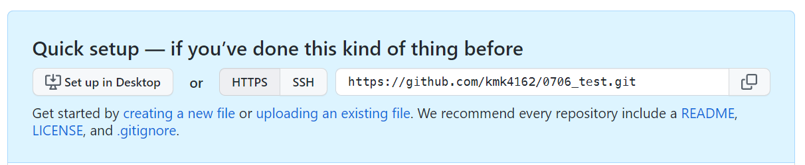
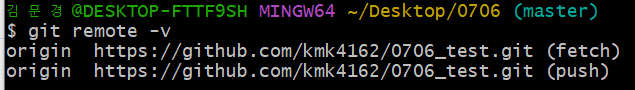
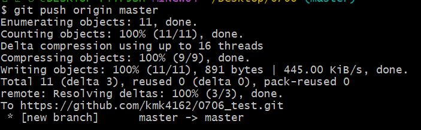
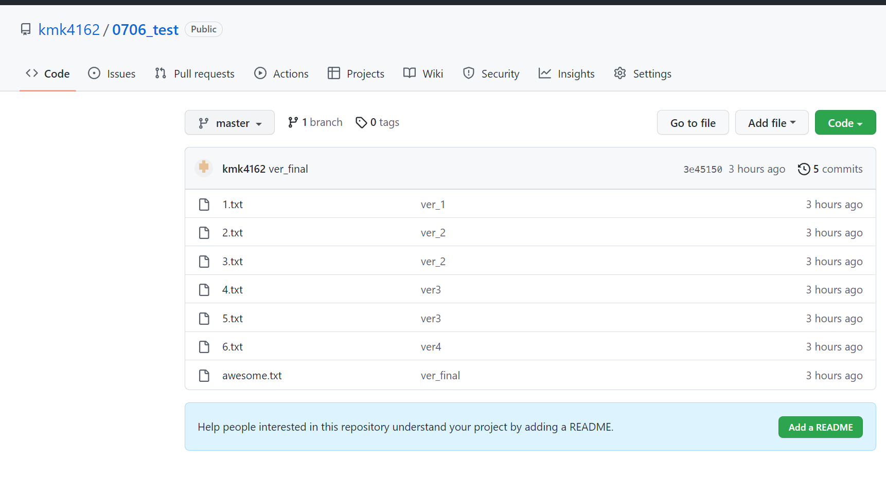
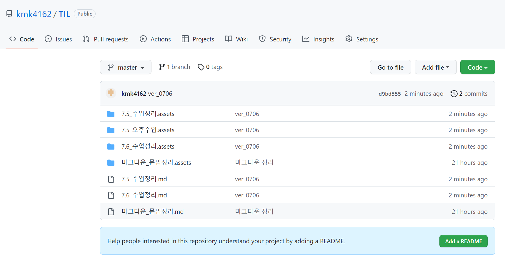
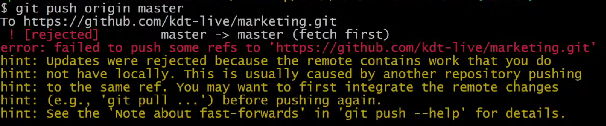
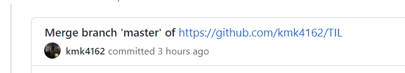
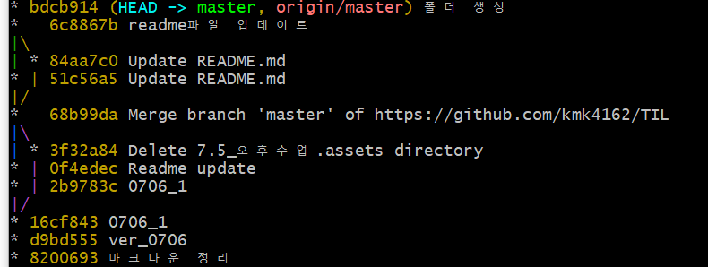
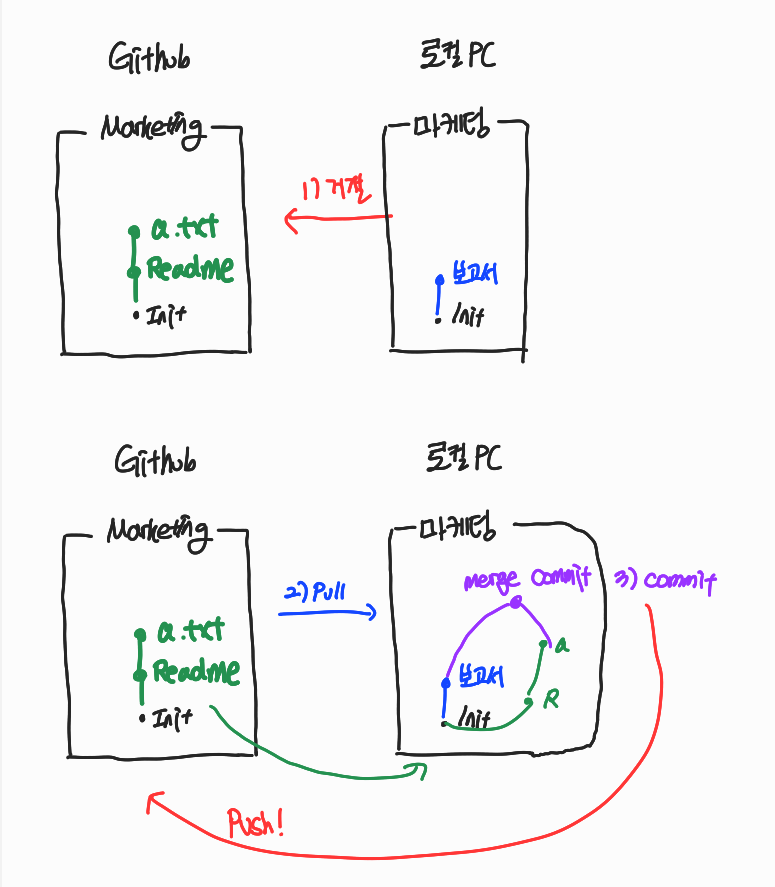

# 7/6

# 🌇 오전

## 🕓 9:00 ~ 10:00

### ✅ 어제 설문 정리 time~

 

## 🕓 10:00 ~ 11:00

### ✅ git init의 의미

- 내가 지금부터 이 프로젝트의 버전관리를 할거다.

- 그러니 바탕화면, c 드라이브에서 버전 관리를 시작하는 것이 아니라

  `내가 git으로 관리할 프로젝트를 각각` 처리해준다.

 

### ✅ 로컬 저장소 만들기(실습)

1. 프로젝트 폴더를 바탕화면에 `0706`으로 만들기
2. 해당 폴더에서 git 버전 관리 시작하기
3.  빈 파일 여러개 만들어서 status 확인도 하고
4. 커밋, log 확인도 여러개하고
5. 커밋 3개 이상 쌓아보기

-  git add를 실수로 실행해서 다시 unstage 상태로 되돌리고 싶을 때는

​		`git reset HEAD 파일이름`

- 너무 일찍 commit 하거나 어떤 파일을 빼먹고 commit을 해서 취소하고 싶을때는

​		`git reset HEAD^`를  사용하는데 종류가 여러가지 있다.

1. `git reset --soft HEAD^` : commit을 취소하고 해당 파일들은 `staged `상태로 워킹 디렉터리에 보존
2. `git reset --mixed HEAD^` : commit을 취소하고 해당 파일들은 `unstaged` 상태로 워킹 디렉터리에 보존
3. `git reset --hard HEAD^`: commit을 취소하고 해당 파일들은 `unstaged`상태로 워킹 디렉터리에서 삭제

> 기본 `git reset HEAD^`는 2번의 mixed와 같다.

- commit message를 변경하려면

​		`git commit --amend`

 

## 🕓 11:00 ~ 12:00

### ✅ GitHub

- GitHub도 `버전(커밋)`을 관리한다!
- 버전을 보내는게 `push`, 오는것은 `pull`
- 협업할 때 , 누군가는 버전을 올림

​		👉 참고할 때 pull하고 또 수정한 뒤 push하고 이런식!

- 원격저장소에 `push`를 해야만 반영할 수 있다

 

### ✅ GitHub에서 원격 저장소 만들기

1. New Repository
2.  저장소 설정하기 

3. 경로 설정

   > $ git remote add origin https://github.com/`깃허브 username`/`저장소이름`.git
   >
   > 👉 깃아 원격저장소 추가해줘 오리진이라는 이름으로 이 url을

   - 로컬 저장소에는 한번만 설정해주면 됨
   - 그리고 터미널에 복붙

 

### ✅ 원격저장소 정보 확인

항상 status 와 log를 보면서 커밋 안 된 파일이 있는지 확인하는 습관을 들여야함

새로운 commit이 등장하지 않으면 `Everything up-to-date`라고 뜸.

> push할때마다 나오는 메시지들을 잘 파악하는 것이 중요하다!!

 

# 🌆오후

## 🕓 1:00 ~ 2:00

### ✅ 실습

-   로컬에 있는 0706 폴더를 GitHub에서 test이름으로 원격저장소 생성 후 push

  1. `0706_test`라고 저장했더니 강의자료 처럼 내 원격 저장소의 주소가 생성됨

  

  2. `$ git remote -v`로 원격 저장소 정보 확인

     

  3. `$ git push origin master`로 push 기능

     

  4. 깃허브 들어가서 확인해보면

     

     

-   로컬에 있는 TIL 폴더를 GitHub에서 TIL 이름으로 원격저장소 생성 후 push

  1. 마찬가지로 진행해줌

     

  > 각각 설정해야함; 우리는 따로 관리하려하기 때문!
  
  

 

### ✅ 배운 것들

- 레포: repository 줄인 말
- Q) 원격 저장소 이름이랑 폴더 같아야 하나요?

​		A) No

- 빠져나갈때는 `ctrl + c`
- push할 때 `$ git push origin master`

 

## 🕓 2:00 ~ 3:00

### ✅ Push 실패

- 이런 경우가 발생함(실제로 이럼...)

- 위에 코드 해석하면

  - Github URL에 보내라고 했음(push)

  - 근데 실패했어

  - 원격저장소에서 한 작업이 로컬에는 없어

    (💬 실제로 오늘 assets 폴더를 깃허브에서 지우고 다시 로컬에서 바탕화면에서 지우고 이렇게 했는데 오류가 떴었음)

  - 다시 push하기 전에 원격저장소의 변경사항을 가져와라

  > 이것이 병합(branch)

- 따라서 이런 에러가 뜨면

  1) 원격저장소로 부터 가져오기- pull
  2) 로컬에서 합치고 다시 보내기- push

  > pull 먼저 하고 push 하기!

- 근데 병합한다고 뜨면 `vim`으로 수정하고 이상한게 막 생길 수 있음...

- 그래서 VS code를 활용해서 편하게 메시지 작성하는 방법이 있다!

 

### ✅ VS code를 에디터로 활용하기

- `git config --global core.editor "code --wait"` 사용

👉 이거 치면 어찌됐든 push, pull이 가능해짐

- 근데 우리가 못 보던 commit 이름이 나옴

  

  > 자동으로 작성된 커밋 메시지!!

- 

- 이렇게 가지치기가 됨

- 정리해보면

  

 

### ✅ 에러 안 나기 위한 원칙!

1. 로컬에서만 편집(수정, 삭제, 생성 등)

   👉 혼자 작업할 때는 볼 일이 없음

2. 작업 전에 git pull origin master

3. 그리고 작업 후에 push

   

 

## 🕓 3:00 ~ 4:00

### ✅ 커밋 메시지 작성 팁

- 길게 쓰고 싶으면 git commit만 하면 앞서 작성한 `git config --global core.editor "code --wait"` 때문에 vs 코드가 열리고 그 창에서 길게 작성 가능
- 메시지를 작성할 때는, 날짜보다는 어떤 수정을 했는지 그 내용을 명확하게 작성하는것이 포인트!(나중에 내가 왜 커밋을 했는지 알아야하니까)
- 일관성있게 작성하는 것도 중요

 

### ✅ GITIGNORE

- 버전관리랑 상관 없는 파일은 어떻게 관리할까?
  - 비밀번호 같은 중요 파일들
- 저장소에 `.gitignore`파일을 만들고 관리!

 

## 🕓 4:00 ~ 6:00

### ✅ 실습

- 깃허브 프로필 만들기
- README 파일 만들기

