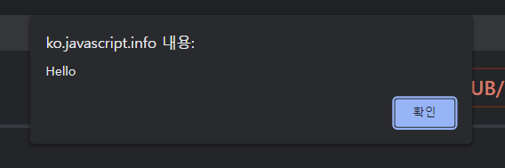
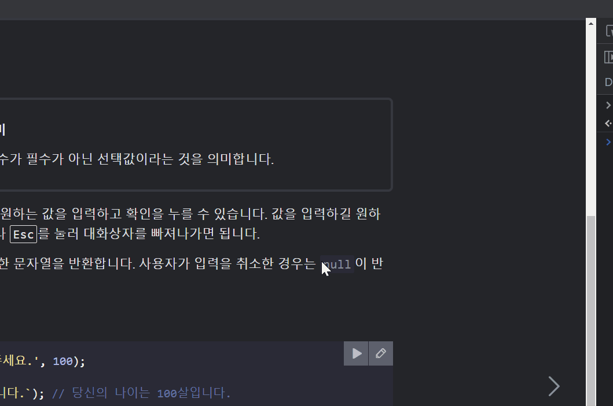
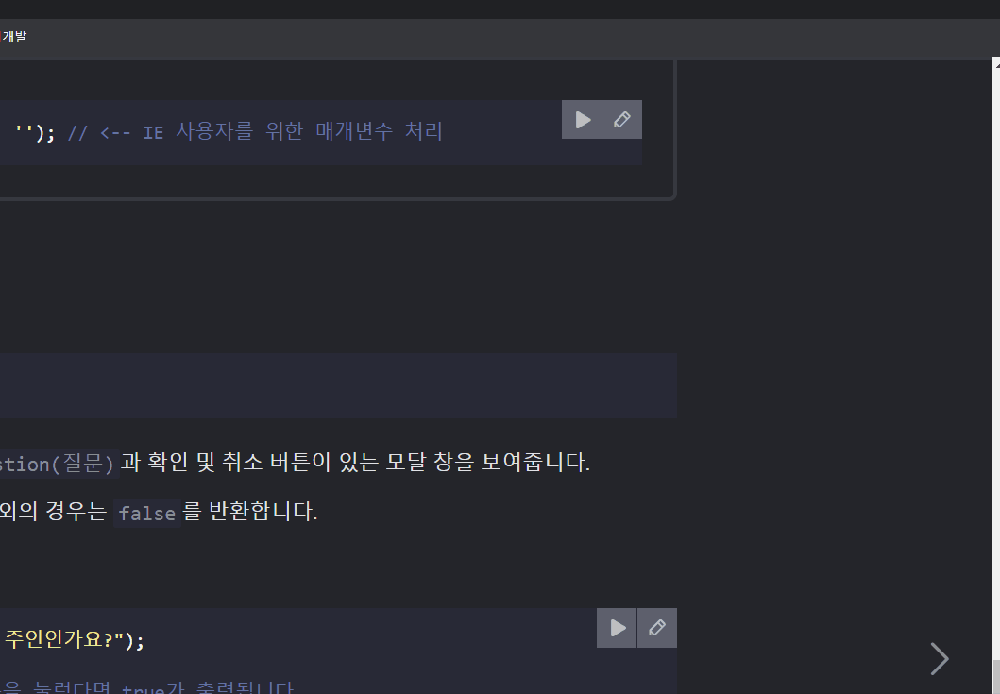

# 📕 자바스크립트 기본

## 1. Hello, world!

### 🧩 script 태그

JS 프로그램을 HTML 문서에 삽입

브라우저가 script 태그를 만나면 안의 코드를 자동으로 처리

<br>

### 🧩 외부 스크립트

JS 코드의 양이 많은 경우엔, 파일로 소분하여 저장이 가능

분해된 각각의 파일들은 `src`속성을 사용해서 HTML에 삽입

`<script src="/path/to/script.js"></script>`

`<script src="https://cdnjs.cloudflare.com/ajax/libs/lodash.js/4.17.11/lodash.js"></script>` 처럼

외부 URL 이용해서 참조도 가능

2개 이상의 스크립트 사용도 가능

> ❗주의:
>
> HTML 안에 직접 스크립트를 작성하는 방식은 대개 스크립트가 아주 간단할 때만 사용합니다. 스크립트가 길어지면 별개의 분리된 파일로 만들어 저장하는 것이 좋습니다.
>
> 스크립트를 별도의 파일에 작성하면 브라우저가 스크립트를 다운받아 [캐시(cache)](https://en.wikipedia.org/wiki/Web_cache)에 저장하기 때문에, 성능상의 이점이 있습니다.
>
> 여러 페이지에서 동일한 스크립트를 사용하는 경우, 브라우저는 페이지가 바뀔 때마다 스크립트를 새로 다운받지 않고 캐시로부터 스크립트를 가져와 사용합니다. 스크립트 파일을 한 번만 다운받으면 되죠.
>
> 이를 통해 트래픽이 절약되고 웹 페이지의 실제 속도가 빨라집니다.

<br>

### ✏️ 과제

#### ✔️ alert 창 띄우기

"자바스크립트!"라는 메시지를 담고 있는 alert 창을 띄워주는 페이지를 만들어 보세요.

```html
<!DOCTYPE html>
<html>
<body>
  <script>
    alert( "I'm JavaScript!" );
  </script>
</body>
</html>
```

<br>

#### ✔️ 외부 스크립트를 이용해서 alert 창 띄우기

이전 과제 [alert 창 띄우기](https://ko.javascript.info/task/hello-alert)의 해답에 있는 스크립트를 `alert.js`라는 외부 파일로 옮겨보세요.

해당 파일을 문서와 동일한 경로로 옮긴 후, 스크립트가 기존처럼 alert 창을 잘 띄워주는지 확인해보세요.

```html
<!DOCTYPE html>
<html>
<body>
  <script src="alert.js"></script>
</body>
</html>
```

<br>

## 2. 코드 구조

### 🧩 문(statement)

어떤 작업을 수행하는 문법 구조와 명령어를 의미

`alert('hello'); alert('world');`도 가능하지만,

```alert('Hello');
alert('hello');
alert('World');
```

나눠 쓰는 방식이 가독성이 더 좋고 일반적

<br>

### 🧩 세미콜론

대부분의 경우, 줄 바꿈은 세미콜론을 의미해서 생략이 가능하지만

세미콜론을 사용하는 것이 더 안전하므로 웬만하면 쓰자 (특히 입문자라면 더욱!) 

<br>

### 🧩 주석

한 줄 짜리는 `//`로 시작

여러 줄은 `/*`와 `*/` 사이에 넣기 

<br>

## 3. 엄격 모드

> 자바스크립트는 꽤 오랫동안 호환성 이슈 없이 발전해왔습니다. 기존의 기능을 변경하지 않으면서 새로운 기능이 추가되었죠.
>
> 덕분에 기존에 작성한 코드는 절대 망가지지 않는다는 장점이 있었습니다. 하지만 자바스크립트 창시자들이 했던 실수나 불완전한 결정이 언어 안에 영원히 박제된다는 단점도 생겼습니다.
>
> 이런 상황은 ECMAScript5(ES5)가 등장하기 전인 2009년까지 지속되었습니다. 그런데 새롭게 제정된 ES5에서는 새로운 기능이 추가되고 기존 기능 중 일부가 변경되었습니다. 기존 기능을 변경하였기 때문에 하위 호환성 문제가 생길 수 있겠죠? 그래서 변경사항 대부분은 ES5의 기본 모드에선 활성화되지 않도록 설계되었습니다. 대신 `use strict`라는 특별한 지시자를 사용해 엄격 모드(strict mode)를 활성화 했을 때만 이 변경사항이 활성화되게 해놓았습니다.

### 🧩 use strict

스크립트 최상단에 와야지 작동

<br>

### 🧩 꼭 사용해야 하나요?

꼭 그렇지만은 않음!

단, 코드를 클래스와 모듈을 사용해 구성한다면 `"use strict"`를 생략해도 됩니다. 

> 두 모드(엄격 모드 & 비엄격 모드)에서 차이를 보이는 기능이 많지 않지만 
>
> 엄격 모드를 사용하면 개발자의 삶의 질이 조금 더 높아진다!

<br>

## 4. 변수와 상수

### 🧩 변수

데이터를 저장할 때 쓰이는 `이름이 붙은 저장소`

키워드는 `let`

'message' 라는 이름을 가진 변수를 생성(선언)

```javascript
let message;
```

할당 연산자(=)를 이용해서 변수 안에 데이터를 저장

```javascript
let message;
message = 'Hello';
```

문자열이 변수와 연결된 메모리 영역에 저장되었기 때문에, 변수명을 이용해서 문자열에 접근이 가능해짐

```javascript
let message;
message = 'Hello';

alert(message);
```

아래와 같이 변수 선언과 값 할당을 한 줄에 작성도 가능

```javascript
let message = 'Hello!'; // 변수를 정의하고 값을 할당

alert(message); // Hello!
```

한 줄에 여러 변수를 선언하는 것도 가능하지만 한 줄에는 하나의 변수만 작성하는 것이 좋음

```javascript
let user = 'John';
let age = 25;
let message = 'Hello';
```

이렇게도 가능

```javascript
let user = 'John',
  age = 25,
  message = 'Hello';
```

<br>

### 🧩 변수 명명 규칙

두 가지 제약 사항이 존재

1. 변수명에는 오직 문자, 숫자, $, _만 가능
2. 첫 글자에 숫자는 불가능

userName, myVeryLongName과 같은 `camelCase`가 사용됨

<br>

### 🧩 상수

변화하지 않는 변수를 선언할 때는 `const`를 사용

재할당할 수 없으므로 상수를 변경하려고 하면 에러가 발생

<br>

### 🧩 대문자 상수

기억하기 힘든 값을 변수에 할당해 별칭으로 사용하는 것은 널리 사용되는 관습

이런 상수는 대문자와 밑줄로 구성된 이름으로 명명

예시로 웹에서 사용하는 색상 표기법인 16진수 컬러 코드에 대한 상수를 만들어보면

```javascript
const COLOR_RED = "#F00";
const COLOR_GREEN = "#0F0";
const COLOR_BLUE = "#00F";
const COLOR_ORANGE = "#FF7F00";

// 색상을 고르고 싶을 때 별칭을 사용할 수 있게 되었습니다.
let color = COLOR_ORANGE;
alert(color); // #FF7F00
```

위와 같이 대문자로 만들면 다음과 같은 장점이 있음

- COLOR_ORANGE가 #FF7F00보다 `기억하기 쉽고`
- COLOR_ORANGE가 #FF7F00보다 `오타 낼 확률이 낮고`
- COLOR_ORANGE가 #FF7F00보다 `훨씬 유의미하므로, 코드 가독성이 증가`

<br>

### 🧩 바람직한 변수명

간결하고 명확해야하고, 변수가 담고있는 것이 무엇인지 잘 설명해야함

좋은 규칙들

- `userName` 이나 `shoppingCart`처럼 사람이 읽을 수 있는 이름을 사용하세요.
- 무엇을 하고 있는지 명확히 알고 있지 않을 경우 외에는 줄임말이나 `a`, `b`, `c`와 같은 짧은 이름은 피하세요.
- 최대한 서술적이고 간결하게 명명해 주세요. `data`와 `value`는 나쁜 이름의 예시입니다. 이런 이름은 아무것도 설명해주지 않습니다. 코드 문맥상 변수가 가리키는 데이터나 값이 아주 명확할 때에만 이런 이름을 사용합시다.
- 자신만의 규칙이나 소속된 팀의 규칙을 따르세요. 만약 사이트 방문객을 'user’라고 부르기로 했다면, 이와 관련된 변수를 `currentVisitor`나 `newManInTown`이 아닌 `currentUser`나 `newUser`라는 이름으로 지어야 합니다.

❗재사용 아니면 새로 만들기?

> 변수를 재사용하면 변수 선언에 쏟는 노력을 좀 덜 순 있겠지만, 디버깅에 열 배 더 많은 시간을 쏟아야 합니다.
>
> 변수를 추가하는 것은 악습이 아닙니다. 좋은 습관입니다.
>
> 모던 자바스크립트 압축기(minifier)와 브라우저는 코드 최적화를 잘해줍니다. 변수를 추가한다고 해서 성능 이슈가 생기지 않죠. 값이 다른 경우, 변수를 다르게 선언해 주면 코드 최적화에 도움이 될 수도 있습니다.

<br>

### ✏️ 과제

#### ✔️ 변수 가지고 놀기

1. `admin`과 `name`이라는 변수를 선언하세요.
2. `name`에 값으로 `"John"`을 할당해 보세요.
3. `name`의 값을 `admin`에 복사해 보세요.
4. `admin`의 값을 `alert` 창에 띄워보세요. "John"이 출력되어야 합니다.

```html
let admin, name;
name = 'John';
admin = name
alert(admin);
```

<br>

#### ✔️ 올바른 이름 선택하기

1. 현재 우리가 살고있는 행성(planet)의 이름을 값으로 가진 변수를 만들어보세요. 변수 이름은 어떻게 지어야 할까요?
2. 웹사이트를 개발 중이라고 가정하고, 현재 접속 중인 사용자(user)의 이름(name)을 저장하는 변수를 만들어보세요. 변수 이름은 어떻게 지어야 할까요?

```javascript
let currentMyPlanet = 'earth';
let currentUserName;
```

<br>

#### ✔️ 대문자 상수 올바로 사용하기

아래 코드를 평가해 보시기 바랍니다.

```javascript
const birthday = '18.04.1982';

const age = someCode(birthday);
```

위 코드의 상수 `birthday`는 태어난 날짜 정보를 담고 있습니다. `age`라는 상수는 나이에 관한 값을 담고 있는데 `birthday`를 조작하여 그 값을 도출합니다(생일을 이용하여 나이를 도출하는 코드는 간결성을 위해 여기선 언급하지 않겠습니다. 이 문제에서 해당 코드가 중요한 역할을 하지 않기도 합니다).

이런 상황에서 `birthday`를 대문자 상수로 바꾸는 것이 적절할까요? `age` 역시 대문자 상수로 바꾸는 것이 괜찮은 선택일까요?

```javascript
const BIRTHDAY = '18.04.1982'; // 대문자 상수로 바꿔도 괜찮을까요?

const AGE = someCode(BIRTHDAY); // 대문자 상수로 바꿔도 괜찮을까요?
```

> 대문자 상수는 ‘하드 코딩한’ 값의 별칭을 만들 때 주로 사용합니다. 실행 전에 이미 값을 알고 있고, 코드에서 직접 그 값을 쓰는 경우에 사용하죠.
>
> 위 코드에서 `birthday`가 그런 경우입니다. 따라서 `birthday`는 대문자 상수로 적합합니다.
>
> 반면, `age`는 런타임에 평가됩니다. 올해의 나이와 내년의 나이는 다르죠. 상수는 코드가 실행될 때마다 바뀌지 않아야 하는 값이란 걸 아마 느끼셨을 겁니다. 이런 관점에서 보았을 때, `age`는 `birthday`보다 덜 상수스럽습니다. 런타임에 계산되죠. 따라서 `age`는 대문자 상수에 적합하지 않습니다.

<br>

## 5. 자료형

8가지가 존재

자바스크립트의 변수는 자료형에 관계없이 모든 데이터일 수 있음

따라서 변수는 어떤 순간에는 문자열, 어떤 순간에는 숫자가 가능

이처럼 자료의 타입은 있지만 변수에 저장되는 값의 타입은 언제든지 바꿀 수 있는 언어를

`동적 타입(dynamically typed) 언어` 라고 부름

<br>

### 🧩 숫자형

정수 및 부동소수점 숫자(123.412 같은)를 나타냄

일반적인 숫자 외에 `Infinity`, `-Infinity`, `NaN(NotANumber)` 도 포함

각각 +무한대, -무한대, 계산 중 에러를 의미

<br>

### 🧩 BigInt

내부 표현 방식 때문에 자바스크립트에선 `(2^53-1)`(`9007199254740991`) 보다 큰 값 혹은 `-(2^53-1)` 보다 작은 정수는 '숫자형’을 사용해 나타낼 수 없음

정수 맨 뒤에 `n`을 붙이면 길이에 상관없이 가능

<br>

### 🧩 문자형

string을 따옴표로 묶음

종류에는 큰따옴표, 작은따옴표, 백틱이 있음

변수나 표현식을 백틱으로 감싼 후, `${}` 안에 넣어주면 변수 & 표현식을 문자열 중간에 넣는 것이 가능

```javascript
let name = "John";

// 변수를 문자열 중간에 삽입
alert( `Hello, ${name}!` ); // Hello, John!

// 표현식을 문자열 중간에 삽입
alert( `the result is ${1 + 2}` ); // the result is 3
```

<br>

### 🧩 불린형

true / false

```javascript
let nameFieldChecked = true; // 네, name field가 확인되었습니다(checked).
let ageFieldChecked = false; // 아니요, age field를 확인하지 않았습니다(not checked)
```

<br>

### 🧩 null 값

오로지 `null`값만 포함하는 별도의 자료형

존재하지 않는 값, 비어 있는 값, 알 수 없는 값을 나타내는데 사용

```javascript
let age = null;
// 나이를 알 수 없거나 그 값이 비어있음을 보여줌
```

<br>

### 🧩 undefined 값

값이 할당되지 않은 상태

변수를 선언만 하고 값을 안 넣으면 자동으로 undefined

<br>

### 🧩 객체 & 심볼

추후 정리

<br>

### 🧩 typeof 연산자

인수의 자료형을 반환

typeof x / typeof(x) 두가지 방법 다 가능

`typeof x`를 호출하면 인수의 자료형을 나타내는 문자열을 반환합니다.

```javascript
typeof undefined // "undefined"

typeof 0 // "number"

typeof 10n // "bigint"

typeof true // "boolean"

typeof "foo" // "string"

typeof Symbol("id") // "symbol"

typeof Math // "object"  (1)

typeof null // "object"  (2)

typeof alert // "function"  (3)
```

마지막 세 줄은 특이 케이스

1. `Math`는 수학 연산을 제공하는 내장 객체이므로 `"object"`가 출력됩니다.
2. `typeof null`의 결과는 `"object"`입니다. `null`은 별도의 고유한 자료형을 가지는 특수 값으로 객체가 아니지만, 하위 호환성을 유지하기 위해 이런 오류를 수정하지 않고 남겨둔 상황입니다. 언어 자체의 오류이므로 `null`이 객체가 아님에 유의하시기 바랍니다.
3. `typeof`는 피연산자가 함수면 `"function"`을 반환합니다. 그러므로 `typeof alert`는 `"function"`을 출력해줍니다. 그런데 '함수’형은 따로 없습니다. 함수는 객체형에 속합니다. 이런 동작 방식이 형식적으론 잘못되긴 했지만, 아주 오래전에 만들어진 규칙이었기 때문에 하위 호환성 유지를 위해 남겨진 상태입니다.

<br>

### ✏️ 과제

#### ✔️ 문자열 따옴표

아래 스크립트의 결과를 예측해 보세요.

```javascript
let name = "Ilya";

alert( `hello ${1}` ); // hello 1

alert( `hello ${"name"}` ); // hello name

alert( `hello ${name}` ); // hello Ilya
```

<br>

## 6. alert, prompt, confirm을 이용한 상호작용

### 🧩 alert

사용자가 확인(OK)버튼을 누를 때 까지 메시지를 보여주는 `모달 창`이 계속 떠있게 됨



<br>

### 🧩 prompt

브라우저에서 제공하는 prompt 함수는 두 개의 인수를 받음

```javascript
result = prompt(title, [default]);
// 보통 대괄호는 선택적임을 의미
```

함수가 실행되면 텍스트 메시지와 입력 필드(input field), 확인(OK) 및 취소(Cancel) 버튼이 있는 모달 창을 띄워줌

title: 사용자에게 보여줄 문자열

default: 입력 필드의 초깃값(선택적)

사용자가 입력 필드에 기재한 문자열을 반환함, 입력을 취소하면 null이 반환됨

```javascript
let age = prompt('나이를 입력해주세요.', 100);

alert(`당신의 나이는 ${age}살 입니다.`); // 당신의 나이는 100살입니다.
```



<br>

### 🧩 confirm

매개변수로 받은 질문과 확인 및 취소 버튼이 있는 모달 창을 보여줌

사용자가 확인을 누르면 true를, 그 외의 경우는 false를 반환



<br>

### ✏️ 과제

#### ✔️ 간단한 페이지 만들기

사용자에게 이름을 물어보고, 입력받은 이름을 그대로 출력해주는 페이지를 만들어 보세요.

```javascript
let result = prompt('당신의 이름은 무엇인가요?');
alert(result);
```

<br>

## 7. 형 변환

### 🧩 문자형으로 변환

alert 메서드는 매개변수로 문자형을 받기 때문에, alert(value)에서 value는 문자형이어야 함

만약 다른 형의 값을 받는다면 자동으로 변환되고

`String(value)`를 호출해서 전달받은 값을 문자열로 변환이 가능

```javascript
let value = true;
alert(typeof value); // boolean

value = String(value); // 변수 value엔 문자열 "true"가 저장됩니다.
alert(typeof value); // string
```

<br>

### 🧩 숫자형으로 변환

수학과 관련된 함수와 표현식에서 자동으로 일어남

숫자형이 아닌 값에 나누기 / 를 적용한 경우가 예시

```javascript
alert( "6" / "2" ); // 3, 문자열이 숫자형으로 자동변환된 후 연산이 수행됩니다.
```

`Number(value)` 함수를 이용하면 주어진 값을 숫자형으로 변환이 가능하지만

숫자 이외의 글자가 들어가있는 문자열은 변환하려고 하면 NaN의 됨

| 전달받은 값      | 형 변환 후                                                   |
| :--------------- | :----------------------------------------------------------- |
| `undefined`      | `NaN`                                                        |
| `null`           | `0`                                                          |
| `true and false` | `1` 과 `0`                                                   |
| `string`         | 문자열의 처음과 끝 공백이 제거됩니다. 공백 제거 후 남아있는 문자열이 없다면 `0`, 그렇지 않다면 문자열에서 숫자를 읽습니다. 변환에 실패하면 `NaN`이 됩니다. |

예시:

```javascript
alert( Number("   123   ") ); // 123
alert( Number("123z") );      // NaN ("z"를 숫자로 변환하는 데 실패함)
alert( Number(true) );        // 1
alert( Number(false) );       // 0
```

<br>

### 🧩 불린형으로 변환

논리 연산 수행 시 발생

`Boolean(value)`를 호출하면 가능

숫자 0, 빈 문자열, null, undefined, NaN과 같이 직관적으로도 비어있다고 느껴지는 값들은 false

그외의 값들은 true

❗주의: 문자열 `'0'`은 `true`입니다.

자바스크립트에선 비어 있지 않은 문자열은 언제나 `true`입니다. (공백도 없어야 진정한 빈 문자열!)

```javascript
alert( Boolean("0") ); // true
alert( Boolean(" ") ); // 공백이 있는 문자열도 비어있지 않은 문자열이기 때문에 true로 변환
```

<br>

## 8. 기본 연산자와 수학

### 🧩 수학

+, -, *, /, %, **

<br>

### 🧩 +로 문자열 연결

```javascript
let s = "my" + "string";
alert(s); // mystring
```

<br>

### 🧩 증가/감소 연산자

증가연산자는 ++, 감소연산자는 --

```javascript
let counter = 2;
counter++;      // counter = counter + 1과 동일하게 동작합니다. 하지만 식은 더 짧습니다.
alert( counter ); // 3
```

<br>

### ✏️ 과제

#### ✔️ 전위형과 후위형

아래 코드가 실행된 후, 변수 `a`, `b`, `c`, `d`엔 각각 어떤 값들이 저장될까요?

```javascript
let a = 1, b = 1;

let c = ++a; // ?
let d = b++; // ?
```

> a = 2, b = 2, c = 2, d = 1
>
> ++a는 증가 후의 값을 반환하고, b++은 증가 전의 값을 반환

<br>

### ✔️ 할당 후 결과 예측하기

아래 코드가 실행되고 난 후, `a`와 `x`엔 각각 어떤 값이 저장될까요?

```javascript
let a = 2;

let x = 1 + (a *= 2);
```

> x = 5, a = 4

<br>

## 9. 비교 연산자

### 🧩 문자열 비교

JS는 '사전'순으로 문자열을 비교함 (정확히는 유니코드 순서)

<br>

### 🧩 다른 형을 가진 값 간의 비교

비교하려는 값의 자료형이 다르면 JS는 이 값들을 `숫자형`으로 바꿈

```javascript
alert( '2' > 1 ); // true, 문자열 '2'가 숫자 2로 변환된 후 비교가 진행됩니다.
alert( '01' == 1 ); // true, 문자열 '01'이 숫자 1로 변환된 후 비교가 진행됩니다.
```

불린값의 경우 `true`는 `1`, `false`는 `0`으로 변환된 후 비교가 이뤄집니다.

```javascript
alert( true == 1 ); // true
alert( false == 0 ); // true
```

<br>

### 🧩 일치 연산자

동등 연산자 ==은 0과 false를 구별 못함

따라서 `===`를 사용하면 자료형의 동등까지 엄격하게 판단이 가능
