# 9/19

## 🟨 Event

### ✅ Event란

- 네트워크 활동이나 사용자와의 상호작용 같은 사건의 발생을 알리기 위한 객체
- 이벤트 발생
  - 마우스를 클릭하거나 키보드를 누르는 등 사용자 행동으로 발생할 수도 있음
  - 특정 메서드를 호출(Element.click())하여 프로그래밍적으로도 만들어 낼 수 있음

 

### ✅ Event의 역할

> ~하면 ~한다 👉 `클릭`하면 `경고창`을 띄운다 👉 특정 이벤트가 발생하면, 할 일(함수)을 등록한다

 

### ✅ addEventListener

- 지정한 이벤트가 대상에 전달될 때마다 호출할 함수를 설정
- 이벤트를 지원하는 모든 객체(Element, Document, Window 등)를 대상으로 지정 가능
- `target.addEventListener(type, listener[, options])`
  - type은 반응 할 이벤트의 유형
  - listener는 지정된 타입의 이벤트가 발생했을 때 알림을 받는 객체

#### ✔️ 버튼 클릭 시 alert 메시지 띄우기

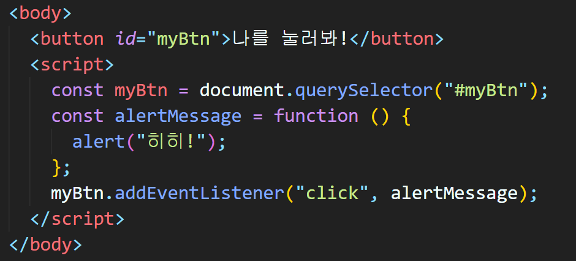

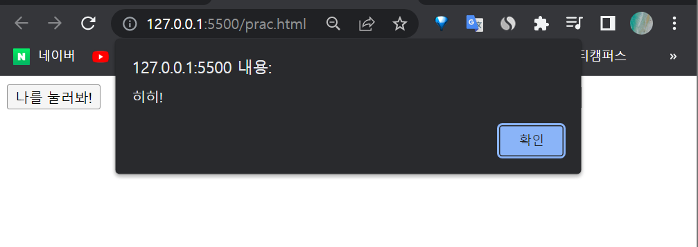

> querySelector로 target에 접근한 후 함수를 만든 다음 `click`시에 함수가 동작하도록 addEventListener를 사용

 

#### ✔️ 내용 입력하면 그대로 업데이트하기

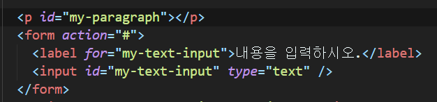

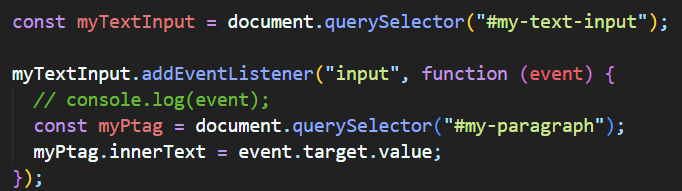

> form의 input에 들어가는 내용(text)에다가 addEventListener를 추가
>
> 그 내용 자체를 p 태그 안의 innertext에 업데이트를 해주는 것

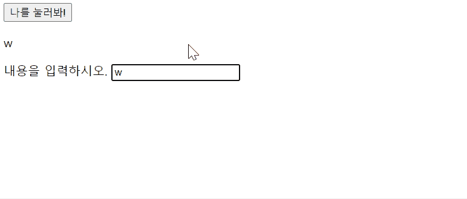

 

#### ✔️ 색깔 입력하면 그대로 바뀜

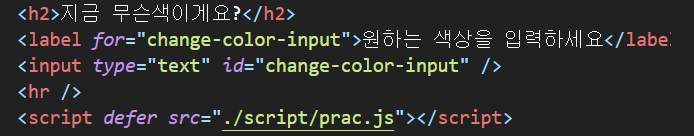

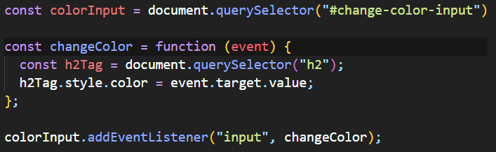

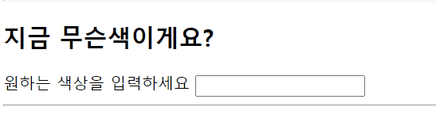

> 위와 유사. 이번엔 innerText가 아니라 style.color를 사용

 

### ✅ Event 취소

- `event.preventDefault()`
- 현재 이벤트의 기본 동작을 중단
- HTML 요소의 기본 동작을 작동하지 않게 막음
  - a 태그의 기본 동작은 클릭 시 링크로 이동 / form 태그의 기본 동작은 form 데이터 전송
- 이벤트를 취소할 수 있는 경우, 이벤트의 전파를 막지 않고 그 이벤트를 취소

 

#### ✔️ checkbox 막기

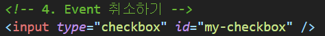

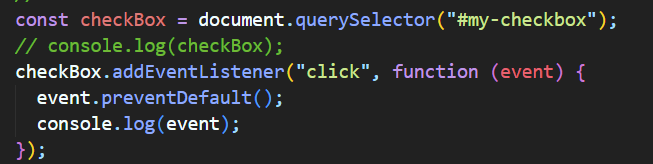

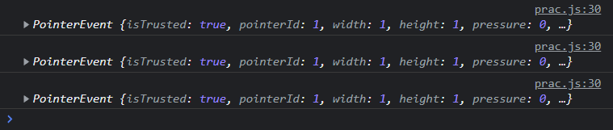

> click 이벤트를 prevent 했기 때문에 체크박스를 누르면 막힘

- 이외에도 submit, scroll 등의 이벤트도 취소할 수 있음 + 취소할 수 없는 이벤트도 존재

 

---

## 🟨 실습

