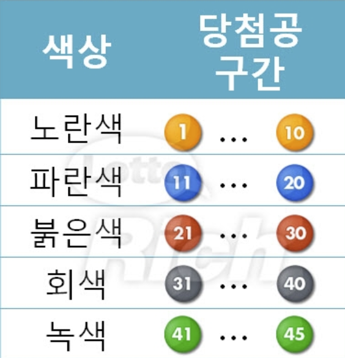

# 9/20

---

## 🟨 실습

### 🧩 기본

- 버튼을 눌렀을 때 번호 6개를 추천하는 코드를 작성

### 🧩 추가 기능

- 숫자별로 적절한 색상을 활용합니다.

  

- 사용자에게 정보를 받아 주어진 수량의 번호를 한번에 제공

- GitHub Pages 기능을 활용하여 배포

### 🧩 결과물

- [깃허브 링크](https://github.com/kmk4162/lotto-gererator)
