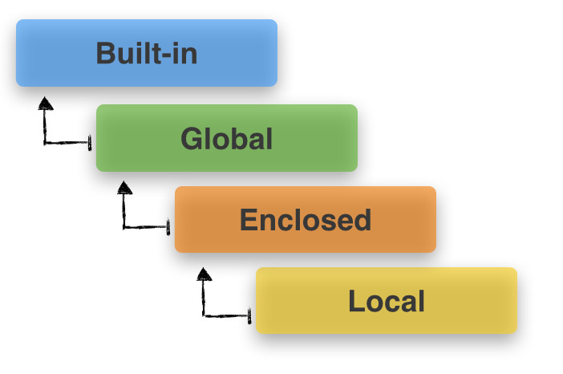

# 7/13

# 🌇 오전

## 🕓 9:00 ~ 10:00

### ✅ 함수

- 우리는 왜 함수를 사용할까

  1. 기능을 분해해서 재사용이 가능(Decomposition)

  2. 복잡한 내용을 숨기고, 기능에 집중해서 사용할 수 있음(Abstraction)

     👉 재사용성, 가독성 증가

<br>


## 🕓 10:00 ~ 12:00

### ✅ 파이썬 자습서

- 참고하면 굿!

  👉[파이썬 자습서](https://docs.python.org/3/)

<br>


### ✅ 함수 기본 구조

#### 💻 1. 선언 및 호출

- def 키워드 활용해서 선언
- 들여쓰기를 통해서 `Function body` 작성
- 함수는 `함수명()`으로 호출
- 호출되면 코드를 실행하고 `return`값을 반환하면서 종료됨

<br>


#### 💻 2. 함수의 결과값(Output)

- return
  - 함수는 `반드시 값을 하나만` return함
  - 명시적인 return이 없는 경우에도 None을 반환
    - return 없이 print만 쓰는 경우에 None이 나옴!

  - 그리고 return과 동시에 함수는 종료

- return문에 한 개 이상의 값을 받고싶으면?
  - 튜플 반환: (1, 20) 이런식으로!(튜플 한 개라고 인지)

<br>


#### 💻 3. 함수의 입력(Input)

- parameter
  - 함수 실행할 때 함수 내부에서 사용되는 식별자
- argument
  - 함수 호출할 때 넣어주는 값
  - 함수 호출 시 parameter를 통해 전달되는 값


> `ham`이 parameter, `spam`이 argument

- keyword arguments

  - 직접 변수의 이름으로 특정 argument를 전달할 수 있음

  - 예시

    ```python
    def add(x, y):
        return x + y
    add(x = 2, y = 5)
    ```

    > x = 2 이런식으로 바로 변수의 이름으로 할당!


- 정해지지 않은 갯수의 arguments


  - 몇개의 인자를 받을지 모르는 함수를 정의할 때 유용!

  - parameter 앞에 `*`를 붙이면

  - 튜플로 반환해줌!

    

- 정해지지 않은 갯수의 keyword arguments
  - 앞에 `**`를 붙임!
  - 딕셔너리로 묶여서 처리됨

<br>


#### 💻 4. 함수의 범위(Scope)

- 함수는 코드 내부에 local scope를 생성하며, 그 외의 공간인 global scope로 구분

- 객체 수명주기
  - 각자의 수명주기가 존재
    - built-in scope: `파이썬이 실행된 이후부터 영원히 유지`
    - global scope: `모듈이 호출된 시점 이후 혹은 인터프리터가 끝날때까지 유지`
    - local scope: `함수가 호출될 때 생성되고, 함수가 종료될 때까지 유지`

- 이름 검색 규칙(Name Resolution)
  - LEGB Rule: Local - Enclosed - Global - Builtin 순서
  - 함수 내에서는 바깥 scope의 변수에 `접근은 가능하나 수정을 할 수 없음!`
  
  

<br>

### ✅ 함수 응용

- map(function, iterable)
  - 순회 가능한 데이터구조의 모든 요소에 함수를 적용(int, float 등)하고, 그 결과를 `map object`로 반환한다
  - 알고리즘 문제 풀이시 input 값들을 바로 숫자로 활용하고 싶을때 사용!!


# 🌆 오후

## 🕓 1:00 ~ 6:00

### ✅ 실습

