# 7/14

# 🌇 오전

## 🕓 9:00 ~ 11:00

### ✅ 시퀀스(순서가 있는 데이터 구조)

#### 💻 1. 문자열

- 문자들의 나열(str)

- 문자열 탐색 / 검증

  - `.find(x)`: x위 첫번째 위치를 반환, `없으면 -1`을 반환

    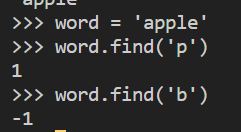

  - `.index(x)`: x위 첫번째 위치를 반환, `없으면 오류 발생`

    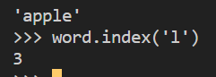

  - `.isdecimal()`: 숫자인지 아닌지, True/False 반환 (여러가지 있는데 이거만 쓰자)

 

- 문자열 변경

  - `.replace(old, new[,count])`

    - 바꿀 대상 글자를 새로운 글자로 바꿔서 반환

      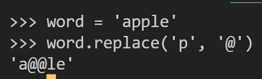

    - count를 지정하면 해당 개수만큼만 시행 (얘는 선택적)

      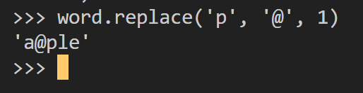

  - `.strip()`

    - 보통 공백 제거; space, \n도 포함

    - 문자기준 양쪽 제거(strip), 왼쪽만 제거(lstrip), 오른쪽만 제거(rstrip) 가능

      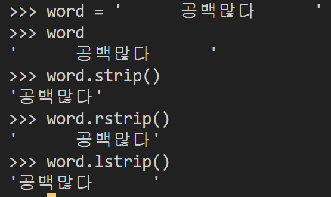

    - 문자열을 따로 지정하지 않으면 위처럼 공백을 제거함

  - `.split(sep = None, maxsplit = -1)`

    - 문자열을 특정한 단위로 나눠 `리스트로 반환`

      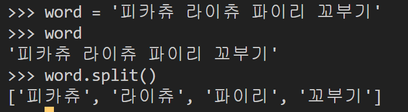

      > 한 줄의 문자열이 공백을 기준으로 요소별로 나뉘어지고 리스트에 담기게 됨!

    - sep이 None이거나 지정되지 않으면 연속된 공백문자를 `단일한 공백문자`로 간주

      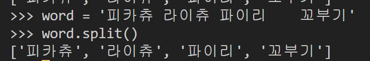

      > 파이리 뒤에 공백이 많아도 따로 separator를 지정해두지 않으면 하나로 처리!

  - `'separator'.join([iterable])`

    - 반복가능한 컨테이너 요소(iterable)을 `separator(구분자)`로 합쳐서 문자열 반환

      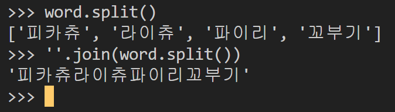

      > 구분자가 `''`이기 때문에 한줄에 공백 없이 합쳐짐

      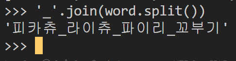

      > 변형도 가능!

    - 숫자 리스트는 불가능 👉 map 활용해서 문자열로 바꾸면 가능

  - 기타 변경 예시들

    - 문자열은 스스로 바뀌는 경우가 없음(immutable)하기 때문에

      모두가 바뀐 결과를 반환

 

#### 💻 2. 리스트(List)

- 값 추가 및 삭제

  - `.append(x)`

    - 리스트 마지막에 값을 추가

      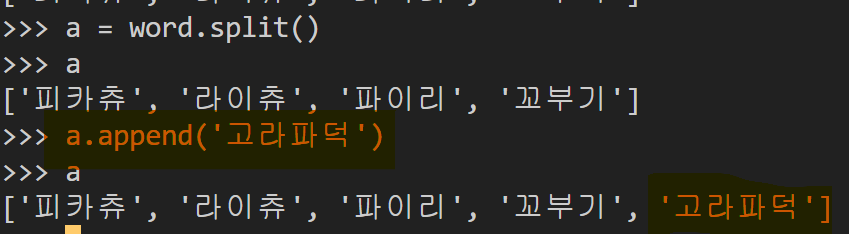

  - `.extend(iterable)`

    - 리스트에 iterable을 추가함(여러개 넣고 싶을 때)

      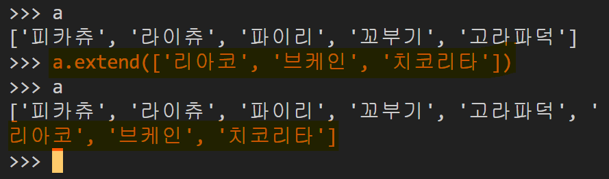

      > 2세대 포켓몬 리스트들 추가 가능!

  - `insert(i, x)`

    - 정해진 위치 i에 값을 추가함

      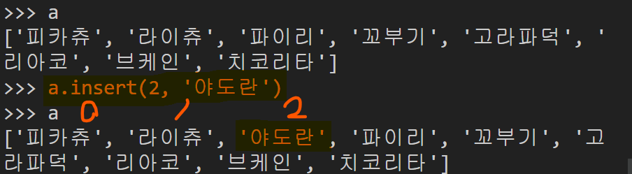

    - 리스트 길이보다 i가 커도 에러가 안 뜨고 맨 뒤에 배치

  - `.remove(x)`

    - 리스트에서 값이 x인 것을 삭제

    - 원본 리스트에서 삭제하고, 없는 경우 ValueError 발생

      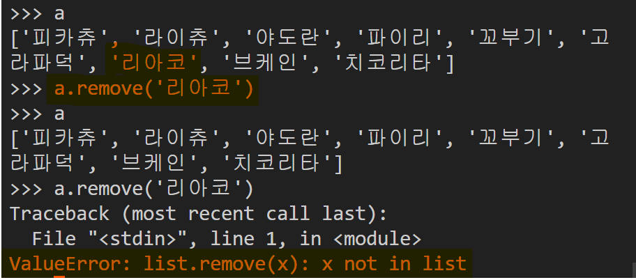

  - `.pop(i)`

    - 정해진 위치 i에 있는 값을 삭제하고, 그 항목을 반환

      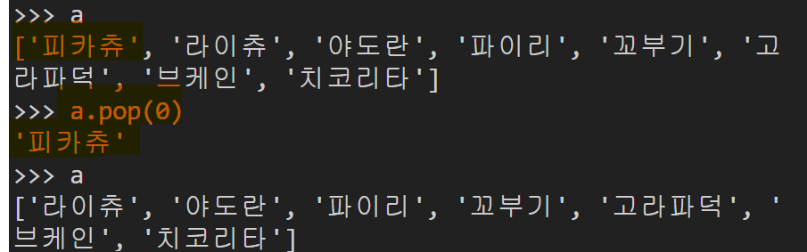

    - i가 지정되지 않으면, 마지막 항목을 삭제하고 반환

  - `.clear()`

    - 모든 항목 삭제

      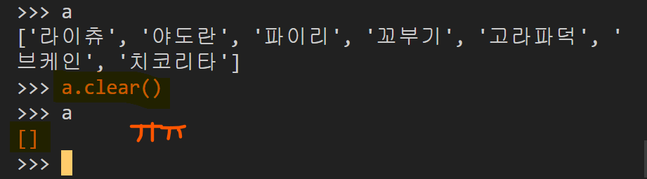

      > 잘가~

 

- 탐색 및 정렬

  - `.index(x)`

    - x값을 찾아 해당 index를 반환

    - 없는 경우 ValueError

      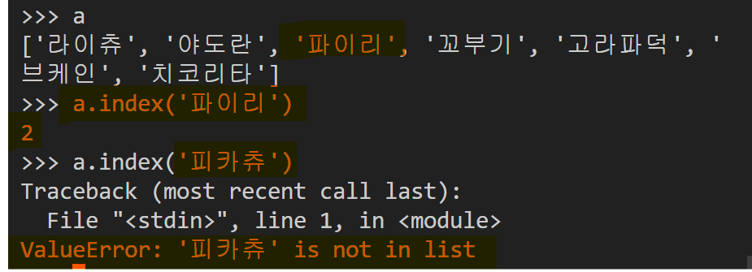

  - `.count(x)`

    - 원하는 값의 개수를 반환

      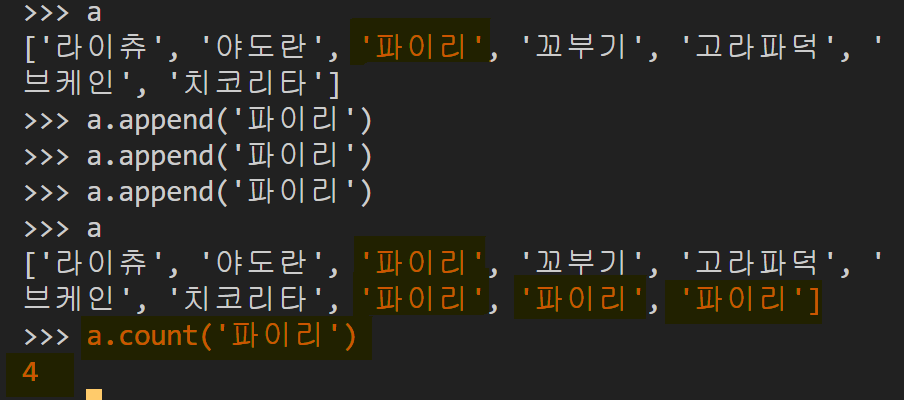

  - `.sort()`

    - 원본 리스트를 정렬함, `None 반환`

      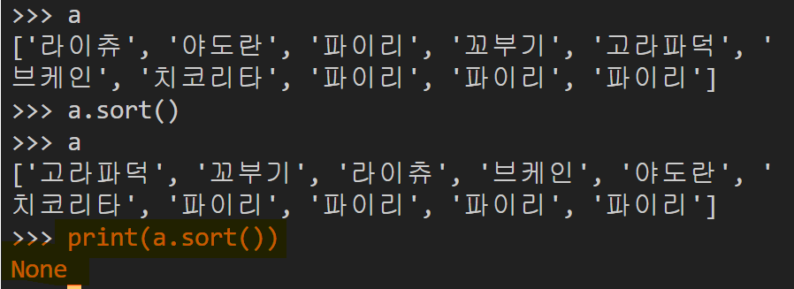

      > 원본의 순서를 바꾸어주고 a.sort()는 None!

    - sorted 함수와 비교해보자

      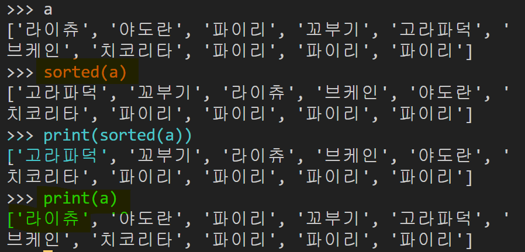

      > 원본은 그대로이고 sorted(a)는 순서 정렬된 리스트를 반환!

      

  - `.reverse()`

    - 순서를 반대로 뒤집음, None 반환

      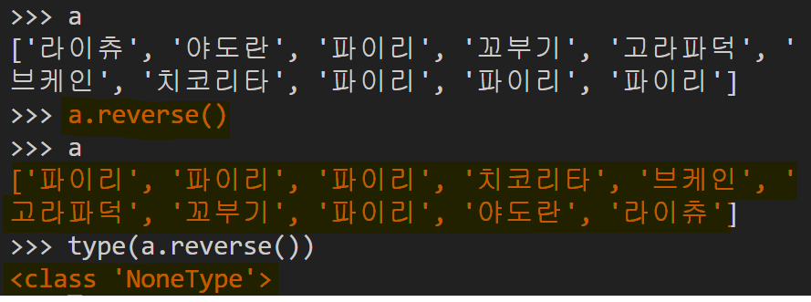

- 메소드 vs 함수

1. 함수
   - 함수의 값을 변수에 대입할 수 있다.
   - 독립적으로 정의되므로 이름으로만 호출이 가능
   - 메소드 보다 더 포괄적인 의미
2. 메소드(method)
   - 객체와 연관되어 사용(str, float, list 등)
   - 이름으로만 호출 불가능
   - 메소드의 기능을 실행할 객체가 꼭 있어야만 함!(S.V 형태)

 

---

### ✅ 컬렉션(순서가 없는 데이터 구조)

#### 💻 1. 세트

pass(추후 정리)

 

#### 💻 2. 딕셔너리

- key와 value 두개가 존재한다는 점이 포인트

- 조회

  - `.get(key[,default])`

    - key를 통해 value를 가져옴

    - KeyError가 발생하지 않으면서 default값을 설정할 수 있음(기본은 None)

      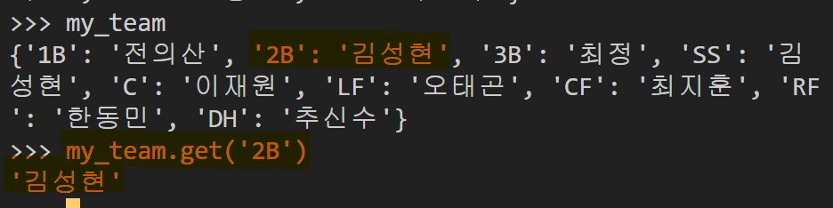

  - `.pop(key[,default])`

    - key가 딕셔너리에 있으면 제거하고 `해당 값을 반환`

    - 그렇지 않으면 default를 반환

    - default가 없으면 KeyError

      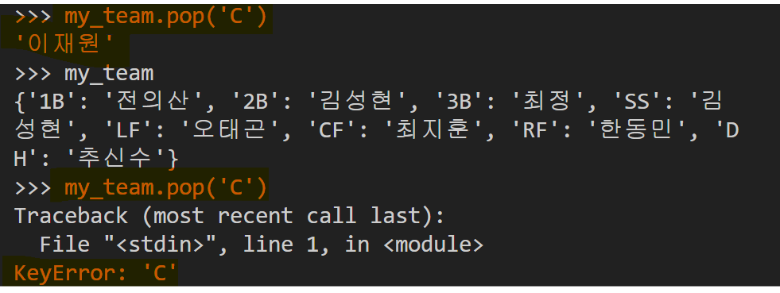

  - `.update([other])`

    - 값을 제공하는 key,value로 덮어씀

      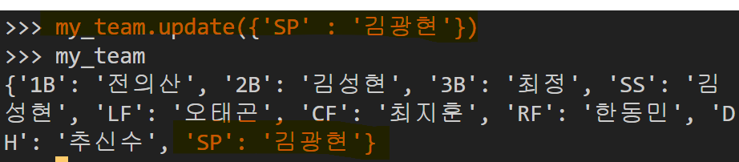

      > 딕셔너리 형태로 추가
      >
      > key값이 오직 숫자라면 key = 'value' 이런식으로도 update 가능
      >
      > 문자열이라면 딕셔너리형태로 괄호 안에 넣어서 update
      >
      > key가 이미 존재한다면 value값이 update 한대로 바뀜!

 

# 🌆 오후

## 🕓 1:00 ~ 6:00

### ✅ 실습

