# 7/15

# 🌇 오전

## 🕓 9:00 ~ 12:00

### ✅ 모듈(Module) & 패키지(Package)

- `다양한 기능을 하나의 파일로!`
- 이런 다양한 패키지를 하나로 묶은것이 `라이브러리`
- 이것을 관리하는 관리자가 `pip`

 

### ✅ 파이썬 표준 라이브러리(PSL)

- 파이썬에 기본적으로 설치된 모듈과 내장함수
  - 예시: random.py

 

### ✅ 파일 읽고 쓰기를 코드로

- 파일을 `open`해서 관리가 가능
- r, w, a는 각각 읽기, 쓰기, 덮어쓰기

 

#### 💻 파일 쓰기

- 파일 열고 파일 내에서 쓸 때에는 `f.write`를 써야함!

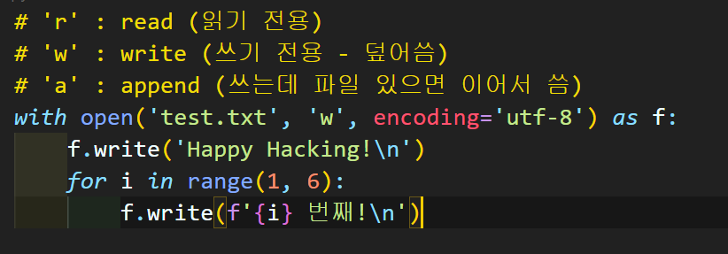

> 원래는 파일을 열면  닫아줘야 하는데 `with`를 쓰면 알아서 닫히기 때문에 `f.close()`를 할 필요가 없다!

 

#### 💻 파일 읽기

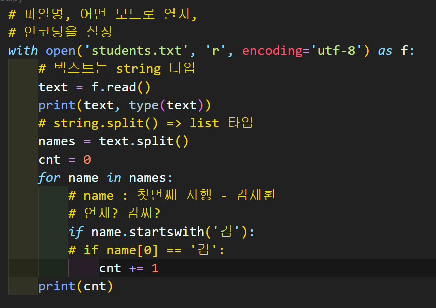

> `text = f.read()` 라고 두면 파일을 다 읽어옴
>
> type을 찍어보면 str(문자열)

 

### ✅ read vs readline vs readlines

#### 💻 1. read

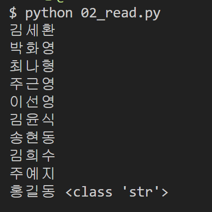

> 파일 내용 전체를 읽고, 파일 내용 전체를 하나의 문자열로 반환
>
> 각각의 줄은 `\n`으로 구분

 

#### 💻 2. readline

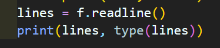

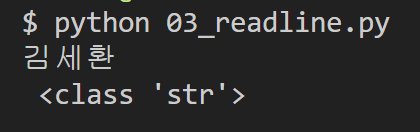

한번만 readline을 쓰면 파일의 첫 줄만 읽어오고

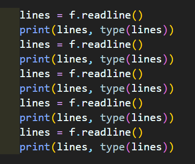

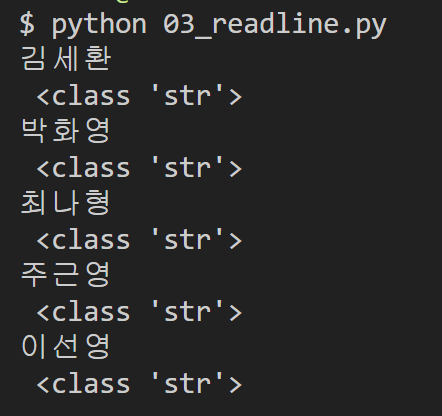

여러번 쓰면 그만큼 한 줄 씩 읽어옴

> 아, 파일을 줄 단위로 읽는구나!

그렇기 때문에 전체 파일을 다 읽어오는 코드를 구현하려면 반복문 사용

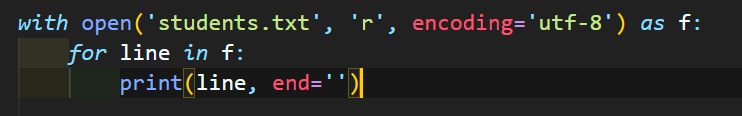

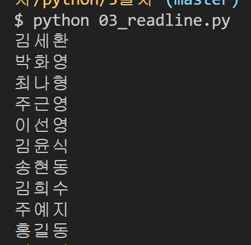

 

#### 💻 3. readlines

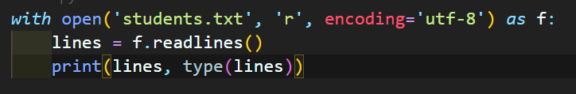

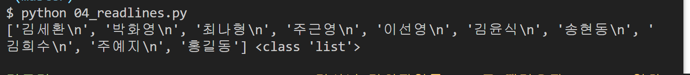

> 개행 문자를 기준으로 모든 줄을 읽어서 한 라인씩 `리스트`로 값을 반환

이 개행문자를 지우고 싶으면 `strip`을 쓰자

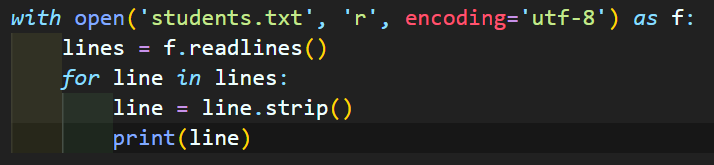

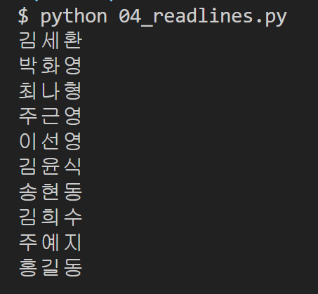

 

### ✅ JSON

- 데이터 교환 방식

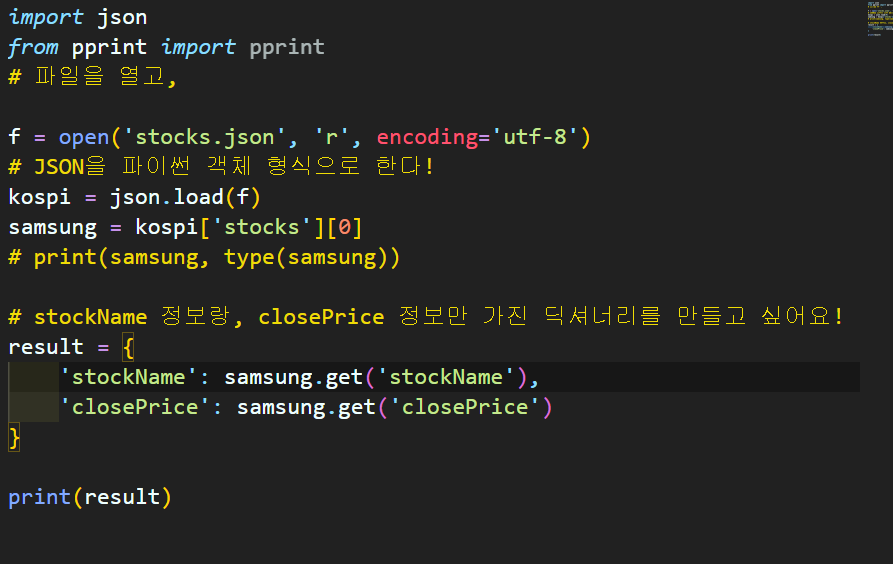

> json을 이용하면 딕셔너리, 딕셔너리 요소 안에 리스트, 딕셔너리... 이런 자료 구조를 가져올 수 있음
>
> `pprint`쓰면 딕셔너리 출력을 훨씬 깔끔하게 보여줌!
>
> 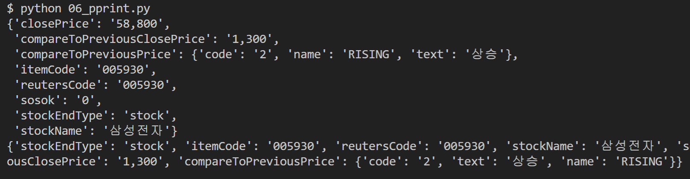

 

# 🌆 오후

## 🕓 1:00 ~ 6:00

### ✅ 프로젝트

