# 7/19

# 🌇 오전

## 🕓 9:00 ~ 12:00

### ✅ OOP (Object Oriented Programming)

- 파이썬은 모든 것이 `객체` 👉 어떠어떠한 것!

- 클래스에서 정의한 것을 토대로 메모리에 할당된 것

- 각각의 객체는 메시지를 주고받고 데이터를 처리할 수 있다!

- 대상의 정보와 동작 (S + V)

- 타입과 실제 사례가 있다

  👉 '', 'hi', 'hello' 처럼 모두 같은 타입(문자열)이지만 각각의 값(실제 사례)가 있다.

  >  타입은 `class`, 그 값은 `instance`

- 객체는 `특정 타입(클래스)`의 `인스턴스(사례, 예시)`이다.
  - 123, 900, 5는 모두 int의 인스턴스
  - [1,2,3], []는 모두 lilst의 인스턴스
  - 'hello', 'bye'는 모두 string의 인스턴스

  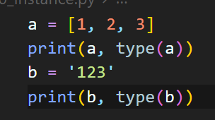

  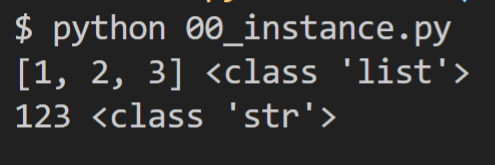

  > 각각 클래스가 list와 str로 정의돼있음

 

- 객체의 특징
  - 타입(type) : 어떤 `연산자`와 `조작(method)`이 가능한가

    > 1 + 3 == 4 지만 [1, 2] + [3, 4] == [1, 2, 3, 4] 처럼
    >
    > type에 따라 다르게 활용됨!

  - 속성(attribute) : 어떤 `상태`를 가지는가
  - 조작법(method) : 어떤 `행위(함수)`를 할 수 있는가

- 객체지향이 왜 강력한가?
  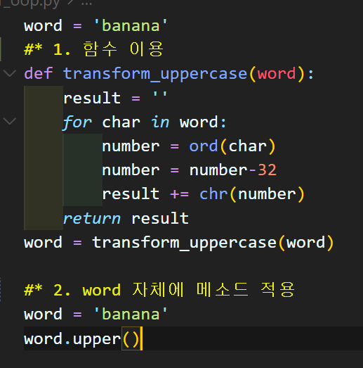

  > 어떤 단어를 전부 대문자로 만든다고 하자
  >
  > 1. 이전처럼 함수만 쓸 수 있었다면 transform_uppercase와 같이 함수를 만들고 그 함수에 인자를 넣어야 대문자로 바꿔 나오는 일만 가능했음
  >
  > 2. 그러나 객체지향 프로그래밍이 된다면 단어 자체에 바로 .upper()라는 메소드를 적용시킬 수 있음!

  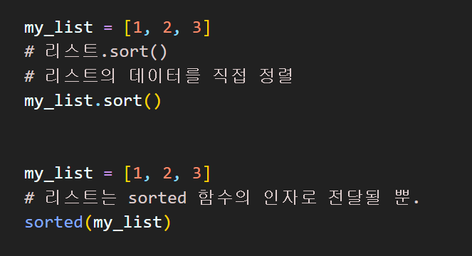

  > 리스트를 정렬하는 2가지 방법도 같은 맥락이다
  >
  > 1. sorted() 내장함수는 우리가 정렬하기를 원하는 리스트를 넣고 그에 대한 반환값을 받을 뿐이고 `바뀐 값을 또 다른 변수에 저장을 해야만 한다!`
  >
  > 2. 하지만 .sort()는 리스트의 데이터를 직접 조작이 가능하다!

- 현실 세계를 프로그램 설계에 반영(추상화)

  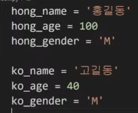

  > 기존처럼 변수에 하나하나 저장하는 방식. 
  >
  > 즉, 사람 한명 추가할때마다 하나하나 저장하는 방식에서 더 효율적으로 데이터를 저장하는 방식이 있다면?

  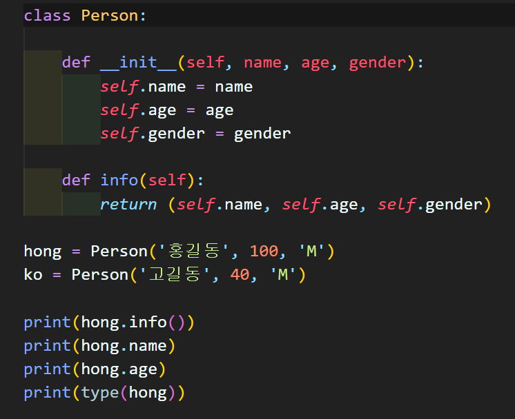

  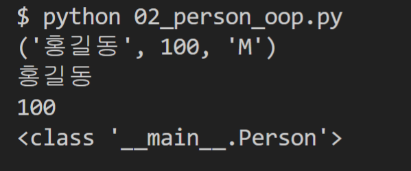

  > `Person`이라는 클래스를 만들고 그 안에 특성을 만들어두기 
  >
  > 이전처럼 str, list, int가 아닌 우리가 만든 Person이라고 클래스가 뜸!
  >
  > 👉 하나하나의 사례들(인스턴스)을 관리하는 방식!!

- 새로운 타입을 내가 직접 만들고 그걸 활용하는 것 👉 메서드(S.V)처럼 가능

- 클래스는 Person, 인스턴스는 iu / 클래스는 list, 인스턴스는 [1,2,3]

- 사각형의 넓이와 둘레를 구한다고 생각해보자

  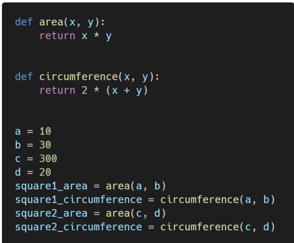

  - 이전의 절차지향적 방식에는 함수를 미리 만들어두고 거기에 변수를 대입하고 저장하는 방식을 썼음

  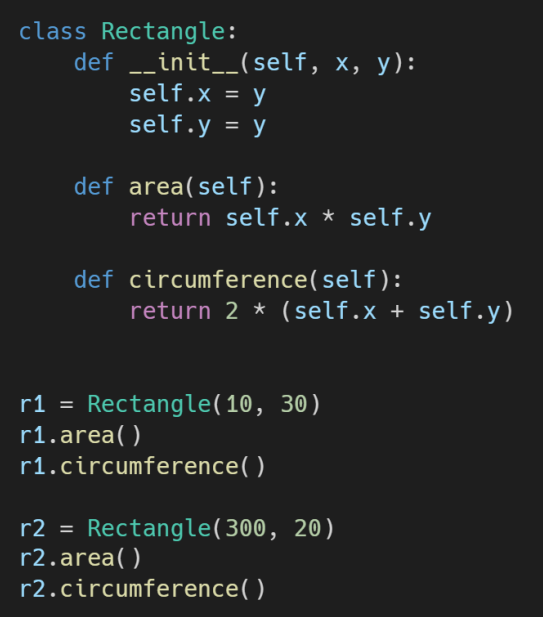

  - 객체지향적으로 바꾼다면 사각형이라는 클래스를 정의하고 그 안에 넓이랑 둘레를 미리 만들어두는 것

  - 우리가 각 인스턴스를 정의하고(가로 10에 세로 30인 사각형도 있을 것이고, 가로 300에 세로 200인 사각형도 있을 것), 그걸 활용(조작)이 가능한 것!!

- 위의 사각형 예시를 이용해서 객체 지향 프로그래밍을 정의하면

  - 사각형 : `클래스(class)`
  - 각 사각형(r1, r2) : `인스턴스(instance)`
  - 사각형의 정보(가로길이, 세로길이) : `속성(attribute)`
  - 사각형의 행동 / 기능(넓이 구하기, 높이 구하기) :`메소드(method)`

- 그냥 모든 것이 다 객체다 라고 생각하자

  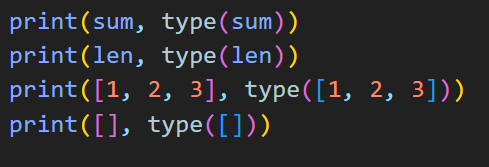

  우리가 계속 쓰던 sum(), len() 함수도

  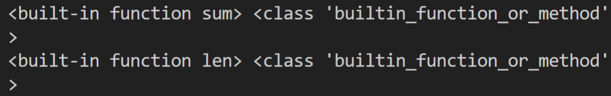

  내부에서 만들어진 `builtin_function_or_method`라는 클래스를 이미 가지고 있음!

- 그렇다면 우리는 왜 클래스를 활용하는가?

  > 우리가 원하는 자료구조를 직접 만들 수 있음!
  >
  > 단지 리스트, 딕셔너리 등은 미리 만들어져있으면 쓰기 편하기 때문에 파이썬에서 대신 만들어 준 것들

 

### ✅ 기본 문법

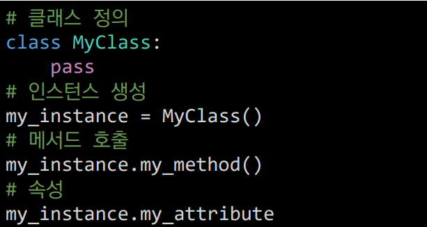

- 클래스 정의 시에는 `CamelCase`, 함수 이름은 `snake_case`로 이름 짓는 문법이 중요! 

  👉 쓰여진 모습만 봐도 아 클래스구나, 함수구나를 알 수 있도록

- 클래스와 인스턴스

  - 클래스는 객체들의 분류

  - 인스턴스는 하나하나의 실체/예

    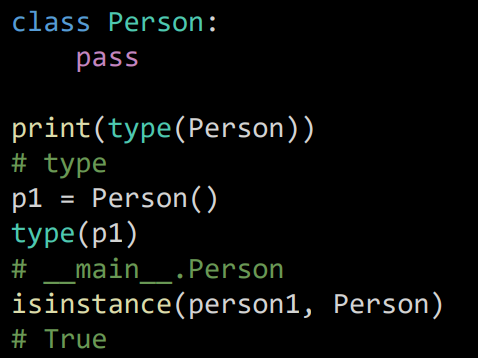

    > Person이라는 class의 타입을 찍어보면 `type`이라고 나옴
    >
    > 그리고 그 Person 클래스에 있는 p1이라는 인스턴스의 타입을 찍어보면 `Person`이라고 뜸

- 속성

  - 특정 데이터 타입의 객체들이 가지게 될 상태/데이터를 의미
  - Person 클래스에는 `.name`, `.age`, `.gender` 등등이 속성이라고 할 수 있음(보통 사람의 이름, 성별, 나이 등등을 넣으니 예시를 들음)
- 메소드

  - 특정 데이터 타입의 객체에 공통적으로 적용 가능한 행위(함수)
  - `클래스 내부에서 정의됨`
- 객체 비교하기

  - ==
    - 동등한(equal)
    - 두 객체가 같아 보이지만 실제로 동일한 대상을 가리키고 있다고 확인해 주는 것은 아님
    
  - is
    - 똑같은 객체이냐는 물음
    - 두 변수가 정말 동일한 객체를 가리키는 경우에만 True
- 얕은 복사

  - 주소까지 똑같지는 않음 👉 원본도 같이 바뀌지 않음!
  - c = [3, 4, 5] 👉 d = list(c) 이런식으로 (리스트 형변환)
- 깊은 복사
  - `copy.deepcopy` 사용
  - 이러면 주소까지 똑같아짐

---

1. 인스턴스 변수

   - 인스턴스가 개인적으로 가지고 있는 속성

   - 생성자 메소드에서 `self.<name>`으로 정의

   - 인스턴스가 생성된 이후에 `<instance>.<name>`으로 접근 및 할당

2. 인스턴스 메소드

   - 호출 시 첫번째 인자로 자기자신(self)이 전달됨

   - self란?
     - `인스턴스 자기자신`
     - 파이썬에서 인스턴스 메소드는 호출 시 첫번째 인자로 인스턴스 자신이 전달되게 설계
     - 매개변수 이름으로 self를 첫번째 인자로 정의

3. 생성자(constructor) 메소드

   - 인스턴스 객체가 생성될 때 자동으로 호출되는 메소드

   - 인스턴스 변수들의 초기값을 설정
     - 인스턴스 생성
     - `__init__`메소드를 자동으로 호출

4. 소멸자(destructor) 메소드
   - 인스턴스 객체가 소멸되기 직전에 호출되는 메소드

# 🌆 오후

## 🕓 1:00 ~ 6:00

### ✅ 실습

