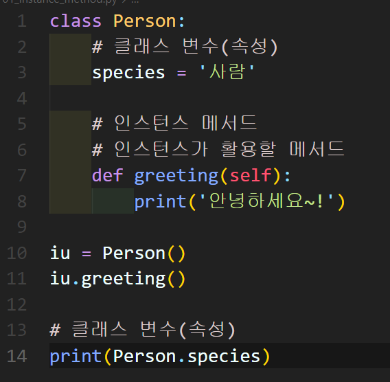
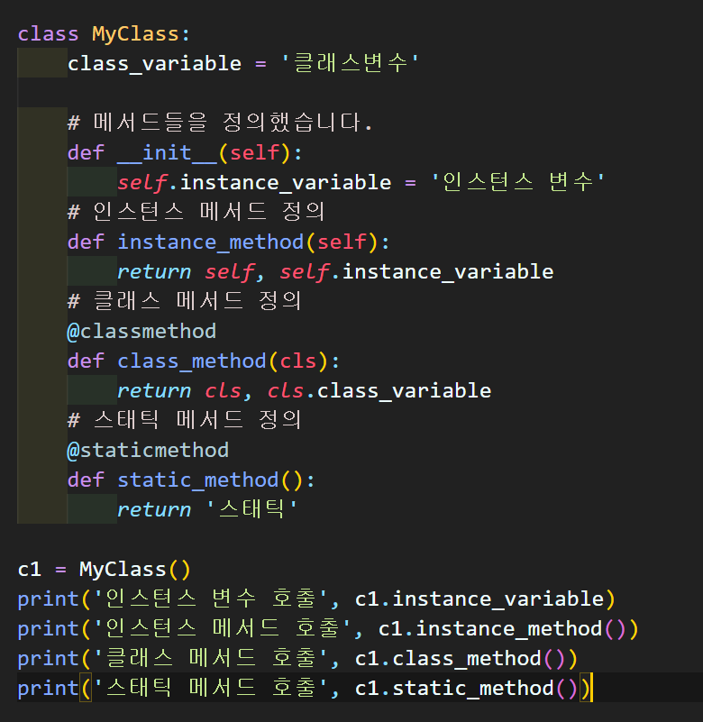
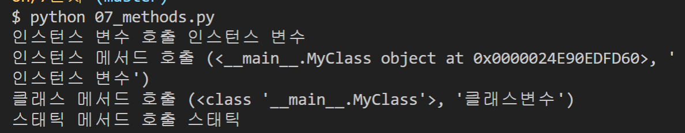

# 7/20

# 🌇 오전

## 🕓 9:00 ~ 12:00

### ✅ 클래스(Class)

- 클래스 속성(attribute)

  - 클래스 내부에서 정의

  - `classname.name` 으로 접근하고 할당

    

    > Person이라는 클래스 안에서 species = '사람' 이라고 정의해두면
    >
    > classname.name 형태인 `Person.species`로 '사람'에 접근이 가능

- 인스턴스와 클래스 간의 이름 공간 : `namespace`
  - 클래스를 정의하면, 클래스와 해당하는 이름 공간 생성
  - 인스턴스를 만들면, 인스턴스 객체가 생성되고 이름 공간 생성
  - 인스턴스에서 특정 속성에 접근하면, `인스턴스 - 클래스` 순서로 탐색

- 클래스 메소드
  - 클래스가 사용할 메소드
  - `@classmethod` 데코레이터를 사용하여 정의
  - 호출 시 첫번째 인자로 클래스(cls)가 전달됨(클래스 안의 메소드 정의할때 첫번째 인자로 self 넣는 것처럼!)

- 스태틱 메소드
  - 인스턴스 변수, 클래스 변수를 전혀 다루지 않는 메소드
  - 단지 기능(행동)만을 하는 메소드 정의할 때 사용
  - `@staticmethod` 데코레이터를 사용하여 정의
  - 호출 시 어떠한 인자도 전달되지 않음

> 👉 둘째 줄에 `<__main__.MyClass object at 0x0000024E90EDFD60>`는 instance_method를 정의할때 첫번째로 인자로 넘어오는 것이 인스턴스 자체를 뜻함
>
> 👉 클래스 메서드 호출 결과가 `<class '__main__.MyClass'>, '클래스변수'` 인데, 이 역시 class_method 정의할때 cls(클래스 자체)를 넘겨주기 때문에 클래스가 자체가 나온다
>
> 👉 스태틱 매서드는 넘게준게 없기 때문에 어떤 인스턴스나 클래스를 쓰지 않고 그냥 return '스태틱' 만 실행 

 

### ✅ 객체 지향의 핵심개념

- 추상화

  - 다른 사람이 활용할 수 있도록 로또 기능 만들고 이 기능을 동작가능한 메서드를 생성해놓음
  - 불필요한 정보는 숨기고 중요한 정보만을 표현함으로써 프로그램을 간단히 만드는 것
  - 부모 클래스에서 자식 클래스로 내려올수록 구체화

- 상속
  - 하위 클래스는 상위 클래스에 정의된 속성, 행동, 관계 및 제약 조건을 모두 상속 받음!
  - 메소드를 `재사용` 가능
  - `Person`이라는 클래스를 만들고, `class Student(Person)` 이라고 만들면 Student 클래스는 Person 클래스의 자식 클래스 이므로 Person 클래스에서 만들어 놓은 메서드도 따로 선언할 필요없이 사용이 가능!
  - `super()` : 자식클래스에서 부모클래스를 사용할 때
  - 메소드 오버라이딩 : 자식 클래스에서 재정의 가능(덮어쓰기)

- 다형성

  - 메소드 덮어쓰기가 가능
  - 이해가 잘 된다 나중에 보고 직접 코드 쳐보자 👉 [참고자료!](https://heytech.tistory.com/109)

- 캡슐화

  - 사용자가 변수와 메소드에 직접적으로 접근하여 실수/고의로 데이터를 변경하는 행위를 미연에 방지하기 위해

  - 회사에서 판매, 총무, 경영 등의 부서가 있고 각 부서마다 처리하는 데이터가 다른데, 다른 부서에서 우리 부서의 데이터에 임의로 접근하고 수정이 가능하면 혼란이 발생할 것!

    👉 이를 막기 위해 너무 쉽게 데이터에 접근가능함을 막는 것!

# 🌆 오후

## 🕓 1:00 ~ 6:00

### ✅ 실습

