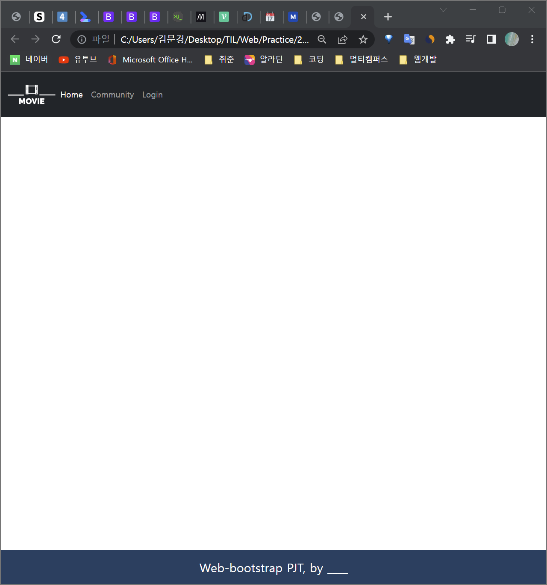
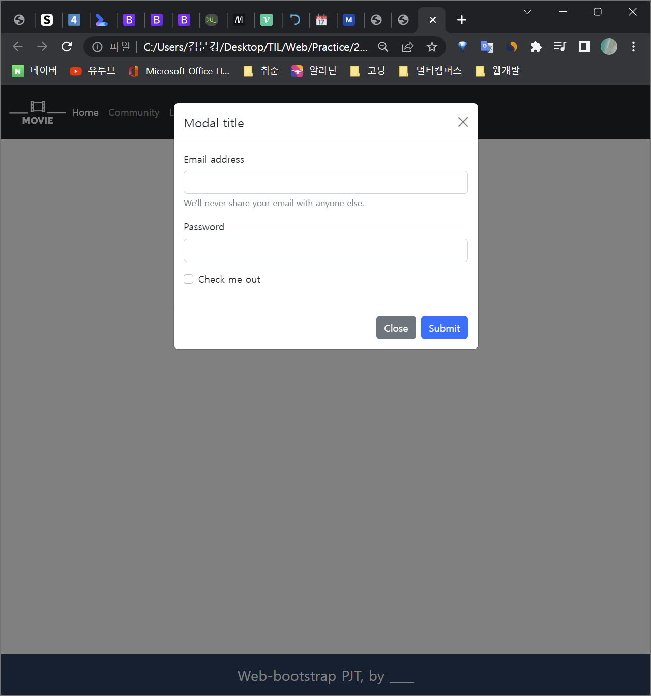
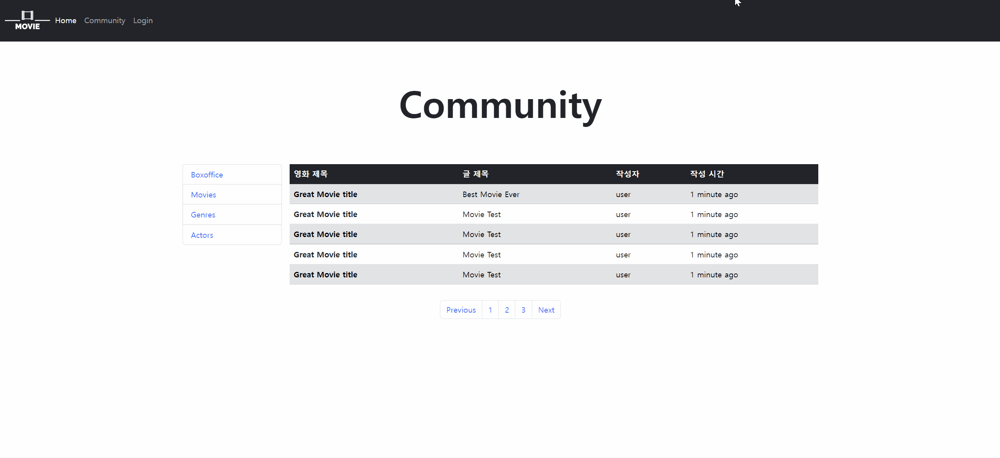

# ✔️ 0913 프로젝트 일지

## ✅ 참고자료 : https://www.notion.so/hphk-edu/02-5e023a910fc34eb4aa7851bcdaaa7103

 

### 🟨 nav_footer.html

> navbar의 home과 Community를 클릭하면 각각 home.html과 community.html로 이동하게 구현
>
> Login을 누르면 Modal이 팝업됨
>
> 

 

### 🟨 home.html

> 상단 이미지는 carousel을 이용해서 일정한 시간 간격으로 로테이션
>
> Viewport의 가로 크기가 576px 미만일 경우 한 행에 1개씩 표시하고, 가로 크기가 576px 이상일 경우 한 행에 2개 이상 표시되게 구현 👉 row, col breakpoint를 설정해줌

 

### 🟨 community.html

> breakpoint별로 992px 이상일때는 표가 나오게, 992px 미만일때는 카드형식으로 나오게 구현