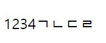

# 8/30

# 🌇 오전

## 🕓 9:00 ~ 12:00

### 🟨 CSS 기본 스타일

#### ✅ 크기 단위

- px (픽셀)
  - 모니터 해상도의 한 화소인 '픽셀' 기준
  - 픽셀의 크기는 변하지 않기 때문에 `고정적인 단위`
- %
  - 백분율 단위
  - 가변적인 레이아웃에서 자주 사용
- em
  -  (바로 위, 부모 요소에 대한) `상속의 영향`을 받음
  - 배수 단위, 요소에 지정된 사이즈에 `상대적인 사이즈`를 가짐
- rem
  - 바로 위, 부모 요소에 대한) `상속의 영향을 받지 않음`
  - 최상위 요소(html)의 사이즈를 기준으로 `배수 단위`를 가짐

 

> - em, rem의 원래 기본 단위는 `font-size`의 기본 값인`16px`
> - em을 만약에 20px로 늘린다면 0.5em은 10px, 2em은 40px 이런식으로 비례해서 증감을 함
> - em은 상위 요소의 폰트 사이즈에서 상속을 받음 👉 `ul`태그의 폰트 사이즈는 2em 이라서 32px로 받고, 그 밑의 `li`태그의 폰트 사이즈 역시 `em` 클래스라서 2em으로 되는데, 여기서는 em이 16이 아니라 상위 태그인 2 * em = 32가 기본 em으로 됨. 따라서 하위 요소의 2em은 16 * 2 * 2 = 64px로 더 커지는 것! 
> - rem은 `root`, 즉 최상위 요소의 font-size 값을 기준으로 하는데, HTML의 최상위 요소는 <html> 임
> - 예를 들어 div로 묶고 그 안에서 font-size를 변화시켜도, 제일 근본인 html의 font-size가 변하지 않는다면 rem은 변하지 않음
> - 유지 보수가 쉬운 `rem`을 사용하자!

- viewport
  - 웹 페이지를 방문한 유저에게 바로 보이게 되는 웹 컨텐츠의 영역 👉 `디바이스 화면`
  - 디바이스의 viewport를 기준으로 상대적인 사이즈가 결정됨

<br>

#### ✅ 색상 단위

- 색상 키워드 `background-color: red;`
  - 대소문자 구별 x
  - red, blud, black 처럼 특정 색을 직접 글자로 나타냄
- RGB 색상 `background-color: rgb(0, 255, 0);`
  - 16진수 표기법을 통해서 특정 색을 표현
- HSL 색상 `background-color: hsl(0, 100%, 50%);`
  - 색상, 채도, 명도를 통해서 특정 색을 표현

<br>

#### ✅ CSS 문서 표현

- 텍스트
  - 서체(`font-family`), 서체 스타일(`font-style`, `font-weight`) 등
  - 자간(`letter-spacing`), 단어 간격(`word-spacing`), 행간(`line-hegiht`) 등
- 컬러(color), 배경(background-image, background-color)
- 기타 HTML 태그별 스타일링
  - 목록(li), 표(table)

> 필요할 때 MDN 문서를 잘 찾아보자

<br>

### 🟨 CSS Selectors

#### ✅ 선택자 유형

- 기본 선택자
  - 전체 선택자, 요소 선택자
  - 클래스 선택자, 아이디 선택자, 속성 선택자
- 결합자
- 의사 클래스 / 요소

> 일단 지금은 선택자는 `class 주면 된다` 라고만 생각하자!

<br>

#### ✅ CSS 적용 우선순위

1. `!important`
   - 너무 셈. class, id tag 다 쓸모 없어짐
   - 웬만하면 손 대지 말자 ㅋㅋㅋ
   - 단, 외부 라이브러리 사용할때는 꽤 사용
2. 우선 순위
   - 인라인 > id > class, 속성, pseudo-class > 요소, pseudo-element
3. CSS 파일 로딩 순서

<br>

#### ✅ CSS 상속

- CSS는 상속을 통해 `부모 요소의 속성을 자식에게 상속`
  - 속성(프로퍼티) 중에는 상속이 되는 것과 되지 않는 것들이 있음
  - 상속 되는 것 예시
    - 예) Text 관련 요소(font, color, text-align), opacity, visibility 등
  - 상속 되지 않는 것 예시 
    - 예) Box model 관련 요소(width, height, margin, padding, border, box-sizing, display), position 관련 요소(position, top/right/bottom/left, z-index) 등

<br>

### 🟨 CSS Box model

#### ✅ Box model

> 원칙1 : 모든 요소는 `네모(박스모델)`이고, 위에서부터 아래로, 왼쪽에서 오른쪽으로 쌓임


- 모든 HTML 요소는 box 형태로 돼있음
- 하나의 박스는 네 영역으로 이루어짐
  - `margin` : 테두리 바깥의 외부 여백, 배경색 지정 x
  - `border` : 테두리 영역
  - `padding` : 테두리 안쪽의 내부 여백, 요소에 적용된 배경색, 이미지는 padding까지 적용
  - `content` : 글이나 이미지 등 요소의 실제 내용


```css
.box {
      margin: 1rem; 
      padding: 1rem;
      background-color: bisque;
      border: 1px solid black;
    }
```


> - padding은 1rem 이니까, 16px씩 상하좌우로 있음 👉 background-color가 padding에 적용됨
> - border는 1px에 solid black이므로 검은 실선의 1px 만큼 추가됨
> - margin도 1rem이니까, 16px씩 상하좌우에 추가 여백이 들어가는 모습


> - 3개의 margin 값을 추가하면 각각 위/ 양 옆/ 아래 이렇게 구분이 됨!
>
> - 4개를 선택할 시, 위에서부터 시계방향으로 각각 margin 설정

<br>

#### ✅ Box-Sizing

- 다음의 content-box의 너비는 얼마일까?

```css
.box2 {
        width: 100px;
        margin: 10px auto;
        padding: 20px;
        border: 1px solid black;
        background-color: blueviolet;
        color: white;
        text-align: center;
}
```


> - 142px이 나옴 👉 width 100 + padding 20px * 2(양 옆) + border 1px * 2(양 옆)
>
> - 그런데 width를 100으로 설정한 만큼, 내 원래 의도는 너비가 100인 사각형을 원했음

```css
.border-box {
        box-sizing: border-box;
}
```


> - content 박스 크기가 100에서 58로 자동으로 줄어듦
>
> - 그래서 58 + 20 * 2 + 1 * 2 = 100으로 됨!


> ```css
> div {
>   width: 160px;
>   height: 80px;
>   padding: 20px;
>   border: 8px solid red;
>   background: yellow;
> }
> 
> .content-box {
>   box-sizing: content-box;
>   /* Total width: 160px + (2 * 20px) + (2 * 8px) = 216px
>      Total height: 80px + (2 * 20px) + (2 * 8px) = 136px
>      Content box width: 160px
>      Content box height: 80px */
> }
> 
> .border-box {
>   box-sizing: border-box;
>   /* Total width: 160px
>      Total height: 80px
>      Content box width: 160px - (2 * 20px) - (2 * 8px) = 104px
>      Content box height: 80px - (2 * 20px) - (2 * 8px) = 24px */
> }
> ```
>
> 
>
> 
>
> - 위와 같은 조건일 때 비교를 하면
> - `content-box`의 경우는 기본 width 160에 양쪽 padding 20, border 8을 더해서 전체 width가 216px이 됨
> - 반면 `border-box`의 경우 padding과 border를 주고 나머지 부분을 width: 160px 에 맞춰서 계산을 하기 때문에, 전체 width는 160px이고, 안쪽 content가 104px로 설정이 됨

<br>

### 🟨 CSS Display

#### ✅ 인라인 / 블록 요소

> 원칙 2 : display에 따라 크기와 배치가 달라진다.

- `display: block`
  - `줄 바꿈이 일어나는` 요소
  - `화면 크기 전체의 가로 폭`을 차지 👉 기본적으로 margin이 전체 가로를 차지함! 이 사실을 잊지말자
  - 블록 레벨 요소 안에 인라인 레벨 요소가 들어갈 수 있음
- `display: inline`
  - `줄 바꿈이 일어나지 않는` 행의 일부 요소
  - `content 너비만큼 가로 폭`을 차지
  - width, height, margin-top, margin-bottom을 지정할 수 없음
  - 상하 여백은 `line-height`로 지정한다.

<br>

#### ✅ 블록 레벨 요소와 인라인 레벨 요소

- 블록 레벨 요소에는
  - div, ul, ol, li, p, hr, form 등
- 인라인 레벨 요소에는
  - span, a, img, input, label, b, em, i, strong 등

<br>

##### ✔️ block

- 블록 레벨 요소는 margin이 무조건 붙어있다고 생각!

​	


> - `block`은 막는다의 의미
> - `block-center` 는 양 옆 margin을 auto로 해서, 양 옆을 막겠다
> - `block-right`는 left에만 margin을 다 밀어넣어서 오른쪽을 막겠다
> - `block-left`는 right에만 margin을 다 밀어넣어서 왼쪽을 막겠다


> `text-align`을 사용하면 위의 예시와 다르게 block 안의 text를 가운데로 정렬할 수 있음

<br>

##### ✔️ inline

- margin top, bottom을 줄 수 없음
- 너비, 높이도 못 가짐




> 1234, ㄱㄴㄷㄹ 라는 컨텐츠 영역만큼만 가질 수 있음

<br>

#### ✅ 다른 display들

##### ✔️ display: inline-block

- block과 inline 레벨 요소의 특징을 모두 가짐
- inline처럼 한 줄에 표시할 수 있고, block처럼 width, height, margin 속성을 모두 지정할 수 있음

<br>

##### ✔️ display: none

- 해당 요소를 화면에 표시하지 않고, 공간조차 부여되지 않음
- 이와 비슷한 `visibility: hidden`은 해당 요소가 공간은 차지하나 화면에 표시만 하지 않음

<br>

# 🌆 오후

## 🕓 1:00 ~ 6:00

### 🟨 실습

#### ✅ 실습 1, 2

<br>

