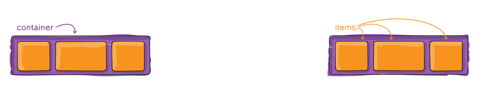
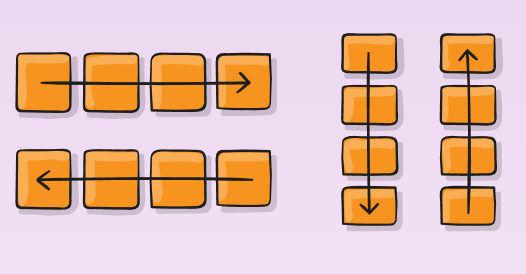
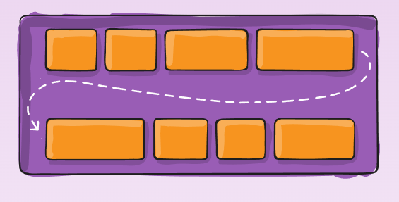
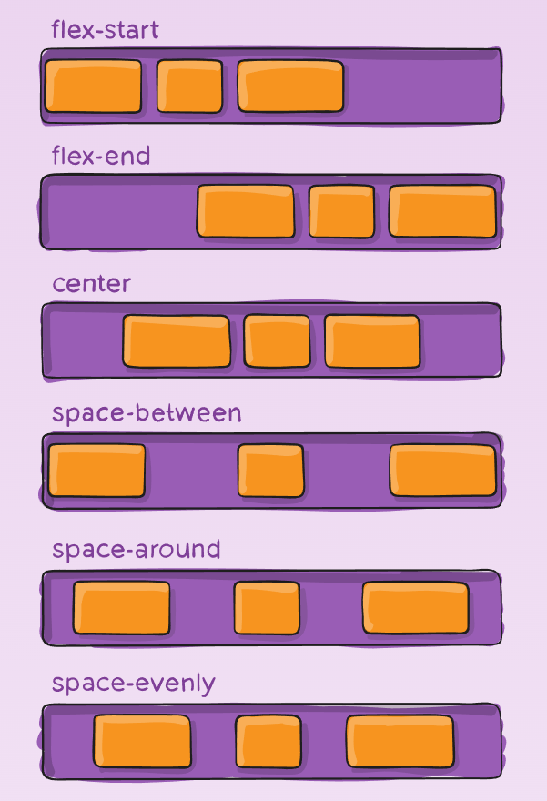
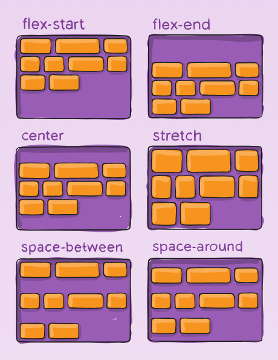
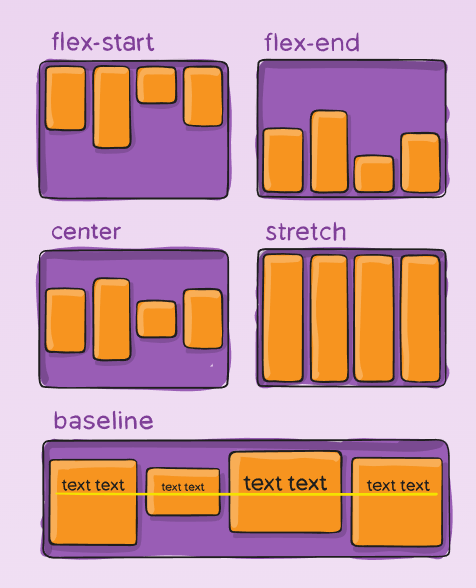
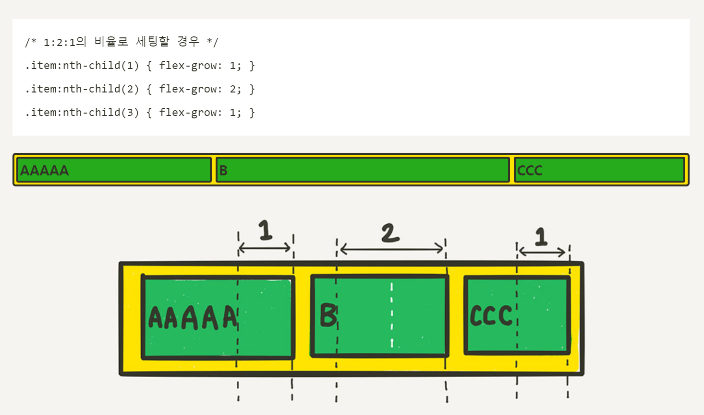
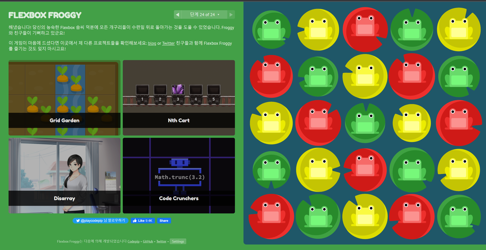

# 8/31

# 🌇 오전

## 🕓 9:00 ~ 12:00

### 🟨 CSS Position

#### ✅ CSS position

- 문서 상에서 요소의 위치를 지정
- `static` : 모드 태그의 기본 값 (기준 위치)
  - 일반적인 요소의 배치 순서에 따름 (좌측 상단)
  - 부모 요소 내에서 배치될 때는 부모 요소의 위치를 기준으로 배치됨

- 좌표 프로퍼티`(top, bottom, left, right)를` 사용하여 이동 가능

<br>

##### ✔️ 1. relative : 상대 위치

- 자기 자신의 static 위치를 기준으로 이동 (normal flow 유지)
- 즉, 원래 relative를 주지 않았다면 있었을 기본 위치를 기준으로 top, bottom, left, right position을 통해 기준점을 새로 잡아줌!
- 레이아웃에서 요소가 차지하는 공간은 static일 때와 같음 (normal position 대비 offset)

<br>

##### ✔️ 2. absolute : 절대 위치

- 요소를 일반적인 문서 흐름에서 제거 후 레이아웃에 공간을 차지하지 않음 (normal flow에서 벗어남)
- `static이 아닌 가장 가까이 있는 부모/조상 요소를 기준으로 이동` (없는 경우 브라우저 화면 기준으로 이동

<br>

##### ✔️ 3. fixed : 고정 위치

- 요소를 일반적인 문서 흐름에서 제거 후 레이아웃에 공간을 차지하지 않음 (normal flow에서 벗어남)
- `부모 요소와 관계없이 viewport를 기준으로 이동`
- `스크롤 시에도 항상 같은 곳에 위치`

<br>

##### ✔️ 4. sticky : 스크롤에 따라 static에서 fixed로 변경

- 속성을 적용한 박스는 평소에 문서 안에서 `position: static` 상태와 같이 일반적인 흐름에 따르지만
- 스크롤 위치가 임계점에 이르면 `position: fixed`와 같이 박스를 화면에 고정할 수 있는 속성

<br>

### 🟨 CSS Layout

#### ✅ CSS layout techniques

- Display
- Position
- Float (CSS1, 1996)
- `Flexbox` (2012) 👉 얘가 혁명❗
- Grid (2017)
- 기타...

<br>

### 🟨 Flexbox

#### ✅ CSS Flexible Box Layout

- `행과 열` 형태로 아이템들을 배치하는 1차원 레이아웃 모델

- 축
  - main axis (메인 축)
  - cross axis (교차 축)
- 구성 요소
  - Flex Container (부모 요소)
  - Flex Item (자식 요소)

<br>

#### ✅ Flexbox 구성 요소

- Flex Container (부모 요소)
  - flexbox 레이아웃을 형성하는 가장 기본적인 모델
  - Flex Item들이 놓여있는 영역
  - display 속성을 `flex` 혹은 `inline-flex`로 지정

```css
.container {
  display: flex; /* or inline-flex */
}
```

- Flex Item (자식 요소)
  - 컨테이너에 속해 있는 컨텐츠(박스)



<br>

#### ✅ 왜 Flex?

> 수직 정렬 & 아이템의 너비와 높이 or 간격을 동일하게 배치하기 쉬워짐!

<br>

#### ✅ Flex 속성

##### ✔️ 배치 설정

- `flex-direction`
  - Main axis 기준 방향 설정



> 왼쪽 위부터 row, row-reverse, column, column-reverse

<br>

- `flex-wrap`
  - 아이템이 컨테이너를 벗어나는 경우 해당 영역 내에 배치되도록 설정
  - 기본적으로 컨테이너 영역을 벗어나지 않도록 함



> - nowrap (기본값) : 줄바꿈을 하지 않음. 넘치면 그냥 삐져 나감
> - wrap : 줄바꿈을 함
> - wrap-reverse : 줄바꿈을 하는데 아이템을 역순으로 배치

<br>

- `flex-flow`
  - flex-direction과 flex-wrap를 동시에 설정이 가능
  - direction, wrap 순서로 설정 값을 차례로 작성
  - 예) `flex-flow: row nowrap;`

<br>

##### ✔️ 공간 나누기

- `justify-content` 👉 Main axis 방향으로 정렬 (수평)

  

  > - flex-start : 기본값, 아이템들을 시작점을 기준으로 정렬
  > - flex-end : 아이템들을 끝점을 기준으로 정렬
  > - center : 아이템들을 가운데로 정렬
  > - space-between : 아이템들의 `사이`에 균일한 간격을 만들어 줌
  > - space-around : 아이템들의 `둘레`에 균일한 간격을 만들어 줌
  > - space-evenly : 아이템들의 `사이와 양 끝`에 균일한 간격을 만들어 줌

- `align-content` 👉 Cross axis 방향으로 정렬 (수직), `여러 행 정렬`

  

  > - flex-start : 기본값, 아이템들을 시작점을 기준으로 정렬
  > - flex-end : 아이템들을 끝점을 기준으로 정렬
  > - center : 아이템들을 가운데로 정렬
  > - space-between : 아이템들의 `사이`에 균일한 간격을 만들어 줌
  > - space-around : 아이템들의 `둘레`에 균일한 간격을 만들어 줌
  > - space-evenly : 아이템들의 `사이와 양 끝`에 균일한 간격을 만들어 줌
  > - stretch : 아이템들이 컨테이너를 가득 채우게 함

##### ✔️ 정렬

- `align-items`

  - 수직축 방향으로 정렬
  - justify-content의 수직 방향 정렬이라고 생각하면 됨

  

  > - stretch : 기본값, 수직축 방향으로 쭉 늘어남
  > - flex-start : 시작점 기준으로 정렬
  > - flex-end : 끝 기준으로 정렬
  > - center : 가운데로 정렬
  > - baseline : 텍스트 베이스라인 기준으로 정렬

<br>

- `align-self`
  - 개별 아이템을 Cross axis 기준으로 정렬
  - 컨테이너에 적용하는 것이 아니라 개별 아이템에 적용!
  - align-items가 전체 아이템의 수직축 방향 정렬이라면, align-self는 해당 아이템의 수직축 방향 정렬

<br>

#### ✔️ 기타

- `order`

  - 배치 순서를 바꿔주는 기능
  - 기본은 0

- `flex-grow`

  - 아이템이 flex-basis의 값보다 커질 수 있는지를 결정하는 속성
  - 아이템들을 제외한 여백 부분을 flex-grow에 지정된 숫자의 비율로 나누어 가짐

  

  > - 여백의 비가 1 : 2 : 1로 나뉘어지는 모습!
  > - 참고자료 : https://studiomeal.com/archives/197

>  참고자료 : https://css-tricks.com/snippets/css/a-guide-to-flexbox/#background


# 🌆 오후

## 🕓 1:00 ~ 6:00

### 🟨 실습

- CSS 배운 내용 정리

- Flex floggy 완료 스크린샷 👉주소 https://flexboxfroggy.com/#ko 

  

- 어제 실습을 flex로 변환

  [실습1 파일]()

  [실습2 파일]()

<br>

