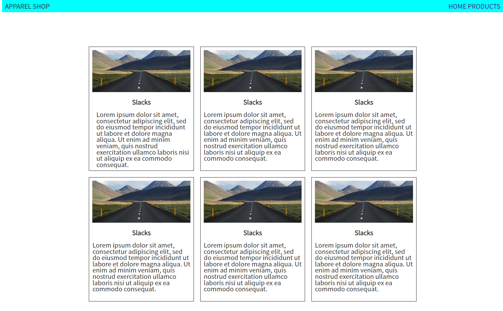
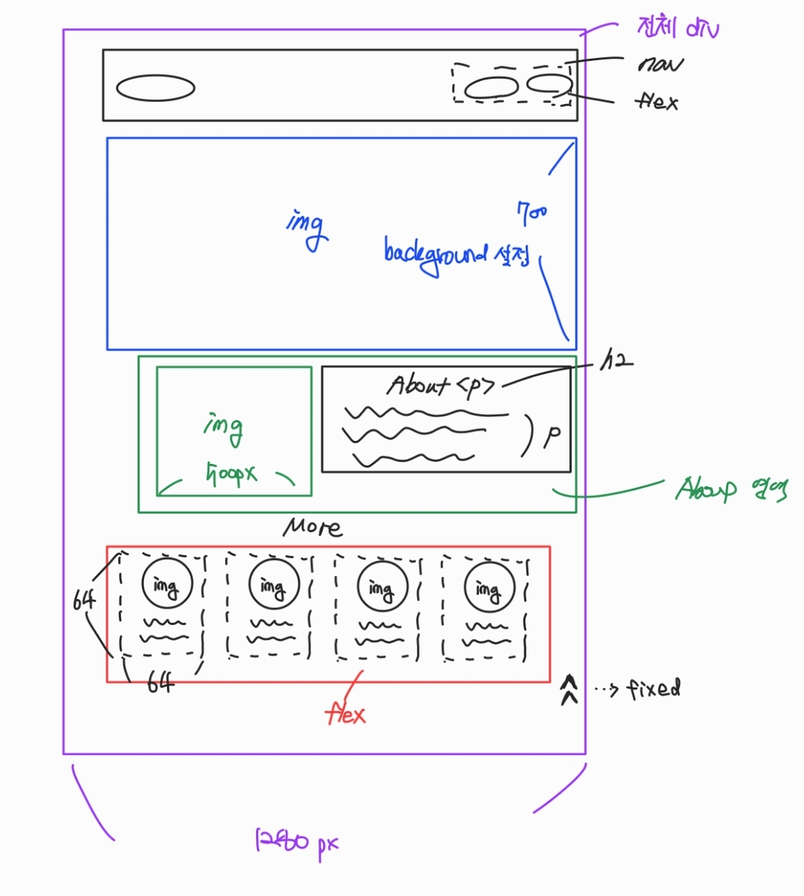

# 9/1

# 🌇 오전

## 🕓 9:00 ~ 12:00

### 🟨 시맨틱 태그

#### ✅ 시맨틱 태그란

- HTML 태그가 `특정 목적, 역할 및 의미적 가치`(semantic value)를 가지는 것

  - h1 태그는 “이 페이지에서 최상위 제목”인 텍스트를 감싸는 역할(또는 의미)을 나타냄

- Non semantic 요소로는 `div, span`등이 있으며 `a, form, table` 태그들도 시맨틱 태그로 볼 수 있음
- 대표적인 시맨틱 태그 목록
  - header : 문서 전체나 섹션의 헤더(머리말 부분)
  - nav : 내비게이션
  - aside : 사이드에 위치한 공간, 메인 콘텐츠와 관련성이 적은 콘텐츠
  - section : 문서의 일반적인 구분, 컨텐츠의 그룹을 표현
  - article : 문서, 페이지, 사이트 안에서 독립적으로 구분되는 영역
  - footer : 문서 전체나 섹션의 푸터(마지막 부분

 

#### ✅ 시맨틱 태그 사용해야하는 이유

- 의미론적 마크업
- 개발자 및 사용자 뿐만 아니라 검색엔진 등에 의미 있는 정보의 그룹을 태그로 표현
- 단순히 구역을 나누는 것 뿐만 아니라 `의미`를 가지는 태그들을 활용하기 위한 노력
- 요소의 의미가 명확해지기 때문에 `코드의 가독성`을 높이고 유지보수를 쉽게 함
- 검색 엔진 최적화(SEO)를 위해서 메타태그, 시맨틱 태그 등을 통한 마크업을 효과적으로 활용 해야함

> 가장 중요한 것은 내가 지금 만들고 있는 웹페이지가 어떻게 구성되는지 파악할 수 있다!

 

# 🌆 오후

## 🕓 1:00 ~ 6:00

### 🟨 실습

👉 [실습 README pdf 파일](./Practice/220901/README.pdf)

- 메인 페이지

  

- 프로덕트 페이지

  

  

 

