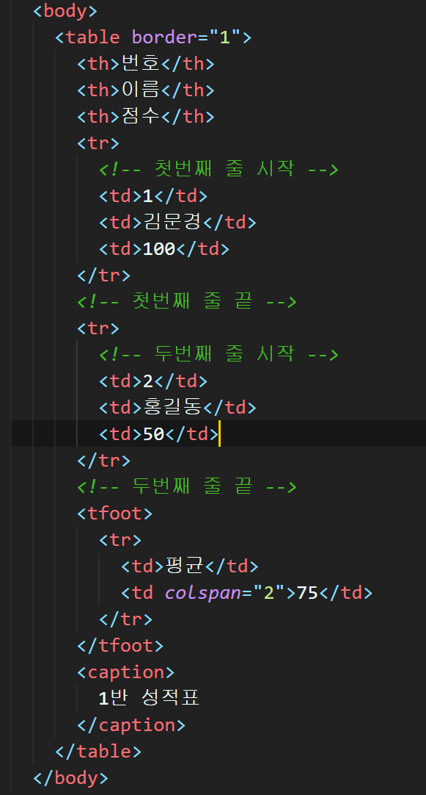
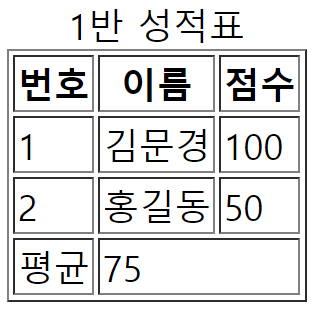
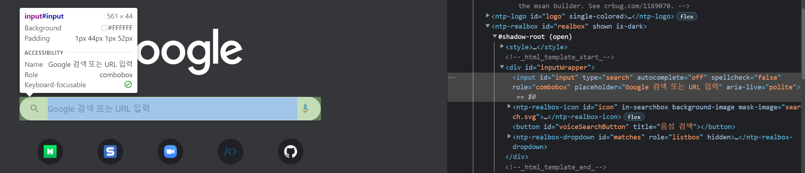
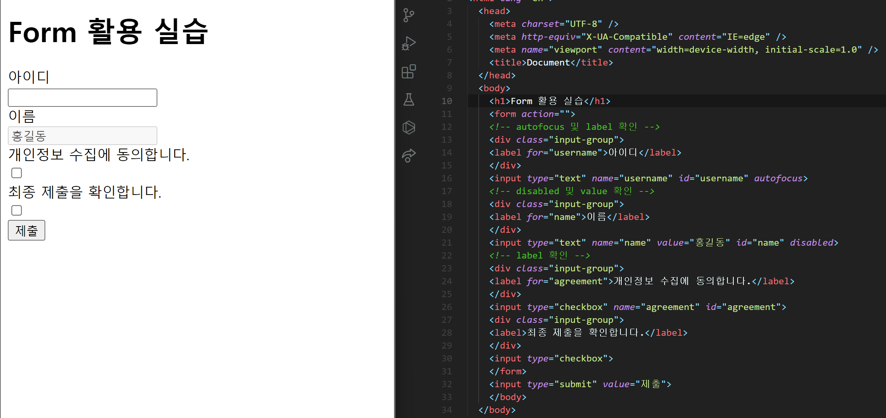
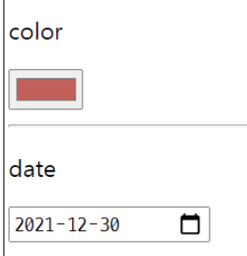
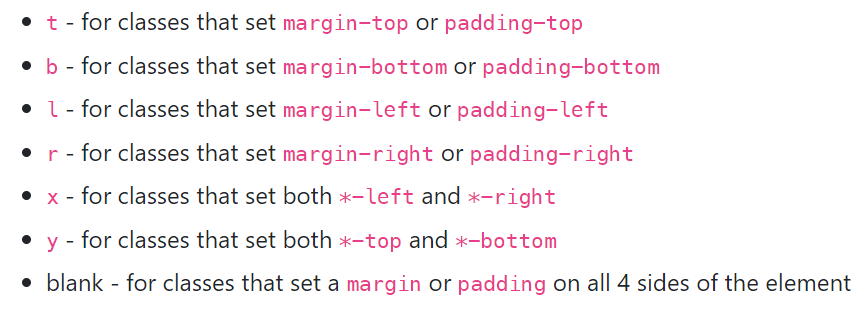
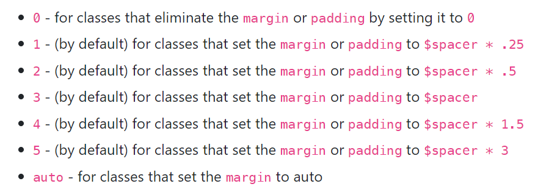
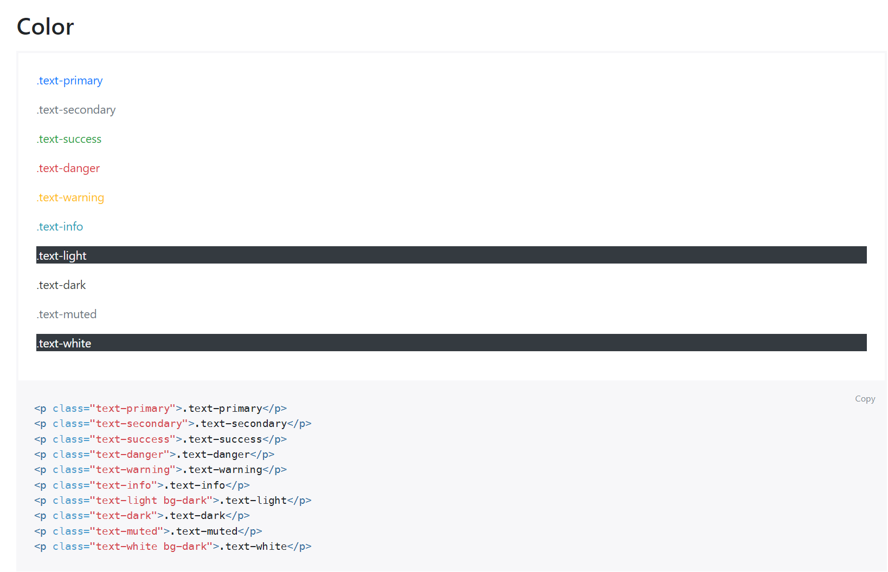
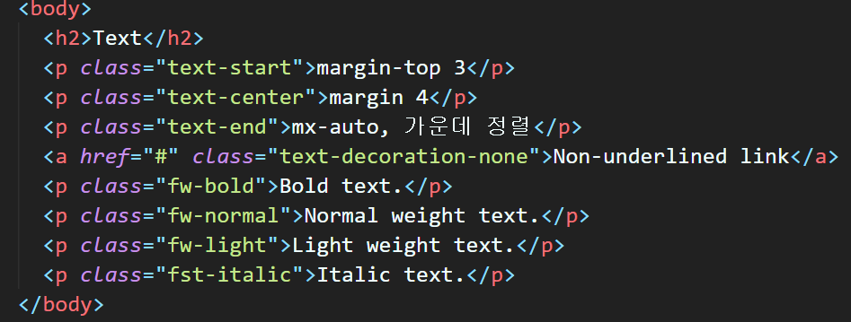
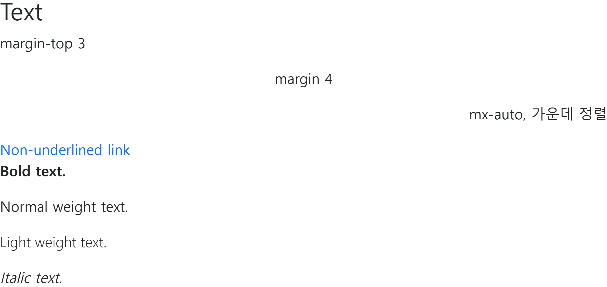

# 9/5

# 🌇 오전

## 🕓 9:00 ~ 12:00

### 🟨 HTML 문서 구조화

#### ✅ table (표)

- table의 각 영역을 명시하기 위해 <thead>, <tbody>, <tfoot> 요소를 활용



- `thead` : header, 위의 목차를 뜻함
- `th`로 목차를 구성하고, `tr`로 가로 줄을 구성
- 내부에는 `th` 또는 `td`로 셀을 구성 (목차의 내부 태그는 th로, 나머지 body나 foot에서는 td 사용)
- `colspan`이나 `rowspan`을 이용해서 셀을 병합할 수 있음
- `caption`을 통해 표 설명 또는 제목을 나타냄

<br>	

#### ✅ form 태그

- `정보(데이터)를 서버에 제출하기 위해 사용하는 태그`

  👉 구글 폼 생각하자

- form 기본 속성

  - `action` : form을 처리할 서버의 URL (데이터를 보낼 곳)
  - `method` : form을 제출할 때 사용할 HTTP 메서드 (GET or POST)
  - `enctype` : method가 post인 경우 데이터의 유형



<br>

#### ✅ input

- 다양한 타입을 가지는 입력 데이터 유형과 위젯이 제공됨
- input의 대표적인 속성
  - `name` : form control에 적용되는 이름 (이름 / 값 페어로 전송됨)
  - `value` : form control에 적용되는 이름 (이름 / 값 페어로 전송됨)
  -  required, readonly, autofocus, autocomplete, disabled 등

<br>

#### ✅ input label

- label을 클릭해서 input 자체의 초점을 맞추거나 활성화 가능
  - 사용자는 선택할 수 있는 영역이 늘어나서 웹 / 모바일 환경에서 편하게 사용할 수 있음
  - label과 input 입력의 관계가 시각적 뿐만 아니라 화면리더기에서도 label을 읽어 쉽게 내용을 확인할 수 있도록 함
- input에는 `id`속성을, label에는 `for`속성을 활용하여 상호 연관을 시킴



<br>

#### ✅ input 유형 - 일반

- 일반적으로 입력을 받기 위하여 제공되며 타입별로 HTML기본 검증 혹은 추가 속성을 활용할 수 있음
  - text : 일반 텍스트 입력
  - password : 입력 시 값이 보이지 않고 문자를 특수기호(*)로 표현
  - email : 이메일 형식이 아닌 경우 form 제출 불가
  - number : min, max, step 속성을 활용하여 숫자 범위 설정 가능
  - file : accept 속성을 활용하여 파일 타입 지정 가능

<br>

#### ✅ input 유형 - 항목 중 선택

- 일반적으로 label 태그와 함께 사용하여 선택 항목을 작성
- 동일 항목에 대하여는 name을 지정하고, 선택된 항목에 대한 value를 지정해야 함
  - checkbox : `다중` 선택
  - radio : `단일` 선택

<br>

#### ✅ input 유형 - 기타

- 다양한 종류의 input을 위해 picker를 제공
  - color : color picker
  - date : date picker



- hidden input을 활용해서 사용자 입력을 받지 않고 서버에 전송되어야 하는 값을 설정

<br>

### 🟨 Bootstrap

> 프론트앤드 개발을 빠르고 쉽게 할 수 있는 프레임워크!
>
> https://getbootstrap.com/

#### ✅ spacing (Margin and Padding)

> `{property}{sides}-{size}` 가 기본 틀
>
> `class`에다가 값을 주는 것! (헷갈리지 말자!)

```html
<div class="mt-3 ms-5">bootstrap-spacing</div>
```

##### ✔️ 1. Property

- m은 margin, p는 padding을 뜻함

<br>

##### ✔️ 2. Sides



> t는 위, b는 아래, l은 왼쪽, r은 오른쪽(왼쪽을 s(start), 오른쪽을 e(end)라고 쓸 수 있다 👉 검증해보자 )
>
> x는 좌우 묶음, y는 위아래 묶음
>
> blank, 즉 아무 설정 안하면 4방향 전부 같게 margin/padding 설정

<br>

##### ✔️ 3. Size



> 3이 기준, `$spacer`는 16px(1rem)
>
> auto면 margin-auto로 설정

<br>

#### ✅ Color



> 아주 다양하게 설정 가능

<br>

#### ✅ Text





<br>

# 🌆 오후

## 🕓 1:00 ~ 6:00

### 🟨 실습

- bootstrap 문서 탐색

  - introduction, download 보고 

  - layout breakpoints 만 일단 보기
  - content 다 보고, forms 보기
  - component 빼고, utilities 다 보기

- 실습 04에서 했던 홈페이지를 bootstrap 활용해서 다시 만들기 (Nav Component 사용 x)


